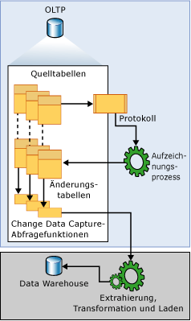

# Über Change Data Capture (SQL Server)
  Change Data Capture zeichnet Einfüge-, Aktualisierungs- und Löschaktivitäten auf, die an einer [!INCLUDE[ssNoVersion](../../includes/ssnoversion-md.md)] -Tabelle vorgenommen werden. Hierdurch werden die Details zu diesen Änderungen in einem leicht verwendbaren relationalen Format bereitgestellt. Für die geänderten Zeilen werden die Spaltendaten sowie die Metadaten, die zur Übernahme der Änderungen in einer Zielumgebung erforderlich sind, aufgezeichnet und in Änderungstabellen gespeichert, die die Spaltenstruktur der nachverfolgten Quelltabellen widerspiegeln. Für den systematischen Zugriff auf die Änderungsdaten durch den Consumer werden Tabellenwertfunktionen bereitgestellt.  
  
 Ein Beispiel für einen Datenconsumer, auf den diese Technologie abzielt, ist eine Anwendung zum Extrahieren, Transformieren und Laden (ETL-Anwendung). Eine ETL-Anwendung lädt Änderungsdaten inkrementell aus [!INCLUDE[ssNoVersion](../../includes/ssnoversion-md.md)] -Quelltabellen in ein Data Warehouse oder Data Mart. Obwohl die Darstellung der Quelltabellen innerhalb des Data Warehouse Änderungen in den Quelltabellen widerspiegeln muss, sind End-to-End-Technologien, die eine Kopie der Quelle aktualisieren, ungeeignet. Benötigt wird stattdessen ein zuverlässiger Datenstrom von Änderungsdaten, der so strukturiert ist, dass er vom Consumer problemlos auf unterschiedliche Darstellungen der Daten in einer Zielumgebung angewendet werden kann. [!INCLUDE[ssNoVersion](../../includes/ssnoversion-md.md)] stellt diese Technologie bereit.  
  
## Change Data Capture &ndash; Datenfluss  
 Die folgende Abbildung zeigt den Hauptdatenfluss für Change Data Capture.  
  
   
  
 Die Quelle der Änderungsdaten ist für Change Data Capture das [!INCLUDE[ssNoVersion](../../includes/ssnoversion-md.md)] -Transaktionsprotokoll. Bei Einfügungen, Aktualisierungen und Löschungen in den nachverfolgten Quelltabellen werden diesem Protokoll entsprechende Einträge hinzugefügt, die diese Änderungen beschreiben. Das Protokoll dient als Eingabe für den Erfassungsvorgang. Der Prozess liest das Protokoll und fügt der Änderungstabelle, die mit der nachverfolgten Tabelle verknüpft ist, Informationen über die Änderungen hinzu. Zur Aufzählung der Änderungen in den Änderungstabellen innerhalb eines angegebenen Bereichs werden Funktionen bereitgestellt, und die Informationen werden in Form eines gefilterten Resultsets zurückgegeben. Das gefilterte Resultset wird typischerweise von einem Anwendungsprozess verwendet, um die Darstellung der Quelle in einer externen Umgebung zu aktualisieren.  
  
## Change Data Capture und die Aufzeichnungsinstanz  
 Damit Änderungen an einzelnen Tabellen innerhalb einer Datenbank nachverfolgt werden können, muss Change Data Capture explizit für die Datenbank aktiviert werden. Dazu wird die gespeicherte Prozedur [sys.sp_cdc_enable_db](../../relational-databases/system-stored-procedures/sys-sp-cdc-enable-db-transact-sql.md)verwendet. Wenn die Datenbank für Change Data Capture aktiviert ist, können Quelltabellen mit der gespeicherten Prozedur [sys.sp_cdc_enable_table](../../relational-databases/system-stored-procedures/sys-sp-cdc-enable-table-transact-sql.md)als nachverfolgte Tabellen identifiziert werden. Wenn eine Tabelle für Change Data Capture aktiviert ist, wird eine Aufzeichnungsinstanz erstellt und zugeordnet, die die Verteilung der Änderungsdaten in der Quelltabelle unterstützt. Die Aufzeichnungsinstanz besteht aus einer Änderungstabelle und bis zu zwei Abfragefunktionen. Die Metadaten, mit denen die Konfigurationsdetails der Aufzeichnungsinstanz beschrieben werden, befinden sich in den Change Data Capture-Metadatentabellen **cdc.change_tables**, **cdc.index_columns**und **cdc.captured_columns**. Diese Informationen können mit der gespeicherten Prozedur [sys.sp_cdc_help_change_data_capture](../../relational-databases/system-stored-procedures/sys-sp-cdc-help-change-data-capture-transact-sql.md)abgerufen werden.  
  
 Alle einer Aufzeichnungsinstanz zugeordneten Objekte werden im Change Data Capture-Schema der aktivierten Datenbank erstellt. Der Name der Aufzeichnungsinstanz muss ein gültiger Objektname sein, der innerhalb aller Aufzeichnungsinstanzen der Datenbank eindeutig ist. Standardmäßig lautet der Name \<*Schemaname*_*Tabellenname*> der Quelltabelle. Zur Benennung der zugeordneten Änderungstabelle wird dem Namen der Aufzeichnungsinstanz **_CT** angehängt. Zur Benennung der Funktion zur Abfrage aller Änderungen wird dem Namen der Aufzeichnungsinstanz **fn_cdc_get_all_changes_** vorangestellt. Wenn die Aufzeichnungsinstanz für die Unterstützung von **net changes** konfiguriert ist, wird darüber hinaus eine Abfragefunktion für **net_changes** erstellt. Diese wird benannt, indem dem Aufzeichnungsinstanznamen **fn_cdc_get_net_changes\_** vorangestellt wird.  
  
## Änderungstabelle  
 Die ersten fünf Spalten einer Change Data Capture-Änderungstabelle sind Metadatenspalten. Diese enthalten zusätzliche Informationen zu den aufgezeichneten Änderungen. Die Namen und in der Regel auch der Typ der restlichen Spalten entsprechen den identifizierten nachverfolgten Spalten aus der Quelltabelle. Diese Spalten enthalten die aus der Quelltabelle erfassten Spaltendaten.  
  
 Jeder auf die Quelltabelle angewendete Einfüge- oder Löschvorgang erscheint als einzelne Zeile in der Änderungstabelle. Die Datenspalten der Zeile, die sich aus einem Einfügevorgang ergibt, enthalten die Spaltenwerte nach dem Einfügevorgang. Die Datenspalten der Zeile, die sich aus einem Löschvorgang ergibt, enthalten die Spaltenwerte vor dem Löschvorgang. Ein Updatevorgang erfordert einen Zeileneintrag, der die Spaltenwerte vor dem Updatevorgang angibt, und einen Zeileneintrag, der die Spaltenwerte nach dem Updatevorgang angibt.  
  
 Darüber hinaus enthält jede Zeile in einer Änderungstabelle zusätzliche Metadaten, die eine Interpretation der Änderungsaktivitäten erlauben. Die Spalte __$start_lsn identifiziert die Commit-Protokollfolgenummer (Log Sequence Number, LSN), die der Änderung zugewiesen wurde. Die Commit-LSN identifiziert sowohl die Änderungen, die innerhalb der gleichen Transaktion ausgeführt wurden, als auch die Reihenfolge der Transaktionen. Die Spalte \_\_$seqval kann verwendet werden, um die Reihenfolge weiterer Änderungen festzulegen, die innerhalb der gleichen Transaktion ausgeführt wurden. In der Spalte \_\_$operation wird der mit der Änderung verbundene Vorgang aufgezeichnet: 1 = Löschung, 2 = Einfügung, 3 = Update (Anfangsimage) und 4 = Update (Endimage). Die Spalte \_\_$update_mask ist eine variable Bitmaske mit einem definierten Bit für jede aufgezeichnete Spalte. Bei Einträgen für Einfüge- und Löschvorgänge werden alle Bits in der Updatemaske gesetzt. Bei Einträgen für Updatevorgänge sind dagegen nur jene Bits gesetzt, die den geänderten Spalten entsprechen.  
  
## Change Data Capture-Gültigkeitsintervall für eine Datenbank  
 Beim Change Data Capture-Gültigkeitsintervall für eine Datenbank handelt es sich um dem Zeitraum, in dem Änderungsdaten für Aufzeichnungsinstanzen verfügbar sind. Das Gültigkeitsintervall beginnt mit der Erstellung der ersten Aufzeichnungsinstanz für eine Datenbanktabelle und dauert bis zum aktuellen Zeitpunkt.  
  
 Damit die Datenmenge in Änderungstabellen nicht auf eine unüberschaubare Größe anwächst, müssen die Daten regelmäßig und systematisch gekürzt werden. Der Change Data Capture-Cleanupprozess dient zur Erzwingung der beibehaltungsbasierten Cleanuprichtlinie. Zunächst wird der untere Endpunkt des Gültigkeitsintervalls verschoben, um die Zeitbeschränkung festzulegen. Anschließend werden die abgelaufenen Einträge aus der Änderungstabelle entfernt. Standardmäßig werden die Daten drei Tage beibehalten.  
  
 Am oberen Endpunkt werden bei jedem Commit neuer Änderungsdaten durch den Aufzeichnungsprozess für jede Transaktion, die Änderungstabelleneinträge beinhaltet, neue Einträge zu **cdc.lsn_time_mapping** hinzugefügt. In der Zuordnungstabelle werden sowohl die Commit-Protokollfolgenummern als auch die Commitzeitpunkte der Transaktion (Spalten start_lsn und tran_end_time) beibehalten. Der maximale LSN-Wert in **cdc.lsn_time_mapping** entspricht der Obergrenzenmarkierung des Datenbank-Gültigkeitsfensters. Die entsprechende Commitzeit wird als Basis für die Berechnung einer neuen Untergrenzenmarkierung durch die beibehaltungsbasierte Cleanuprichtlinie verwendet.  
  
 Da der Aufzeichnungsprozess Änderungsdaten aus dem Transaktionsprotokoll extrahiert, entsteht eine Latenzzeit zwischen dem Commitzeitpunkt einer Änderung in einer Quelltabelle und dem Zeitpunkt, an dem die Änderung in der zugeordneten Änderungstabelle angezeigt wird. Diese Latenzzeit ist in der Regel sehr kurz, vergessen Sie jedoch nicht, dass die Änderungsdaten erst verfügbar sind, nachdem der Aufzeichnungsprozess die verbundenen Protokolleinträge verarbeitet hat.  
  
## Change Data Capture-Gültigkeitsintervall für eine Aufzeichnungsinstanz  
 In der Regel stimmt das Gültigkeitsintervall einzelner Aufzeichnungsinstanzen mit dem Gültigkeitsintervall für die Datenbank überein, dies ist jedoch nicht immer so. Das Gültigkeitsintervall der Aufzeichnungsinstanz beginnt zu dem Zeitpunkt, an dem der Aufzeichnungsprozess die Aufzeichnungsinstanz erkennt und die Protokollierung zugeordneter Änderungen in der Änderungstabelle startet. Wenn also Aufzeichnungsinstanzen zu verschiedenen Zeiten erstellt werden, weisen diese unterschiedliche untere Endpunkte auf. Die Spalte „start_lsn“ des von [sys.sp_cdc_help_change_data_capture](../../relational-databases/system-stored-procedures/sys-sp-cdc-help-change-data-capture-transact-sql.md) zurückgegebenen Resultsets zeigt den aktuellen unteren Endpunkt für jede definierte Aufzeichnungsinstanz. Bei der Bereinigung von Änderungstabelleneinträgen durch den Cleanupprozess werden die start_lsn-Werte für alle Aufzeichnungsinstanzen angepasst, sodass sie die neue Untergrenzenmarkierung für verfügbare Änderungsdaten widerspiegeln. Dabei werden nur die Aufzeichnungsinstanzen angepasst, deren start_lsn-Werte kleiner sind als die neue Untergrenzenmarkierung. Nach einer gewissen Zeit stimmen also die Gültigkeitsintervalle aller einzelnen Instanzen mit dem Gültigkeitsintervall der Datenbank überein, vorausgesetzt, es werden keine neuen Aufzeichnungsinstanzen erstellt.  
  
 Für Consumer von Änderungsdaten ist das Gültigkeitsintervall wichtig, da das Extrahierungsintervall einer Anforderung vollständig von dem aktuellen Change Data Capture-Gültigkeitsintervall für die Aufzeichnungsinstanz abgedeckt werden muss. Wenn der untere Endpunkt des Extrahierungsintervalls links vom unteren Endpunkt des Gültigkeitsintervalls liegt, kann es bei einem umfassenden Cleanup zu fehlenden Änderungsdaten kommen. Wenn der obere Endpunkt des Extrahierungsintervalls rechts vom oberen Endpunkt des Gültigkeitsintervalls liegt, wird der Aufzeichnungsprozess vor dem Ende des Extrahierungsintervalls beendet, was ebenfalls zu fehlenden Daten führen kann.  
  
 Mit der Funktion [sys.fn_cdc_get_min_lsn](../../relational-databases/system-functions/sys-fn-cdc-get-min-lsn-transact-sql.md) können Sie den aktuellen kleinsten LSN-Wert und mit der Funktion [sys.fn_cdc_get_max_lsn](../../relational-databases/system-functions/sys-fn-cdc-get-max-lsn-transact-sql.md) den aktuellen größten LSN-Wert für eine Aufzeichnungsinstanz abrufen. Wenn bei der Abfrage von Änderungsdaten der angegebene LSN-Bereich nicht innerhalb der beiden LSN-Werte liegt, schlagen die Change Data Capture-Abfragefunktionen fehl.  
  
## Handhabung von Änderungen an Quelltabellen  
 Die Berücksichtigung von Spaltenänderungen in den nachverfolgten Quelltabellen ist für Downstreamconsumer schwierig. Durch die Aktivierung von Change Data Capture für eine Quelltabelle werden solche DDL-Änderungen zwar nicht verhindert, mit Change Data Capture können die Auswirkungen für den Consumer jedoch minimiert werden, indem erlaubt wird, dass die über die API zurückgegebenen Resultsets unverändert bleiben, auch wenn die Spaltenstruktur der zugrunde liegenden Quelltabelle geändert wird. Diese feste Spaltenstruktur gilt auch für die zugrunde liegende Änderungstabelle, auf die die definierten Abfragefunktionen zugreifen.  
  
 Um eine Änderungstabelle mit fester Spaltenstruktur zu berücksichtigen, ignoriert der Aufzeichnungsprozess, mit dem Werte in die Änderungstabelle eingefügt werden, alle neuen Spalten, die bei der Aktivierung der Quelltabelle für Change Data Capture nicht zur Aufzeichnung identifiziert wurden. Wenn eine nachverfolgte Spalte gelöscht wird, werden in den nachfolgenden Änderungseinträgen NULL-Werte für die Spalte angegeben. Wenn sich jedoch der Datentyp einer vorhandenen Spalte ändert, wird diese Änderung in die Änderungstabelle übernommen, um sicherzustellen, dass durch den Aufzeichnungsmechanismus keine Datenverluste für nachverfolgte Spalten entstehen. Außerdem sendet der Aufzeichnungsprozess alle erkannten Änderungen an der Spaltenstruktur nachverfolgter Tabellen an die Tabelle cdc.ddl_history. Consumer, die über notwendige Anpassungen von Downstreamanwendungen informiert werden möchten, verwenden die gespeicherte Prozedur [sys.sp_cdc_get_ddl_history](../../relational-databases/system-stored-procedures/sys-sp-cdc-get-ddl-history-transact-sql.md).  
  
 In der Regel wird die Form der aktuellen Aufzeichnungsinstanz beibehalten, wenn DDL-Änderungen an der verbundenen Quelltabelle vorgenommen werden. Es besteht jedoch die Möglichkeit, eine zweite Aufzeichnungsinstanz für die Tabelle zu erstellen, die die neue Spaltenstruktur widerspiegelt. Hierdurch wird die Aufzeichnung von Änderungen an derselben Quelltabelle in zwei unterschiedliche Änderungstabellen mit zwei verschiedenen Spaltenstrukturen ermöglicht. Eine dieser Änderungstabellen kann für aktuelle Betriebsprogramme und die andere für eine Entwicklungsumgebung verwendet werden, in der versucht wird, die neuen Spaltendaten aufzunehmen. Da der Aufzeichnungsmechanismus gleichzeitig Werte in beide Änderungstabellen einfügen kann, ist ein Übergang zwischen den Tabellen ohne Datenverlust möglich. Dies kann immer der Fall sein, wenn die beiden Change Data Capture-Zeitachsen überlappen. Wenn der Übergang erfolgt, kann die überflüssige Aufzeichnungsinstanz entfernt werden.  
  
> [!NOTE]  
>  Einer Quelltabelle können maximal zwei Aufzeichnungsinstanzen gleichzeitig zugeordnet werden.  
  
## Beziehung zwischen dem Aufzeichnungsauftrag und dem Protokollleser der Transaktionsreplikation  
 Die Logik für den Change Data Capture-Prozess ist in die gespeicherte Prozedur [sp_replcmds](../../relational-databases/system-stored-procedures/sp-replcmds-transact-sql.md)eingebettet. Hierbei handelt es sich um eine als Teil von „sqlservr.exe“ erstellte interne Serverfunktion, die auch bei der Transaktionsreplikation verwendet wird, um Änderungen aus dem Transaktionsprotokoll zu sammeln. Wenn für eine Datenbank nur Change Data Capture aktiviert wurde, erstellen Sie den Change Data Capture-Aufzeichnungsauftrag des SQL Server-Agents als Mittel zum Aufrufen von sp_replcmds. Wenn die Replikation ebenfalls aktiviert ist, wird für die Änderungsdatenanforderungen beider Consumer nur der Transaktions-Protokollleser verwendet. Mit dieser Strategie werden Protokollkonflikte erheblich reduziert, wenn sowohl die Replikation als auch Change Data Capture für eine Datenbank aktiviert sind.  
  
 Der Wechsel zwischen diesen beiden Betriebsmodi zur Aufzeichnung von Änderungsdaten erfolgt automatisch, wenn sich der Replikationsstatus einer Datenbank ändert, für die Change Data Capture aktiviert ist.  
  
> [!IMPORTANT]  
>  Für beide Instanzen der Aufzeichnungslogik muss der [!INCLUDE[ssNoVersion](../../includes/ssnoversion-md.md)] -Agent ausgeführt werden, damit der Prozess ausgeführt werden kann.  
  
 Die Hauptaufgabe des Capture-Prozesses besteht darin, das Protokoll zu durchsuchen und Spaltendaten und transaktionsrelevante Informationen in die Change Data Capture-Änderungstabellen zu schreiben. Um eine transaktionskonsistente Begrenzung über alle von Change Data Capture aufgefüllten Änderungstabellen hinweg sicherzustellen, öffnet der Aufzeichnungsprozess bei jedem Scanzyklus eine eigene Transaktion und führt dafür einen Commit aus. Der Prozess erkennt neu für Change Data Capture aktivierte Tabellen und nimmt diese automatisch in die Gruppe von Tabellen auf, die aktiv auf Änderungseinträge im Protokoll überwacht werden. Auch die Deaktivierung von Change Data Capture wird erkannt. In diesem Fall wird die Quelltabelle aus der Gruppe von Tabellen, die aktiv auf Änderungseinträge überwacht werden, entfernt. Wenn die Verarbeitung für einen Protokollabschnitt beendet ist, sendet der Aufzeichnungsprozess ein Signal an die Serverprotokoll-Kürzungslogik, die anhand dieser Informationen für die Kürzung geeignete Protokolleinträge auswählt.  
  
> [!NOTE]  
>  Wenn eine Datenbank für Change Data Capture aktiviert ist, wird, auch wenn als Wiederherstellungsmodus die einfache Wiederherstellung festgelegt ist, der Protokollkürzungspunkt nicht weiter verschoben, bevor alle für die Aufzeichnung markierten Änderungen vom Aufzeichnungsprozess erfasst wurden. Falls der Aufzeichnungsprozess nicht ausgeführt wird und Änderungen erfasst werden müssen, wird das Protokoll beim Ausführen von CHECKPOINT nicht gekürzt.  
  
 Der Aufzeichnungsprozess wird auch zur Speicherung des Verlaufs der an nachverfolgten Tabellen vorgenommenen DDL-Änderungen verwendet. Die mit Change Data Capture verknüpften DDL-Anweisungen nehmen Einträge im Transaktionsprotokoll der Datenbank vor, wenn eine für Change Data Capture aktivierte Datenbank oder Tabelle gelöscht wird und wenn Spalten einer für Change Data Capture aktivierten Tabelle hinzugefügt, geändert oder gelöscht werden. Diese Protokolleinträge werden vom Aufzeichnungsprozess verarbeitet, der die zugehörigen DDL-Ereignisse an die Tabelle cdc.ddl_history sendet. Sie können Informationen über DDL-Ereignisse mit Auswirkungen auf nachverfolgte Tabellen mit der gespeicherten Prozedur [sys.sp_cdc_get_ddl_history](../../relational-databases/system-stored-procedures/sys-sp-cdc-get-ddl-history-transact-sql.md)abrufen.  
  
## Change Data Capture-Agentaufträge  
 Einer Datenbank, für die Change Data Capture aktiviert ist, werden in der Regel zwei [!INCLUDE[ssNoVersion](../../includes/ssnoversion-md.md)] -Agentaufträge zugeordnet: ein Aufzeichnungsauftrag zur Auffüllung der Datenbank-Änderungstabellen und ein Cleanupauftrag für die Bereinigung der Änderungstabellen. Beide Aufträge bestehen aus einem Einzelschritt, der einen [!INCLUDE[tsql](../../includes/tsql-md.md)] -Befehl ausführt. Bei dem aufgerufenen [!INCLUDE[tsql](../../includes/tsql-md.md)] -Befehl handelt es sich um eine in Change Data Capture definierte gespeicherte Prozedur zur Implementierung der Auftragslogik. Die Aufträge werden erstellt, wenn die erste Tabelle der Datenbank für Change Data Capture aktiviert wird. Der Cleanupauftrag wird immer erstellt. Der Aufzeichnungsauftrag wird nur erstellt, wenn für die Datenbank keine Transaktionsveröffentlichungen definiert wurden. Der Aufzeichnungsauftrag wird auch dann erstellt, wenn sowohl Change Data Capture als auch die Transaktionsreplikation für eine Datenbank aktiviert sind und der Transaktions-Protokollleserauftrag entfernt wird, da die Datenbank über keine definierten Veröffentlichungen mehr verfügt.  
  
 Sowohl Aufzeichnungs- als auch Cleanupaufträge werden mit Standardparametern erstellt. Der Aufzeichnungsauftrag wird sofort gestartet. Er wird kontinuierlich ausgeführt und verarbeitet maximal 1000 Transaktionen pro Scanzyklus mit einer Wartezeit von 5 Sekunden. Der Cleanupauftrag wird täglich um 2 Uhr morgens ausgeführt. Änderungstabelleneinträge werden 4320 Minuten bzw. 3 Tage beibehalten, und mit einer Löschanweisung werden maximal 5000 Einträge entfernt.  
  
 Die Change Data Capture-Agentaufträge werden entfernt, wenn Change Data Capture für eine Datenbank deaktiviert wird. Der Aufzeichnungsauftrag kann auch entfernt werden, wenn einer Datenbank die erste Veröffentlichung hinzugefügt wird und sowohl Change Data Capture als auch die Transaktionsreplikation aktiviert sind.  
  
 Intern werden Change Data Capture-Agentaufträge mit den gespeicherten Prozeduren [sys.sp_cdc_add_job](../../relational-databases/system-stored-procedures/sys-sp-cdc-add-job-transact-sql.md) und [sys.sp_cdc_drop_job](../../relational-databases/system-stored-procedures/sys-sp-cdc-drop-job-transact-sql.md)erstellt bzw. gelöscht. Diese gespeicherten Prozeduren werden ebenfalls verfügbar gemacht, sodass Administratoren die Erstellung und Entfernung dieser Aufträge kontrollieren können.  
  
 Die Standardkonfiguration der Change Data Capture-Agentaufträge wird nicht explizit von Administratoren gesteuert. Mit der gespeicherten Prozedur [sys.sp_cdc_change_job](../../relational-databases/system-stored-procedures/sys-sp-cdc-change-job-transact-sql.md) können die Standardkonfigurationsparameter geändert werden. Darüber hinaus ermöglicht die gespeicherte Prozedur [sys.sp_cdc_help_jobs](../../relational-databases/system-stored-procedures/sys-sp-cdc-help-jobs-transact-sql.md) das Anzeigen der aktuellen Konfigurationsparameter. Sowohl der Aufzeichnungsauftrag als auch der Cleanupauftrag extrahieren Konfigurationsparameter aus der Tabelle msdb.dbo.cdc_jobs, wenn sie gestartet werden. Änderungen, die mit [sys.sp_cdc_change_job](../../relational-databases/system-stored-procedures/sys-sp-cdc-change-job-transact-sql.md) an diesen Werten vorgenommen werden, treten ersten in Kraft, wenn der Auftrag beendet und neu gestartet wird.  
  
 Zwei zusätzliche gespeicherte Prozeduren ermöglichen das Starten und Beenden der Change Data Capture-Agentaufträge: [sys.sp_cdc_start_job](../../relational-databases/system-stored-procedures/sys-sp-cdc-start-job-transact-sql.md) und [sys.sp_cdc_stop_job](../../relational-databases/system-stored-procedures/sys-sp-cdc-stop-job-transact-sql.md).  
  
> [!NOTE]  
>  Beim Starten und Beenden des Aufzeichnungsauftrags gehen keine Änderungsdaten verloren. Es wird lediglich verhindert, dass der Aufzeichnungsprozess das Protokoll aktiv nach Änderungseinträgen durchsucht, die in die Änderungstabellen eingefügt werden können. Um die zusätzliche Last durch die Protokollscanvorgänge während der Spitzenlastzeiten zu vermeiden, können Sie den Aufzeichnungsauftrag beenden und dann wieder starten, wenn der Ressourcenbedarf sinkt.  
  
 Beide [!INCLUDE[ssNoVersion](../../includes/ssnoversion-md.md)] -Agentaufträge wurden mit genügend Flexibilität und Konfigurationsmöglichkeiten konzipiert, um die grundlegenden Anforderungen von Change Data Capture-Umgebungen zu erfüllen. In beiden Fällen wurden jedoch die zugrunde liegenden gespeicherten Prozeduren, die die Kernfunktionalität bereitstellen, verfügbar gemacht, um eine weitere Anpassung zu ermöglichen.  
  
 Change Data Capture kann nicht ordnungsgemäß ausgeführt werden, wenn der Datenbankmoduldienst oder der SQL Server-Agent-Dienst unter dem NETWORK SERVICE-Konto ausgeführt wird. Dies kann zu Fehler 22832 führen.  
  
## Siehe auch  
 [Nachverfolgen von Datenänderungen &#40;SQL Server&#41;](../../relational-databases/track-changes/track-data-changes-sql-server.md)   
 [Aktivieren und Deaktivieren von Change Data Capture &#40;SQL Server&#41;](../../relational-databases/track-changes/enable-and-disable-change-data-capture-sql-server.md)   
 [Arbeiten mit Änderungsdaten &#40;SQL Server&#41;](../../relational-databases/track-changes/work-with-change-data-sql-server.md)   
 [Verwalten und Überwachen von Change Data Capture &#40;SQL Server&#41;](../../relational-databases/track-changes/administer-and-monitor-change-data-capture-sql-server.md)  
  
  
