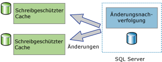
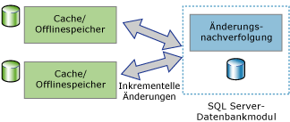

# Informationen zur Änderungsnachverfolgung (SQL Server)
[!INCLUDE[tsql-appliesto-ss2008-asdb-xxxx-xxx_md](../../includes/tsql-appliesto-ss2008-asdb-xxxx-xxx-md.md)]

  Die Änderungsnachverfolgung ist eine einfache Lösung, die einen effizienten Änderungsnachverfolgungsmechanismus für Anwendungen bereitstellt. Normalerweise mussten Anwendungsentwickler benutzerdefinierte Mechanismen zur Änderungsnachverfolgung implementieren, damit die Anwendungen Änderungen an Daten in einer Datenbank abfragen und auf Informationen im Zusammenhang mit den Änderungen zugreifen konnten. Die Erstellung dieser Mechanismen war i. d. R. mit hohem Arbeitsaufwand verbunden und erforderte vielfach eine Kombination von Triggern, **timestamp** -Spalten, neuen Tabellen zum Speichern von Nachverfolgungsinformationen und benutzerdefinierten Cleanupprozessen.  
  
 Die Anforderungen an die Menge erforderlicher Informationen zu den Änderungen variieren je nach Anwendungstyp. Anwendungen können die Änderungsnachverfolgung verwenden, um die folgenden Fragen zu den an einer Benutzertabelle vorgenommenen Änderungen zu beantworten:  
  
-   Welche Zeilen wurden in einer Benutzertabelle geändert?  
  
    -   Es ist nur die Tatsache von Belang, dass eine Zeile geändert wurde, nicht jedoch, wie oft die Zeile geändert wurde oder welche Werte bei Zwischenänderungen festgelegt wurden.  
  
    -   Die aktuellen Daten können direkt aus der nachverfolgten Tabelle abgerufen werden.  
  
-   Wurde eine Zeile geändert?  
  
    -   Die Tatsache, dass eine Zeile geändert wurde, und Informationen zu der Änderung müssen verfügbar sein und zum Zeitpunkt der Änderung in derselben Transaktion aufgezeichnet werden.  
  
> [!NOTE]  
>  Wenn für eine Anwendung Informationen zu allen vorgenommenen Änderungen und die Zwischenwerte der geänderten Daten erforderlich sind, ist möglicherweise eher die Verwendung von Change Data Capture anstelle der Änderungsnachverfolgung zu empfehlen. Weitere Informationen finden Sie unter [Informationen zu Change Data Capture &#40;SQL Server&#41;](../../relational-databases/track-changes/about-change-data-capture-sql-server.md).  
  
## Unidirektionale und bidirektionale Synchronisierungsanwendungen  
 Anwendungen, die Daten mit einer Instanz von [!INCLUDE[ssDEnoversion](../../includes/ssdenoversion-md.md)] synchronisieren müssen, müssen in der Lage sein, Änderungen abzufragen. Die Änderungsnachverfolgung kann sowohl als Grundlage für unidirektionale als auch für bidirektionale Synchronisierungsanwendungen verwendet werden.  
  
### Unidirektionale Synchronisierungsanwendungen  
 Es können unidirektionale Synchronisierungsanwendungen, z. B. ein Client oder eine Zwischenspeicherungsanwendung auf der mittleren Ebene, erstellt werden, die die Änderungsnachverfolgung verwenden. Wie in der folgenden Abbildung dargestellt, müssen für eine Zwischenspeicherungsanwendung Daten in [!INCLUDE[ssDE](../../includes/ssde-md.md)] gespeichert und in anderen Datenspeichern zwischengespeichert werden. Die Anwendung muss in der Lage sein, den Cache auf dem aktuellen Stand zu halten, indem dieser mit allen an den Datenbanktabellen vorgenommenen Änderungen aktualisiert wird. Es werden keine Änderungen zurück an [!INCLUDE[ssDE](../../includes/ssde-md.md)]übergeben.  
  
   
  
### Bidirektionale Synchronisierungsanwendungen  
 Es können auch bidirektionale Synchronisierungsanwendungen erstellt werden, die die Änderungsnachverfolgung verwenden. In diesem Szenario werden die Daten in einer Instanz von [!INCLUDE[ssDE](../../includes/ssde-md.md)] mit mindestens einem Datenspeicher synchronisiert. Die Daten in diesen Speichern können aktualisiert werden, und die Änderungen müssen wieder mit [!INCLUDE[ssDE](../../includes/ssde-md.md)]synchronisiert werden.  
  
   
  
 Ein gutes Beispiel für eine bidirektionale Synchronisierungsanwendung ist eine gelegentlich verbundene Anwendung. In einer Anwendung dieses Typs fragt eine Clientanwendung einen lokalen Speicher ab und aktualisiert diesen. Wenn eine Verbindung zwischen einem Client und einem Server verfügbar ist, führt die Anwendung die Synchronisierung mit einem Server aus, und geänderte Daten fließen in beide Richtungen.  
  
 Die bidirektionalen Synchronisierungsanwendungen müssen Konflikte erkennen können. Zu einem Konflikt kommt es, wenn in der Zeit zwischen zwei Synchronisierungen die gleichen Daten in beiden Datenspeichern geändert wurden. Wenn eine Anwendung über die Fähigkeit zum Erkennen von Konflikten verfügt, kann sichergestellt werden, dass keine Änderungen verloren werden.  
  
## Funktionsweise der Änderungsnachverfolgung  
 Zum Konfigurieren der Änderungsnachverfolgung können Sie DDL-Anweisungen oder [!INCLUDE[ssManStudioFull](../../includes/ssmanstudiofull-md.md)]verwenden. Weitere Informationen finden Sie unter [Aktivieren und Deaktivieren der Änderungsnachverfolgung &#40;SQL Server&#41;](../../relational-databases/track-changes/enable-and-disable-change-tracking-sql-server.md). Zum Nachverfolgen von Änderungen muss die Änderungsnachverfolgung zuerst für die Datenbank und dann für die Tabellen, die in dieser Datenbank nachverfolgt werden sollen, aktiviert werden. Die Tabellendefinition muss in keiner Weise geändert werden, und es werden keine Trigger erstellt.  
  
 Nachdem die Änderungsnachverfolgung für eine Tabelle konfiguriert wurde, werden bei der Verwendung einer DML-Anweisung, die sich auf die Zeilen in der Tabelle auswirkt, Änderungsinformationen für jede geänderte Zeile aufgezeichnet. Zum Abfragen von geänderten Zeilen und Informationen zu den Änderungen können Sie [Änderungsnachverfolgungsfunktionen](../../relational-databases/system-functions/change-tracking-functions-transact-sql.md)verwenden.  
  
 Die Werte der Primärschlüsselspalte sind die einzigen Informationen aus der nachverfolgten Tabelle, die mit den Änderungsinformationen aufgezeichnet werden. Diese Werte identifizieren die Zeilen, die geändert wurden. Zum Abrufen der aktuellen Daten dieser Zeilen kann eine Anwendung die Werte der Primärschlüsselspalte verwenden, um die Quelltabelle mit der nachverfolgten Tabelle zu verknüpfen.  
  
 Informationen zu den an den einzelnen Zeilen vorgenommenen Änderungen können auch mithilfe der Änderungsnachverfolgung abgerufen werden. Dazu zählen z. B. der Typ des DML-Vorgangs, der die Änderung (Einfügung, Update oder Löschung) bewirkt hat, oder die Spalten, die im Rahmen eines Updatevorgangs geändert wurden. 
 
## Bereinigen der Änderungsnachverfolgung
Informationen der Änderungsnachverfolgung für alle Tabellen (für die Änderungsnachverfolgung aktiviert ist) werden in einem speicherinternen Rowstore gespeichert. Die Daten der Änderungsnachverfolgung für jede Tabelle, für die Änderungsnachverfolgung aktiviert ist, werden bei jedem Prüfpunkt aus dem speicherinternen Rowstore in die entsprechende interne Tabelle auf dem Datenträger geleert. Während des Prüfpunkts wird auch der speicherinterne Rowstore gelöscht, nachdem die Zeilen in die Tabellen auf dem Datenträger verschoben werden.

Jede Tabelle, für die Änderungsnachverfolgung aktiviert ist, verfügt über eine interne Tabelle auf dem Datenträger, die von Änderungsnachverfolgungsfunktionen verwendet wird, um die Version und die Zeilen zu bestimmen, die seit einer bestimmten Version geändert wurden. Jedes Mal, wenn der Thread **Auto Cleanup** aufgerufen wird, scannt er alle Benutzerdatenbanken auf der SQL Server-Instanz, um die Datenbanken zu identifizieren, für die Änderungsnachverfolgung aktiviert ist. Entsprechend der eingestellten Beibehaltungsdauer der Datenbank werden die abgelaufenen Datensätze jeder internen Tabelle auf dem Datenträger gelöscht.

In den Service Packs für [!INCLUDE[ssSQL14](../../includes/sssql14-md.md)] und [!INCLUDE[ssSQL15](../../includes/sssql15-md.md)] wurde eine gespeicherte Prozedur für das Ausführen einer manuellen Bereinigung für die interne Änderungsnachverfolgung interner Tabellen hinzugefügt. Weitere Informationen zur gespeicherten Prozedur finden Sie unter [KB173157](https://support.microsoft.com/help/3173157/adds-a-stored-procedure-for-the-manual-cleanup-of-the-change-tracking-side-table-in-sql-server-2014-sp2-or-2016-sp1). 
  
## Siehe auch  
 [Aktivieren und Deaktivieren der Änderungsnachverfolgung &#40;SQL Server&#41;](../../relational-databases/track-changes/enable-and-disable-change-tracking-sql-server.md)   
 [Verwenden der Änderungsnachverfolgung &#40;SQL Server&#41;](../../relational-databases/track-changes/work-with-change-tracking-sql-server.md)   
 [Verwalten der Änderungsnachverfolgung &#40;SQL Server&#41;](../../relational-databases/track-changes/manage-change-tracking-sql-server.md)   
 [Nachverfolgen von Datenänderungen &#40;SQL Server&#41;](../../relational-databases/track-changes/track-data-changes-sql-server.md)  
  
  

