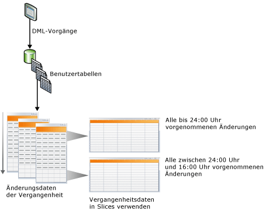
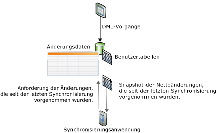

# Nachverfolgen von Datenänderungen (SQL Server)
[!INCLUDE[tsql-appliesto-ss2008-asdb-xxxx-xxx-md](../../includes/tsql-appliesto-ss2008-asdb-xxxx-xxx-md.md)]
  [!INCLUDE[ssCurrent](../../includes/sscurrent-md.md)] stellt zwei Funktionen bereit, mit denen Änderungen in einer Datenbank nachverfolgt werden: [Change Data Capture](#Capture) und [Änderungsnachverfolgung](#Tracking). Mit diesen Funktionen können Anwendungen die DML-Änderungen (Einfüge-, Aktualisierungs- und Löschvorgänge) ermitteln, die an Benutzertabellen in einer Datenbank vorgenommen wurden. Change Data Capture und die Änderungsnachverfolgung können auf derselben Datenbank aktiviert werden, d. h., es sind keine zusätzlichen Überlegungen erforderlich. Informationen zu den Editionen von [!INCLUDE[ssNoVersion](../../includes/ssnoversion-md.md)] , die Change Data Capture und die Änderungsnachverfolgung unterstützen, finden Sie unter [Von den SQL Server 2016-Editionen unterstützte Funktionen](~/sql-server/editions-and-supported-features-for-sql-server-2016.md). Änderungsnachverfolgung wird von [!INCLUDE[ssSDS_md](../../includes/sssds-md.md)]unterstützt.
  
## Vorteile der Verwendung von Change Data Capture oder der Änderungsnachverfolgung  
 Damit bestimmte Anwendungen effizient ausgeführt werden können, muss eine wichtige Anforderung erfüllt sein: Die Anwendungen müssen in der Lage sein, Daten abzufragen, die in einer Datenbank geändert wurden. Zum Ermitteln von Datenänderungen mussten Anwendungsentwickler normalerweise eine benutzerdefinierte Nachverfolgungsmethode in ihren Anwendungen implementieren, wobei sie eine Kombination von Triggern, Zeitstempelspalten und zusätzlichen Tabellen verwendeten. Die Erstellung solcher Anwendungen ist normalerweise sehr arbeitsintensiv, führt zu Schemaupdates und ist häufig mit hohem Verwaltungsaufwand verbunden.  
  
 Die Verwendung von Change Data Capture oder der Änderungsnachverfolgung in Anwendungen zum Nachverfolgen von Änderungen in einer Datenbank (im Gegensatz zur Entwicklung einer benutzerdefinierten Lösung) bietet die folgenden Vorteile:  
  
-   Kürzere Entwicklungszeit. Aufgrund der in [!INCLUDE[ssCurrent](../../includes/sscurrent-md.md)]verfügbaren Funktionalität müssen Sie keine benutzerdefinierte Lösung entwickeln.  
  
-   Schemaänderungen sind nicht erforderlich. Sie müssen weder Spalten noch Trigger hinzufügen oder Seitentabellen erstellen, in denen gelöschte Zeilen nachverfolgt oder Änderungsnachverfolgungsinformationen gespeichert werden, wenn den Benutzertabellen keine Spalten hinzugefügt werden können  
  
-   Integrierter Cleanup-Mechanismus. Der Cleanup für die Änderungsnachverfolgung wird automatisch im Hintergrund ausgeführt. Ein benutzerdefinierter Cleanup für Daten, die in einer Seitentabelle gespeichert werden, ist nicht erforderlich.  
  
-   Funktionen werden bereitgestellt, um Änderungsinformationen abzurufen.  
  
-   Niedriger Aufwand für DML-Vorgänge. Bei der synchronen Änderungsnachverfolgung entsteht immer ein gewisser Aufwand. Allerdings kann dieser Aufwand durch Verwendung der Änderungsnachverfolgung minimiert werden. Der Aufwand ist dabei in vielen Fällen geringer als bei der Verwendung alternativer Lösungen, insbesondere solcher Lösungen, die die Verwendung von Triggern erfordern.  
  
-   Die Änderungsnachverfolgung basiert auf Transaktionen, für die ein Commit ausgeführt wurde. Die Reihenfolge der Änderungen wird durch den Commitzeitpunkt der Transaktion bestimmt. Auf diese Weise werden bei umfangreichen und überlappenden Transaktionen zuverlässige Ergebnisse erzielt. Benutzerdefinierte Lösungen, in denen **timestamp** -Werte verwendet werden, müssen speziell für solche Szenarien entworfen werden.  
  
-   Standardtools sind verfügbar, die Sie zum Konfigurieren und Verwalten verwenden können. [!INCLUDE[ssCurrent](../../includes/sscurrent-md.md)] stellt Standard-DDL-Anweisungen, [!INCLUDE[ssManStudioFull](../../includes/ssmanstudiofull-md.md)], Katalogsichten und Sicherheitsberechtigungen bereit.  
  
## Funktionsunterschiede zwischen Change Data Capture und Änderungsnachverfolgung  
 In der folgenden Tabelle sind die Funktionsunterschiede zwischen Change Data Capture und Änderungsnachverfolgung aufgelistet. Der Nachverfolgungsmechanismus in Change Data Capture umfasst die asynchrone Erfassung der Änderungen aus dem Transaktionsprotokoll, sodass die Änderungen nach Abschluss des jeweiligen DML-Vorgangs verfügbar sind. Der Nachverfolgungsmechanismus bei der Änderungsnachverfolgung umfasst die synchrone Erfassung der Änderungen im Einklang mit den DML-Vorgängen, sodass die Änderungen unmittelbar verfügbar sind.  
  
|Funktion|Change Data Capture|Änderungsnachverfolgung|  
|-------------|-------------------------|---------------------|  
|**Nachverfolgte Änderungen**|||  
|DML-Änderungen|ja|ja|  
|**Nachverfolgte Informationen**|||  
|Verlaufsdaten|ja|nein|  
|Ob Spalte geändert wurde|ja|ja|  
|DML-Typ|ja|ja|  
  
##   Change Data Capture  
 Change Data Capture stellt Änderungsverlaufsinformationen für Benutzertabellen bereit, indem sowohl die Tatsache, dass DML-Änderungen vorgenommen wurden, als auch die geänderten Daten erfasst werden. Die Änderungen werden über einen asynchronen Prozess durch Lesen des Transaktionsprotokolls erfasst, der keine großen Auswirkungen auf die Systemleistung hat.  
  
 Wie in der folgenden Abbildung gezeigt, werden die an Benutzertabellen vorgenommenen Änderungen in entsprechenden Änderungstabellen aufgezeichnet. Diese Änderungstabellen stellen eine Übersicht über den Änderungsverlauf dar. Die von [bereitgestellten](../../relational-databases/system-functions/change-data-capture-functions-transact-sql.md)Change Data Capture [!INCLUDE[ssNoVersion](../../includes/ssnoversion-md.md)] -Funktionen ermöglichen die einfache und systematische Verarbeitung der Änderungsdaten.  
  
   
  
### Sicherheitsmodell  
 In diesem Abschnitt wird das Sicherheitsmodell von Change Data Capture beschrieben.  
  
 **Konfiguration und Verwaltung**  
 Um Change Data Capture für eine Datenbank aktivieren oder deaktivieren zu können, muss der Benutzer, der [sys.sp_cdc_enable_db &#40;Transact-SQL&#41;](../../relational-databases/system-stored-procedures/sys-sp-cdc-enable-db-transact-sql.md) oder [sys.sp_cdc_disable_db &#40;Transact-SQL&#41;](../../relational-databases/system-stored-procedures/sys-sp-cdc-disable-db-transact-sql.md) aufruft, ein Mitglied der festen Serverrolle **sysadmin** sein. Zur Aktivierung und Deaktivierung von Change Data Capture auf Tabellenebene muss der Benutzer, der [sys.sp_cdc_enable_table &#40;Transact-SQL&#41;](../../relational-databases/system-stored-procedures/sys-sp-cdc-enable-table-transact-sql.md) und [sys.sp_cdc_disable_table &#40;Transact-SQL&#41;](../../relational-databases/system-stored-procedures/sys-sp-cdc-disable-table-transact-sql.md) aufruft, entweder ein Mitglied der Rolle „sysadmin“ oder ein Mitglied der Datenbankrolle **db_owner** sein.  
  
 Gespeicherte Prozeduren zur Verwaltung von Change Data Capture-Aufträgen können nur von Mitgliedern der Serverrolle **sysadmin** und der Datenbankrolle **db_owner** verwendet werden.  
  
 **Änderungsenumeration und Metadatenabfragen**  
 Für den Zugriff auf die mit einer Änderungsinstanz verbundenen Änderungsdaten muss dem Benutzer die Zugriffsberechtigung für alle aufgezeichneten Spalten der zugeordneten Quelltabelle erteilt werden. Wenn bei Erstellung der Aufzeichnungsinstanz eine Gatingrolle angegeben wird, muss der Aufrufer außerdem Mitglied der angegebenen Gatingrolle sein. Andere allgemeine Change Data Capture-Funktionen für den Zugriff auf Metadaten stehen für alle Datenbankbenutzer mit der Rolle public zur Verfügung. Der Zugriff auf die zurückgegebenen Metadaten wird jedoch in der Regel auch hier durch die Zugriffsberechtigungen auf die zugrunde liegenden Quelltabellen und die Mitgliedschaft in definierten Gatingrollen beschränkt.  
  
 **Anwendung von DDL-Vorgängen auf Change Data Capture-aktivierte Quelltabellen**  
 Wenn eine Tabelle für Change Data Capture aktiviert ist, können DDL-Vorgänge nur von Mitgliedern der festen Serverrolle **sysadmin**bzw. von Mitgliedern der Datenbankrolle **db_owner**oder **db_ddladmin**auf die Tabelle angewendet werden. Wenn Benutzer, denen die Berechtigung zur Ausführung von DDL-Vorgängen auf die Tabelle explizit erteilt wurde, diesen Vorgang versuchen, wird die Fehlermeldung 22914 zurückgegeben.  
  
### Überlegungen zum Datentyp für Change Data Capture  
 Alle Basisspaltentypen werden von Change Data Capture unterstützt. In der folgenden Tabelle sind jeweils das Verhalten und die Einschränkungen verschiedener Spaltentypen aufgeführt.  
  
|Typ der Spalte|In Änderungstabellen aufgezeichnete Änderungen|Einschränkungen|  
|--------------------|---------------------------------------|-----------------|  
|Spalten mit geringer Dichte|ja|Bei Verwendung eines Spaltensatzes wird das Aufzeichnen von Änderungen nicht unterstützt.|  
|Berechnete Spalten|nein|Änderungen an berechneten Spalten werden nicht nachverfolgt. Die Spalte wird in der Änderungstabelle mit dem entsprechenden Typ angezeigt, hat aber einen Wert von NULL.|  
|XML|ja|Änderungen an einzelnen XML-Elementen werden nicht nachverfolgt.|  
|timestamp|ja|Der Datentyp in der Änderungstabelle wird in Binärformat umgewandelt.|  
|BLOB-Datentypen|ja|Das vorherige Image der BLOB-Spalte wird nur gespeichert, wenn die Spalte selbst geändert wird.|  
  
### Change Data Capture und andere SQL Server-Funktionen  
 In diesem Abschnitt wird beschrieben, wie die folgenden Funktionen mit Change Data Capture interagieren:  
  
-   Datenbankspiegelung  
  
-   Transaktionsreplikation  
  
-   Datenbankwiederherstellung oder -anfügung  
  
#### Datenbankspiegelung  
 Eine Datenbank, die für Change Data Capture aktiviert ist, kann gespiegelt werden. Um sicherzustellen, dass Capture und Cleanup für die Spiegelung automatisch durchgeführt werden, führen Sie folgende Schritte aus:  
  
1.  Stellen Sie sicher, dass für die Spiegelung der [!INCLUDE[ssNoVersion](../../includes/ssnoversion-md.md)] -Agent ausgeführt wird.  
  
2.  Erstellen Sie den Aufzeichnungsauftrag und den Cleanupauftrag für die Spiegelung, nachdem der Prinzipal einen Failover auf die Spiegelung durchgeführt hat. Verwenden Sie zum Erstellen der Aufträge die gespeicherte Prozedur [sys.sp_cdc_add_job &#40;Transact-SQL&#41;](../../relational-databases/system-stored-procedures/sys-sp-cdc-add-job-transact-sql.md).  
  
 Weitere Informationen zur Datenbankspiegelung finden Sie unter [ Datenbankspiegelung &#40;SQL Server&#41;](../../database-engine/database-mirroring/database-mirroring-sql-server.md).  
  
#### Transaktionsreplikation  
 Change Data Capture und die Transaktionsreplikation können in einer Datenbank parallel vorhanden sein, allerdings wird die Auffüllung der Änderungstabellen anders behandelt, wenn beide Funktionen aktiviert sind. Change Data Capture und die Transaktionsreplikation verwenden immer dieselbe Prozedur, nämlich [sp_replcmds](../../relational-databases/system-stored-procedures/sp-replcmds-transact-sql.md), um die Änderungen aus dem Transaktionsprotokoll auszulesen. Wenn Change-Data-Capture allein aktiviert ist, ruft ein [!INCLUDE[ssNoVersion](../../includes/ssnoversion-md.md)] -Agentauftrag die Prozedur **sp_replcmds**auf. Wenn für eine Datenbank beide Funktionen aktiviert sind, ruft der Protokolllese-Agent die Prozedur **sp_replcmds**auf. Dieser Agent füllt sowohl die Änderungstabellen als auch die Tabellen der Verteilungsdatenbank auf. Weitere Informationen finden Sie unter [Replication Log Reader Agent](../../relational-databases/replication/agents/replication-log-reader-agent.md).  
  
 Angenommen, Change Data Capture ist für die [!INCLUDE[ssSampleDBobject](../../includes/sssampledbobject-md.md)] -Datenbank aktiviert, und zwei Tabellen sind für die Erfassung aktiviert. Um die Änderungstabellen aufzufüllen, ruft der Capture-Auftrag **sp_replcmds**auf. Die Datenbank wird für die Transaktionsreplikation aktiviert, und eine Veröffentlichung wird erstellt. Anschließend wird der Protokolllese-Agent für die Datenbank erstellt, und der Erfassungsauftrag wird gelöscht. Der Protokolllese-Agent fährt fort, das Protokoll ab der letzten Protokollfolgenummer zu durchsuchen, für die ein Commit in die Änderungstabelle ausgeführt wurde. Auf diese Weise wird die Datenkonsistenz in den Änderungstabellen sichergestellt. Wenn die Transaktionsreplikation in dieser Datenbank deaktiviert wird, wird der Protokolllese-Agent entfernt und der Aufzeichnungsauftrag neu erstellt.  
  
> [!NOTE]  
>  Falls der Protokolllese-Agent sowohl für Change Data Capture als auch für die Transaktionsreplikation verwendet wird, werden die replizierten Änderungen zuerst in die Verteilungsdatenbank geschrieben. Anschließend werden erfasste Änderungen in die Änderungstabellen geschrieben. Der Commit wird für beide Vorgänge zusammen ausgeführt. Wenn beim Schreiben in die Verteilungsdatenbank eine Latenz auftritt, werden Änderungen in den Änderungstabellen auch erst nach dieser Latenzzeit angezeigt.  
  
#### Wiederherstellen oder Anfügen einer Datenbank, die für Change Data Capture aktiviert ist  
 [!INCLUDE[ssNoVersion](../../includes/ssnoversion-md.md)] verwendet die folgende Logik, um zu ermitteln, ob Change Data Capture nach dem Wiederherstellen oder Anfügen einer Datenbank aktiviert bleibt:  
  
-   Wenn eine Datenbank auf demselben Server mit demselben Datenbanknamen wiederhergestellt wird, bleibt Change Data Capture aktiviert.  
  
-   Wenn eine Datenbank auf einem anderen Server wiederhergestellt wird, wird Change Data Capture standardmäßig deaktiviert, und alle zugehörigen Metadaten werden gelöscht.  
  
     Um Change-Data-Capture beizubehalten, verwenden Sie beim Wiederherstellen der Datenbank die **KEEP_CDC** -Option. Weitere Informationen zu dieser Option finden Sie unter [RESTORE](../../t-sql/statements/restore-statements-transact-sql.md).  
  
-   Wenn eine Datenbank getrennt und an denselben Server oder einen anderen Server angefügt wird, bleibt Change Data Capture aktiviert.  
  
-   Wenn eine Datenbank mit der Option **KEEP_CDC** an eine andere Edition als die Enterprise Edition angefügt oder dafür wiederhergestellt wird, wird der Vorgang blockiert, weil Change-Data-Capture [!INCLUDE[ssNoVersion](../../includes/ssnoversion-md.md)] Enterprise erfordert. Die Fehlermeldung 932 wird angezeigt:  
  
     `SQL Server cannot load database '%.*ls' because change data capture is enabled. The currently installed edition of SQL Server does not support change data capture. Either disable change data capture in the database by using a supported edition of SQL Server, or upgrade the instance to one that supports change data capture.`  
  
 Sie können [sys.sp_cdc_disable_db](../../relational-databases/system-stored-procedures/sys-sp-cdc-disable-db-transact-sql.md) verwenden, um Change Data Capture aus einer wiederhergestellten oder angefügten Datenbank zu entfernen.  
  
##   Change Tracking  
 Bei der Änderungsnachverfolgung wird die Tatsache erfasst, dass Zeilen in einer Tabelle geändert wurden. Die geänderten Daten werden nicht erfasst. Hierdurch können Anwendungen die geänderten Zeilen ermitteln, wobei die aktuellen Zeilendaten direkt von den Benutzertabellen abgerufen werden. Im Hinblick auf den Verlauf ist die Änderungsnachverfolgung also nicht so aussagekräftig wie Change Data Capture. Der Vorteil für die Anwendungen, die keine Verlaufsinformationen erfordern, liegt darin, dass viel weniger Speicherplatz benötigt wird, da die Änderungsdaten nicht aufgezeichnet werden. Zur Nachverfolgung der Änderungen wird ein synchroner Nachverfolgungsmechanismus verwendet. Dieser wurde so konzipiert, dass er sich minimal auf die Leistung der DML-Vorgänge auswirkt.  
  
 Die folgende Abbildung zeigt ein Synchronisierungsszenario, in dem die Verwendung der Änderungsnachverfolgung vorteilhaft ist. In diesem Szenario erfordert eine Anwendung die folgenden Informationen: alle Zeilen in der Tabelle, die seit der letzten Synchronisierung der Tabelle geändert wurden, und nur die aktuellen Zeilendaten. Da zur Nachverfolgung der Änderungen ein synchroner Mechanismus verwendet wird, kann eine Anwendung die bidirektionale Synchronisierung anwenden und eventuelle Konflikte zuverlässig ermitteln.  
  
   
  
### Änderungsnachverfolgung und Synchronisierungsdienste für ADO.NET  
 [!INCLUDE[sql_sync_long](../../includes/sql-sync-long-md.md)] wird die Synchronisierung zwischen Datenbanken ermöglicht, und es stellt eine intuitive und flexible API zur Erstellung von Anwendungen bereit, die für Offline- und Zusammenarbeitsszenarien konzipiert sind. [!INCLUDE[sql_sync_long](../../includes/sql-sync-long-md.md)] stellt eine API bereit, um Änderungen zu synchronisieren. Es werden jedoch keine Änderungen im Server oder in der Peer-Datenbank nachverfolgt. Sie können ein benutzerdefiniertes Änderungsnachverfolgungssystem erstellen, dies ist jedoch in der Regel mit viel Komplexität und einem hohen Verwaltungsaufwand verbunden. Zur Nachverfolgung von Änderungen in einer Server- oder Peerdatenbank empfehlen wir die Änderungsnachverfolgung in [!INCLUDE[ssCurrent](../../includes/sscurrent-md.md)] , da sie leicht zu konfigurieren ist und hochleistungsfähige Nachverfolgung bietet.  
  
 Weitere Informationen zur Änderungsnachverfolgung und zu [!INCLUDE[sql_sync_long](../../includes/sql-sync-long-md.md)]finden Sie unter den folgenden Links:  
  
-   [Informationen zur Änderungsnachverfolgung &#40;SQL Server&#41;](../../relational-databases/track-changes/about-change-tracking-sql-server.md)  
  
     Beschreibt die Änderungsnachverfolgung, bietet einen allgemeinen Überblick über die Funktion der Änderungsnachverfolgung und erläutert das Zusammenwirken der Änderungsnachverfolgung mit anderen [!INCLUDE[ssDEnoversion](../../includes/ssdenoversion-md.md)] -Funktionen.  
  
-   [Microsoft Sync Framework Developer Center](http://go.microsoft.com/fwlink/?LinkId=108054)  
  
     Stellt vollständige Dokumentation für [!INCLUDE[ssSyncFrameLong](../../includes/sssyncframelong-md.md)] und [!INCLUDE[sql_sync_short](../../includes/sql-sync-short-md.md)]bereit. Das Kapitel „Vorgehensweise: Verwenden der SQL Server-Änderungsnachverfolgung“ in der Dokumentation zu [!INCLUDE[sql_sync_short](../../includes/sql-sync-short-md.md)]enthält genaue Informationen und Codebeispiele.  
  
## Verwandte Aufgaben (erforderlich)  
  
|||  
|-|-|  
|**Task**|**Thema**|  
|Bietet eine Übersicht über Change Data Capture.|[Über Change Data Capture &#40;SQL Server&#41;](../../relational-databases/track-changes/about-change-data-capture-sql-server.md)|  
|Beschreibt das Aktivieren und Deaktivieren von Change Data Capture für eine Datenbank und eine Tabelle|[Aktivieren und Deaktivieren von Change Data Capture &#40;SQL Server&#41;](../../relational-databases/track-changes/enable-and-disable-change-data-capture-sql-server.md)|  
|Beschreibt, wie Sie Change Data Capture verwalten und überwachen können.|[Verwalten und Überwachen von Change Data Capture &#40;SQL Server&#41;](../../relational-databases/track-changes/administer-and-monitor-change-data-capture-sql-server.md)|  
|Beschreibt die Verwendung der Änderungsdaten, die Change Data Capture-Kunden zur Verfügung stehen. In diesem Thema werden die Überprüfungen von LSN-Grenzwerten, die Abfragefunktionen und Abfragefunktionsszenarien beschrieben.|[Arbeiten mit Änderungsdaten &#40;SQL Server&#41;](../../relational-databases/track-changes/work-with-change-data-sql-server.md)|  
|Bietet eine Übersicht über die Änderungsnachverfolgung.|[Informationen zur Änderungsnachverfolgung &#40;SQL Server&#41;](../../relational-databases/track-changes/about-change-tracking-sql-server.md)|  
|Beschreibt das Aktivieren und Deaktivieren der Änderungsnachverfolgung für eine Datenbank oder eine Tabelle.|[Aktivieren und Deaktivieren der Änderungsnachverfolgung &#40;SQL Server&#41;](../../relational-databases/track-changes/enable-and-disable-change-tracking-sql-server.md)|  
|Beschreibt die Vorgehensweisen zum Verwalten der Änderungsnachverfolgung, zum Konfigurieren der Sicherheit und zum Ermitteln der Auswirkungen der Änderungsnachverfolgung auf Speicherung und Leistung.|[Verwalten der Änderungsnachverfolgung &#40;SQL Server&#41;](../../relational-databases/track-changes/manage-change-tracking-sql-server.md)|  
|Beschreibt, wie Anwendungen, die die Änderungsnachverfolgung verwenden, Überarbeitungen abrufen, diese auf einen anderen Datenspeicher anwenden und die Quelldatenbank aktualisieren können. In diesem Thema wird beschrieben, welche Rolle die Änderungsnachverfolgung spielt, wenn ein Failover auftritt und eine Datenbank von einer Sicherung wiederhergestellt werden muss.|[Verwenden der Änderungsnachverfolgung &#40;SQL Server&#41;](../../relational-databases/track-changes/work-with-change-tracking-sql-server.md)|  
  
## Weitere Informationen finden Sie unter  
 [Change Data Capture-Funktionen &#40;Transact-SQL&#41;](../../relational-databases/system-functions/change-data-capture-functions-transact-sql.md)   
 [Änderungsnachverfolgungsfunktionen &#40;Transact-SQL&#41;](../../relational-databases/system-functions/change-tracking-functions-transact-sql.md)   
 [Gespeicherte Prozeduren für Change Data Capture &#40;Transact-SQL&#41;](../../relational-databases/system-stored-procedures/change-data-capture-stored-procedures-transact-sql.md)   
 [Change Data Capture-Tabellen &#40;Transact-SQL&#41;](../../relational-databases/system-tables/change-data-capture-tables-transact-sql.md)   
 [Dynamische Verwaltungssichten in Bezug auf Change Data Capture &#40;Transact-SQL&#41;](http://msdn.microsoft.com/library/2a771d7d-693a-4f56-9227-02cd00e0e200)  
  
  

