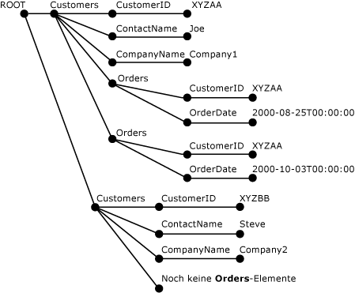

# <a name="openxml-sql-server"></a>OPENXML (SQL Server)
  OPENXML ist ein [!INCLUDE[tsql](../../includes/tsql-md.md)] -Schlüsselwort, das für arbeitsspeicherinterne XML-Dokumente ein Rowset bereitstellt, das mit einer Tabelle oder einer Sicht vergleichbar ist. OPENXML ermöglicht es, auf XML-Daten so zuzugreifen, wie auf ein relationales Rowset. Dies geschieht, indem eine Rowsetsicht der internen Darstellung eines XML-Dokuments bereitgestellt wird. Die Datensätze im Rowset können in Datenbanktabellen gespeichert werden.  
  
 OPENXML kann immer dann in SELECT- und SELECT INTO-Anweisungen verwendet werden, wenn Rowsetanbieter, eine Sicht oder OPENROWSET als Quelle verwendet werden können. Informationen zur Syntax von OPENXML finden Sie unter [OPENXML &#40;Transact-SQL&#41;](../../t-sql/functions/openxml-transact-sql.md).  
  
 Um Abfragen für XML-Dokumente mithilfe von OPENXML zu schreiben, müssen Sie zunächst **sp_xml_preparedocument**aufrufen. Dies analysiert das XML-Dokument und gibt ein Handle auf das analysierte Dokument zurück, das zur Verwendung bereit ist. Das analysierte Dokument ist eine strukturierte Dokumentobjektdarstellung (DOM - Document Object Model) der verschiedenen Knoten des XML-Dokuments. Das Dokumenthandle wird an OPENXML übergeben. OPENXML erstellt dann auf der Grundlage der übergebenen Parameter eine Rowsetsicht des Dokuments.  
  
> [!NOTE]  
>  **sp_xml_preparedocument** verwendet eine SQL-aktualisierte Version des MSXML-Parsers (Msxmlsql.dll). Diese Version des MSXML-Parsers wurde für [!INCLUDE[ssNoVersion](../../includes/ssnoversion-md.md)] entwickelt und ist abwärtskompatibel zu MSXML Version 2.6.  
  
 Die interne Darstellung eines XML-Dokuments muss durch einen Aufruf der gespeicherten Systemprozedur **sp_xml_removedocument** aus dem Arbeitsspeicher gelöscht werden, um den Arbeitsspeicher zu leeren.  
  
 Der Vorgang wird in der folgenden Abbildung veranschaulicht.  
  
   
  
 Um die Funktionsweise von OPENXML zu verstehen, benötigen Sie Kenntnisse über XPath-Abfragen und XML. Weitere Informationen zur XPath-Unterstützung in SQL Server finden Sie unter [Verwenden von XPath-Abfragen in SQLXML 4.0](../../relational-databases/sqlxml-annotated-xsd-schemas-xpath-queries/using-xpath-queries-in-sqlxml-4-0.md).  
  
> [!NOTE]  
>  Mit OpenXML können die XPath-Muster für die Zeilen und Spalten als Variablen parametrisiert werden. Diese Art der Parametrisierung kann zu XPath-Ausdrucksangriffen führen, wenn der Programmierer die Parametrisierung für externe Benutzer offen legt (wenn Parameter beispielsweise über eine extern aufgerufene gespeicherte Prozedur bereitgestellt werden). Um solche potenziellen Sicherheitsprobleme zu vermeiden, sollten XPath-Parameter niemals für externe aufrufende Prozesse offen gelegt werden.  
  
## <a name="example"></a>Beispiel  
 Das folgende Beispiel veranschaulicht die Verwendung von `OPENXML` in einer `INSERT` - und einer `SELECT` -Anweisung. Das XML-Beispieldokument setzt sich aus `<Customers>` - und `<Orders>` -Elementen zusammen.  
  
 Zuerst analysiert die gespeicherte Prozedur `sp_xml_preparedocument` das XML-Dokument. Das analysierte Dokument ist eine strukturierte Darstellung der Knoten im XML-Dokument (Elemente, Attribute, Text und Kommentare). `OPENXML` verweist dann auf dieses analysierte XML-Dokument und erstellt eine Rowsetansicht für das gesamte oder Teile des XML-Dokuments. Eine `INSERT` -Anweisung kann mithilfe von `OPENXML` Daten aus einem solchen Rowset in eine Datenbanktabelle einfügen. Es können mehrere `OPENXML` -Aufrufe verwendet werden, um eine Rowsetsicht verschiedener Teile des XML-Dokuments bereitzustellen und sie zu verarbeiten, indem sie z. B. in unterschiedliche Tabellen eingefügt werden. Dieses Verfahren wird auch als Aufteilen von XML-Daten in Tabellen bezeichnet.  
  
 Im folgenden Beispiel wird ein XML-Dokument so aufgeteilt, dass mithilfe von zwei `<Customers>` -Anweisungen `Customers` -Elemente in der `<Orders>` -Tabelle und `Orders` -Elemente in der `INSERT` -Tabelle gespeichert werden. Das Beispiel enthält auch eine `SELECT` -Anweisung mit `OPENXML` , die `CustomerID` und `OrderDate` aus dem XML-Dokument abruft. Der letzte Schritt in diesem Verfahren besteht darin, `sp_xml_removedocument`erneut aufzurufen. Dadurch wird der der internen XML-Darstellung, die während der Analysephase erstellt wurde, zugewiesene Arbeitsspeicher freigegeben.  
  
```  
-- Create tables for later population using OPENXML.  
CREATE TABLE Customers (CustomerID varchar(20) primary key,  
                ContactName varchar(20),   
                CompanyName varchar(20));  
GO  
CREATE TABLE Orders( CustomerID varchar(20), OrderDate datetime;)  
GO  
DECLARE @docHandle int;  
DECLARE @xmlDocument nvarchar(max); -- or xml type  
SET @xmlDocument = N'<ROOT>  
<Customers CustomerID="XYZAA" ContactName="Joe" CompanyName="Company1">  
<Orders CustomerID="XYZAA" OrderDate="2000-08-25T00:00:00"/>  
<Orders CustomerID="XYZAA" OrderDate="2000-10-03T00:00:00"/>  
</Customers>  
<Customers CustomerID="XYZBB" ContactName="Steve"  
CompanyName="Company2">No Orders yet!  
</Customers>  
</ROOT>';  
EXEC sp_xml_preparedocument @docHandle OUTPUT, @xmlDocument;  
-- Use OPENXML to provide rowset consisting of customer data.  
INSERT Customers   
SELECT *   
FROM OPENXML(@docHandle, N'/ROOT/Customers')   
  WITH Customers;  
-- Use OPENXML to provide rowset consisting of order data.  
INSERT Orders   
SELECT *   
FROM OPENXML(@docHandle, N'//Orders')   
  WITH Orders;  
-- Using OPENXML in a SELECT statement.  
SELECT * FROM OPENXML(@docHandle, N'/ROOT/Customers/Orders') WITH (CustomerID nchar(5) '../@CustomerID', OrderDate datetime);  
-- Remove the internal representation of the XML document.  
EXEC sp_xml_removedocument @docHandle;   
```  
  
 Die folgende Abbildung zeigt die analysierte XML-Struktur des vorherigen XML-Dokuments, das mithilfe von sp_xml_preparedocument erstellt wurde.  
  
   
  
## <a name="openxml-parameters"></a>OPENXML-Parameter  
 Zu den Parametern für OPENXML gehören:  
  
-   Ein XML-Dokumenthandle (*idoc*)  
  
-   Ein XPath-Ausdruck zur Identifizierung der Knoten, die Zeilen zugeordnet werden (*rowpattern*)  
  
-   Eine Beschreibung des zu generierenden Rowsets  
  
-   Die Zuordnung zwischen den Rowsetspalten und den XML-Knoten  
  
### <a name="xml-document-handle-idoc"></a>XML-Dokumenthandle (idoc)  
 Das Dokumenthandle wird von der gespeicherten Prozedur **sp_xml_preparedocument** zurückgegeben.  
  
### <a name="xpath-expression-to-identify-the-nodes-to-be-processed-rowpattern"></a>XPath-Ausdruck zur Identifizierung der zu verarbeitenden Knoten (rowpattern)  
 Der als *rowpattern* angegebene XPath-Ausdruck bezeichnet einen Knotensatz im XML-Dokument. Jeder von *rowpattern* identifizierte Knoten entspricht in dem von OPENXML generierten Rowset einer einzelnen Zeile.  
  
 Bei den durch den XPath-Ausdruck identifizierten Knoten kann es sich um jeden im XML-Dokument enthaltenen Knoten handeln. Wenn *rowpattern* eine Reihe von Elementen im XML-Dokument identifiziert, wird für jeden identifizierten Elementknoten eine Zeile im Rowset erstellt. Wenn z. B. *rowpattern* mit einem Attribut endet, wird für jeden von *rowpattern*ausgewählten Attributknoten eine Zeile erstellt.  
  
### <a name="description-of-the-rowset-to-be-generated"></a>Beschreibung des zu generierenden Rowsets  
 Zum Generieren des Rowsets verwendet OPENXML ein Rowsetschema. Ein Rowsetschema kann über die folgenden Optionen angegeben werden.  
  
#### <a name="using-the-edge-table-format"></a>Verwenden des Rahmentabellenformats  
 Um ein Rowsetschema anzugeben, müssen Sie das Rahmentabellenformat verwenden. Verwenden Sie keine WITH-Klausel.  
  
 In diesem Fall gibt OPENXML ein Rowset im Rahmentabellenformat zurück. Die Bezeichnung Rahmentabelle geht darauf zurück, dass jeder Rahmen in der analysierten XML-Dokumentstruktur einer Zeile im Rowset zugeordnet wird.  
  
 Rahmentabellen stellen die detaillierte XML-Dokumentstruktur in einer einzigen Tabelle dar. Diese Struktur enthält die Element- und Attributnamen, die Dokumenthierarchie, die Namespaces und die Verarbeitungsanweisungen. Durch das Rahmentabellenformat erhalten Sie zusätzliche Informationen, die nicht über die Metaeigenschaften offen gelegt werden. Weitere Informationen zu Metaeigenschaften finden Sie unter [Specify Metaproperties in OPENXML](../../relational-databases/xml/specify-metaproperties-in-openxml.md).  
  
 Die von Rahmentabellen gebotenen zusätzlichen Informationen ermöglichen Ihnen das Speichern und Abfragen des Datentyps eines Elements oder Attributs, des Knotentyps sowie das Speichern und Abfragen von Informationen zur Struktur von XML-Dokumenten. Die zusätzlichen Informationen ermöglichen außerdem das Erstellen eines eigenen XML-Dokumentmanagementsystems.  
  
 Mithilfe einer Rahmentabelle können Sie gespeicherte Prozeduren schreiben, die XML-Dokumente als BLOB-Eingabe (Binary Large OBject) verwenden, die Rahmentabelle ausgeben und dann das Dokument auf einer detaillierteren Ebene extrahieren und analysieren. Diese detaillierte Ebene kann die Dokumenthierarchie, die Element- und Attributnamen, die Namespaces und die Verarbeitungsanweisungen enthalten.  
  
 Die Rahmentabelle kann auch als Speicherformat für XML-Dokumente dienen, wenn keine andere Zuordnung zu relationalen Formaten logisch ist und ein ntext-Feld keine ausreichenden strukturellen Informationen bietet.  
  
 Wenn die Überprüfung des XML-Dokuments mit einem XML-Parser möglich ist, können Sie dieselben Informationen stattdessen auch mit einer Rahmentabelle erhalten.  
  
 In der folgenden Tabelle wird die Struktur der Rahmentabelle beschrieben.  
  
|Spaltenname|Datentyp|Beschreibung|  
|-----------------|---------------|-----------------|  
|**id**|**bigint**|Die eindeutige ID des Dokumentknotens.<br /><br /> Das Stammelement weist den ID-Wert 0 auf. Die negativen ID-Werte sind reserviert.|  
|**parentid**|**bigint**|Identifiziert das übergeordnete Element des Knotens. Bei dem über diese ID identifizierten übergeordneten Objekt muss es sich nicht unbedingt um das übergeordnete Element handeln. Dies hängt jedoch vom NodeType des Knotens ab, dessen übergeordnetes Objekt durch diese ID identifiziert wird. Wenn es sich bei dem Knoten beispielsweise um einen Textknoten handelt, kann das übergeordnete Objekt ein Attributknoten sein.<br /><br /> Wenn sich der Knoten auf der obersten Ebene im XML-Dokument befindet, ist **ParentID** gleich NULL.|  
|**node type**|**int**|Identifiziert den Knotentyp. Eine ganze Zahl, die der Nummer des Knotentyps des XML-Objektmodells (DOM) entspricht.<br /><br /> In dieser Spalte können folgende Werte den Knotentyp angeben:<br /><br /> **1** = Elementknoten<br /><br /> **2** = Attributknoten<br /><br /> **3** = Textknoten<br /><br /> **4** = CDATA-Abschnittsknoten<br /><br /> **5** = Entitätsverweisknoten<br /><br /> **6** = Entitätsknoten<br /><br /> **7** = Verarbeitungsanweisungsknoten<br /><br /> **8** = Kommentarknoten<br /><br /> **9** = Dokumentknoten<br /><br /> **10** = Dokumenttypknoten<br /><br /> **11** = Dokumentfragmentknoten<br /><br /> **12** = Notationsknoten<br /><br /> Weitere Informationen finden Sie im Microsoft XML (MSXML) SDK im Abschnitt über die nodeType-Eigenschaft.|  
|**localname**|**nvarchar(max)**|Gibt den lokalen Namen des Elements oder Attributs an. Ist NULL, wenn das DOM-Objekt keinen Namen hat.|  
|**Präfix**|**nvarchar(max)**|Das Namespacepräfix des Knotennamens.|  
|**namespaceuri**|**nvarchar(max)**|Der Namespace-URI (Universal Resource Identifier) des Knotens. Ist der Wert NULL, ist kein Namespace vorhanden.|  
|**datatype**|**nvarchar(max)**|Der eigentliche Datentyp der Element- oder Attributzeile, der anderenfalls NULL ist. Der Datentyp wird aus der Inline-DTD (Document Type Definition) oder aus dem Inlineschema abgeleitet.|  
|**prev**|**bigint**|Die XML-ID des vorhergehenden gleichgeordneten Elements. Ist NULL, wenn kein direktes vorhergehendes gleichgeordnetes Element vorhanden ist.|  
|**text**|**ntext**|Enthält den Attributwert oder den Elementinhalt als Text. Oder ist NULL, wenn für den Rahmentabelleneintrag kein Wert benötigt wird.|  
  
#### <a name="using-the-with-clause-to-specify-an-existing-table"></a>Verwenden der WITH-Klausel, um eine vorhandene Tabelle anzugeben  
 Mit der WITH-Klausel können Sie den Namen einer vorhandenen Tabelle angeben. Hierzu geben Sie einfach den Namen einer vorhandenen Tabelle an, deren Schema OPENXML zum Generieren des Rowsets verwenden kann.  
  
#### <a name="using-the-with-clause-to-specify-a-schema"></a>Verwenden der WITH-Klausel, um ein Schema anzugeben  
 Mit der WITH-Klausel können Sie ein vollständiges Schema angeben. Ein Rowsetschema wird durch Angeben der Spaltennamen, der zugehörigen Datentypen und der Zuordnung zum XML-Dokument angegeben.  
  
 Sie können das Spaltenmuster mithilfe des ColPattern-Parameters in SchemaDeclaration angeben. Das angegebene Spaltenmuster wird zur Zuordnung einer Rowsetspalte zum von rowpattern bezeichneten XML-Knoten und zur Bestimmung des Zuordnungstyps verwendet.  
  
 Wenn ColPattern für eine Spalte nicht angegeben ist, wird die Rowsetspalte basierend auf der vom *flags* -Parameter angegebenen Zuordnung dem XML-Knoten mit demselben Namen zugeordnet. Wenn ColPattern in der WITH-Klausel jedoch als Teil der Schemaspezifikation angegeben ist, wird die im *flags* -Parameter angegebene Zuordnung überschrieben.  
  
### <a name="mapping-between-the-rowset-columns-and-the-xml-nodes"></a>Die Zuordnung zwischen den Rowsetspalten und den XML-Knoten  
 In der OPENXML-Anweisung können Sie optional den Typ der Zuordnung – wie attributzentriert oder elementzentriert – zwischen den Rowsetspalten und den von *rowpattern*identifizierten XML-Knoten angeben. Diese Information wird bei der Transformation zwischen XML-Knoten und Rowsetspalten verwendet.  
  
 Die Zuordnung kann auf zwei Arten angegeben werden, wobei Sie auch beide angeben können:  
  
-   Mit dem *flags* -Parameter  
  
     Die vom *flags* -Parameter angegebene Zuordnung geht von einer Namensentsprechung aus, bei der die XML-Knoten den entsprechenden Rowsetspalten mit demselben Namen zugeordnet werden.  
  
-   Mit dem *ColPattern* -Parameter  
  
     *ColPattern*, ein XPath-Ausdruck, wird in der WITH-Klausel als Teil von *SchemaDeclaration* angegeben. Durch die in *ColPattern* angegebene Zuordnung wird die Zuordnung des *flags* -Parameters überschrieben.  
  
     *ColPattern* kann zur Angabe des Zuordnungstyps – wie attributzentriert oder elementzentriert – verwendet werden, der die vom Parameter *flags*angegebene Standardzuordnung überschreibt oder erweitert.  
  
     *ColPattern* wird in folgenden Situationen angegeben:  
  
    -   Der Spaltenname im Rowset unterscheidet sich vom Element- oder Attributnamen, dem er zugeordnet ist. In diesem Fall wird *ColPattern* zur Identifizierung des XML-Element- und Attributnamens verwendet, dem die Rowsetspalte zugeordnet ist.  
  
    -   Der Spalte soll ein Metaeigenschaftsattribut zugeordnet werden. In diesem Fall wird *ColPattern* zur Identifizierung der Metaeigenschaft verwendet, der die Rowsetspalte zugeordnet ist. Weitere Informationen zur Verwendung von Metaeigenschaften finden Sie unter [Angeben von Metaeigenschaften in OPENXML](../../relational-databases/xml/specify-metaproperties-in-openxml.md).  
  
 Sowohl der *flags* -Parameter als auch der *ColPattern* -Parameter sind optional. Wenn keine Zuordnung angegeben ist, wird eine attributzentrierte Zuordnung vorgenommen. Die attributzentrierte Zuordnung ist der Standardwert des *flags* -Parameters.  
  
#### <a name="attribute-centric-mapping"></a>Attributzentrierte Zuordnung  
 Wenn der *flags* -Parameter in OPENXML auf 1 festgelegt ist (XML_ATTRIBUTES), wird die **attributzentrierte** Zuordnung durchgeführt. Wenn *flags* XML_ATTRIBUTES enthält, enthält oder verwendet das verfügbar gemachte Rowset Zeilen, in denen jedes XML-Element als eine Zeile dargestellt ist. Die XML-Attribute werden anhand ihres Namens den Attributen zugeordnet, die in SchemaDeclaration definiert sind, oder die in der WITH-Klausel über Tablename bereitgestellt werden. Die Namensübereinstimmung bedeutet, dass XML-Attribute eines bestimmten Namens in einer Spalte im Rowset mit demselben Namen gespeichert werden.  
  
 Wenn sich der Spaltenname vom zugeordneten Attributnamen unterscheidet, muss der *ColPattern* -Parameter angegeben werden.  
  
 Wenn das XML-Attribut über einen Namespacequalifizierer verfügt, muss der Spaltenname im Rowset ebenfalls über einen Qualifizierer verfügen.  
  
#### <a name="element-centric-mapping"></a>Elementzentrierte Zuordnung  
 Wenn der *flags* -Parameter in OPENXML auf 2 (XML_ELEMENTS) festgelegt ist, wird die **elementzentrierte** Zuordnung vorgenommen. Sie ist, abgesehen von den folgenden Unterschieden, mit der **attributzentrierten** Zuordnung vergleichbar:  
  
-   Die Namensübereinstimmung der Zuordnung (z. B. eine Spaltenzuordnung zu einem XML-Element desselben Namens) wählt die nicht komplexen Teilelemente aus, es sei denn, es wurde ein Muster auf Spaltenebene angegeben. Wenn das Teilelement komplex ist, weil es weitere Teilelemente enthält, wird die Spalte während des Abfrageprozesses auf NULL festgelegt. Attributwerte der Teilelemente werden dann ignoriert.  
  
-   Wenn mehrere Teilelemente denselben Namen besitzen, wird der erste Knoten zurückgeliefert.  
  
## <a name="see-also"></a>Siehe auch  
 [sp_xml_preparedocument &#40;Transact-SQL&#41;](../../relational-databases/system-stored-procedures/sp-xml-preparedocument-transact-sql.md)   
 [sp_xml_removedocument &#40;Transact-SQL&#41;](../../relational-databases/system-stored-procedures/sp-xml-removedocument-transact-sql.md)   
 [OPENXML &#40;Transact-SQL&#41;](../../t-sql/functions/openxml-transact-sql.md)   
 [XML-Daten &#40;SQL Server&#41;](../../relational-databases/xml/xml-data-sql-server.md)  
  
  
