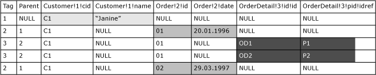

# <a name="use-explicit-mode-with-for-xml"></a>Verwenden des EXPLICIT-Modus mit FOR XML
  Wie im Thema [Erstellen von XML mithilfe von FOR XML](../../relational-databases/xml/for-xml-sql-server.md)beschrieben wird, bieten die Modi RAW und AUTO kaum Steuerungsmöglichkeiten für die Form des aus einem Abfrageergebnis generierten XML-Codes. Der EXPLICIT-Modus hingegen ermöglicht größte Flexibilität beim Generieren der gewünschten XML-Ausgabe aus einem Abfrageergebnis.  
  
 Die Abfrage im EXPLICIT-Modus muss so geschrieben werden, dass die zusätzlichen Informationen zu der erforderlichen XML-Ausgabe, wie z. B. die erwartete Schachtelung, explizit als Teil der Abfrage angegeben werden. Das Schreiben von Abfragen im EXPLICIT-Modus kann jedoch aufwendig sein, je nachdem, welche XML-Daten erforderlich sind. Möglicherweise ist das [Verwenden des PATH-Modus](../../relational-databases/xml/use-path-mode-with-for-xml.md) mit Schachtelung dem Schreiben von Abfragen im EXPLICIT-Modus als einfachere Alternative vorzuziehen.  
  
 Da Sie die gewünschten XML-Daten als Teil der Abfrage im EXPLICIT-Modus beschreiben, müssen Sie sicherstellen, dass die generierten XML-Daten wohlgeformt und gültig sind.  
  
## <a name="rowset-processing-in-explicit-mode"></a>Verarbeiten von Rowsets im EXPLICIT-Modus  
 Der EXPLICIT-Modus transformiert das Rowset, das beim Ausführen der Abfrage ausgegeben wird, in ein XML-Dokument. Das Rowset muss ein bestimmtes Format aufweisen, damit der EXPLICIT-Modus das XML-Dokument erstellt. Dies erfordert, dass Sie die zum Erstellen des Rowsets, **universal table**, erforderliche SELECT-Abfrage in einem bestimmten Format schreiben, damit die Verarbeitungslogik die gewünschten XML-Daten erstellt.  
  
 Zuerst muss die Abfrage die folgenden beiden Metadatenspalten erstellen:  
  
-   Die erste Spalte muss die Tagnummer des aktuellen Elements als Integer-Typ bereitstellen; der Name der Spalte muss **Tag**lauten. Die Abfrage muss eine eindeutige Tagnummer für jedes aus dem Rowset konstruierte Element bereitstellen.  
  
-   Die zweite Spalte muss die Tagnummer des übergeordneten Elements bereitstellen; der Name dieser Spalte muss **Parent**lauten. So stellen die Tag- und die Parent-Spalte Informationen zur Hierarchie bereit.  
  
 Die Werte der Metadatenspalten sowie die Informationen in den Spaltennamen werden dann zum Erstellen der gewünschten XML-Ausgabe verwendet. Beachten Sie, dass die Abfrage die Spaltennamen in einer bestimmten Art bereitstellen muss. Beachten Sie außerdem, dass der Wert 0 oder NULL in der **Parent** -Spalte anzeigt, dass das entsprechende Element kein übergeordnetes Element besitzt. Das Element wird der XML-Ausgabe auf der obersten Ebene hinzugefügt.  
  
 Zum besseren Verständnis dazu, wie die von der Abfrage generierte Universaltabelle zu einem XML-Ergebnis verarbeitet wird, nehmen Sie einmal an, Sie haben eine Abfrage geschrieben, die die folgende Universaltabelle erstellt:  
  
   
  
 Beachten Sie hinsichtlich dieser Universaltabelle Folgendes:  
  
-   Die ersten beiden Spalten sind Metadatenspalten mit der Bezeichnung **Tag** und **Parent** . Diese Werte bestimmen die Hierarchie.  
  
-   Die Spaltennamen werden in einer bestimmten Art angegeben, wie weiter unten in diesem Thema beschrieben.  
  
-   Beim Generieren der XML-Ausgabe aus dieser Universaltabelle werden die Daten dieser Tabelle vertikal in Spaltengruppen partitioniert. Die Gruppierung wird aufgrund des **Tag** -Wertes und der Spaltennamen bestimmt. Beim Konstruieren der XML-Ausgabe wählt die Verarbeitungslogik jeweils eine Spaltengruppe für jede Zeile aus und konstruiert so ein Element. In diesem Beispiel gilt Folgendes:  
  
    -   Für den Wert „1“ in der ersten Zeile der **Tag**-Spalte bilden die Spalten, deren Namen dieselbe Tagnummer enthalten, also **Customer!1!cid** und **Customer!1!name**, eine Gruppe. Diese Spalten werden nun beim Verarbeiten der Zeile verwendet. Beachten Sie auch die Form des generierten Elements: <`Customer id=... name=...`>. Das Format der Spaltennamen wird weiter unten in diesem Thema beschrieben.  
  
    -   Für die Zeilen mit dem Wert „2“ in der **Tag**-Spalte bilden die Spalten **Order!2!id** und **Order!2!date** eine Gruppe, die dann zum Konstruieren der Elemente verwendet wird, <`Order id=... date=... /`>.  
  
    -   Für die Zeilen mit dem Wert „3“ in der **Tag**-Spalte bilden die Spalten **OrderDetail!3!id!id** und **OrderDetail!3!pid!idref** ebenfalls eine Gruppe. Jede dieser Zeilen generiert ein Element, <`OrderDetail id=... pid=...`>, aus diesen Spalten.  
  
-   Beachten Sie, dass die Zeilen beim Generieren der XML-Hierarchie der Reihe nach verarbeitet werden. Die XML-Hierarchie wird wie folgt bestimmt:  
  
    -   Die erste Zeile gibt den **Tag** -Wert 1 und den **Parent** -Wert NULL an. Das entsprechende Element, <`Customer`>, wird dem XML-Dokument folglich auf der obersten Ebene hinzugefügt.  
  
        ```  
        <Customer cid="C1" name="Janine">  
        ```  
  
    -   In der zweiten Zeile werden der **Tag** -Wert 2 und der **Parent** -Wert 1 aufgeführt. Folglich wird dem <`Customer`>-Element das untergeordnete <`Order`>-Element hinzugefügt.  
  
        ```  
        <Customer cid="C1" name="Janine">  
           <Order id="O1" date="1/20/1996">  
        ```  
  
    -   In den nächsten beiden Zeilen werden der **Tag** -Wert 3 und der **Parent** -Wert 2 aufgeführt. Folglich werden dem <`Order`>-Element die beiden untergeordneten <`OrderDetail`>-Elemente hinzugefügt.  
  
        ```  
        <Customer cid="C1" name="Janine">  
           <Order id="O1" date="1/20/1996">  
              <OrderDetail id="OD1" pid="P1"/>  
              <OrderDetail id="OD2" pid="P2"/>  
        ```  
  
    -   Die letzte Zeile identifiziert die **Tag** -Nummer 2 und die **Parent** -Tagnummer 1. Folglich wird dem übergeordneten <`Customer`>-Element ein weiteres untergeordnetes <`Order`>-Element hinzugefügt.  
  
        ```  
        <Customer cid="C1" name="Janine">  
           <Order id="O1" date="1/20/1996">  
              <OrderDetail id="OD1" pid="P1"/>  
              <OrderDetail id="OD2" pid="P2"/>  
           </Order>  
           <Order id="O2" date="3/29/1997">  
        </Customer>  
        ```  
  
 Zusammenfassend sind also beim Verwenden des EXPLICIT-Modus zum Erstellen einer XML-Ausgabe die Werte in der **Tag** - und **Parent** -Metadatenspalte, die in den Spaltennamen bereitgestellten Informationen sowie die richtige Reihenfolge der Zeilen erforderlich.  
  
### <a name="universal-table-row-ordering"></a>Anordnung der Zeilen in der Universaltabelle  
 Beim Konstruieren der XML-Daten werden die Zeilen in der Universaltabelle der Reihe nach verarbeitet. Daher müssen die Zeilen des Rowsets so angeordnet werden, dass jedem übergeordneten Knoten unmittelbar dessen untergeordnete Elemente folgen, damit die den einzelnen übergeordneten Elementen zugeordneten untergeordneten Elemente ordnungsgemäß abgerufen werden können.  
  
## <a name="specifying-column-names-in-a-universal-table"></a>Angeben von Spaltennamen in einer Universaltabelle  
 Beim Schreiben von Abfragen im EXPLICIT-Modus müssen die Spaltennamen des resultierenden Rowsets im folgenden Format angegeben werden. Die Spaltennamen stellen Transformationsinformationen wie Element- und Attributnamen sowie weitere, in Direktiven angegebene, zusätzliche Informationen bereit.  
  
 Das allgemeine Format sieht folgendermaßen aus:  
  
```  
  
ElementName!TagNumber!AttributeName!Directive  
```  
  
 Es folgt die Beschreibung der einzelnen Teile des Formats:  
  
 *ElementName*  
 Der allgemeine Bezeichner des Elements im Ergebnis. Wenn beispielsweise **Customers** als *ElementName* angegeben ist, wird das \<Customers>-Element generiert.  
  
 *TagNumber*  
 Ein eindeutiger, einem Element zugewiesener Tagwert. Dieser Wert bestimmt mithilfe der beiden Metadatenspalten **Tag** und **Parent**die Schachtelung der Elemente in der XML-Ausgabe.  
  
 *AttributeName*  
 Stellt den Namen des zu konstruierenden Attributs im angegebenen *ElementName*-Element bereit. Dieses Verhalten gilt, wenn kein Wert für *Directive* angegeben wird.  
  
 Wenn einer der Werte *xml* , **cdata**oder **element**für **Directive**angegeben wird, wird dieser Wert zum Konstruieren eines untergeordneten Elements von *ElementName*verwendet, und der Wert der Spalte wird diesem hinzugefügt.  
  
 Wenn Sie einen Wert für *Directive*angeben, kann *AttributeName* leer sein. Beispiel: ElementName!TagNumber!!Directive. In diesem Fall ist der Spaltenwert direkt in *ElementName*enthalten.  
  
 *Directive*  
 *Directive* ist optional und wird zum Bereitstellen zusätzlicher Informationen für das Konstruieren der XML-Ausgabe verwendet. *Directive* hat zwei Aufgaben.  
  
 Die erste besteht darin, Werte als ID, IDREF und IDREFS zu codieren. Sie können die Schlüsselwörter **ID**, **IDREF**und **IDREFS** als Werte für *Directive*angeben. Diese Direktiven überschreiben die Attributtypen. Außerdem ermöglichen sie, dokumentinterne Links zu erstellen.  
  
 Sie können *Directive* auch verwenden, um anzugeben, wie die Zeichenfolgendaten der XML-Ausgabe zugeordnet werden sollen. Als Werte für **Directive**können die Schlüsselwörter **hide**, **element, elementxsinil**, **xml**, **xmltext** und *cdata*verwendet werden. Die **hide** -Direktive blendet den Knoten aus. Dies kann sich als nützlich erweisen, wenn Sie Werte nur zu Sortierzwecken abrufen, jedoch nicht in der resultierenden XML-Ausgabe verwenden möchten.  
  
 Die **element** -Direktive generiert ein enthaltenes Element anstelle eines Attributs. Die enthaltenen Daten sind als Entität codiert. So wird z. B. das Zeichen **<** zu &lt;. Bei Spaltenwerten von NULL wird kein Element generiert. Wenn Sie möchten, dass für NULL-Spaltenwerte Elemente generiert werden, können Sie die **elementxsinil** -Direktive angeben. Damit wird ein Element mit dem Attribut xsi:nil=TRUE generiert.  
  
 Die **xml** -Direktive ist mit der **element** -Direktive identisch, mit der Ausnahme, dass keine Entitätscodierung vorgenommen wird. Beachten Sie, dass die **element** -Direktive mit **ID**, **IDREF**oder **IDREFS**kombiniert werden kann; die **xml** -Direktive hingegen ist mit keiner anderen Direktive außer **hide**zulässig.  
  
 Bei der **cdata** -Direktive werden die Daten von einem CDATA-Abschnitt umgeben. Es findet keine Entitätscodierung des Inhalts statt. Der ursprüngliche Datentyp muss vom Typ Text sein ( **varchar**, **nvarchar**, **text**oder **ntext**). Diese Direktive kann nur mit **hide**verwendet werden. Wird diese Direktive verwendet, darf *AttributeName* nicht angegeben werden.  
  
 Das Kombinieren von Direktiven dieser beiden Gruppen ist in den meisten Fällen zulässig, nicht jedoch das Kombinieren der Direktiven untereinander.  
  
 Wenn weder *Directive* noch *AttributeName* angegeben ist, wie z. B. in **Customer!1**, ist eine **element** -Direktive implizit enthalten, wie z. B. in **Customer!1!!element**, und die Spaltendaten sind in *ElementName*enthalten.  
  
 Wird die **xmltext** -Direktive angegeben, wird der Spalteninhalt von einem einzelnen Tag umgeben, das in den Rest des Dokuments integriert wird. Diese Direktive erweist sich beim Abrufen von nicht verbrauchten XML-Überlaufdaten, die in einer Spalte mithilfe von OPENXML gespeichert wurden, als nützlich. Weitere Informationen finden Sie unter [OPENXML &#40;SQL Server&#41;](../../relational-databases/xml/openxml-sql-server.md).  
  
 Wird *AttributeName* angegeben, wird der Tagname durch den angegebenen Namen ersetzt. Anderenfalls wird das Attribut an die aktuelle Liste der Attribute der einschließenden Elemente angefügt und der Inhalt ohne Entitätscodierung an den Anfang der Eingrenzung gesetzt. Die Spalte mit dieser Direktive muss vom Typ Text sein ( **varchar**, **nvarchar**, **char**, **nchar**, **text**oder **ntext**). Diese Direktive kann nur mit **hide**verwendet werden. Diese Direktive ist zum Abrufen von in einer Spalte gespeicherten Überlaufdaten nützlich. Wenn der Inhalt kein wohlgeformtes XML-Dokument ist, ist das Verhalten nicht definiert.  
  
## <a name="in-this-section"></a>In diesem Abschnitt  
 Die folgenden Beispiele veranschaulichen die Verwendung des EXPLICIT-Modus.  
  
-   [Beispiel: Abrufen von Informationen zu Mitarbeitern](../../relational-databases/xml/example-retrieving-employee-information.md)  
  
-   [Beispiel: Angeben der ELEMENT-Direktive](../../relational-databases/xml/example-specifying-the-element-directive.md)  
  
-   [Beispiel: Angeben der ELEMENTXSINIL-Direktive](../../relational-databases/xml/example-specifying-the-elementxsinil-directive.md)  
  
-   [Beispiel: Erstellen von gleichgeordneten Elementen im EXPLICIT-Modus](../../relational-databases/xml/example-constructing-siblings-with-explicit-mode.md)  
  
-   [Beispiel: Angeben der ID- und der IDREF-Direktive](../../relational-databases/xml/example-specifying-the-id-and-idref-directives.md)  
  
-   [Beispiel: Angeben der ID- und der IDREFS-Direktive](../../relational-databases/xml/example-specifying-the-id-and-idrefs-directives.md)  
  
-   [Beispiel: Angeben der HIDE-Direktive](../../relational-databases/xml/example-specifying-the-hide-directive.md)  
  
-   [Beispiel: Angeben der ELEMENT-Direktive und Entitätscodierung](../../relational-databases/xml/example-specifying-the-element-directive-and-entity-encoding.md)  
  
-   [Beispiel: Angeben der CDATA-Direktive](../../relational-databases/xml/example-specifying-the-cdata-directive.md)  
  
-   [Beispiel: Angeben der XMLTEXT-Direktive](../../relational-databases/xml/example-specifying-the-xmltext-directive.md)  
  
## <a name="see-also"></a>Siehe auch  
 [Verwenden des RAW-Modus mit FOR XML](../../relational-databases/xml/use-raw-mode-with-for-xml.md)   
 [Verwenden des AUTO-Modus mit FOR XML](../../relational-databases/xml/use-auto-mode-with-for-xml.md)   
 [Verwenden des PATH-Modus mit FOR XML](../../relational-databases/xml/use-path-mode-with-for-xml.md)   
 [SELECT &#40;Transact-SQL&#41;](../../t-sql/queries/select-transact-sql.md)   
 [FOR XML &#40;SQL Server&#41;](../../relational-databases/xml/for-xml-sql-server.md)  
  
  
