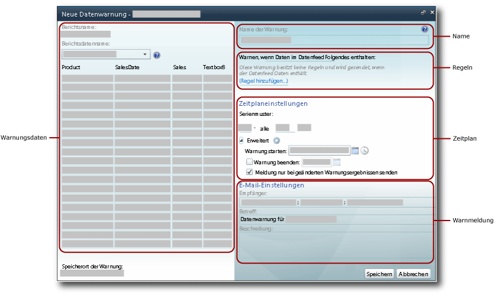

# Datenwarnungs-Designer

[!INCLUDE[ssrs-appliesto-sql2016-xpreview](../includes/ssrs-appliesto-sql2016-xpreview.md)][!INCLUDE[ssrs-appliesto-sharepoint-2013-2016i](../includes/ssrs-appliesto-sharepoint-2013-2016.md)]

Sie können Datenwarnungsdefinitionen im Datenwarnungs-Designer erstellen und bearbeiten. Eine Warnungsdefinition ist eine Auflistung von Metadaten. Dazu gehören die für Sie interessanten Berichtsdaten, die Regeln, die Berichtsdaten zum Erstellen von Datenwarnungsinstanzen und zum Senden von Datenwarnmeldungen erfüllen müssen, sowie die Empfänger der Warnmeldung usw.  

> [!NOTE]
> Reporting Services-Integration in SharePoint ist nach SQL Server 2016 nicht mehr verfügbar.

 Um eine Warnungsdefinition zu erstellen, führen Sie eine Reihe von verwandten Tasks aus:  
  
-   Wählen Sie den Bericht und den Berichtsdatenfeed aus, der Daten enthält, die Sie verwenden möchten.  
  
-   Definieren Sie die Regeln und Klauseln, die das Senden einer Warnung veranlassen. Die Regeln können einfach oder komplex sein, wobei mehrere durch AND-Operatoren kombinierte Klauseln verwendbar sind.  
  
-   Definieren Sie die Häufigkeit, mit der die Warnmeldung gesendet wird, sowie das Datum und die Uhrzeit für Start und Ende der Warnung. Warnmeldungen können nur gesendet werden, wenn sich Ergebnisse ändern.  
  
-   Geben Sie die E-Mail-Adressen von Warnmeldungsempfängern an.  
  
-   Passen Sie die Zeile **Betreff** der Warnmeldung an.  
  
-   Stellen Sie eine Beschreibung der Warnung für eine Warnmeldung bereit.  
  
> [!NOTE]  
>  Da die [!INCLUDE[ssRSnoversion](../includes/ssrsnoversion-md.md)] -Datenwarnungsfunktion nur verfügbar ist, wenn Sie [!INCLUDE[ssRSnoversion](../includes/ssrsnoversion-md.md)] im SharePoint-Modus installieren, muss der Bericht, für den Sie eine Warnung erstellen möchten, gespeichert, bereitgestellt oder in eine SharePoint-Dokumentbibliothek hochgeladen werden.  
>   
>  Datenwarnungen können nicht für Berichte erstellt werden, bei denen die integrierte Windows-Authentifizierung verwendet wird oder die Angabe von Anmeldeinformationen erforderlich ist. Die Berichte müssen gespeicherte Anmeldeinformationen verwenden. Weitere Informationen finden Sie unter [Specify Credential and Connection Information for Report Data Sources](../reporting-services/report-data/specify-credential-and-connection-information-for-report-data-sources.md).  
  
 Zum Öffnen des Datenwarnungs-Designers klicken Sie auf der Berichtssymbolleiste im Menü **Aktionen** auf die Option **Neue Datenwarnung** . Wenn Sie die Option **Neue Datenwarnung** nicht sehen, ist der Bericht zur Verwendung von gespeicherten Anmeldeinformationen nicht konfiguriert. Sie können den Typ der Anmeldeinformationen aktualisieren, indem Sie die Berichtsdatenquelle der SharePoint-Bibliothek aktualisieren.  
  
##   Benutzeroberfläche des Datenwarnungs-Designers  
 Der Datenwarnungs-Designer ist in verschiedene Bereiche unterteilt. Der Bereich, in dem Sie den Berichtsdatenfeed auswählen, der Bereich, in dem Sie einfache oder komplexe Bedingungen erstellen, indem Sie Bedingungen Regeln hinzufügen, usw. Das folgende Bild zeigt die Bereiche im Datenwarnungs-Designer an.  
  
   
  
  
### Warnungsdaten  
 Nach dem Öffnen des Datenwarnungs-Designers werden alle Datenfeeds aus dem Bericht generiert und zur Verfügung gestellt. Die Dropdownliste **Berichtsdatenname** enthält die Namen der Feeds. Die Datenfeeds werden im Arbeitsspeicher zwischengespeichert, während Sie die Warnungsdefinition und die Tabelle erstellen, die angezeigt werden. Die Datenfeeddaten werden schnell aufgefüllt, wenn Sie zwischen Datenfeeds umschalten, um die Berichtsdaten zu untersuchen.  
  
 Der erste Schritt beim Erstellen einer Datenwarnungsdefinition ist das Auswählen des Berichtsdatenfeeds, der die Daten enthält, die mithilfe der Warnung überwacht werden sollen. Berichte können keine oder mehrere Datenfeeds enthalten. Wenn ein Bericht keine Datenfeeds enthält, können Sie keine Warnungen dafür erstellen. Ein Datenfeed kann von jedem Datenbereich generiert werden, einschließlich aller Typen von Diagrammen, Messgeräten, Indikatoren sowie Tabellen, Matrizen und Listen.  
  
 Ist der Bericht parametrisiert, und sehen Sie nicht die im Berichtsdatenfeed erwarteten Daten und Spalten, führen Sie den Bericht mithilfe der entsprechenden Parameterwerte erneut aus. Die Spalten und Werte müssen im Bericht vorhanden sein, der in den Datenfeed einzubinden ist.  
  
 Abhängig vom Layout des Berichts ist es möglicherweise nicht intuitiv, wie viele Datenfeeds ein Bericht enthält oder welche Daten in welchem Datenfeed enthalten sind. Die [!INCLUDE[ssRSnoversion](../includes/ssrsnoversion-md.md)]-Atom-Renderingerweiterung generiert die Datenfeeds, die Sie mit Warnungen verwenden. Die Atom-Renderingerweiterung stellt Berichtsdaten als vereinfachte Rowsets bereit, ein Tabellenformat, in dem alle Spalten die gleiche Anzahl Zeilen aufweisen. Diese Rowsets sind Inhalte der Datenfeeds. Da das Berichtslayout oft komplex ist und Datenbereiche mit mehreren Peers oder geschachtelte Datenbereiche enthält, werden mehrere Datenfeeds benötigt, um alle Berichtsdaten verfügbar zu machen. Weitere Informationen zum Generieren von Datenfeeds aus Berichten finden Sie unter [Generieren von Datenfeeds aus Berichten &#40;Berichts-Generator und SSRS&#41;](../reporting-services/report-builder/generating-data-feeds-from-reports-report-builder-and-ssrs.md) und [Generieren von Datenfeeds aus einem Bericht &#40;Berichts-Generator und SSRS&#41;](../reporting-services/report-builder/generate-data-feeds-from-a-report-report-builder-and-ssrs.md).  
  
 Wenn Sie einen Datenfeed auswählen, werden die Daten aus dem Feed im Warnungsdatenbereich vom Datenwarnungs-Designer in einer Tabelle mit Zeilen und Spalten angezeigt. Die Metadaten der Datenquelle, die der Bericht verwendet, oder der Bericht selbst gibt/geben die Spaltennamen an, und der Datenfeed füllt die Feldliste auf, mit der Sie Regeln in der Datenbedingung definieren. Der Datenfeed enthält auch Metadaten, wie z. B. die Datentypen von Tabellenspalten, die die Werte und Vergleichsoperatoren einschränken, die Sie beim Erstellen der Regeln mit Feldern verwenden können.  
  
 Einige Berichte enthalten Millionen von Datenzeilen. In der Tabelle werden nur die ersten 100 Zeilen der Daten im Feed angezeigt.  
  
### Name der Warnung  
 Standardmäßig weist die Warnungsdefinition denselben Namen wie der Bericht auf. Sie können den Namen der Warnung in einen sinnvolleren Namen ändern. Dies erleichtert Ihnen beim Verwalten der Warnungen das Bestimmen der Warnungen, die aktualisiert, gelöscht usw. werden sollen.  
  
 Sie können mehrere Warnungen in einem Bericht erstellen. Zwar sind mehrere Warnungsdefinitionen mit demselben Namen möglich, es wird allerdings empfohlen, dass Sie eindeutige Namen für die Warnungen verwenden. Dies erleichtert die Unterscheidung und Verwaltung der Warnungsdefinitionen. Im Datenwarnungs-Manager können Sie eine Liste aller Warnungen anzeigen, die Sie erstellt haben. Weitere Informationen finden Sie unter [Datenwarnungs-Manager für Warnungsadministratoren](../reporting-services/data-alert-manager-for-alerting-administrators.md) und [Verwalten meiner Datenwarnungen im Datenwarnungs-Manager](../reporting-services/manage-my-data-alerts-in-data-alert-manager.md).  
  
### Regeln und Klauseln  
 Der Umfang der Datenänderungen und die Warnungsregeln definieren die Datenänderungen, die die Warnung auslösen. Der Umfang der Datenänderungen lautet wie folgt:  
  
-   **Einige Daten haben**– Mindestens ein Wert in den Daten erfüllt die Regeln, die die Bedingung angibt.  
  
-   **Keine Daten haben**– Kein Wert in den Daten erfüllt die Regeln, die die Bedingung angibt.  
  
 Eine Regel enthält 0 (null), eine Klausel oder viele Klauseln. Mehrere Regeln werden mithilfe des logischen AND-Operators kombiniert. Eine Regel kann mehrere mit dem OR-Operator kombinierte Klauseln beinhalten, wenn die Spalte den String-Datentyp aufweist. Im Folgenden werden die Basisregeln, die nur eine Klausel verwenden, sowie mehrere mit dem AND-Operator kombinierte Regeln und mehrere Regeln mit mindestens einer OR-Klausel gezeigt.  
  
 **Einfache Regeln**  
  
-   Nettoumsatz **ist größer als** 100.000  
  
-   Verkaufsdatum ist **nach** dem 1.6.2010  
  
-   Firmenname **ist nicht** Contoso  
  
 **Mit dem AND-Operator kombinierte Regeln**  
  
-   Umsatz **ist größer als** 1500,00  
  
     **und** verkaufte Einheiten **ist kleiner als** 500  
  
     Rückgabedatum **ist vor** dem 1.1.2010  
  
-   Umsatz **ist größer als oder gleich** 1500,00  
  
     **und** Rückgabedatum **ist nach** dem 01.01.2010  
  
     **und** verkaufte Einheiten **ist größer als** 500  
  
-   Heraufstufungsname **enthält** Spring  
  
     **und** verkaufte Einheiten **ist größer als** 500  
  
     **und** Gewinn **ist**  0  
  
 **Regeln mit OR-Klauseln**  
  
-   Nachname **ist** Blythe  
  
     **Oder**  Petulescu  
  
     **Oder**  Martin  
  
-   Rückgabedatum **ist nach** dem 01.01.2010  
  
     **und** Vertriebsgebiet **ist**  zentral  
  
     **Oder**  südlich  
  
     **Oder**  nördlich  
  
 Je nach Datentyp des Felds stellt der Datenwarnungs-Designer andere Vergleiche bereit. Der Datenwarnungs-Designer stellt Vergleiche bereit, die auf den Datentyp des Felds zugeschnitten sind, mit dem Werte verglichen werden. Im Folgenden werden Vergleiche für verschiedene Datentypen aufgelistet. Der **Boolean** -Datentyp wird nicht in Regeln unterstützt.  
  
-   Vergleiche des Datums-/Uhrzeitdatentyps sind **ist**, **ist not**, **ist before**und **ist after**.  
  
-   Vergleiche von numeristtchen Datentypen sind **ist**, **ist not**, **ist less than**, **ist less than or equal to**, **ist greater than**, **ist greater than or equal to**.  
  
-   Vergleiche des String-Datentyps sind **ist**, **ist not**und **enthält**.  
  
 Wenn Sie eine Regel erstellen, geben Sie an, ob ein Wert oder Feld im Vergleich zu verwenden ist. Wählen Sie dazu die Option **Werteingabemodus** oder **Feldauswahlmodus**aus. Wenn Sie **Werteingabemodus**auswählen, stellen Sie eine Liste mit zu vergleichenden Werten bereit. Ein Vergleich, der mehrere OR-Klauseln umfasst, ähnelt stark dem logischen IN-Vergleich in [!INCLUDE[tsql](../includes/tsql-md.md)], der einer Liste mit für eine Übereinstimmung zu testenden Werten entspricht. Weitere Informationen finden Sie unter [IN &#40;Transact-SQL&#41;](../t-sql/language-elements/in-transact-sql.md).  
  
 Wenn Sie **Feldauswahlmodus**auswählen, erfolgt der Vergleich zwischen zwei Feldern (Zeile für Zeile). Die zwei Felder müssen über kompatible Datentypen verfügen, beispielsweise zwei numerische Felder. Andernfalls ist der Vergleich nicht gültig. Eine Liste mit Feldern wird automatisch angezeigt, wenn Sie die Option **Feldauswahlmodus**auswählen.  
  
 Datenwarnungen ohne Regeln sind auch gültig. Dieser Warnungstyp kann sehr nützlich sein. Stellen Sie sich ein Szenario vor, in dem Sie nur benachrichtigt werden möchten, wenn der Berichtsdatenfeed Daten enthält. Der Datenfeed enthält Teilnehmerinformationen und der Feed ist leer, bis ein Teilnehmer den Vorgang abbricht. In diesem Szenario würden Sie eine Warnung empfangen und mit dem ersten Abbruch beginnen.  
  
 Sie können einzelne Regeln und Klauseln löschen.  
  
 Regeln und Klauseln sind in der Datenwarnmeldung enthalten.  
  
### Zeitplaneinstellungen  
 Der für die Datenwarnung definierte Zeitplan definiert für das Senden der Datenwarnmeldung das Serienmuster sowie Anfang und Ende der jeweiligen Warnmeldung. Die Muster sind: einmal, Minute, täglich und wöchentlich. Obwohl eine Warnung nur einen Zeitplan aufweist, können Sie mit diesen Intervallen komplexe Serienmuster erstellen, die die meisten Geschäftsanforderungen erfüllen. Beispiele für allgemeine Serienmuster, die in Zeitplänen verwendet werden:  
  
-   **Täglich alle 10 Tage** – sendet Warnungen alle 10 Tage einmal täglich.  
  
-   **Wöchentlich alle 2 Wochen am Montag** – sendet Warnungen nur montags alle zwei Wochen.  
  
-   **Stündlich alle 12 Stunden** – sendet alle 12 Stunden Warnungen.  
  
-   **Minute alle 30 Minuten** – sendet alle 30 Minuten Warnungen.  
  
 Das Serienmuster gibt an, wann die Warnung gesendet wird. Wenn die Regeln während des Intervalls erfüllt werden, das das Muster angibt, wird die Warnung erst am Ende des Intervalls gesendet.  
  
 Falls Sie so schnell wie möglich eine Datenwarnmeldung erhalten möchten, wenn Berichtsdaten die angegebenen Regeln erfüllen, können Sie die Warnung so planen, dass sie oft ausgeführt wird. Wenn sich die Berichtsdaten nicht ändern, erhalten Sie und andere Empfänger u. U. viele redundante Meldungen. Möchten Sie nur Meldungen empfangen, wenn sich die Ergebnisse der Regelanwendung ändern, wählen Sie die Option zum Senden von Meldungen nur bei Ergebnisänderungen **** .  
  
> [!IMPORTANT]  
>  Die Verwendung eines Serienmusters, das häufiger als täglich ausgeführt wird, ist nicht empfehlenswert, sofern hierfür kein wichtiger Grund auf Unternehmensebene vorliegt. Die Verarbeitung von Datenwarnungsdefinitionen in Echtzeit ist kein unterstütztes Szenario. Das zu häufige Verarbeiten von Datenwarnungsdefinitionen beeinträchtigt die Leistung des Berichtsservers und der allgemeinen [!INCLUDE[ssRSnoversion](../includes/ssrsnoversion-md.md)] -Bereitstellung.  
  
### E-Mail-Einstellungen  
 Sie geben anhand der Option **Empfänger** die E-Mail-Adressen der Empfänger an, die Datenwarnmeldungen per E-Mail erhalten sollen. Mehrere E-Mail-Adressen werden auf dieselbe Art wie bei Microsoft Office Outlook-E-Mails durch Semikolons getrennt. Sie können auch Verteilergruppen als Empfänger angeben. Dies vereinfacht und optimiert die Verwaltung der Empfängerliste. Wenn SharePoint Ihre E-Mail-Adresse bestimmen kann, wenn Sie eine Warnungsdefinition erstellen, wird Ihre E-Mail-Adresse automatisch der Empfängerliste hinzugefügt. Andernfalls müssen Sie sich ausdrücklich als Empfänger hinzufügen.  
  
 Der Standardbetreff der e-Mail lautet **datenwarnungs für \<Warnungsname >**. Sie können den Betreff Ihren Anforderungen entsprechend ändern.  
  
 Sie können mithilfe der Option **Beschreibung** auch eine Beschreibung angeben, die in der Datenwarnmeldung enthalten sein soll. Das Einfügen einer Beschreibung, insbesondere im Fall von ähnlichen Datenwarnungen, ermöglicht ein schnelles Unterscheiden und Verstehen der Warnmeldungen. Zusätzlich zur Warnmeldung, die gesendet wird, wenn Berichtsdaten die angegebenen Regeln erfüllen, wird bei Auftreten eines Fehlers allen Empfängern eine Warnmeldung gesendet. Weitere Informationen finden Sie unter [Data Alert Messages](../reporting-services/data-alert-messages.md).  
  
 Weitere Informationen zum Generieren der E-Mail finden Sie unter [Reporting Services-Datenwarnungen](../reporting-services/reporting-services-data-alerts.md).  
  
##   Erstellen einer Datenwarnungsdefinition  
 Wenn Ihnen die SharePoint-Berechtigungen "Elemente anzeigen" und "Warnungen erstellen" gewährt werden und erstellt werden, können Sie eine Datenwarnungsdefinition für jeden Bericht erstellen, den Sie anzeigen können. Dabei wird vorausgesetzt, dass der betreffende Bericht gespeicherte Anmeldeinformationen oder keine Anmeldeinformationen verwendet. Sie führen den Bericht über eine SharePoint-Bibliothek aus. Die für Sie verfügbaren Daten, die Sie im Datenwarnungs-Designer verwenden können, stammen aus dem Bericht. Wenn der Bericht parametrisiert wird, müssen Sie den Bericht möglicherweise mithilfe anderer Parameterwerte erstellen, um sicherzustellen, dass die Daten, an denen Sie interessiert sind, im Bericht enthalten sind. Nachdem der Bericht geöffnet ist, klicken Sie auf der Berichtssymbolleiste im Menü **Aktionen** auf die Option **Neue Datenwarnung** , um den Datenwarnungs-Designer zu öffnen. Das folgende Bild zeigt das Öffnen des Datenwarnungs-Designers.  
  
   
  
 Weitere Informationen finden Sie unter [Erstellen einer Datenwarnung im Datenwarnungs-Designer](../reporting-services/create-a-data-alert-in-data-alert-designer.md).  
  
  
##   Speichern einer Datenwarnungsdefinition  
 Der Datenwarnungs-Designer zeigt die URL der Website an, auf der die Datenwarnungsdefinition gespeichert wird. Datenwarnungsdefinitionen werden immer auf derselben Website wie die Berichte gespeichert.  
  
> [!NOTE]  
>  Die zum Ausführen des Berichts ausgewählten Parameterwerte werden in der Warnungsdefinition gespeichert und verwendet, wenn der Bericht als Schritt der Verarbeitung der Warnungsdefinition erneut ausgeführt wird. Um andere Parameterwerte zu verwenden, müssen Sie eine neue Warnungsdefinition erstellen.  
  
 Die Warnungsdefinition wird vor dem Speichern überprüft. Alle Fehler müssen korrigiert werden, bevor die Warnungsdefinition gespeichert werden kann. Weitere Informationen finden Sie unter [Erstellen einer Datenwarnung im Datenwarnungs-Designer](../reporting-services/create-a-data-alert-in-data-alert-designer.md).  
  
  
##   Bearbeiten einer Datenwarnungsdefinition  
 Nach dem Speichern der Datenwarnungsdefinition können Sie diese im Datenwarnungs-Designer erneut öffnen und dann bearbeiten. Sie können Regeln und Klauseln hinzufügen, ändern oder löschen und den Zeitplan sowie die E-Mail-Einstellungen ändern. Wenn der von der Warnung verwendete Berichtsdatenfeed geändert wurde und die Felder nicht mehr bereitstellt, auf die die Warnungsregeln verweisen, oder wenn die Datentypen oder andere Metadaten der Felder geändert wurden, ist die Warnungsdefinition nicht mehr gültig und muss korrigiert werden, bevor sie erneut gespeichert werden kann. Wenn Sie einen anderen Datenfeed verwenden möchten, müssen Sie eine neue Warnungsdefinition erstellen.  
  
 Um eine Datenwarnungsdefinition zu bearbeiten, klicken Sie im Datenwarnungs-Manager mit der rechten Maustaste auf die gewünschte Definition, und klicken Sie anschließend auf **Bearbeiten**. Das folgende Bild zeigt das Kontextmenü einer Datenwarnung im Datenwarnungs-Manager.  
  
   
  
 Weitere Informationen finden Sie unter [Bearbeiten einer Datenwarnung im Warnungs-Designer](../reporting-services/edit-a-data-alert-in-alert-designer.md).  
  
  
##   Verwandte Aufgaben  
 In diesem Abschnitt sind die Prozeduren zum Erstellen und Bearbeiten von Warnungen aufgeführt.  
  
-   [Bearbeiten einer Datenwarnung im Warnungs-Designer](../reporting-services/edit-a-data-alert-in-alert-designer.md)  
  
-   [Erstellen einer Datenwarnung im Datenwarnungs-Designer](../reporting-services/create-a-data-alert-in-data-alert-designer.md)  

## Siehe auch

[Reporting Services-Datenwarnungen](../reporting-services/reporting-services-data-alerts.md)   
[Datenwarnungs-Manager für Warnungsadministratoren](../reporting-services/data-alert-manager-for-alerting-administrators.md)  

Weiteren Fragen wenden? [Versuchen Sie das Reporting Services-Forum stellen](http://go.microsoft.com/fwlink/?LinkId=620231)
