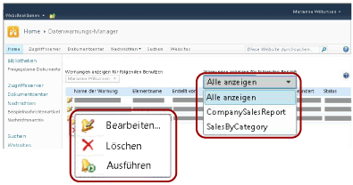
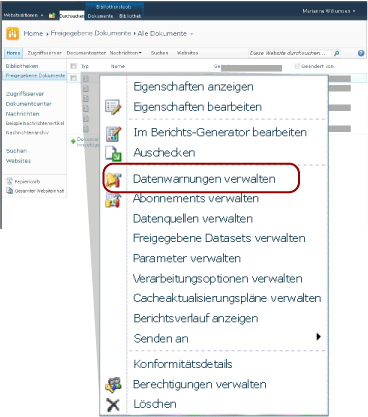

# Datenwarnungs-Manager f&#252;r SharePoint-Benutzer
  [!INCLUDE[ssRSnoversion](../includes/ssrsnoversion-md.md)] stellt den Datenwarnungs-Manager bereit, mit dem SharePoint Information Worker Datenwarnungen verwalten können. Sie können Informationen zu den von ihnen erstellten Warnungen anzeigen, Warnungen löschen, Warnungsdefinitionen zur Bearbeitung öffnen und bei Bedarf Warnungen ausführen. Zudem haben sie die Möglichkeit, nur Warnungen für einen einzelnen Bericht oder Warnungen für alle Berichte anzuzeigen. Das folgende Bild zeigt die im Datenwarnungs-Manager für Information Worker verfügbaren Funktionen.  
  
   
  
 Wenn eine SharePoint-Website für Datenwarnungen aktiviert wird, werden zwei SharePoint-Seiten (MyDataAlerts.aspx und SiteDataAlerts.aspx) erstellt und der SharePoint-Website hinzugefügt. MyDataAlerts.aspx entspricht dem Datenwarnungs-Manager für SharePoint Information Worker. Information Worker öffnen den Datenwarnungs-Manager über das Kontextmenü von Berichten, für die sie Warnungen erstellt haben.  
  
 Sie können den Datenwarnungs-Manager auch direkt über eine URL öffnen. Die Syntax der URL wird nachfolgend angezeigt:  
  
 `http://<site name>/_layouts/ReportServer/MyDataAlerts.aspx`  
  
> [!NOTE]  
>  Vor der Verwendung der [!INCLUDE[ssRSnoversion](../includes/ssrsnoversion-md.md)] -Warnfunktionen muss Ihnen ein Administrator die entsprechenden Berechtigungen gewähren. Weitere Informationen zu den erforderlichen Berechtigungen finden Sie unter [Reporting Services-Datenwarnungen](../reporting-services/reporting-services-data-alerts.md).  
  
##   Anzeigen von Datenwarnungsinformationen  
 Sie können eine Liste mit Datenwarnungen anzeigen, die Sie mittels Datenwarnungs-Designer erstellt haben. Um den Datenwarnungs-Manager zu öffnen, klicken Sie mit der rechten Maustaste auf einen Bericht, der in einer SharePoint-Bibliothek veröffentlicht wurde. Das folgende Bild zeigt die Option **Datenwarnungen verwalten** im Kontextmenü des Berichts.  
  
   
  
 Im Datenwarnungs-Manager ist eine Tabelle enthalten. Diese beinhaltet den Warnungsnamen, Berichtsnamen, Ihren Namen als Ersteller der Warnungsdefinition, die Nummer, mit der die Warnmeldung gesendet wurde, die letzte Ausführung der Warnung, die letzte Änderung der Warnungsdefinition und der Status der neuesten Warnmeldung. Wenn die Warnmeldung nicht generiert oder gesendet werden kann, enthält die Statusspalte Informationen zum Fehler und hilft Ihnen bei der Fehlerbehebung für die Warnung. Weitere Informationen finden Sie unter [Verwalten meiner Datenwarnungen im Datenwarnungs-Manager](../reporting-services/manage-my-data-alerts-in-data-alert-manager.md).  
  
 In der folgenden Tabelle werden Beispieldaten einer Tabelle im Datenwarnungs-Manager angezeigt. Tritt ein Fehler auf, werden die Fehlermeldung und der Bezeichner des Eintrags im Protokoll (eine GUID) in das Feld **Status** der Tabelle aufgenommen.  
  
|Name der Warnung|Berichtsname|Erstellt von|Gesendete Warnungen|Zuletzt ausgeführt|Zuletzt geändert|Status|  
|----------------|-----------------|----------------|-----------------|--------------|-------------------|------------|  
|SalesQTR|SalesByTerritoryAndQTR|Lauren Johnson|4|6/12/2011|6/1/2011|Die letzte Warnung war erfolgreich, und die Warnung wurde gesendet.|  
|UnitsSold|ProductsSalesByQTR|Lauren Johnson|2|7/1/2011|6/28/2011|Die letzte Warnung wurde erfolgreich ausgeführt, aber die Daten blieben unverändert, und es wurde keine Warnung gesendet.|  
|TopPromotion|PromotionTracking|Lauren Johnson|0||5/23/2011|Die Warnung wurde erstellt.|  
  
  [Zurück zum Anfang](#BackToTop)  
  
##   Löschen von Datenwarnungen  
 Warnungsdefinitionen lassen sich über den Datenwarnungs-Manager löschen. Als Information Worker können Sie die von Ihnen erstellten Warnungsdefinitionen löschen. Sie können keine von anderen erstellten Warnungsdefinitionen löschen. Weitere Informationen finden Sie unter [Verwalten meiner Datenwarnungen im Datenwarnungs-Manager](../reporting-services/manage-my-data-alerts-in-data-alert-manager.md).  
  
 Wenn Sie eine Warnungsdefinition löschen, wird sie dauerhaft gelöscht. Wenn Sie Warnmeldungen nur anhalten möchten, ändern Sie das Serienmuster bzw. das Start- oder Enddatum in der Warnungsdefinition. Weitere Informationen finden Sie unter [Bearbeiten einer Datenwarnung im Warnungs-Designer](../reporting-services/edit-a-data-alert-in-alert-designer.md).  
  
  [Zurück zum Anfang](#BackToTop)  
  
##   Bearbeiten von Datenwarnungen  
 Als Information Worker öffnen Sie die Warnungsdefinitionen zur Bearbeitung über den Datenwarnungs-Manager. Sie können ausschließlich die von Ihnen erstellten Warnungsdefinitionen bearbeiten. Klicken Sie mit der rechten Maustaste auf die Warnungsdefinition, und klicken Sie dann auf **Bearbeiten**. Daraufhin wird der Datenwarnungs-Designer geöffnet. Dieser zeigt die Warnungsdefinition an. Weitere Informationen finden Sie unter [Datenwarnungs-Designer](../reporting-services/data-alert-designer.md) und [Bearbeiten einer Datenwarnung im Warnungs-Designer](../reporting-services/edit-a-data-alert-in-alert-designer.md).  
  
  [Zurück zum Anfang](#BackToTop)  
  
##   Ausführen von Datenwarnungen  
 Der Datenwarnungs-Manager umfasst Informationen zur letzten Verarbeitung der Datenwarnungsdefinition durch den Warndienst sowie die Anzahl der Übermittlungen einer Datenwarnmeldung. Unter Umständen möchten Sie die Warnmeldung umgehend ausführen und senden, anstelle auf den entsprechenden Zeitpunkt des Zeitplans zu warten. Wenn Sie eine Warnung über den Datenwarnungs-Manager ausführen, wird der Warnungszeitplan überschrieben. Zudem beginnt die Verarbeitung der Warnungsdefinition innerhalb von einer Minute bis fünf Minuten. Dies hängt von der Zeit, die für die Berichtsausführung erforderlich ist, sowie von der Auslastung des Berichtsservers zum Zeitpunkt der gewünschten Ausführung der Warnung ab. Haben Sie jedoch angegeben, dass eine Meldung nur im Fall von Ergebnisänderungen gesendet wird, und sind keine Ergebnisänderungen erfolgt, wird keine Meldung erstellt oder gesendet. Weitere Informationen finden Sie unter [Verwalten meiner Datenwarnungen im Datenwarnungs-Manager](../reporting-services/manage-my-data-alerts-in-data-alert-manager.md).  
  
> [!NOTE]  
>  Nach dem Klicken auf **Ausführen**  dauert es ein paar Sekunden, bis der Wert der Spalte **Status** aktualisiert wird, um die Warnungsverarbeitung anzugeben. Wenn Sie mehrmals auf die Option **Ausführen**  klicken, wird die Warnung mehrmals verarbeitet. Dadurch werden unnötig Ressourcen des Berichtsservers in Anspruch genommen. Zudem kann sich dies auf die Leistung des Berichtsservers auswirken. Um aktualisierte Informationen zur Warnung anzuzeigen, klicken Sie auf die Aktualisierungsschaltfläche des Webbrowsers. So lässt sich überprüfen, ob Statusupdates und weitere Informationen zur Warnung verfügbar sind.  
  
  [Zurück zum Anfang](#BackToTop)  
  
##   Verwandte Aufgaben  
 In diesem Abschnitt sind Prozeduren aufgeführt, die das Verwalten von Warnungen und Bearbeiten von Warnungsdefinitionen zeigen.  
  
-   [Verwalten meiner Datenwarnungen im Datenwarnungs-Manager](../reporting-services/manage-my-data-alerts-in-data-alert-manager.md)  
  
-   [Bearbeiten einer Datenwarnung im Warnungs-Designer](../reporting-services/edit-a-data-alert-in-alert-designer.md)  
  
  [Zurück zum Anfang](#BackToTop)  
  
## Siehe auch  
 [Datenwarnungs-Designer](../reporting-services/data-alert-designer.md)   
 [Erstellen einer Datenwarnung im Datenwarnungs-Designer](../reporting-services/create-a-data-alert-in-data-alert-designer.md)   
 [Reporting Services-Datenwarnungen](../reporting-services/reporting-services-data-alerts.md)  
  
  