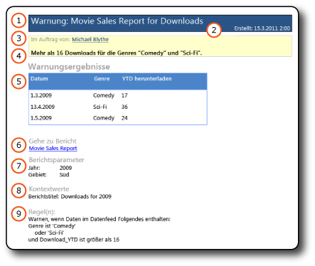
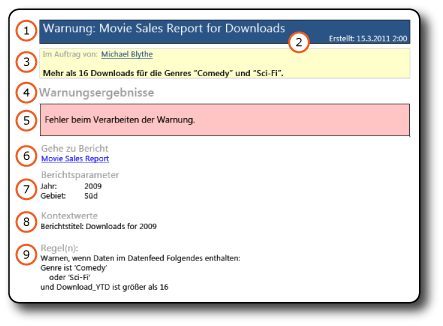

# Datenwarnmeldungen
  [!INCLUDE[ssRSnoversion](../includes/ssrsnoversion-md.md)] -Datenwarnungen übermitteln zwei Typen von Datenwarnmeldungen per E-Mail: Meldungen mit Datenwarnungsergebnissen und Meldungen mit Fehlerbeschreibungen. Durch Meldungen mit Ergebnissen werden alle Empfänger über Änderungen der Berichtsdaten informiert, die von allgemeinem Interesse und wichtig für Geschäftsentscheidungen sind. Tritt aus einem unbestimmten Grund ein Fehler auf, und sind die Ergebnisse nicht verfügbar, wird stattdessen die Fehlermeldung gesendet.  
  
 Der Eigentümer der Datenwarnungsdefinition kann auch Informationen zur Datenwarnungsinstanz im Datenwarnungs-Manager anzeigen. Weitere Informationen finden Sie unter [Data Alert Manager for SharePoint Users](../reporting-services/data-alert-manager-for-sharepoint-users.md).  
  
##   Datenwarnmeldungen  
 Die folgenden Bilder zeigen eine Datenwarnmeldung mit Ergebnissen und eine Warnmeldung mit einer Fehlerbeschreibung.  
  
 **Ergebnismeldung**  
  
   
  
 **Fehlermeldung**  
  
   
  
 Die Meldungen beinhalten die gleichen Informationstypen.  
  
1.  **Im Auftrag von** enthält den Namen des Erstellers der Datenwarnungsdefinition.  
  
2.  Haben Sie in der Warnungsdefinition eine Beschreibung angegeben, wird diese unterhalb von **Im Auftrag von**angezeigt.  
  
3.  **Warnungsergebnisse** zeigen die Zeilen im Berichtsdatenfeed, der die in der Warnungsdefinition angegebenen Regeln erfüllt, in einem Tabellenformat oder eine Fehlermeldung an. Die Anzahl der angezeigten Zeilen ist unbeschränkt.  
  
4.  **Gehe zu Bericht** ist ein Link zum Bericht, auf dem die Warnungsdefinition basiert. Wenn der Link nicht gültig ist, da der Bericht verschoben oder gelöscht wurde, wird eine Fehlermeldung angezeigt.  
  
5.  **Regel(n)** listet die Regeln und Klauseln in der Warnungsdefinition auf. Anhand dieser Informationen lassen sich die Warnungsergebnisse leichter überprüfen und verstehen. Des Weiteren lassen sich die Regeln in der Datenwarnungsdefinition identifizieren, die Sie ggf. zum Eingrenzen oder Erweitern der Ergebnisse ändern möchten.  
  
6.  **Berichtsparameter** listet die Parameter und Parameterwerte auf, mit denen der Bericht ausgeführt wurde. Parameter und Parameterwerte vereinfachen den Einblick in die Warnungsergebnisse.  
  
7.  **Kontextwerte** beinhalten die Namen und Werte von Berichtselementen, die sich außerhalb der Berichtsdatenbereiche befinden. Die Elemente sind in der Regel Textfelder. Es kann sich zum Beispiel um ein Textfeld mit einem konstanten Wert wie dem Betreff oder der Beschreibung eines Berichts handeln.  
  
 Der einzige Unterschied zwischen den zwei Meldungstypen ist Element 5, **Warnungsergebnisse**. Tritt bei der Erstellung einer Datenwarnungsinstanz oder Datenwarnmeldung ein Fehler auf, zeigt **Warnungsergebnisse** eine Fehlermeldung mit der Beschreibung des Problems an. Die Fehlermeldung wird an alle Empfänger gesendet und informiert diese, dass die erwarteten Warnungsergebnisse, die die Empfänger u. U. auch für Geschäftsentscheidungen benötigen, nicht verfügbar sind.  
  
  [Zurück zum Anfang](#BackToTop)  
  
##   Verwandte Aufgaben  
 Dieser Abschnitt listet Prozeduren zum Erstellen und Bearbeiten der Datenwarnungsdefinitionen auf, die viele der in den Datenwarnmeldungen angezeigten Informationen bieten.  
  
-   [Erstellen einer Datenwarnung im Datenwarnungs-Designer](../reporting-services/create-a-data-alert-in-data-alert-designer.md)  
  
-   [Bearbeiten einer Datenwarnung im Warnungs-Designer](../reporting-services/edit-a-data-alert-in-alert-designer.md)  
  
  [Zurück zum Anfang](#BackToTop)  
  
## Siehe auch  
 [Datenwarnungs-Designer](../reporting-services/data-alert-designer.md)   
 [Reporting Services-Datenwarnungen](../reporting-services/reporting-services-data-alerts.md)  
  
  