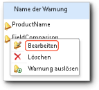

# Bearbeiten einer Datenwarnung im Warnungs-Designer

[!INCLUDE[ssrs-appliesto-sql2016-xpreview](../includes/ssrs-appliesto-sql2016-xpreview.md)][!INCLUDE[ssrs-appliesto-sharepoint-2013-2016i](../includes/ssrs-appliesto-sharepoint-2013-2016.md)]

Öffnen Sie die mit dem Datenwarnungs-Manager zu bearbeitende Datenwarnungsdefinition. Nur der Benutzer, der die Warnungsdefinition erstellt hat, kann sie bearbeiten. Weitere Informationen zum Öffnen des Datenwarnungs-Managers finden Sie unter [Verwalten meiner Datenwarnungen im Datenwarnungs-Manager](../reporting-services/manage-my-data-alerts-in-data-alert-manager.md).

> [!NOTE]
> Reporting Services-Integration in SharePoint ist nach SQL Server 2016 nicht mehr verfügbar.

 Das folgende Bild zeigt das Kontextmenü einer Datenwarnung im Datenwarnungs-Manager.  
  
   
  
 Die folgende Prozedur enthält die Schritte zum Öffnen der Warnungsdefinition im Datenwarnungs-Designer über den Datenwarnungs-Manager, um sie zu bearbeiten.  
  
### So bearbeiten Sie eine Datenwarnungsdefinition mit dem Datenwarnungs-Designer  
  
1.  Klicken Sie im Datenwarnungs-Manager mit der rechten Maustaste auf die zu bearbeitende Datenwarnungsdefinition, und klicken Sie dann auf **Bearbeiten**.  
  
     Die Warnungsdefinition wird im Datenwarnungs-Designer geöffnet.  
  
2.  Aktualisieren Sie die Regeln, Zeitplaneinstellungen und E-Mail-Einstellungen. Weitere Informationen finden Sie unter [Datenwarnungs-Designer](../reporting-services/data-alert-designer.md) und [Erstellen einer Datenwarnung im Datenwarnungs-Designer](../reporting-services/create-a-data-alert-in-data-alert-designer.md).  
  
    > [!NOTE]  
    >  Sie können keinen anderen Datenfeed auswählen. Um einen anderen Datenfeed zu verwenden, erstellen Sie eine neue Datenwarnungsdefinition.  
  
3.  Klicken Sie auf **Speichern**.  
  
    > [!NOTE]  
    >  Wenn der Bericht und die aus dem Bericht generierten Datenfeeds geändert wurden, ist die Warnungsdefinition möglicherweise nicht mehr gültig. Dies tritt auf, wenn eine Spalte, auf die die Warnungsdefinition in ihren Regeln verweist, vom Bericht gelöscht wird, den Datentyp ändert, oder wenn der Bericht gelöscht oder verschoben wird. Sie können eine ungültige Warnungsdefinition öffnen. Sie können sie jedoch nicht erneut speichern, sofern sie nicht gemäß der aktuellen Version des Berichtsdatenfeeds gültig ist, auf dem sie basiert. Weitere Informationen dazu, wie Datenfeeds aus Berichten generiert werden, finden Sie unter [Generieren von Datenfeeds aus Berichten &#40;Berichts-Generator und SSRS&#41;](../reporting-services/report-builder/generating-data-feeds-from-reports-report-builder-and-ssrs.md).  

## Siehe auch

[Datenwarnungs-Manager für Warnungsadministratoren](../reporting-services/data-alert-manager-for-alerting-administrators.md)   
[Reporting Services-Datenwarnungen](../reporting-services/reporting-services-data-alerts.md)  

Weiteren Fragen wenden? [Versuchen Sie das Reporting Services-Forum stellen](http://go.microsoft.com/fwlink/?LinkId=620231)
