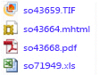

# <a name="lesson-3-defining-a-data-driven-subscription"></a>Lesson 3: Defining a Data-Driven Subscription
In dieser Lektion des [!INCLUDE[ssRSnoversion_md](../includes/ssrsnoversion-md.md)] -Tutorials verwenden Sie die datengesteuerten Abonnementseiten des [!INCLUDE[ssRSnoversion](../includes/ssrsnoversion-md.md)] -Webportals, um eine Verbindung mit einer Abonnementdatenquelle herzustellen, um eine Abfrage zu erstellen, die Abonnementdaten abruft, und um das Resultset den Berichts- und Übermittlungsoptionen zuzuordnen.  
  
> [!NOTE]  
> Prüfen Sie vor dem Starten, dass der **[!INCLUDE[ssNoVersion](../includes/ssnoversion-md.md)] -Agent** ausgeführt wird. Ist dies nicht der Fall, können Sie das Abonnement nicht speichern.  Sie können dies überprüfen, indem Sie den [SQL Server-Konfigurations-Manager](../relational-databases/sql-server-configuration-manager.md)öffnen.
In dieser Lektion wird davon ausgegangen, dass Sie Lektion 1 und Lektion 2 abgeschlossen haben und dass die Berichtsdatenquelle gespeicherte Anmeldeinformationen verwendet.  Weitere Informationen finden Sie unter [Lektion 2: Ändern der Eigenschaften der Berichtsdatenquelle](../reporting-services/lesson-2-modifying-the-report-data-source-properties.md).  
  
## <a name="bkmk_startwizard"></a>Starten des Assistenten für datengesteuertes Abonnement  
  
1.  Klicken Sie im [!INCLUDE[ssRSnoversion_md](../includes/ssrsnoversion-md.md)] -Webportal auf **Home**, und navigieren Sie zum Ordner mit dem Bericht **Sales Orders** .  
  
2.  Klicken Sie im Kontextmenü  des Berichts auf **Verwalten**, und klicken Sie anschließend im linken Bereich auf **Abonnements** .  
  
3.  Klicken Sie auf **+ Neues Abonnement**. Wenn diese Schaltfläche nicht angezeigt wird, verfügen Sie möglicherweise nicht über Inhalts-Manager-Berechtigungen. 
  
## <a name="define-a-description"></a>Definieren einer Beschreibung  
1.  Geben Sie **Lieferung Verkaufsauftrag** bei Beschreibung ein.
## <a name="type"></a>Geben Sie
1.  Klicken Sie auf **Datengesteuertes Abonnement**.  
## <a name="schedule"></a>Zeitplan
1. Klicken Sie im Bereich „Zeitplan“ auf **Berichtsspezifischer Zeitplan**.
2. Klicken Sie auf **Zeitplan bearbeiten**.
3.  Klicken Sie in **Zeitplandetails**auf **Einmal**.  
4.  Geben Sie eine Startzeit an, die ein paar Minuten nach der aktuellen Zeit liegt.  
5.  Klicken Sie auf **Anwenden**.
## <a name="destination"></a>Ziel  
1.  Wählen Sie im Zielabschnitt **Windows-Dateifreigabe** als Übermittlungsmethode aus.  

## <a name="dataset"></a>Dataset
1. Klicken Sie auf **Dataset bearbeiten**.
2. Wählen Sie **Eine benutzerdefinierte Datenquelle**.
3. Wählen Sie **Microsoft SQL Server** als Typ der **Datenquellenverbindung** aus.
4. Geben Sie unter „Verbindungszeichenfolge“ die folgende Verbindungszeichenfolge ein: *Subscribers* ist die Datenbank, die Sie in Lektion 1 erstellt haben. 
  
    ```  
    data source=localhost; initial catalog=Subscribers
    ```
    
 ## <a name="credentials"></a>Anmeldeinformationen
 1. Wählen Sie **Die folgenden Anmeldeinformationen verwenden**aus.
 2. Wählen Sie **Windows-Benutzername und -Kennwort**aus.
 3.  Geben Sie unter **Benutzername** und **Kennwort**Ihren Benutzernamen und Ihr Kennwort für die Domäne ein. Geben Sie unter **Benutzername**sowohl die Domäne als auch das Benutzerkonto an.
     > [!NOTE]  
    > Die Anmeldeinformationen, die für die Verbindung mit einer Abonnentendatenquelle verwendet werden, werden nicht an [!INCLUDE[ssManStudio](../includes/ssmanstudio-md.md)]zurückgegeben. Wenn Sie das Abonnement später ändern, müssen Sie das Kennwort zum Herstellen der Verbindung mit der Datenquelle erneut eingeben.
## <a name="query"></a>Abfrage      
1.  Geben Sie im Abfragefeld folgende Abfrage ein:  
  
    ```  
    Select * from OrderInfo  
    ```  
  
2.  Geben Sie ein Timeout von 30 Sekunden an.  
  
3.  Klicken Sie auf **Abfrage überprüfen**, und klicken Sie anschließend auf **Anwenden**.
## <a name="delivery-options"></a>Übermittlungsoptionen
Geben Sie folgende Werte an:

Parameter  |Wertquelle  | Wert/Feld  
---------|---------|---------
**Dateiname**     |Wert aus Dataset abrufen | Order     
**Pfad**     | Wert eingeben  | Geben Sie als Wert den Namen einer öffentlichen Dateifreigabe ein, für die Sie Schreibberechtigungen besitzen (z.B. `\\mycomputer\public\myreports`). 
**Renderformat** | Wert aus Dataset abrufen | Format
**Schreibmodus**| Wert eingeben| Automatisch inkrementieren    
**Dateierweiterung** |Wert eingeben |Wahr
**Benutzername** | Wert eingeben | Geben Sie Ihr Domänenbenutzerkonto an. Geben Sie ihn in folgendem Format: \<Domäne >\\\<Konto >. Das Benutzerkonto muss über Berechtigungen für den Pfad verfügen, den Sie konfiguriert haben. 
**Kennwort** | Wert eingeben | Geben Sie Ihr Kennwort ein

## <a name="report-parameters"></a>Berichtsparameter
 1. Wählen Sie im Feld **OrderNumber** **Wert aus Dataset abrufen**aus. Wählen Sie in "Wert" die Option **Reihenfolge**aus. 
 2. Klicken Sie auf **Abonnement erstellen**.
   
## <a name="next-steps"></a>Nächste Schritte  
Beim Ausführen des Abonnements werden vier Berichtsdateien an die von Ihnen angegebene Dateifreigabe übermittelt, eine für jeden Auftrag in der *Abonnenten* -Datenquelle. Jede Übermittlung muss im Hinblick auf die Daten (sie müssen sich auf einen bestimmten Auftrag beziehen), das Renderingformat und das Dateiformat eindeutig sein. Sie können jeden Bericht von dem freigegebenen Ordner aus öffnen, um sicherzustellen, dass jede Version entsprechend den von Ihnen festgelegten Abonnementoptionen angepasst wurde.  
  
  
  
Die Abonnementseite im Webportal enthält das Datum der **letzten Ausführung** und den **Status** des Abonnements. 
**Hinweis:** Aktualisieren Sie die Seite, nachdem das Abonnement ausgeführt wurde, um die aktualisierten Informationen anzuzeigen.  
    
  
  
Dies ist der letzte Schritt des Tutorials „Defining a Data-Driven Subscription“ (Definieren eines datengesteuerten Abonnements).   
  
## <a name="see-also"></a>Siehe auch  
[Abonnements und Übermittlung &#40;Reporting Services&#41;](../reporting-services/subscriptions/subscriptions-and-delivery-reporting-services.md)  
[Datengesteuerte Abonnements](../reporting-services/subscriptions/data-driven-subscriptions.md)  
[Erstellen, Ändern und Löschen von datengesteuerten Abonnements](../reporting-services/subscriptions/create-modify-and-delete-data-driven-subscriptions.md)  
[Verwenden einer externen Datenquelle für Abonnentendaten &#40;datengesteuertes Abonnement&#41;](../reporting-services/subscriptions/use-an-external-data-source-for-subscriber-data-data-driven-subscription.md)  
  
  
  


