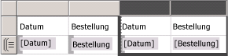
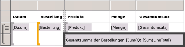
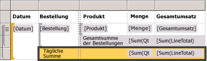
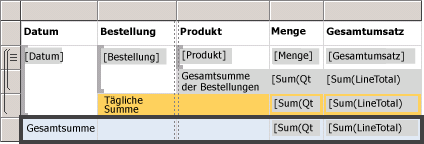
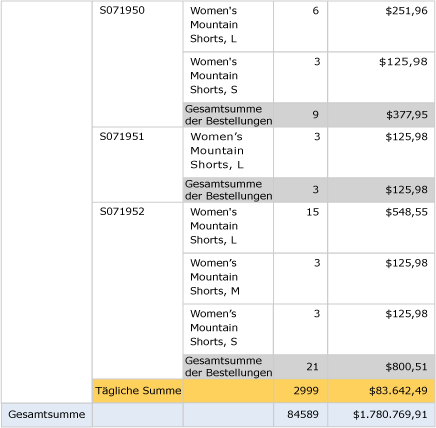

# Lesson 6: Adding Grouping and Totals (Reporting Services)
In dieser Lektion des Tutorials werden Sie Ihrem [!INCLUDE[ssRSnoversion](../includes/ssrsnoversion-md.md)] -Report Gruppierungen und Gesamtergebnisse hinzufügen, um Ihre Daten zu organisieren und zusammenzufassen.  
  
  
## So gruppieren Sie Daten in einem Bericht  
  
1.  Klicken Sie auf die Registerkarte **Entwurf** .  
  
2.  Wenn Sie den Bereich **Zeilengruppen** nicht sehen, klicken Sie mit der rechten Maustaste auf die Entwurfsoberfläche. Klicken Sie auf **Sicht** und anschließend auf **Gruppierung**.  
  
3.  Ziehen Sie im **Berichtsdatenbereich** das Feld **Date** in den Bereich **Zeilengruppen** . Platzieren Sie das Feld über der Zeile **(Details)**.
  
    Beachten Sie, dass das Zeilenhandle nun Klammern zum Anzeigen einer Gruppe aufweist. Außerdem verfügt die Tabelle nun auf jeder Seite der vertikalen gepunkteten Linie einmal über die Spalte Date.  
  
      
  
4.  Ziehen Sie im **Berichtsdatenbereich** das Feld **Order** in den Bereich **Zeilengruppen** . Platzieren das Feld unter Date und über **Details**.

   
  
    Note that the row handle now has two brackets in it , to show two groups. The table now has two **Order** columns, too.  
  
5.  Löschen Sie die ursprünglichen Spalten **Date** und **Order** **rechts** der doppelten Linie. Dadurch werden die einzelnen Datensatzwerte entfernt, und nur der Gruppenwert wird angezeigt. Wählen Sie die Spaltenhandles für die beiden Spalten aus, klicken Sie mit der rechten Maustaste und wählen Sie **Spalten löschen**aus.  
  
      
  
6.  Klicken Sie mit der rechten Maustaste auf die Zelle mit dem Feldausdruck `[Date]` und anschließend auf das Dialogfeld **Textfeldeigenschaften**.  
  
7.  Klicken Sie auf **Zahl**und anschließend im Feld **Kategorie** auf **Datum**.  
  
8.  Wählen Sie im Feld **Typ** die Option **31. Januar 2000**aus.  
  
9.  [!INCLUDE[clickOK](../includes/clickok-md.md)].  
  
10.  Wechseln Sie zur Registerkarte **Vorschau** , um eine Vorschau des Berichts anzuzeigen. Die Vorschau sollte ähnlich der folgenden Abbildung aussehen:  
     
  
## So fügen Sie einem Bericht Gesamtwerte hinzu  
  
1.  Wechseln Sie in die Entwurfsansicht.  
  
2.  Klicken Sie mit der rechten Maustaste auf die Datenbereichszelle mit dem Feld `[LineTotal]`und anschließend auf **Gesamtergebnis hinzufügen**.  
  
    Dadurch wird eine Zeile mit dem Gesamtwert für die einzelnen Bestellungen in Dollar hinzugefügt.  
  
3.  Klicken Sie mit der rechten Maustaste auf die Zelle mit dem Feld `[Qty]`und anschließend auf **Gesamtergebnis hinzufügen**.  
  
    Dadurch wird der Ergebniszeile eine Gesamtmenge für die einzelnen Bestellungen hinzugefügt.  
  
4.  Geben Sie in die leere Zelle links von `Sum[Qty]`die Bezeichnung**Order Total**ein.  
  
5.  Sie können der Ergebniszeile eine Hintergrundfarbe hinzufügen. Wählen Sie die beiden Gesamtergebniszellen und die Bezeichnungszelle aus.  
  
6.  Klicken Sie im Menü **Format** auf **Hintergrundfarbe**, klicken Sie auf **Hellgrau**und dann auf **OK**.  
  
      
  
## So fügen Sie einem Bericht einen Tagesgesamtwert hinzu  
  
1.  Klicken Sie mit der rechten Maustaste auf die Zelle **Order** , zeigen Sie auf **Gesamtergebnis hinzufügen**, und klicken Sie auf **Danach**.  
  
    Dadurch wird eine neue Zeile mit der Gesamtmenge und dem Gesamtbetrag in Dollar für die einzelnen Tage hinzugefügt; außerdem wird die Bezeichnung**Total**in der Spalte Order hinzugefügt.  
  
2.  Geben Sie in der gleichen Zelle zuerst das Wort **Daily** und anschließend das Wort **Total** ein, um **Daily Total**zu erhalten.  
  
3.  Wählen Sie die Zelle **Daily Total** aus, und markieren Sie die beiden Zellen für **Sum** sowie die leere Zelle dazwischen.  
  
4.  Klicken Sie im Menü **Format** auf **Hintergrundfarbe**, klicken Sie auf **Orange**und dann auf **OK**.  
  
      
  
## So fügen Sie einem Bericht ein Gesamtergebnis hinzu  
  
1.  Klicken Sie mit der rechten Maustaste auf die Zelle Date, zeigen Sie auf **Gesamtergebnis hinzufügen**, und klicken Sie auf **Danach**.  
  
    Dadurch wird eine neue Zeile mit der Gesamtmenge und dem Gesamtbetrag in Dollar für den gesamten Bericht hinzugefügt; außerdem wird die Bezeichnung **Total** in der Spalte **Date** hinzugefügt.  
  
2.  Geben Sie in der gleichen Zelle zuerst das Wort **Grand** und anschließend das Wort **Total** ein, um **Grand Total**zu erhalten.  
  
3.  Wählen Sie die Zelle **Grand Total** aus, und markieren Sie die beiden Zellen für **Sum** sowie die leeren Zellen dazwischen.  
  
4.  Klicken Sie im Menü **Format** auf **Hintergrundfarbe**, klicken Sie auf **Hellblau**und dann auf **OK**.  
  
      
  
5.  Klicken Sie auf **Vorschau**.  
  
    Die letzte Seite sollte ähnlich dem folgenden Bild aussehen. Klicken Sie auf der Symbolleiste auf „Letzte Seite“. aus.   
  
      
  
## So veröffentlichen Sie den Bericht auf dem Berichtsserver (Optional)  
  
1.  Ein optionaler Schritt besteht darin, den vervollständigten Bericht auf dem Berichtsserver im einheitlichen Modus zu veröffentlichen, damit Sie den Bericht im Berichts-Manager anzeigen können.  
  
2.  Klicken Sie auf das Menü **Projekt** und anschließend auf die Option für die **Eigenschaften des Tutorials**.  
  
3.  Geben Sie in **TargetServerURL** den Namen Ihres Berichtsservers ein, z.B.   
- `http:/<servername>/reportserver`  
   
- `http://localhost/reportserver` funktioniert, wenn Sie den Bericht auf dem Berichtsserver erstellen.  
  
  
4. Beachten Sie, dass für TargetReportFolder „tutorial“ angegeben wurde – der Name des Projekts.  Dies ist der Name des Ordners, in dem in den nächsten Schritten der Bericht bereitgestellt wird.  
5. Klicken Sie auf **OK**.  
  
6.  Klicken Sie im Menü **Erstellen** auf **Tutorial bereitstellen**.  
  
    Wenn Sie im Ausgabefenster eine Meldung wie die Folgende sehen, war die Bereitstellung erfolgreich:  
  
    > ------ Build started: Project: tutorial, Configuration: Debug ------  
    > Skipping 'Sales Orders.rdl'. Item is up to date.  
    > Erstellung abgeschlossen -- 0 Fehler, 0 Warnungen  
    > ------ Deploy started: Project: tutorial, Configuration: Debug ------  
    > Deploying to http://[server name]/reportserver  
    > Deploying report '/tutorial/Sales Orders'.  
    > Deploy complete -- 0 errors, 0 warnings  
    > ========== Build: 1 succeeded or up-to-date, 0 failed, 0 skipped ==========  
    > ========== Deploy: 1 succeeded, 0 failed, 0 skipped ==========  
  
    Wenn Sie eine Fehlermeldung wie die Folgende sehen, überprüfen Sie, ob Sie über Berechtigungen für den Berichtsserver verfügen und ob Sie [!INCLUDE[ssBIDevStudio](../includes/ssbidevstudio-md.md)] mit Administratorrechten gestartet haben.  
  
    > „Die dem Benutzer 'XXXXXXXX\\[Ihr Benutzername]' erteilten Berechtigungen reichen zum Ausführen des Vorgangs nicht aus.“  
  
7.  Rufen Sie das Webportal mit Administratorrechten auf, indem Sie z.B. mit der rechten Maustaste auf das Symbol für Internet Explorer und anschließend auf **Als Administrator ausführen**klicken.  
  
    Rufen Sie die [!INCLUDE[ssRSnoversion_md](../includes/ssrsnoversion-md.md)] -Webportal-URL auf.   
    **Hinweis:** Für die URL des *Portals* wird „Reports“ und nicht die *Berichtsserver* -URL „Berichtsserver“ verwendet.  Zum Beispiel:   
    - `http://<server name>/reports`.  
     - `http://localhost/reports` funktioniert, wenn Sie den Bericht auf dem Berichtsserver erstellen.  
  
8.  Wechseln Sie zum Ordner, in dem der Bericht gespeichert ist. Als Standardname wird *Tutorial*, der Name des Projekts oder der Name, den Sie in das Feld TargetReportFolder in den Projekteigenschaften eingegeben haben, verwendet.   
Klicken Sie auf den Namen des Berichts **Sales Orders** , um den gerenderten Bericht im Browser anzuzeigen.  
  
      
 
** Sie haben das Tutorial zum Erstellen eines einfachen Tabellenberichts erfolgreich abgeschlossen.**  
  
## Weitere Informationen finden Sie unter  
[Filtern, Gruppieren und Sortieren von Daten &#40;Berichts-Generator und SSRS&#41;](../reporting-services/report-design/filter-group-and-sort-data-report-builder-and-ssrs.md)  
  
  
  

