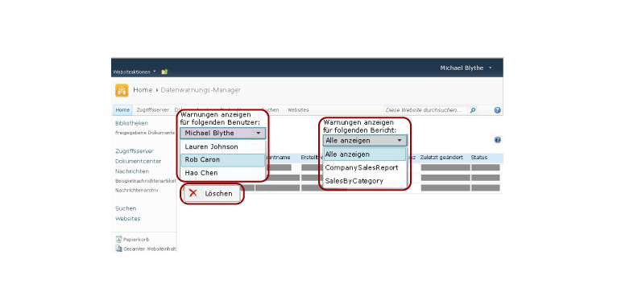

# Verwalten aller Datenwarnungen auf einer SharePoint-Website im Datenwarnungs-Manager

[!INCLUDE[ssrs-appliesto](../includes/ssrs-appliesto.md)] [!INCLUDE[ssrs-appliesto-2016](../includes/ssrs-appliesto-2016.md)] [!INCLUDE[ssrs-appliesto-not-pbirsi](../includes/ssrs-appliesto-not-pbirs.md)] [!INCLUDE[ssrs-appliesto-sharepoint-2013-2016i](../includes/ssrs-appliesto-sharepoint-2013-2016.md)]

SharePoint-Warnungsadministratoren können eine Liste der von allen Benutzern der Website erstellten Datenwarnungen und Informationen zu den Warnungen anzeigen. Warnungsadministratoren können auch Warnungen löschen. Das folgende Bild zeigt Warnungsadministratoren die verfügbaren Funktionen im Datenwarnungs-Manager.

 

> [!NOTE]
> Die Integration von Reporting Services in SharePoint ist nach SQL Server 2016 nicht mehr möglich.

## Anzeigen einer Liste der von einem Websitebenutzer erstellten Warnungen  
  
1.  Wechseln Sie zur SharePoint-Website, auf der Datenwarnungsdefinitionen gespeichert sind.  
  
2.  Klicken Sie auf der Startseite auf **Websiteaktionen**.  
  
3.  Führen Sie einen Bildlauf zum Ende der Liste durch, und klicken Sie auf **Siteeinstellungen**.  
  
4.  Klicken Sie unter **Reporting Services**auf **Datenwarnungen verwalten**.  
  
5.  Klicken Sie neben der Liste **Warnungen anzeigen für folgenden Benutzer** auf den Pfeil nach unten, und wählen Sie den Benutzer aus, dessen Warnungen Sie anzeigen möchten.  
  
6.  Klicken Sie neben der Liste **Warnungen anzeigen für folgenden Bericht** auf den Pfeil nach unten, und wählen Sie eine bestimmte anzuzeigende Warnung aus, oder klicken Sie auf **Alle anzeigen** , um alle vom ausgewählten Benutzer erstellten Warnungen anzuzeigen.  
  
     Eine Tabelle umfasst den Namen, Berichtsnamen, Namen der Person, die die Datenwarnung erstellt hat, die Häufigkeit der Übermittlungen einer Datenwarnung, die letzte Änderung der Datenwarnungsdefinition und den Status der Datenwarnung. Wenn die Datenwarnung nicht generiert oder gesendet werden kann, enthält die Statusspalte Informationen zum Fehler und hilft Ihnen bei der Behebung des Problems.  
  
## Löschen einer Warnungsdefinition  
  
-   Klicken Sie mit der rechten Maustaste auf die zu löschende Datenwarnung, und klicken Sie auf **Löschen**.  
  
    > [!NOTE]  
    >  Nach dem Löschen der Warnung werden keine weiteren Warnmeldungen gesendet. Wenn Sie jedoch die Warnungsdatenbank abfragen, stellen Sie möglicherweise fest, dass die Warnungsdefinition immer noch vorhanden ist. Der Warndienst führt den Cleanup nach einem Zeitplan durch. Die Warnungsdefinition wird beim nächsten Cleanup dauerhaft gelöscht. Das Standardintervall für den Cleanup beträgt 20 Minuten. Dieses und andere Cleanupintervalle sind konfigurierbar. Weitere Informationen finden Sie unter [Reporting Services-Datenwarnungen](../reporting-services/reporting-services-data-alerts.md).  

## Weitere Informationen finden Sie unter

[Datenwarnungs-Manager für Warnungsadministratoren](../reporting-services/data-alert-manager-for-alerting-administrators.md)   
[Reporting Services-Datenwarnungen](../reporting-services/reporting-services-data-alerts.md)  

Haben Sie dazu Fragen? [Stellen Sie eine Frage im Reporting Services-Forum](http://go.microsoft.com/fwlink/?LinkId=620231)
