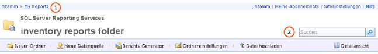

# Suchen und Anzeigen von Berichten im Web-Portal (Berichts-Generator und SSRS)
  Der Berichts-Manager ist ein webbasiertes Tool mit Funktionen zum Anzeigen und Verwalten von Berichten. Er ist in der Berichtsserverinstallation enthalten. Um den Berichts-Manager zu öffnen, geben Sie die Berichts-Manager-URL in einem Browserfenster ein. Weitere Informationen zu den Browseranforderungen von finden Sie unter [Browserunterstützung für Reporting Services und Power View](../../reporting-services/browser-support-for-reporting-services-and-power-view.md). Wenden Sie sich an den Systemadministrator, wenn Sie wissen möchten, wie eine Berichts-Manager-URL auf dem Berichtsserver konfiguriert werden kann. Weitere Informationen finden Sie unter [Konfigurieren des Berichts-Managers &#40;einheitlicher Modus&#41;](../../reporting-services/report-server/configure-report-manager-native-mode.md).  
  
 Die Berechtigungen, die der Systemadministrator auf dem Berichtsserver festgelegt hat, bestimmen die Elemente, die Sie bei Verwendung des Berichts-Managers sehen können. Berechtigungen werden über eine Rollenzuweisung gewährt. Zum Suchen und Anzeigen der Berichte muss Ihre Rollenzuweisung die Aufgabe Berichte anzeigen enthalten. Zum Suchen eines Berichts auf einem Berichtsserver führen Sie eine Suche anhand des Namens oder einer Beschreibung durch, oder durchsuchen Sie die Berichtsserverordner. Sie können nur Berichte suchen oder Ordner nach Berichten durchsuchen, die veröffentlicht und auf den Berichtsserver hochgeladen wurden. Weitere Informationen zum Suchen nach einem Bericht finden Sie unter [Suchen nach Berichten und anderen Elementen &#40;Berichts-Generator und SSRS&#41;](../../reporting-services/report-builder/searching-for-reports-and-other-items-report-builder-and-ssrs.md).  
  
> [!NOTE]  
>  [!INCLUDE[ssRBRDDup](../../includes/ssrbrddup-md.md)]  
  
## Navigieren der Ordnerhierarchie im Berichts-Manager  
 Für die Suche nach Berichten, die Sie ausführen möchten, können Sie die Startseite verwenden. Diese wird automatisch angezeigt, wenn Sie den Berichts-Manager starten und wenn Sie einen Ordner in der Ordnerhierarchie öffnen. Auf der Startseite werden nur die Elemente angezeigt, zu deren Anzeige Sie berechtigt sind. Der Ordnerpfad wird als Linkzeile oben auf der Startseite angezeigt. Die Ordnernamen sind alphabetisch geordnet, beginnend mit dem Stammordner (Home). Beim Öffnen jedes zusätzlichen Ordners wird der Ordnername dem Ordnerpfad oben auf der Seite hinzugefügt. **(1)** in der Abbildung unten. Wenn Sie einen Bericht öffnen, wird der Name des Berichts ebenfalls dem Ordnerpfad hinzugefügt.  
  
   
Berichts-Manager-Menüband  
  
 Verwenden Sie zum Navigieren in einer Ordnerhierarchie die folgenden Vorgehensweisen:  
  
-   Zum Anzeigen des Inhalts eines Ordners klicken Sie auf der Startseite auf den Namen des Ordners. Eine Ordnerseite mit dem Inhalt des Ordners wird geöffnet.  
  
-   Zum Navigieren nach unten in der Ordnerhierarchie öffnen Sie einen Unterordner des aktuellen Ordners. Ordner enthalten Berichte, Ressourcen, freigegebene Datenquellenelemente und andere Ordner. Durch Klicken auf ein Ordnersymbol wird der Ordner mit dem Inhalt der direkt darunter gelegenen Hierarchieebene angezeigt.  
  
-   Zum Navigieren nach oben in der Ordnerhierarchie klicken Sie in der Linkleiste oben auf der Seite auf den Namen des Ordners, dessen Inhalt Sie anzeigen möchten. **(1)** in der Abbildung oben.  
  
## Öffnen eines Berichts  
 Wenn Sie einen Bericht gefunden haben, klicken Sie auf den Namen des Berichts, um ihn zu öffnen. Der Bericht wird in HTML gerendert und im Berichts-Manager auf der Seite Inhalt angezeigt. Berichte werden stets von der Browsersitzung zwischengespeichert. Wenn Sie einen Bericht öffnen, können Sie in der Regel durch Klicken auf die Schaltfläche **Zurück** wieder zu dem Bericht zurückkehren. Dies gilt auch, wenn Sie einen Benutzernamen und ein Kennwort zum Ausführen des Berichts eingeben mussten. Ein gerenderter Bericht kann erst beim Schließen des Browsers vollständig geschlossen werden.  
  
 Nicht auf alle in der Ordnerhierarchie angezeigten Berichte kann sofort zugegriffen werden. Bei manchen Berichten werden Sie möglicherweise zur Eingabe Ihres Benutzernamens und Kennworts aufgefordert, um zu ermitteln, ob Sie auf die Datenquelle für den Bericht zugreifen dürfen. Weitere Informationen zum Öffnen von Berichten im Berichts-Manager finden Sie unter [Öffnen und Schließen eines Berichts &#40;Berichts-Manager&#41;](../../reporting-services/reports/open-and-close-a-report-report-manager.md).  
  
 Sie können auch direkt mit Berichts-Generator einen Bericht auf dem Berichtsserver suchen und öffnen. Weitere Informationen finden Sie unter [Suchen nach Berichten und anderen Elementen &#40;Berichts-Generator und SSRS&#41;](../../reporting-services/report-builder/searching-for-reports-and-other-items-report-builder-and-ssrs.md).  
  
## So suchen Sie nach Elementen  
  
-   Geben Sie für die Suche nach Elementen im Berichts-Manager oben auf der Seite in das Textfeld **Suchen** eine Suchzeichenfolge ein. **(2)** in der Abbildung oben. Suchvorgänge beginnen in der Ordnerhierarchie im Knoten der obersten Ebene und werden in den untergeordneten Zweigen fortgesetzt. Falls Sie keine Zugriffsberechtigung für einen bestimmten Zweig haben, wird dieser ausgelassen. Dies ist der Fall bei Ordnern vom Typ Meine Berichte anderer Benutzer und bei anderen Ordnern, die nicht generell verfügbar sind. Nur Berichte und Elemente, die Sie anzeigen dürfen, werden in die Suchergebnisse einbezogen.  
  
-   Um anhand des Namens oder einer Beschreibung nach einem Element zu suchen, geben Sie den gesamten Text oder einen Teil davon an. Bei der Suchzeichenfolge wird die Groß/Kleinschreibung nicht beachtet. Suchoperatoren wie z. B. Pluszeichen (+) oder Minuszeichen (–) zum Ein- oder Ausschließen von Suchkriterien sind nicht zulässig.  
  
-   Verwenden Sie die Symbolleiste oben im Bericht, um nach Text in einem Bericht zu suchen.  
  
## Siehe auch  
 [Suchen nach Berichten und anderen Elementen &#40;Berichts-Generator und SSRS&#41;](../../reporting-services/report-builder/searching-for-reports-and-other-items-report-builder-and-ssrs.md)   
 [Suchen, Anzeigen und Verwalten von Berichten &#40;Berichts-Generator und SSRS&#41;](../../reporting-services/report-builder/finding-viewing-and-managing-reports-report-builder-and-ssrs.md)  
  
  