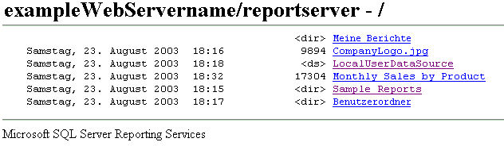

# Suchen und Anzeigen von Berichten mit einem Browser (Berichts-Generator und SSRS)
  Mit jedem unterstützten Webbrowser kann ein Bericht über eine Direktverbindung mit einem Berichtsserver angezeigt werden. Für jeden Bericht gibt es auf einem Berichtsserver eine URL-Adresse. Sie können die Webadresse eines Berichts eingeben, um ihn in einem Browserfenster unabhängig von der Webanwendung zu öffnen. Der Bericht wird im HTML-Format geöffnet und enthält die Berichtssymbolleiste, sodass Sie auf Seiten navigieren oder Datenwerte innerhalb des Berichts suchen können. Sie können in der URL Parameter festlegen, um die Symbolleiste auszublenden oder das Ausgabeformat des Berichts auszuwählen.  
  
 Wenn Sie einen Bericht über die entsprechende Webadresse öffnen, können Sie ihn anzeigen, jedoch nicht verwalten. Sie können nicht auf die Eigenschaftenseiten eines Elements oder auf Abonnementdefinitionsseiten zugreifen. Für diese Aufgaben müssen Sie den Berichts-Manager oder eine SharePoint-Website verwenden.  
  
 Wenn Ihnen die Webadresse eines Berichts nicht bekannt ist, können Sie die Webadresse des Berichtsservers aufrufen und dann in der Ordnerhierarchie des Berichtsservers navigieren, um den gewünschten Bericht auszuwählen. Im folgenden Diagramm wird eine Ordnerhierarchie veranschaulicht, wie sie in einem Browserfenster angezeigt wird.  
  
   
Ordner in einem Browser  
  
> [!NOTE]  
>  Wenn Sie von einem Handheldgerät auf einen Bericht zugreifen, müssen Sie einen Browser zum Öffnen des Berichts verwenden. Berichts-Manager ist nicht für Handheldgeräte ausgelegt.  
  
 Weitere Informationen über die Browsertypen, die Sie verwenden können, finden Sie unter "Von Reporting Services unterstützte Browser-Typen" in der [Reporting Services-Dokumentation](http://go.microsoft.com/fwlink/?linkid=121312) in der SQL Server-Onlinedokumentation.  
  
> [!NOTE]  
>  [!INCLUDE[ssRBRDDup](../../includes/ssrbrddup-md.md)]  
  
## Navigieren in Ordnern des Berichtsservers mithilfe eines Webbrowsers  
 Mithilfe eines Webbrowsers können Sie in Berichtsserverordnern navigieren und Berichte ausführen. Berichte und Elemente werden in der Ordnerhierarchie als Links dargestellt. Sie können auf Links klicken, um einen Bericht, eine Ressource oder einen Ordner zu öffnen sowie den Inhalt einer freigegebenen Datenquelle anzuzeigen. Das Navigieren in der Ordnerhierarchie ist hilfreich, wenn Sie die URL eines Berichts nicht kennen. Geben Sie die Webadresse des Berichtsservers an, um eine Browserverbindung im Stammknoten der Ordnerhierarchie zu öffnen, und klicken Sie dann auf Ordnerlinks, um in der Hierarchie zu navigieren.  
  
 Beim Zugriff auf das virtuelle Verzeichnis eines Berichtsservers werden nur die Ordner, Berichte und hochgeladen Elemente angezeigt, auf die Sie Zugriff haben. Auf der Benutzeroberfläche werden nur die Ordnerhierarchie und grundlegende Informationen angezeigt, z. B. das Erstellungs- oder Änderungsdatum, die Dateigröße und der Elementtyp für einzelne Elemente:  
  
-   Ein Link ohne weiteren Indikator ist ein Bericht oder ein Modell.  
  
-   Das Tag \<ds> gibt eine freigegebene Datenquelle an.  
  
-   Das Tag \<dir> gibt ein Ordnerelement an.  
  
-   Eine Dateierweiterung zeigt eine Ressource an. Die Dateierweiterung identifiziert den MIME-Typ der Ressource. Beispielsweise steht .jpg für ein Bild im JPEG-Format.  
  
## Eingeben der URL-Adresse eines Berichts  
 [!INCLUDE[ssRSnoversion](../../includes/ssrsnoversion-md.md)] unterstützt den URL-Zugriff auf bestimmte Elemente eines Berichtsservers. Die URL muss einen vollqualifizierten Pfad zum Bericht und Befehle zum Rendern des Berichts einschließen. Falls der Bericht Parameter enthält, müssen Sie die entsprechenden Werte angeben, die zum Öffnen des Berichts erforderlich sind. Wenn Sie eine URL für einen Bericht eingeben, der Leerzeichen im Pfad, Parameterwerte oder eine Renderingerweiterung enthält, müssen Sie URL-codierte Zeichen in der URL verwenden, um die gewünschten Ergebnisse zu erhalten. Das folgende Beispiel zeigt eine Berichts-URL, die die Codierung der Zeichen im Pfadnamen, Parameter und eine Renderingerweiterung enthält:  
  
 `http://<Webservername>/reportserver?/<reportfolder>/employee+sales+summary&ReportYear=2004&ReportMonth=06&EmpID=24&rs:Command=Render&rs:Format=HTML4.0`  
  
 Eine URL darf in Internet Explorer maximal 2.083 Zeichen enthalten. Weitere Informationen finden Sie unter [URL-Länge in Internet Explorer](http://support.microsoft.com/kb/208427).  
  
 Weitere Informationen über den Zugriff auf einen Bericht über eine URL, einschließlich Informationen über den Aufbau einer URL finden Sie unter "URL-Zugriff" in der [Reporting Services-Dokumentation](http://go.microsoft.com/fwlink/?linkid=121312) in der SQL Server-Onlinedokumentation.  
  
  
