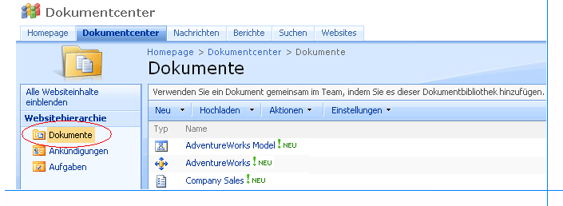
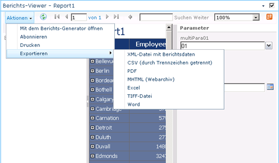
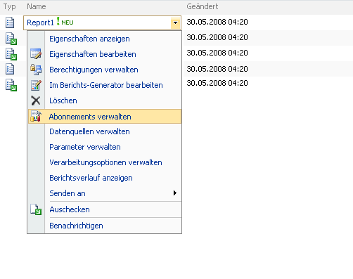

# Suchen, Anzeigen und Verwalten von Berichten (Berichts-Generator und SSRS)
  In Berichts-Generator können Sie Ordner auf einem Berichtsserver oder auf einer SharePoint-Website durchsuchen, um Berichte, freigegebene Datenquellen, Modelle und andere zugehörige Berichtselemente zu suchen und auf Ihrem Computer nach lokalen Berichten zu suchen. Um die Suche nach Berichten einfacher zu gestalten, speichert Berichts-Generator eine Liste der zuletzt verwendeten Server und Websites und stellt Direktzugriff auf den Desktop und die Ordner Eigene Dateien und Arbeitsplatz im Dateisystem des Computers bereit.  
  
 In Berichts-Designer können Sie auch den Computer durchsuchen, um lokale Berichte zu suchen. Nach der Bereitstellung von Berichten auf einem Berichtsserver oder einer SharePoint-Website können Sie den Berichtsserver mit dem Berichts-Manager durchsuchen oder auf der SharePoint-Website nach Berichten suchen. Berichte und verwandte Elemente bleiben lokal verfügbar, nachdem sie bereitgestellt wurden.  
  
> [!NOTE]  
>  Sie können Berichts-Generator im lokalen Modus oder mit einer Verbindung mit einem Berichtsserver verwenden. Bestimmte Einschränkungen kommen zur Geltung, wenn Sie keine aktive Verbindung zu einem Berichtsserver haben.  
  
 Um einen Bericht auf einem Berichtsserver oder einer SharePoint-Website in Berichts-Generator zu suchen, müssen Sie die URL zum Berichtsserver oder der SharePoint-Website bereitstellen. Sie können die zu verwendende URL zu Beginn der Installation von Berichts-Generator angeben. Dies ist der Server oder die Website, mit denen Berichts-Generator standardmäßig eine Verbindung herstellt, wenn Sie Berichte speichern oder öffnen.  
  
 Berichte können in Berichts-Generator und Berichts-Designer in der Vorschau angezeigt werden, wenn Sie Berichte erstellen oder aktualisieren. Sie können mit dem Berichts-Manager oder auf einer SharePoint-Website, die in Reporting Services integriert ist, mit den SharePoint-Tools und -Funktionen nach dem Veröffentlichen der Berichte angezeigt und verwaltet werden. Weitere Informationen finden Sie unter [Anzeigen einer Berichtsvorschau in Berichts-Generator](../../reporting-services/report-builder/previewing-reports-in-report-builder.md) und [Ausführen einer Vorschau für Berichte](../../reporting-services/reports/previewing-reports.md).  
  
 Wenn Sie Berichte in Berichts-Generator und Bericht-Designer als Vorschau anzeigen oder sie im Berichts-Manager bzw. auf einer SharePoint-Website anzeigen, werden die Daten aktualisiert, und die Berichte zeigen die aktuellen Daten aus der Datenquelle an, die im Bericht verwendet werden. Wenn Sie einen Bericht anzeigen möchten, ohne die zugehörigen Daten zu aktualisieren, verwenden Sie den Berichtsverlauf und die zwischengespeicherten Daten bei veröffentlichten Berichten. Sie können diese Funktionen nicht verwenden, wenn Sie Berichte in Berichts-Generator und Berichts-Designer anzeigen.  
  
> [!NOTE]  
>  [!INCLUDE[ssRBRDDup](../../includes/ssrbrddup-md.md)]  
  
##   Suchen und Anzeigen von Berichten in Berichts-Generator  
 Um einen Bericht zu suchen, mit dem Sie arbeiten möchten, oder eine freigegebene Datenquelle, ein Bild oder einen Unterbericht auszuwählen, die in einem Bericht verwendet werden sollen, durchsuchen Sie Ihren Computer, die Ordner auf einem Berichtsserver oder die SharePoint-Website, die in Reporting Services integriert wurde.  
  
 Sie müssen eine URL für den Berichtsserver angeben und die entsprechenden Berechtigungen für die Ordner haben, mit denen Sie Berichtelemente lesen und speichern können, um Berichte auf einem Berichtsserver zu suchen. Wenden Sie sich an den Systemadministrator für den Berichtsserver, damit Sie die entsprechende URL und die erforderlichen Berechtigungen erhalten.  
  
 Nachdem Sie den Bericht im Berichts-Generator gefunden und geöffnet haben, können Sie ihn in der Vorschau anzeigen und Änderungen vornehmen. Wenn Sie ihn in der Vorschau anzeigen, werden die aktuellen Daten angezeigt. Weitere Informationen finden Sie unter [Previewing Reports in Report Builder](../../reporting-services/report-builder/previewing-reports-in-report-builder.md).  
  
 Berichts-Generator unterstützt Sie bei den folgenden Tasks:  
  
-   **Suchen nach Berichten:** Bei der Suche nach einem Bericht können Sie das vertraute Dialogfeld **Datei öffnen** im Stil von Microsoft Office verwenden, das für Berichts-Generator angepasst wurde. Sie können die Ordner auf einem Berichtsserver oder einem Dateisystem suchen, einschließlich Meine Berichte<legacyBold>, <legacyBold>Sites und Server<legacyBold>, <legacyBold>Desktop, </legacyBold>Eigene Dateien</legacyBold> und </legacyBold>Arbeitsplatz</legacyBold>. Sites und Server enthält eine Liste der zuletzt verwendeten Server.  
  
-   **Suchen von freigegebenen Datenquellen** Bei der Suche nach einer freigegebenen Datenquelle können Sie aus einer Liste der zuletzt verwendeten Objekte wählen oder zu einem anderen Ordner auf demselben Berichtsserver wie der Bericht wechseln.  
  
-   **Anzeigen von Berichten** Sie zeigen in Berichts-Generator einen Bericht in der Vorschau an, wenn Sie Berichte erstellen oder aktualisieren. Wenn Berichts-Generator eine Verbindung mit einem Berichtsserver hergestellt hat, lädt und verarbeitet der Berichtsserver den Bericht. Andernfalls werden die Berichte lokal verarbeitet. Der Berichts-Viewer in Berichts-Generator zeigt den gerenderten Bericht an.  
  
 
##   Anzeigen und Verwalten von Berichten auf einem Berichtsserver  
 Sie können den Berichts-Manager verwenden, um Berichte auf dem Berichtsserver anzuzeigen und zu verwalten. Durchsuchen Sie die Ordner auf dem Server, um nach Berichten zu suchen, führen Sie Berichte aus, um sie in einem Browser anzuzeigen, und führen Sie Verwaltungstasks aus.  
  
 Berichts-Manager unterstützt Sie bei folgenden Verwaltungstasks:  
  
-   Anzeigen und aktualisieren der Eigenschaften von Berichten, freigegebenen Datenquellen und anderen Berichtselementen  
  
-   Hochladen von Berichten und erstellen von freigegebenen Datenquellen für Berichte  
  
-   Erstellen von Zeitplänen, um Berichte zu bestimmten Zeiten und in bestimmten Intervallen auszuführen  
  
-   Erstellen, Ändern oder Löschen von Abonnements für Berichte  
  
-   Erstellen des Berichtsverlaufs und Angeben der Anzahl von Berichtsmomentaufnahmen, die im Berichtsverlauf gespeichert werden sollen  
  
-   Erstellen neuer Ordner auf dem Server, um die Berichte nach Wunsch anzuordnen.  
  
 Einige dieser Tasks können vom Administrator des Berichtsservers für Sie ausgeführt werden. Weitere Informationen zu den auf einem Berichtsserver ausgeführten Tasks finden Sie unter [Reporting Services-Berichtsserver (einheitlicher Modus)](../../reporting-services/report-server/reporting-services-report-server-native-mode.md).  
  
 Der Berichts-Manager enthält in der Regel Ordner, Berichte, Datenquellen und Berichtsmodelle sowie den Ordner Meine Berichte. Der Ordner Meine Berichte ist ein persönlicher Arbeitsbereich, in dem Sie Ihre eigenen Berichte speichern und damit arbeiten können. Andere Berichtsserverordner sind öffentliche Ordner, für die Benutzer in der Regel erweiterte Berechtigungen zum Hinzufügen oder Ändern von Ordnerinhalten benötigen. Sie können Ordner innerhalb von Meine Berichte erstellen, um die Berichte anzuordnen. Weitere Informationen finden Sie unter [Verwenden von „Meine Berichte“ &#40;Berichts-Generator und SSRS&#41;](../../reporting-services/report-builder/using-my-reports-report-builder-and-ssrs.md).  
  
 Der Berichts-Manager zeigt Berichte im HTML-Viewer von Reporting Services an. Der HTML-Viewer stellt ein Framework zum Anzeigen von Berichten im HTML-Format bereit und enthält unter anderem eine Berichtssymbolleiste, einen Parameterabschnitt, einen Abschnitt für Anmeldeinformationen und eine Dokumentstruktur. Die Berichtssymbolleiste stellt Funktionalität für Seitennavigation, Zoom, Aktualisierung, Suche, Export, Druck und Datenfeeds bereit. Die Berichtssymbolleiste wird auch in einem Browserfenster oben im Bericht angezeigt, wenn Sie über eine URL auf Berichte zugreifen. Die Druckfunktionalität ist optional und muss vom Administrator aktiviert werden. Wenn verfügbar, wird ein Druckersymbol auf der Berichtssymbolleiste angezeigt. Die folgenden Abbildungen enthalten detaillierte Darstellungen der Berichtssymbolleiste in einem Berichts-Manager-Fenster und der Funktionen der Berichtssymbolleiste.  
  
   
Berichts-Manager-Fenster  
  
   
Berichtssymbolleiste  
  
 Nachdem Sie einen Bericht ausgeführt haben, können Sie ihn in ein anderes Format exportieren, z. B. [!INCLUDE[msCoName](../../includes/msconame-md.md)] Excel oder PDF. Sie können den Bericht auch mithilfe einer Datenrenderingerweiterung wie einer CSV-Renderingerweiterung (durch Trennzeichen getrennt) exportieren und die CSV-Datendatei danach als Eingabe für eine andere Anwendung verwenden. Weitere Informationen zum Exportieren von Berichten finden Sie unter [Exportieren von Berichten (Berichts-Generator und SSRS)](../../reporting-services/report-builder/export-reports-report-builder-and-ssrs.md) und [Exportieren eines Berichts in ein anderes Dateiformat (Berichts-Generator und SSRS)](http://msdn.microsoft.com/library/b577568b-ecbd-44c3-be88-31dab6fc38a2).  
  
 Um einen Bericht auf möglichst einfache Weise auszuwählen und auszuführen, öffnen Sie den Berichts-Manager, und suchen Sie nach dem Bericht bzw. navigieren Sie zu dem Bericht, den Sie anzeigen möchten. Eine ausführliche Anleitung zum Öffnen von Berichten finden Sie unter [Öffnen und Schließen eines Berichts (Berichts-Manager)](../../reporting-services/reports/open-and-close-a-report-report-manager.md).  
  
 Nachdem Sie einen Bericht ausgeführt haben, können Sie ihn aktualisieren, um neue Daten anzuzeigen.  
  
### Aktualisieren von Berichten  
 Berichtsdaten ändern sich häufig. Deshalb empfiehlt es sich, den Bericht oft zu aktualisieren, um die neuesten Daten anzuzeigen. Es gibt drei verschiedene Möglichkeiten zum Aktualisieren eines Berichts.  
  
|Option|Ergebnis|  
|------------|------------|  
|Schaltfläche**Aktualisieren** im Browserfenster|Zeigt den im Sitzungscache gespeicherten Bericht an. Ein Sitzungscache wird erstellt, wenn ein Benutzer einen Bericht öffnet. [!INCLUDE[ssRSnoversion](../../includes/ssrsnoversion-md.md)] verwendet Browsersitzungen, um eine konsistente Anzeige sicherzustellen, während ein Bericht geöffnet ist.|  
||Wenn Sie auf der Berichtssymbolleiste auf die Schaltfläche **Aktualisieren** klicken, führt der Berichtsserver die Abfrage erneut aus und aktualisiert die Berichtsdaten, falls der Bericht bedarfsgesteuert ausgeführt wird. Falls der Bericht zwischengespeichert ist oder es sich um eine Momentaufnahme handelt, wird der in der Berichtsserver-Datenbank gespeicherte Bericht angezeigt, wenn auf **Aktualisieren** geklickt wird.|  
|Tastenkombination STRG+F5|Führt zum selben Ergebnis wie das Klicken auf die Schaltfläche **Aktualisieren** auf der Berichtssymbolleiste.|  
  
  
##   Anzeigen und Verwalten von Berichtsserverelementen von einer SharePoint-Website  
 Wenn der Systemadministrator einen Berichtsserver für die Ausführung im integrierten SharePoint-Modus konfiguriert, können Sie Berichte und andere Berichtsserverelemente von einer SharePoint-Website aus anzeigen und verwalten.  
  
 Die SharePoint-Website stellt Seiten zum Festlegen der Datenquelleneigenschaften, für den Berichtsverlauf, für Berichtsverarbeitungsoptionen, Zeitpläne, Abonnements und Berichtsparameter und zum Erstellen freigegebener Zeitpläne bereit. Die Verwaltung von Berichtsserverelementen auf einer SharePoint-Website unterscheidet sich nicht von der Erstellung und Verwaltung mithilfe anderer Tools in [!INCLUDE[ssNoVersion](../../includes/ssnoversion-md.md)].  
  
 Für den Zugriff auf die Anwendungsseiten wählen Sie elementspezifische Aktionen aus einem Dropdownmenü in einem Bericht oder einem anderen Berichtsserverelement aus, das Sie zuvor zu einer SharePoint-Bibliothek hinzugefügt haben. Je nach Element und verfügbaren Berechtigungen kann es Ihnen eventuell auch möglich sein, Berichte im Berichts-Generator zu erstellen, Modelle zu generieren und Einstellungen für die Modellelementsicherheit festzulegen.  
  
 Weitere Informationen zu den Reporting Services- und SharePoint-Technologien finden Sie unter [Konfiguration und Verwaltung eines Berichtsservers (Reporting Services im SharePoint-Modus)](../../reporting-services/report-server-sharepoint/configuration-and-administration-of-a-report-server.md) in der [!INCLUDE[ssNoVersion](../../includes/ssnoversion-md.md)]-[Onlinedokumentation](http://go.microsoft.com/fwlink/?LinkId=154888) auf msdn.microsoft.com.  
  
### Suchen von Berichtsserverelementen auf einer SharePoint-Website  
 Bevor Sie Eigenschaften festlegen können, müssen Sie zunächst in der Lage sein, das Element zu finden. Berichtsserverelemente werden immer in Bibliotheken oder in einem Ordner innerhalb einer Bibliothek gespeichert.  
  
 Wenn Sie auf die SharePoint-Website zugreifen, sehen Sie die Seite "Durchsuchen" und die Registerkarte "Bibliothekstools". Auf der Seite "Durchsuchen" werden die Bibliotheken und der Inhalt der ausgewählten Bibliothek aufgelistet. Sie können den Bericht, Berichtsmodelle und andere Elemente in der Bibliothek anzeigen, Ordner untersuchen und die Website nach Elementen durchsuchen.  
  
 Zur Unterscheidung der Berichtsserverelemente von anderen Elementen auf einer SharePoint-Website können Sie ein Element anhand des Symbols visuell identifizieren oder den Mauszeiger über den Typ halten, sodass die Dateierweiterung angezeigt wird. Das folgende Bild zeigt Ordner, ein Berichtsmodell und eine Berichtsdefinition in der Bibliothek **Berichte** :  
  
   
  
### Anzeigen von Berichten  
 Berichtsdefinitionen (RDL-Dateien), die Sie in eine SharePoint-Bibliothek hochladen, werden über ein vom Reporting Services-Add-In installiertes Berichts-Viewer-Webpart angezeigt. Eine RDL-Dateizuordnung wird automatisch beim Installieren des Add-Ins definiert. Wenn Sie einen Bericht auswählen, wird er automatisch im Webpart geöffnet. Nach dem Öffnen des Berichts können Sie die im Webpart enthaltene Berichtssymbolleiste für die Seitennavigation und zum Durchsuchen, Zoomen und Drucken des Berichts verwenden. Die Symbolleiste enthält eine Option zum Exportieren eines Datenfeeds, mit der der Bericht als Atom-Datenfeed exportiert werden kann, und ein Menü **Aktionen** , über das der Bericht gedruckt, abonniert und in andere Formate exportiert werden kann, z. B. PDF, Word und Excel. Über das Menü **Aktionen** kann der Bericht auch im Berichts-Generator geöffnet werden. Das folgende Bild zeigt einen Bericht und die Exportoptionen im Menü **Aktionen** .  
  
   
  
### Verwalten von Elementen mithilfe von Aktionen  
 Verwaltungsaufgaben werden durch Aktionen in einem Dropdownmenü für jedes Element unterstützt. Je nach Berechtigungen sind für die einzelnen Elemente allgemeine Aktionen verfügbar, die Standardaktionen für Elemente sind, die in einer SharePoint-Bibliothek gespeichert sind. **Eigenschaften anzeigen** und **Eigenschaften bearbeiten** sind Beispiele für solche allgemeinen Aktionen. Benutzerdefinierte Aktionen stellen elementspezifische Verwaltungsfunktionen bereit. Das folgende Bild zeigt die Aktionen für eine Berichtsdefinition. **Abonnements verwalten** und **Verarbeitungsoptionen verwalten**sind Beispiele für benutzerdefinierte Aktionen für eine Berichtsdefinition:  
  
   
  
  
##   Anzeigen von Berichten in einer Desktopanwendung  
 Sie können die Anzeige im Browser vollständig umgehen und stattdessen eine Desktopanwendung, wie z.B. [!INCLUDE[msCoName](../../includes/msconame-md.md)] Excel, als Berichts-Viewer verwenden. Dazu definieren Sie ein Abonnement, das ein Desktopanwendungsformat und einen freigegebenen Zielordner angibt. Der Berichtsserver generiert den Bericht als Anwendungsdatei, fügt eine Dateierweiterung an und speichert den Bericht als Datei auf der Festplatte. Anschließend können Sie [!INCLUDE[msCoName](../../includes/msconame-md.md)] Excel (oder eine andere Anwendung) anstelle eines Browsers zum Anzeigen des Berichts verwenden.  
  
  
##   Benutzersitzungen  
 [!INCLUDE[ssRSnoversion](../../includes/ssrsnoversion-md.md)] verwendet Browsersitzungen, um die Konsistenz beim Anzeigen von Berichten aufrechtzuerhalten. Sitzungen basieren auf Browserverbindungen, nicht auf authentifizierten Benutzern. Jedes Mal, wenn ein Benutzer einen Bericht in einem Browserfenster öffnet, wird eine neue Sitzung erstellt. Nachdem eine Browsersitzung eingerichtet wurde, verwenden Sie weiterhin die Berichtsversion, die zu Beginn der Sitzung geöffnet wurde, selbst wenn der Bericht auf dem Berichtsserver geändert wird. Wenn Sie z. B. einen Bericht um 23:00 Uhr öffnen und ein Berichtsautor denselben Bericht um 23:01 Uhr erneut veröffentlicht, verwendet Ihre Sitzung dieselbe Version, die Sie während der Sitzung geöffnet haben.  
  
 Aktualisieren Sie einen Bericht innerhalb einer Sitzung mithilfe der Browserschaltfläche **Aktualisieren** , wird die ursprüngliche Sitzungsversion des Berichts angezeigt. Wenn Sie einen bedarfsgesteuerten Bericht mithilfe der Schaltfläche **Aktualisieren** auf der Berichtssymbolleiste aktualisieren, wird der Bericht erneut ausgeführt, und neue Daten, falls vorhanden, werden angezeigt.  
  
 Sitzungsinformationen werden in der temporären Berichtsserver-Datenbank gespeichert. Der Berichtsserver verwendet nicht die Sitzungsverwaltung von [!INCLUDE[vstecasp](../../includes/vstecasp-md.md)] . Wenn Sie den Server neu starten oder einen Wiederherstellungsvorgang für die Datenbank ausführen, wird der Sitzungsstatus nicht wiederhergestellt. Weitere Informationen zur Sitzungsverwaltung finden Sie unter [Identifizieren des Ausführungsstatus](../../reporting-services/report-server-web-service-net-framework-soap-headers/identifying-execution-state.md).  
  
 
##   In diesem Abschnitt  
 Die folgenden Themen enthalten weitere Informationen zum Anzeigen und Verwalten von Berichten.  
  
  [Suchen, Anzeigen und Verwalten von Berichten](../../reporting-services/report-builder/finding-viewing-and-managing-reports-report-builder-and-ssrs.md)
  
 [Suchen und Anzeigen von Berichten mit einem Browser &#40;Berichts-Generator und SSRS&#41;](../../reporting-services/report-builder/finding-and-viewing-reports-with-a-browser-report-builder-and-ssrs.md)  
 Beschreibt, wie Sie einen Bericht über eine URL suchen und anzeigen.  
  
 [Suchen nach Berichten und anderen Elementen &#40;Berichts-Generator und SSRS&#41;](../../reporting-services/report-builder/searching-for-reports-and-other-items-report-builder-and-ssrs.md)  
 Beschreibt, wie die Suchfunktionalität im Berichts-Manager verwendet wird, um nach Elementen auf dem Berichtsserver zu suchen.  
  
 [Verwenden von „Meine Berichte“ &#40;Berichts-Generator und SSRS&#41;](../../reporting-services/report-builder/using-my-reports-report-builder-and-ssrs.md)  
 Beschreibt, wie Sie den Ordner Meine Berichte als persönlichen Arbeitsbereich zum Speichern und Arbeiten mit eigenen Berichten verwenden.  
  
 [Anzeigen einer Berichtsvorschau in Berichts-Generator](../../reporting-services/report-builder/previewing-reports-in-report-builder.md)  
 Beschreibt, wie Berichte in der Vorschau angezeigt werden, während sie erstellt oder aktualisiert werden.  
  
## Siehe auch  
 [Speichern von Berichten &#40;Berichts-Generator&#41;](../../reporting-services/report-builder/saving-reports-report-builder.md)   
 [Berichts-Generator in SQL Server 2016](../../reporting-services/report-builder/report-builder-in-sql-server-2016.md)   
 [Installieren und Deinstallieren des Berichts-Generators](http://msdn.microsoft.com/library/2c9a5814-17bf-4947-8fb3-6269e7caa416)  
  
  
