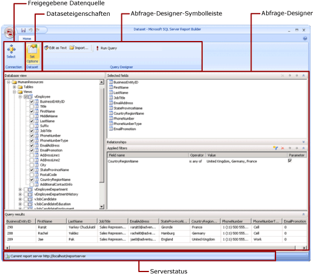

# Freigegebene Datasetentwurfsansicht (Report Builder)
  In einem Bericht stellt ein Dataset Berichtsdaten dar, die als Ergebnis der Ausführung einer Abfrage für eine externe Datenquelle zurückgegeben werden. Freigegebene Datasets werden auf einem Berichtsserver veröffentlicht und können in mehreren Berichten verwendet werden. Sie können Datasets erstellen, um Sie für andere freizugeben. Im Fenster „Freigegebene Datasetentwurfsansicht“ wählen Sie eine freigegebene Datenquelle aus, geben Eigenschaften für das freigegebene Dataset an und erstellen im Abfrage-Designer eine Abfrage.  
  
   
  
 Weitere Informationen zum Arbeiten mit Daten in einem Bericht finden Sie unter [Berichtsdatasets &#40;SSRS&#41;](../../reporting-services/report-data/report-datasets-ssrs.md).  
  
##   Menüband  
 Das Menüband bietet schnellen Zugriff auf die Befehle, die Sie zur Ausführung einer Aufgabe benötigen. Die Befehle sind in den folgenden logischen Gruppen organisiert: Verbindung, Dataset und Abfrage-Designer.  
  
### Verbindung  
 Verwenden Sie die Schaltfläche **Auswählen** in der Gruppe "Verbindung", um eine freigegebene Datenquelle im Bericht auszuwählen, oder navigieren Sie zu einer freigegebenen Datenquelle auf dem Berichtsserver.  
  
> [!NOTE]  
>  Ein freigegebenes Dataset muss auf einer freigegebenen Datenquelle basieren. Wenn die benötigte Datenquelle nicht verfügbar ist, müssen Sie auf dem Berichtsserver eine Datenquelle erstellen. Weitere Informationen finden Sie unter [Erstellen, Ändern und Löschen von freigegebenen Datenquellen (SSRS)](../../reporting-services/report-data/create-modify-and-delete-shared-data-sources-ssrs.md).  
  
 Weitere Informationen finden Sie unter [Data Connections, Data Sources, and Connection Strings in Report Builder](http://msdn.microsoft.com/library/7e103637-4371-43d7-821c-d269c2cc1b34).  
  
### Dataset  
 Verwenden Sie die Schaltfläche **Optionen festlegen** , um Eigenschaften des freigegebenen Datasets festzulegen. Dabei handelt es sich z. B. um:  
  
-   Felder. Sie können ein Feld hinzufügen oder ein Feld in der Feldauflistung bearbeiten.  
  
-   Datenoptionen. Sie können Optionen festlegen, die sich auf die Übereinstimmungskriterien und die Sortierreihenfolge auswirken, z. B. Berücksichtigung der Groß- und Kleinschreibung und Sortierung.  
  
-   Filter. Sie können Filter definieren, um die Daten in einem Bericht einzuschränken, nachdem der Bericht über die Datenverbindung abgerufen wurde.  
  
-   Parameter. Sie können einen Parameter hinzufügen oder Parameteroptionen bearbeiten. Sie können z. B. einen Standardwert für jeden Parameter angeben, damit Sie einen Cacheaktualisierungsplan für dieses freigegebene Dataset auf dem Berichtsserver erstellen können.  
  
 Die von Ihnen festgelegten Werte werden der Definition des freigegebenen Datasets auf dem Berichtsserver hinzugefügt. Wenn ein Berichtsautor dieses freigegebene Dataset in einen Bericht einschließt, gelten die von Ihnen angegebenen Optionen für diese Datasetinstanz.  
  
 Ein Berichtsautor kann die folgenden Optionen überschreiben, nachdem ein freigegebenes Dataset einem Bericht hinzugefügt wurde: "Sortierung", "Unterscheidung nach Groß-/Kleinschreibung", "Unterscheidung nach Akzent", "Unterscheidung nach Kanatyp", "Unterscheidung nach Breite" und "Teilergebnisse". Es können auch weitere Datasetfilter erstellt werden, um die Daten im Bericht einzuschränken.  
  
 Weitere Informationen finden Sie unter [Erstellen von Berichten zu eingebetteten und freigegebenen Datasets &#40;Berichts-Generator und SSRS&#41;](../../reporting-services/report-data/report-embedded-datasets-and-shared-datasets-report-builder-and-ssrs.md).  
  
 Weitere Informationen zu Cacheaktualisierungsplänen finden Sie unter [Zwischenspeichern von freigegebenen Datasets (SSRS)](../../reporting-services/report-server/cache-shared-datasets-ssrs.md).  
  
### Abfrage-Designer  
 Erstellen Sie mithilfe der Abfrage-Designer-Symbolleiste eine Abfrage, um die Daten anzugeben, die über die Datenverbindung abgerufen werden sollen. Die angezeigte Symbolleiste hängt vom Abfrage-Designer ab, der dem Datenquellentyp der Datenverbindung zugeordnet ist.  
  
 Weitere Informationen finden Sie im Thema für den jeweiligen Datenquellentyp unter [Hinzufügen von Daten aus externen Datenquellen &#40;SSRS&#41;](../../reporting-services/report-data/add-data-from-external-data-sources-ssrs.md).  
  
  
##   Abfrage-Designer-Oberfläche  
 Ein Abfrage-Designer hilft Ihnen, eine Abfrage in der für die externe Datenquelle erforderlichen Syntax zu erstellen.  
  
 Bei einigen Datenquellentypen ist ein grafischer Abfrage-Designer verfügbar, mit dem Sie die Metadaten in einer externen Datenquelle durchsuchen können. Sie können Namen interaktiv vom Metadatenbereich in die Abfrageentwurfsoberfläche ziehen oder die gewünschten Namen interaktiv auswählen.  
  
 Einige Datenquellentypen unterstützen einen textbasierten Abfrage-Designer, mit dem Sie in anderen Tools (z.B. in [!INCLUDE[ssManStudioFull](../../includes/ssmanstudiofull-md.md)]) erstellte Abfragen einfügen können.  
  
 Für jeden Datenquellentyp gelten bestimmte Anforderungen für die von der externen Datenquelle unterstützten Abfragen. Weitere Informationen finden Sie im Thema für den jeweiligen Datenquellentyp unter [Hinzufügen von Daten aus externen Datenquellen &#40;SSRS&#41;](../../reporting-services/report-data/add-data-from-external-data-sources-ssrs.md) und [Von Reporting Services unterstützte Datenquellen &#40;SSRS&#41;](../../reporting-services/report-data/data-sources-supported-by-reporting-services-ssrs.md).  
  
  
##   Anzeigen von Abfrageergebnissen  
 Durch die Abfragen, die Sie in der Entwurfsansicht für freigegebene Datasets erstellen, werden beim Verarbeiten des Berichts Daten über die Datenverbindung abgerufen.  
  
 Führen Sie die Abfrage aus, um Beispieldaten von der Datenverbindung anzuzeigen. So können Sie sicherstellen, dass die Abfrage den erwarteten Datentyp zurückgibt. Die Spalten im Resultset stammen aus den Metadaten für Datenschemas aus der Datenverbindung. Die Spaltennamen werden zur Datasetfeldauflistung. Die im Abfrageresultset angezeigten Werte der Daten sind Entwurfszeitdaten. Nachdem Sie das freigegebene Dataset als Definition des freigegebenen Datasets auf dem Berichtsserver gespeichert haben, wird nur der Abfragetext gespeichert. Die Daten im Abfrageresultset werden nicht gespeichert.  
  
 Wenn ein Berichtsautor dieses freigegebene Dataset einem Bericht hinzufügt, wird ein Zeiger auf die Datasetdefinition auf dem Berichtsserver hinzugefügt. Im Bericht wird die Datasetfeldauflistung im Berichtsdatenbereich angezeigt. Der Abfragetext ist nicht verfügbar.  
  
 Zum Ausführen einer Abfrage werden andere Anmeldeinformationen verwendet als zum Anzeigen einer Berichtsvorschau oder Ausführen eines Berichts vom Berichtsserver. Weitere Informationen finden Sie unter [Specify Credential and Connection Information for Report Data Sources](../../reporting-services/report-data/specify-credential-and-connection-information-for-report-data-sources.md).  
  
### Ausführen eines Berichts mit Parametern  
 Wenn die Abfrage Abfragevariablen enthält, werden automatisch Datasetparameter erstellt. Sobald Sie die Erstellung der Datasetabfrage abschließen, werden wiederum automatisch auf Datasetparameter festgelegte Berichtsparameter erstellt.  
  
 Enthält ein Bericht Parameter, kann der Bericht nur dann automatisch ausgeführt werden, wenn für alle Parameter Standardwerte festgelegt wurden. Falls einem Parameter kein Standardwert zugewiesen wurde, müssen Sie bei der Ausführung des Berichts einen Wert für den Parameter auswählen und dann auf der Registerkarte **Ausführen** auf **Bericht anzeigen** klicken.  
  
 Weitere Informationen finden Sie unter [Berichtsparameter &#40;Berichts-Generator und Berichts-Designer&#41;](../../reporting-services/report-design/report-parameters-report-builder-and-report-designer.md).  
  
  
##   Speichern des freigegebenen Datasets  
 Klicken Sie zum Speichern der erstellten Abfrage auf die Schaltfläche **Berichts-Generator** und anschließend auf **Speichern** oder **Speichern unter**. Navigieren Sie zum entsprechenden Ordner auf dem Berichtsserver, und speichern Sie die freigegebene Datasetdefinition. Das freigegebene Dataset steht anderen Benutzern erst zur Verfügung, wenn Sie es auf dem Berichtsserver speichern.  
  
  
## Siehe auch  
 [Berichtsdatasets &#40;SSRS&#41;](../../reporting-services/report-data/report-datasets-ssrs.md)   
 [Filtern, Gruppieren und Sortieren von Daten &#40;Berichts-Generator und SSRS&#41;](../../reporting-services/report-design/filter-group-and-sort-data-report-builder-and-ssrs.md)   
 [Berichtsparameter &#40;Berichts-Generator und Berichts-Designer&#41;](../../reporting-services/report-design/report-parameters-report-builder-and-report-designer.md)  
  
  
