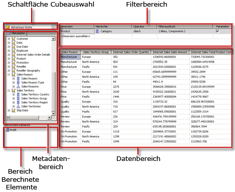
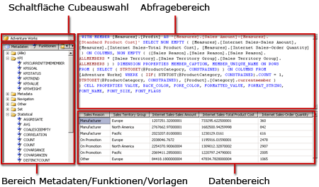

# Benutzeroberfl&#228;che des MDX-Abfrage-Designers f&#252;r Analysis Services
  [!INCLUDE[ssRSnoversion](../../includes/ssrsnoversion-md.md)] stellt grafische Abfrage-Designer zum Erstellen von MDX-Abfragen (Multidimensional Expressions) und DMX-Abfragen (Data Mining Expressions) für eine [!INCLUDE[ssASnoversion](../../includes/ssasnoversion-md.md)]-Datenquelle bereit. In diesem Thema wird der MDX-Abfrage-Designer beschrieben. Weitere Informationen zum DMX-Abfrage-Designer finden Sie unter [Analysis Services-Verbindungstyp für DMX &#40;SSRS&#41;](../../reporting-services/report-data/analysis-services-connection-type-for-dmx-ssrs.md).  
  
 Der grafische MDX-Abfrage-Designer verfügt über zwei Modi: Entwurfsmodus und Abfragemodus. Jeder Modus stellt einen Metadatenbereich bereit, in dem Sie Elemente aus den ausgewählten Cubes ziehen können, um eine MDX-Abfrage zu erstellen, die beim Verarbeiten des Berichts Daten abruft.  
  
> [!IMPORTANT]  
>  Benutzer greifen auf Datenquellen zu, wenn sie Abfragen erstellen und ausführen. Sie sollten minimale Berechtigungen für die Datenquellen gewähren, z. B. nur Leseberechtigungen.  
  
> [!NOTE]  
>  Das Importieren einer MDX-Abfrage aus einer Datei wird nicht unterstützt.  
  
## Grafischer MDX-Abfrage-Designer im Entwurfsmodus  
 Wenn Sie eine MDX-Abfrage für ein Berichtsdataset bearbeiten, wird der grafische MDX-Abfrage-Designer im Entwurfsmodus geöffnet.  
  
 In der folgenden Abbildung werden die Bereiche für den Entwurfsmodus bezeichnet.  
  
   
  
 In der folgenden Tabelle sind die Bereiche in diesem Modus aufgeführt.  
  
|Bereich|Funktion|  
|----------|--------------|  
|Cube auswählen (Schaltfläche **...**)|Zeigt den aktuell ausgewählten Cube an.|  
|Metadaten (Bereich)|Zeigt eine hierarchische Liste von Measures, KPIs (Key Performance Indicators) und Dimensionen an, die für den ausgewählten Cube definiert sind.|  
|Berechnete Elemente (Bereich)|Zeigt die aktuell definierten berechneten Elemente an, die für eine Verwendung in der Abfrage verfügbar sind.|  
|Filter (Bereich)|Wird zum Auswählen von Dimensionen und zugehörigen Hierarchien verwendet, um Daten an der Quelle zu filtern und die an den Bericht zurückgegebenen Daten zu beschränken.|  
|Daten (Bereich)|Zeigt die Spaltenüberschriften für das Resultset an, während Sie Elemente aus dem Metadatenbereich und dem Bereich für berechnete Elemente ziehen. Aktualisiert automatisch das Resultset, wenn die Schaltfläche **Automatisch ausführen** ausgewählt wird. .|  
  
 Sie können Dimensionen, Measures und KPIs aus dem Metadatenbereich sowie berechnete Elemente aus dem Bereich für berechnete Elemente in den Datenbereich ziehen. Im Filterbereich können Sie Dimensionen und zugehörige Hierarchien auswählen sowie Filterausdrücke festlegen, um die für eine Abfrage zur Verfügung stehenden Daten zu beschränken. Wenn die Umschaltfläche **AutoExecute** () auf der Symbolliste ausgewählt wird, führt der Abfrage-Designer die Abfrage jedes Mal aus, wenn Sie ein Metadatenobjekt im Datenbereich ablegen. Sie können die Abfrage mithilfe der Schaltfläche **Ausführen** () auf der Symbolleiste manuell ausführen.  
  
 Wenn Sie in diesem Modus eine MDX-Abfrage erstellen, werden die folgenden zusätzlichen Eigenschaften automatisch in die Abfrage eingeschlossen:  
  
 **Elementeigenschaften** MEMBER_CAPTION, MEMBER_UNIQUE_NAME  
  
 **Zelleigenschaften** VALUE, BACK_COLOR, FORE_COLOR, FORMATTED_VALUE, FORMAT_STRING, FONT_NAME, FONT_SIZE, FONT_FLAGS  
  
 Um eigene zusätzliche Eigenschaften anzugeben, müssen Sie die MDX-Abfrage im Abfragemodus manuell bearbeiten.  
  
### Symbolleiste des grafischen MDX-Abfrage-Designers im Entwurfsmodus  
 Die Symbolleiste des Abfrage-Designers stellt Schaltflächen bereit, die Ihnen beim Entwurf von MDX-Abfragen mit der grafischen Oberfläche helfen. In der folgenden Tabelle sind die Schaltflächen und ihre Funktionen aufgeführt.  
  
|Schaltfläche|Description|  
|------------|-----------------|  
|**Als Text bearbeiten**|Nicht aktiviert für diesen Datenquellentyp.|  
|**Importieren**|Importieren einer vorhandenen Abfrage aus einer Berichtsdefinitionsdatei (.rdl) im Dateisystem. Weitere Informationen finden Sie unter [Erstellen von Berichten zu eingebetteten und freigegebenen Datasets &#40;Berichts-Generator und SSRS&#41;](../../reporting-services/report-data/report-embedded-datasets-and-shared-datasets-report-builder-and-ssrs.md).|  
||Wechselt zum MDX-Befehlstyp.|  
||Wechselt zum DMX-Befehlstyp.|  
||Aktualisieren von Metadaten aus der Datenquelle.|  
||Zeigt das Dialogfeld **Generator für berechnete Elemente** an.|  
||Schaltet zwischen dem Anzeigen und Nichtanzeigen von leeren Zellen im Datenbereich um. (Dies entspricht dem Verwenden der NON EMPTY-Klausel in MDX.)|  
||Bei jeder Änderung wird die Abfrage automatisch ausgeführt, und das Ergebnis wird angezeigt. Die Ergebnisse werden im Datenbereich angezeigt.|  
|")|Zeigt Aggregationen im Datenbereich an.|  
||Löschen der ausgewählten Spalte im Datenbereich aus der Abfrage.|  
|")|Anzeigen des Dialogfelds **Abfrageparameter** . Bei der Angabe von Werten für einen Abfrageparameter wird automatisch ein Berichtsparameter mit demselben Namen erstellt. Der Wert des Abfrageparameters wird auf einen Ausdruck festgelegt, der auf den Berichtsparameter verweist.|  
||Bereitet die Abfrage vor.|  
||Führt die Abfrage aus und zeigt die Ergebnisse im Datenbereich an.|  
||Abbrechen der Abfrage.|  
||Umschalten zwischen Entwurfsmodus und Abfragemodus.|  
  
## Grafischer MDX-Abfrage-Designer im Abfragemodus  
 Wenn Sie vom grafischen Abfrage-Designer in den **Abfragemodus** wechseln möchten, klicken Sie auf der Symbolleiste auf die Schaltfläche **Entwurfsmodus** .  
  
 In der folgenden Abbildung sind die Bereiche für den Abfragemodus veranschaulicht.  
  
   
  
 In der folgenden Tabelle sind die Bereiche in diesem Modus aufgeführt.  
  
|Bereich|Funktion|  
|----------|--------------|  
|Cube auswählen (Schaltfläche **...**)|Zeigt den aktuell ausgewählten Cube an.|  
|Metadaten/Funktionen/Vorlagen (Bereich)|Zeigt eine hierarchische Liste von Measures, KPIs und Dimensionen an, die für den ausgewählten Cube definiert sind.|  
|Abfragebereich|Zeigt den Abfragetext an.|  
|Ergebnisbereich|Zeigt die Ergebnisse des Ausführens der Abfrage an.|  
  
 Im Metadatenbereich werden Registerkarten für **Metadaten**, **Funktionen**und **Vorlagen**angezeigt. Auf der Registerkarte **Metadaten** können Sie Dimensionen, Hierarchien, KPIs und Measures in den MDX-Abfragebereich ziehen. Auf der Registerkarte **Funktionen** können Sie Funktionen in den MDX-Abfragebereich ziehen. Auf der Registerkarte **Vorlagen** können Sie dem MDX-Abfragebereich MDX-Vorlagen hinzufügen. Wenn Sie die Abfrage ausführen, werden im Ergebnisbereich die Ergebnisse für die MDX-Abfrage angezeigt.  
  
 Sie können die im Entwurfsmodus erstellte Standard-MDX-Abfrage um zusätzliche Elementeigenschaften und Zelleigenschaften erweitern. Wenn Sie die Abfrage ausführen, werden diese Werte nicht im Resultset angezeigt. Sie werden jedoch an [!INCLUDE[ssRSnoversion](../../includes/ssrsnoversion-md.md)] zurückgegeben, und Sie können diese Werte in einem Bericht verwenden. Weitere Informationen finden Sie unter [Erweiterte Feldeigenschaften für eine Analysis Services-Datenbank &#40;SSRS&#41;](../../reporting-services/report-data/extended-field-properties-for-an-analysis-services-database-ssrs.md).  
  
### Symbolleiste für den grafischen Abfrage-Designer im Abfragemodus  
 Die Symbolleiste des Abfrage-Designers stellt Schaltflächen bereit, die Ihnen beim Entwurf von MDX-Abfragen mit der grafischen Oberfläche helfen.  
  
 Die Schaltflächen der Symbolleiste sind im Entwurfs- und Abfragemodus identisch, aber die folgenden Schaltflächen sind für den Abfragemodus nicht aktiviert:  
  
-   **Als Text bearbeiten**  
  
-   **Berechnetes Element hinzufügen** ()  
  
-   **Leere Zellen anzeigen** ()  
  
-   **AutoExecute** ()  
  
-   **Aggregationen anzeigen** ("))  
  
## Siehe auch  
 [Definieren von Parametern im MDX-Abfrage-Designer für Analysis Services &#40;Berichts-Generator und SSRS&#41;](../../reporting-services/report-data/define parameters in the mdx query designer for analysis services.md)   
 [Erstellen eines freigegebenen Datasets oder eingebetteten Datasets &#40;Berichts-Generator und SSRS&#41;](../../reporting-services/report-data/create-a-shared-dataset-or-embedded-dataset-report-builder-and-ssrs.md)   
 [Analysis Services-Verbindungstyp für DMX &#40;SSRS&#41;](../../reporting-services/report-data/analysis-services-connection-type-for-dmx-ssrs.md)   
 [RSReportDesigner-Konfigurationsdatei](../../reporting-services/report-server/rsreportdesigner-configuration-file.md)   
 [Analysis Services-Verbindungstyp für MDX &#40;SSRS&#41;](../../reporting-services/report-data/analysis-services-connection-type-for-mdx-ssrs.md)  
  
  