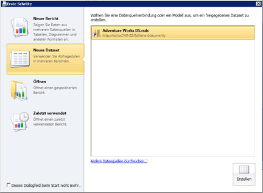

# Erstellen eines freigegebenen Datasets oder eingebetteten Datasets (Berichts-Generator und SSRS)
Eingebettete Datasets können nur in einem einzelnen [!INCLUDE[ssRSnoversion_md](../../includes/ssrsnoversion-md.md)] -Bericht verwendet werden. Freigegebene Datasets auf einem Berichtsserver können in mehreren Berichten verwendet werden, sowohl in mobilen als auch in paginierten. Sie benötigen zum Erstellen eines Dataset eine eingebettete oder eine freigegebene Datenquelle.  
  
 Verwenden Sie den **Berichts-Generator** für folgende Tasks:  
  
1.  Erstellen eines freigegebenen Datasets in der Datasetentwurfsansicht. Für freigegebene Datasets müssen veröffentlichte freigegebene Datenquellen verwendet werden.  
  
2.   Erstellen eines eingebetteten Datasets in der Berichtsentwurfsansicht.  
  
3.   Speichern Sie das Dataset direkt auf dem Berichtsserver oder der SharePoint-Website.  
  
 Verwenden Sie den **Berichts-Designer** in [!INCLUDE[ssBIDevStudioFull](../../includes/ssbidevstudiofull-md.md)] für die folgenden Tasks:  
  
1.  Erstellen Sie im Projektmappen-Explorer ein freigegebenes Dataset. Für freigegebene Datasets müssen Datenquellen aus dem Ordner Freigegebene Datenquellen im Projektmappen-Explorer verwendet werden.  
  
2.  Erstellen Sie im Berichtsdatenbereich ein eingebettetes Dataset.  
  
3.  Stellen Sie die freigegebenen Datasets und freigegebene Datenquelle mit dem Bericht optional bereit. Verwenden Sie für jeden Elementtyp Projekteigenschaften, um Pfade zu Ordnern auf dem Berichtsserver oder einer SharePoint-Website anzugeben.  
  
 Weitere Informationen finden Sie unter [Erstellen von Berichten zu eingebetteten und freigegebenen Datasets &#40;Berichts-Generator und SSRS&#41;](../../reporting-services/report-data/report-embedded-datasets-and-shared-datasets-report-builder-and-ssrs.md).  
  
> [!NOTE]  
>  [!INCLUDE[ssRBRDDup](../../includes/ssrbrddup-md.md)]  
  
## So öffnen Sie den Berichts-Generator und erstellen ein freigegebenes Dataset  
  
1.  So öffnen Sie den Berichts-Generator. Der Bereich **Neuer Bericht oder neues Dataset** wird geöffnet, wie in der folgenden Abbildung dargestellt:  
  
       
  
    > [!NOTE]  
    >  Wenn der Bereich **Neuer Bericht oder neues Dataset** nicht angezeigt wird, klicken Sie in der Schaltfläche „Berichts-Generator“ auf **Neu**.  
  
2.  Klicken Sie im linken Bereich unter **Dataset erstellen**auf **Freigegebenes Dataset**.  
  
3.  Klicken Sie im rechten Bereich auf **Durchsuchen** , um eine freigegebene Datenquelle vom Berichtsserver auszuwählen, und klicken Sie dann auf **Erstellen**. Der mit der freigegebenen Datenquelle verknüpfte Abfrage-Designer wird geöffnet.  
  
4.  Geben Sie im Abfrage-Designer die Felder an, die in das Dataset einbezogen werden sollen.  
  
5.  Klicken Sie auf **Ausführen** (**!**), um die Abfrage auszuführen.  
  
6.  Klicken Sie in der Schaltfläche **Berichts-Generator** auf **Speichern** oder **Speichern unter** , um das freigegebene Dataset auf dem Berichtsserver zu speichern.  
  
7.  Um den Berichts-Generator zu beenden, klicken Sie auf **Berichts-Generator**und dann auf **Berichts-Generator beenden**. Um mit Berichten zu arbeiten, klicken Sie auf **Berichts-Generator**und dann auf **Neu** oder **Öffnen**.  
  
## So legen Sie Abfrageparameteroptionen fest  
  
1.  So öffnen Sie den Berichts-Generator.  
  
2.  Klicken Sie auf **Öffnen**.  
  
3.  Wechseln Sie zum Berichtsserver, und wählen Sie den Ordner für die freigegebene Datenquelle aus.  
  
4.  Klicken Sie unter **Elemente des Typs**in der Dropdownliste auf „Datasets (*.rsd)“.  
  
5.  Wählen Sie das freigegebene Dataset aus, und klicken Sie dann auf **Öffnen**. Der verknüpfte Abfrage-Designer wird geöffnet.  
  
6.  Klicken Sie im Menüband auf **Dataseteigenschaften**.  
  
7.  Klicken Sie auf **Parameter**. Legen Sie auf dieser Seite als Standardwert eine Konstante oder einen Ausdruck fest, markieren Sie den Parameter als schreibgeschützt, auf NULL festlegbar oder mit **In Abfrage auslassen**. Weitere Informationen finden Sie unter [Berichtsparameter](../../reporting-services/report-design/report-parameters-report-builder-and-report-designer.md).  
  
8.  [!INCLUDE[clickOK](../../includes/clickok-md.md)]  

  
## So erstellen Sie ein Dataset aus einer relationalen SQL Server-Datenbank  
  
1.  Klicken Sie im Berichtsdatenbereich mit der rechten Maustaste auf den Namen der Datenquelle, und klicken Sie dann auf **Dataset hinzufügen**. Die Seite **Abfrage** des Dialogfelds **Dataseteigenschaften** wird aufgerufen.  
  
2.  Geben Sie im Textfeld **Name**einen Namen für das Dataset ein, oder übernehmen Sie den Standardnamen.  
  
    > [!NOTE]  
    >  Der Name des Datasets wird intern im Bericht verwendet. Zur Verdeutlichung sollte der Name des Datasets die Daten beschreiben, die von der Abfrage zurückgegeben werden.  
  
3.  Wählen Sie aus der Liste **Datenquelle**eine vorhandene freigegebene Datenquelle aus, oder klicken Sie auf **Neu** , um eine neue eingebettete Datenquelle zu erstellen.  
  
4.  Wählen Sie einen **Abfragetyp** . Die verfügbaren Optionen sind vom Datenquellentyp abhängig.  
  
    -   Wählen Sie **Text** aus, um eine Abfrage zu schreiben, die die Abfragesprache der Datenquelle verwendet.  
  
    -   Wählen Sie **Table** aus, um alle Felder in einer relationalen Datenbanktabelle zurückzugeben.  
  
    -   Wählen Sie **Gespeicherte Prozedur** , um eine gespeicherte Prozedur nach Namen auszuführen.  
  
5.  Geben Sie in **Abfrage**die Abfrage, die gespeicherte Prozedur oder den Tabellennamen ein. Oder klicken Sie auf **Abfrage-Designer** , um den grafischen oder textbasierten Abfrage-Designer zu öffnen, oder auf **Importieren** , um die Abfrage aus einem vorhandenen Bericht zu importieren.  
  
     In einigen Fällen kann die von der Abfrage angegebene Feldauflistung nur durch Anwendung der Abfrage auf die Datenquelle ermittelt werden. Eine gespeicherte Prozedur gibt möglicherweise im Resultset eine variable Feldauflistung zurück. Klicken Sie auf **Felder aktualisieren** , um die Abfrage auf die Datenquelle anzuwenden und die Feldnamen abzurufen, die erforderlich sind, um die Dataset-Feldauflistung im Berichtsdatenbereich aufzufüllen. Die Feldauflistung wird unter dem Datasetknoten angezeigt, nachdem Sie das Dialogfeld **Dataseteigenschaften** geschlossen haben.  
  
6.  Geben Sie in das Feld **Timeout**die Anzahl der Sekunden ein, die der Berichtsserver auf eine Antwort von der Datenbank warten soll. Der Standardwert beträgt 0 Sekunden. Bei diesem Wert gibt es keinen Timeout.  
  
7.  [!INCLUDE[clickOK](../../includes/clickok-md.md)]  
  
     Das Dataset und seine Feldauflistung werden im Berichtsdatenbereich unter dem Datenquellenknoten angezeigt.  
  
## Siehe auch  
 [Erstellen von Berichten zu eingebetteten und freigegebenen Datasets &#40;Berichts-Generator und SSRS&#41;](../../reporting-services/report-data/report-embedded-datasets-and-shared-datasets-report-builder-and-ssrs.md)   
 [Datasetfeld-Sammlung &#40;Berichts-Generator und SSRS&#41;](../../reporting-services/report-data/dataset-fields-collection-report-builder-and-ssrs.md)   
 [Berichtsdatasets &#40;SSRS&#41;](../../reporting-services/report-data/report-datasets-ssrs.md)   
 [Datenverbindungen, Datenquellen und Verbindungszeichenfolgen (Berichts-Generator und SSRS)](http://msdn.microsoft.com/library/7e103637-4371-43d7-821c-d269c2cc1b34)   
 [Eingebettete und freigegebene Datasets &#40;Berichts-Generator und SSRS&#41;](../../reporting-services/report-data/embedded-and-shared-datasets-report-builder-and-ssrs.md)  
  
  
