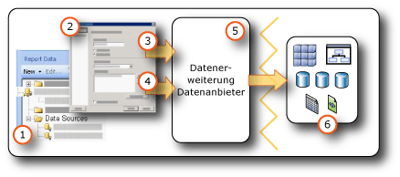

# <a name="data-connections-data-sources-and-connection-strings-report-builder-and-ssrs"></a>Datenverbindungen, Datenquellen und Verbindungszeichenfolgen (Berichts-Generator und SSRS)

[!INCLUDE [ssrs-appliesto](../../includes/ssrs-appliesto.md)] [!INCLUDE [ssrs-appliesto-2016-and-later](../../includes/ssrs-appliesto-2016-and-later.md)] [!INCLUDE[ssrs-appliesto-pbirsi](../../includes/ssrs-appliesto-pbirs.md)] [!INCLUDE[ssrs-appliesto-sharepoint-2013-2016i](../../includes/ssrs-appliesto-sharepoint-2013-2016.md)]

[!INCLUDE [ssrs-previous-versions](../../includes/ssrs-previous-versions.md)]

  Sie müssen zuerst [!INCLUDE[ssRBnoversion](../../includes/ssrbnoversion-md.md)] Datenquellen  [!INCLUDE[ssRSnoversion](../../includes/ssrsnoversion-md.md)] und *Datasets* erstellen, um Daten in paginierten *- und*-Berichten einzuschließen. In diesem Thema werden die Typen von Datenquellen und die Vorgehensweise bei der Erstellung von Datenquellen beschrieben. Zudem erhalten Sie wichtige Informationen zu Anmeldeinformationen für Datenquellen. Eine Datenquelle umfasst den Datenquellentyp, Verbindungsinformationen und den Typ der zu verwendenden Anmeldeinformationen. Es gibt zwei Typen von Datenquellen: eingebettet und freigegeben. Eine eingebettete Datenquelle wird im Bericht definiert und nur von diesem Bericht verwendet. Eine freigegebene Datenquelle wird unabhängig von einem Bericht definiert und kann von mehreren Berichten verwendet werden. Weitere Informationen finden Sie unter [eingebettete und freigegebene Datasets &#40; Berichts-Generator und SSRS &#41; ](../../reporting-services/report-data/embedded-and-shared-datasets-report-builder-and-ssrs.md).  

> [!NOTE]  
>  [!INCLUDE[ssRBRDDup](../../includes/ssrbrddup-md.md)]
  
##  <a name="bkmk_data_sources"></a> Eingebettete und freigegebene Datenquellen  
 Freigegebene Datenquellen sind hilfreich, wenn bestimmte Datenquellen häufig verwendet werden. Es wird empfohlen, dass Sie so oft wie möglich freigegebene Datenquellen verwenden. Mit ihnen können Berichte und der Berichtszugriff einfacher verwaltet und Berichte und die Datenquellen, auf die sie zugreifen, sicherer gemacht werden. Wenn Sie eine freigegebene Datenquelle benötigen, wenden Sie sich an den Systemadministrator. Er erstellt eine freigegebene Datenquelle für Sie.  
  
 Eine eingebettete Datenquellenverbindung ist eine Datenverbindung, die in der Berichtsdefinition gespeichert wird. Eingebettete Informationen für eine Datenquellenverbindung können nur in dem Bericht verwendet werden, in den die Informationen eingebettet wurden. Verwenden Sie das Dialogfeld **Datenquelleneigenschaften** , um eingebettete Datenquellen zu definieren und zu verwalten.  
  
 Der Unterschied zwischen den eingebetteten und den freigegebenen Datenquellen ist die Art der Erstellung, Speicherung und Verwaltung.  
  
-   In Berichts-Designer werden eingebettete oder freigegebene Datenquellen als Teil eines [!INCLUDE[ssBIDevStudioFull](../../includes/ssbidevstudiofull-md.md)] -Projekts erstellt. Sie können steuern, ob Sie sie für die Vorschau lokal verwenden oder sie als Teil des Projekts auf einem Berichtsserver oder einer SharePoint-Website bereitstellen möchten. Sie können benutzerdefinierte Datenerweiterungen verwenden, die auf dem Computer und dem Berichtsserver oder der SharePoint-Website installiert wurden, auf dem bzw. der die Berichte bereitgestellt werden.  
  
     Systemadministratoren können zusätzliche Datenverarbeitungserweiterungen und .NET Framework-Datenanbieter installieren und konfigurieren. Weitere Informationen finden Sie unter [Datenverarbeitungserweiterungen und .NET Framework-Datenanbieter &#40;SSRS&#41;](../../reporting-services/report-data/data-processing-extensions-and-net-framework-data-providers-ssrs.md).  
  
     Entwickler können mithilfe der <xref:Microsoft.ReportingServices.DataProcessing> -API Datenverarbeitungserweiterungen erstellen, durch die weitere Datenquellentypen unterstützt werden.  
  
-   Wechseln Sie im [!INCLUDE[ssRBnoversion](../../includes/ssrbnoversion-md.md)]zu einem Berichtsserver oder zu einer SharePoint-Website, und wählen Sie freigegebene Datenquellen aus, oder erstellen Sie eingebettete Datenquellen im Bericht. Freigegebene Datenquellen können nicht im [!INCLUDE[ssRBnoversion](../../includes/ssrbnoversion-md.md)]erstellt werden. Sie können keine benutzerdefinierten Datenerweiterungen im [!INCLUDE[ssRBnoversion](../../includes/ssrbnoversion-md.md)]verwenden.  
  
 In der folgenden Tabelle werden die Unterschiede zwischen eingebetteten und freigegebenen Datenquellen zusammengefasst.  
  
|Description|Eingebettet<br /><br /> Datenquelle|Shared<br /><br /> Datenquelle|  
|-----------------|------------------------------|----------------------------|  
|Die Datenverbindung ist in die Berichtsdefinition eingebettet.|||  
|Der Zeiger auf die Datenverbindung auf dem Berichtsserver ist in die Berichtsdefinition eingebettet.|||  
|Wird auf dem Berichtsserver verwaltet.|||  
|Ist für freigegebene Datasets erforderlich.|||  
|Ist für Komponenten erforderlich.|||  
  
##  <a name="bkmk_DataConnections"></a> Integrierte Datenerweiterungen  
 Standarddatenerweiterungen in [!INCLUDE[ssRSnoversion](../../includes/ssrsnoversion-md.md)] umfassen die folgenden Typen von Datenverbindungen:  
  
-   Microsoft SQL Server und Microsoft Azure SQL-Datenbank
  
-   Microsoft SQL Server Analysis Services  
  
-   Microsoft SharePoint-Liste  
  
-   [!INCLUDE[ssSDSFull](../../includes/sssdsfull-md.md)]  
  
-   Microsoft SQL Server Parallel Data Warehouse  
  
-   OLE DB  
  
-   Oracle  
  
-   SAP NetWeaver BI  
  
-   Hyperion Essbase  
  
-   Teradata  
  
-   XML  
  
-   ODBC  
  
-   Microsoft BI Semantikmodell für Power View: Auf einer SharePoint-Website, die für einen [!INCLUDE[ssGemini](../../includes/ssgemini-md.md)] -Katalog und [!INCLUDE[ssCrescent](../../includes/sscrescent-md.md)]konfiguriert wurde, ist dieser Datenquellentyp verfügbar. Dieser Datenquellentyp wird nur für [!INCLUDE[ssCrescent](../../includes/sscrescent-md.md)] -Präsentationen verwendet. Weitere Informationen finden Sie unter [Building the Perfect BI Semantic Tabular Models for Power View](http://technet.microsoft.com/video/building-the-perfect-bi-semantic-tabular-models-for-power-view.aspx).  
  
 Eine vollständige Liste der Datenquellen und -versionen, die [!INCLUDE[ssRSnoversion](../../includes/ssrsnoversion-md.md)] unterstützt, finden Sie unter [Von Reporting Services unterstützte Datenquellen &#40;SSRS&#41;](../../reporting-services/report-data/data-sources-supported-by-reporting-services-ssrs.md).  
  
## <a name="data-in-includessrbnoversionincludesssrbnoversion-mdmd"></a>Daten in [!INCLUDE[ssRBnoversion](../../includes/ssrbnoversion-md.md)]  
   
  
1.  **Datenquellen im Berichtsdatenbereich:** Eine Datenquelle wird im Berichtsdatenbereich angezeigt, nachdem Sie eine eingebettete Datenquelle erstellt oder eine freigegebene Datenquelle hinzugefügt haben.  
  
2.  **Dialogfeld „Verbindung“:** Verwenden Sie das Dialogfeld „Verbindung“, um eine Verbindungszeichenfolge zu erstellen oder eine Verbindungszeichenfolge einzufügen.  
  
3.  **Datenverbindungsinformationen:** Die Verbindungszeichenfolge wird an die Datenerweiterung übergeben.  
  
4.  **Anmeldeinformationen:** Anmeldeinformationen werden getrennt von der Verbindungszeichenfolge verwaltet.  
  
5.  **Datenerweiterung/Datenanbieter:** Die Verbindung mit den Daten kann über mehrere Datenzugriffsebenen hergestellt werden.  
  
6.  **Externe Datenquellen:** Rufen Sie Daten aus relationalen Datenbanken, mehrdimensionalen Datenbanken, SharePoint-Listen, Webdiensten oder Berichtsmodellen ab.  
  
##  <a name="bkmk_connection_examples"></a> Beispiele für häufige Verbindungszeichenfolgen  
 Verbindungszeichenfolgen sind die Textdarstellung von Verbindungseigenschaften für einen Datenanbieter. In der folgenden Tabelle sind Beispiele von Verbindungszeichenfolgen für verschiedene Datenverbindungstypen aufgeführt.  
 
 > [!NOTE]  
>  [Connectionstrings.com](http://www.connectionstrings.com/) ist eine weitere Ressource für den Bezug von Verbindungszeichenfolgen. 
  
|**Data source**|**Beispiel**|**Description**|  
|---------------------|-----------------|---------------------|  
|SQL Server-Datenbank auf dem lokalen Server|`data source="(local)";initial catalog=AdventureWorks`|Legen Sie den Datenquellentyp auf **Microsoft SQL Server**fest. Weitere Informationen finden Sie unter [SQL Server-Verbindungstyp &#40;SSRS&#41;](../../reporting-services/report-data/sql-server-connection-type-ssrs.md).|  
|SQL Server-Instanz<br /><br /> database|`Data Source=localhost\MSSQL13.<InstanceName>; Initial Catalog=AdventureWorks`|Legen Sie den Datenquellentyp auf **Microsoft SQL Server**fest.|  
|SQL Server Express-Datenbank|`Data Source=localhost\MSSQL13.SQLEXPRESS; Initial Catalog=AdventureWorks`|Legen Sie den Datenquellentyp auf **Microsoft SQL Server**fest.|  
|Azure SQL-Datenbank|`Data Source=<host>;Initial Catalog=AdventureWorks; Encrypt=True`|Legen Sie den Datenquellentyp auf **Microsoft Azure SQL-Datenbank**. Weitere Informationen finden Sie unter [SQL Azure-Verbindungstyp &#40;SSRS&#41;](../../reporting-services/report-data/sql-azure-connection-type-ssrs.md).|  
|SQL Server Parallel Data Warehouse|`HOST=<IP address>;database= AdventureWorks; port=<port>`|Legen Sie den Datenquellentyp auf **Microsoft SQL Server Parallel Data Warehouse**fest. Weitere Informationen finden Sie unter [SQL Server Parallel Data Warehouse-Verbindungstyp &#40;SSRS&#41;](../../reporting-services/report-data/sql-server-parallel-data-warehouse-connection-type-ssrs.md).|  
|Analysis Services-Datenbank auf dem lokalen Server|`data source=localhost;initial catalog=Adventure Works DW`|Legen Sie den Datenquellentyp auf **Microsoft SQL Server Analysis Services**fest. Weitere Informationen finden Sie unter [Analysis Services-Verbindungstyp für MDX &#40; SSRS &#41; ](../../reporting-services/report-data/analysis-services-connection-type-for-mdx-ssrs.md) oder [Analysis Services-Verbindungstyp für DMX &#40; SSRS &#41; ](../../reporting-services/report-data/analysis-services-connection-type-for-dmx-ssrs.md).|  
|Analysis Services-Datenbank für tabellarische Modelle mit Sales-Perspektive|`Data source=<servername>;initial catalog= Adventure Works DW;cube='Sales’`|Legen Sie den Datenquellentyp auf **Microsoft SQL Server Analysis Services**fest. Geben Sie den Perspektivennamen in der "cube="-Einstellung an. Weitere Informationen finden Sie unter [Perspektiven &#40;SSAS – tabellarisch&#41;](../../analysis-services/tabular-models/perspectives-ssas-tabular.md).|  
|Berichtsmodell-Datenquelle auf einem Berichtsserver, der im einheitlichen Modus konfiguriert ist|`Server=http://myreportservername/reportserver; datasource=/models/Adventure Works`|Geben Sie die URL des Berichtsservers oder der Dokumentbibliothek sowie den Pfad des veröffentlichten Modells im Namespace des Berichtsserverordners oder Dokumentbibliotheksordners an. Weitere Informationen finden Sie unter [Berichtsmodellverbindung &#40; SSRS &#41; ](../../reporting-services/report-data/report-model-connection-ssrs.md).|  
|Berichtsmodell-Datenquelle auf einem Berichtsserver, der im integrierten SharePoint-Modus konfiguriert ist|`Server=http://server; datasource=http://server/site/documents/models/Adventure Works.smdl`|Geben Sie die URL des Berichtsservers oder der Dokumentbibliothek sowie den Pfad des veröffentlichten Modells im Namespace des Berichtsserverordners oder Dokumentbibliotheksordners an.|  
|[!INCLUDE[ssNoVersion](../../includes/ssnoversion-md.md)] 2000 [!INCLUDE[ssASnoversion](../../includes/ssasnoversion-md.md)] -Server|`provider=MSOLAP.2;data source=<remote server name>;initial catalog=FoodMart 2000`|Legen Sie den Datenquellentyp auf **OLE DB-Anbieter für OLAP Services 8.0**fest.<br /><br /> Sie können eine schnellere Verbindung mit [!INCLUDE[ssNoVersion](../../includes/ssnoversion-md.md)] 2000 [!INCLUDE[ssASnoversion](../../includes/ssasnoversion-md.md)] -Datenquellen erzielen, wenn Sie die **ConnectTo** -Eigenschaft auf **8.0**festlegen. Sie können diese Eigenschaft im Dialogfeld **Verbindungseigenschaften** auf der Registerkarte **Erweiterte Eigenschaften** festlegen.|  
|Oracle-Server|`data source=myserver`|Legen Sie den Datenquellentyp auf **Oracle**fest. Auf dem Computer mit Berichts-Designer und auf dem Berichtsserver müssen die Oracle-Clienttools installiert sein. Weitere Informationen finden Sie unter [Oracle-Verbindungstyp &#40;SSRS&#41;](../../reporting-services/report-data/oracle-connection-type-ssrs.md).|  
|SAP NetWeaver BI-Datenquelle|`DataSource=http://mySAPNetWeaverBIServer:8000/sap/bw/xml/soap/xmla`|Legen Sie den Datenquellentyp auf **SAP NetWeaver BI**fest. Weitere Informationen finden Sie unter [SAP NetWeaver BI-Verbindungstyp &#40;SSRS&#41;](../../reporting-services/report-data/sap-netweaver-bi-connection-type-ssrs.md).|  
|Hyperion Essbase-Datenquelle|`Data Source=http://localhost:13080/aps/XMLA; Initial Catalog=Sample`|Legen Sie den Datenquellentyp auf **Hyperion Essbase**fest. Weitere Informationen finden Sie unter [Hyperion Essbase-Verbindungstyp &#40;SSRS&#41;](../../reporting-services/report-data/hyperion-essbase-connection-type-ssrs.md).|  
|Teradata-Datenquelle|`data source=`\<"NNN" >. \<"NNN" >. \<"NNN" >. \<"NNN" >`;`|Legen Sie den Datenquellentyp auf **Teradata**fest. Die Verbindungszeichenfolge ist eine IP-Adresse (Internet Protocol) in Form von vier Feldern, wobei jedes Feld ein bis drei Ziffern aufweisen kann. Weitere Informationen finden Sie unter [Teradata-Verbindungstyp &#40; SSRS &#41; ](../../reporting-services/report-data/teradata-connection-type-ssrs.md).|  
|Teradata-Datenquelle|`Database=`*\<database name>* `; data source=` *\<NN*N*>.\< "Nnn" >. \<NNN>. \<N*NN*>*`;Use X Views=False;Restrict to Default Database=True`|Legen Sie den Datenquellentyp auf **Teradata**fest, ähnlich dem vorherigen Beispiel. Verwenden Sie nur die Standarddatenbank, die im Datenbank-Tag angegeben wird, und ermitteln Sie nicht automatisch Datenbeziehungen.|  
|XML-Datenquelle, Webdienst|`data source=http://adventure-works.com/results.aspx`|Legen Sie den Datenquellentyp auf **XML**fest. Die Verbindungszeichenfolge ist eine URL für einen Webdienst, der Webdienste-Definitionssprache (WSDL) unterstützt. Weitere Informationen finden Sie unter [XML-Verbindungstyp &#40; SSRS &#41; ](../../reporting-services/report-data/xml-connection-type-ssrs.md).|  
|XML-Datenquelle, XML-Dokument|`http://localhost/XML/Customers.xml`|Legen Sie den Datenquellentyp auf **XML**fest. Die Verbindungszeichenfolge besteht aus einer URL für das XML-Dokument.|  
|XML-Datenquelle, eingebettetes XML-Dokument|*Empty*|Legen Sie den Datenquellentyp auf **XML**fest. Die XML-Daten sind in der Berichtsdefinition eingebettet.|  
|SharePoint-Liste|`data source=http://MySharePointWeb/MySharePointSite/`|Legen Sie den Datenquellentyp auf **SharePoint-Liste**fest.|  
  
 Wenn Sie mittels **localhost**keine Verbindung zu einem Berichtsserver herstellen können, überprüfen Sie, ob das Netzwerkprotokoll für TCP/IP aktiviert ist. Weitere Informationen finden Sie unter [Configure Client Protocols](../../database-engine/configure-windows/configure-client-protocols.md).  
  
 Weitere Informationen zu den Konfigurationen, die zum Herstellen einer Verbindung mit diesen Datenquellentypen erforderlich sind, finden Sie im spezifischen Datenverbindungsthema unter [Hinzufügen von Daten aus externen Datenquellen &#40;SSRS&#41;](../../reporting-services/report-data/add-data-from-external-data-sources-ssrs.md) oder [Von Reporting Services unterstützte Datenquellen &#40;SSRS&#41;](../../reporting-services/report-data/data-sources-supported-by-reporting-services-ssrs.md).  
  
##  <a name="bkmk_special_password_characters"></a> Sonderzeichen in Kennwörtern  
 Wenn Sie eine ODBC- oder SQL-Datenquelle so konfigurieren, dass nach einem Kennwort gefragt oder das Kennwort in die Verbindungszeichenfolge eingeschlossen wird, und ein Benutzer das Kennwort mit Sonderzeichen wie z. B. Satzzeichen eingibt, können die Sonderzeichen von einigen zugrunde liegenden Datenquellentreibern nicht überprüft werden. Wenn Sie den Bericht verarbeiten, ist die Meldung "Kein zulässiges Kennwort" möglicherweise ein Anzeichen für dieses Problem. Falls die Änderung des Kennworts unmöglich ist, können Sie mit dem Datenbankadministrator vereinbaren, dass die entsprechenden Anmeldeinformationen auf dem Server als Teil eines ODBC-System-Datenquellennamens (Data Source Name, DSN) gespeichert werden. Weitere Informationen finden Sie unter "OdbcConnection.ConnectionString" in der [!INCLUDE[dnprdnshort](../../includes/dnprdnshort-md.md)] SDK-Dokumentation.  
  
##  <a name="bkmk_Expressions_in_connection_strings"></a> Auf Ausdrücken beruhende Verbindungszeichenfolgen  
 Auf Ausdrücken beruhende Verbindungszeichenfolgen werden zur Laufzeit ausgewertet. Sie können beispielsweise die Datenquelle als Parameter angeben, den Parameterverweis in die Verbindungszeichenfolge einbinden und dem Benutzer das Auswählen einer Datenquelle für den Bericht gestatten. Nehmen Sie beispielsweise an, ein multinationales Unternehmen verfügt über Datenserver in verschiedenen Ländern. Mit einer ausdrucksbasierten Verbindungszeichenfolge kann ein Benutzer, der einen Umsatzbericht ausführt, vor der Ausführung des Berichts eine Datenquelle für ein bestimmtes Land bzw. für eine bestimmte Region auswählen.  
  
 Im folgenden Beispiel wird die Verwendung eines Datenquellenausdrucks in einer [!INCLUDE[ssNoVersion](../../includes/ssnoversion-md.md)] -Verbindungszeichenfolge veranschaulicht. Für das Beispiel wird vorausgesetzt, dass Sie einen Berichtsparameter mit dem Namen `ServerName`erstellt haben:  
  
```  
="data source=" & Parameters!ServerName.Value & ";initial catalog=AdventureWorks"  
```  
  
 Datenquellenausdrücke werden zur Laufzeit oder beim Anzeigen einer Berichtsvorschau verarbeitet. Der Ausdruck muss in [!INCLUDE[vbprvb](../../includes/vbprvb-md.md)]geschrieben sein. Halten Sie sich an die folgenden Richtlinien, wenn Sie einen Datenquellenausdruck definieren:  
  
-   Entwerfen Sie den Bericht mithilfe einer statischen Verbindungszeichenfolge. Eine statische Verbindungszeichenfolge bezeichnet eine Verbindungszeichenfolge, die nicht durch einen Ausdruck festgelegt wird (wenn Sie beispielsweise die Schritte zum Erstellen einer berichtsspezifischen oder freigegebenen Datenquelle ausführen, definieren Sie eine statische Verbindungszeichenfolge). Die Verwendung einer statischen Verbindungszeichenfolge ermöglicht es Ihnen, im Berichts-Designer eine Verbindung mit der Datenquelle herzustellen, sodass Sie die Abfrageergebnisse abrufen können, die Sie zum Erstellen des Berichts benötigen.  
  
-   Verwenden Sie keine freigegebene Datenquelle, wenn Sie die Datenquellenverbindung definieren. Es ist nicht möglich, einen Datenquellenausdruck in einer freigegebenen Datenquelle zu verwenden. Sie müssen eine eingebettete Datenquelle für den Bericht definieren.  
  
-   Geben Sie die Anmeldeinformationen getrennt von der Verbindungszeichenfolge an. Sie können gespeicherte Anmeldeinformationen, auf Anforderung eingegebene Anmeldeinformationen oder die integrierte Sicherheit verwenden.  
  
-   Fügen Sie einen Berichtsparameter zum Angeben einer Datenquelle hinzu. Als Parameterwerte können Sie entweder eine statische Liste verfügbarer Werte angeben (in diesem Fall sollten die verfügbaren Werte den Datenquellen entsprechen, die Sie mit dem Bericht verwenden können) oder eine Abfrage definieren, die zur Laufzeit eine Liste mit Datenquellen abruft.  
  
-   Stellen Sie sicher, dass die Datenquellen in der Liste das gleiche Datenbankschema verwenden. Die Schemainformationen stellen den Ausgangspunkt bei jedem Berichtsentwurf dar. Wenn das Schema, das zum Definieren des Berichts verwendet wird, nicht mit dem Schema identisch ist, das zur Laufzeit vom Bericht verwendet wird, kann der Bericht möglicherweise nicht ausgeführt werden.  
  
-   Ersetzen Sie die statische Verbindungszeichenfolge durch einen Ausdruck, bevor Sie den Bericht veröffentlichen. Ersetzen Sie die statische Verbindungszeichenfolge erst dann durch einen Ausdruck, wenn der Entwurf des Berichts vollständig abgeschlossen ist. Sobald Sie einen Ausdruck verwenden, können Sie die Abfrage nicht mehr im Berichts-Designer ausführen. Außerdem werden die Feldliste im Berichtsdatenbereich und die Parameterliste nicht mehr automatisch aktualisiert.  

## <a name="next-steps"></a>Nächste Schritte

[Erstellen, ändern und Löschen von freigegebenen Datenquellen](../../reporting-services/report-data/create-modify-and-delete-shared-data-sources-ssrs.md)   
[Erstellen und Verwenden eingebetteter Datenquellen](../../reporting-services/report-data/create-and-modify-embedded-data-sources.md)   
[Festlegen von Bereitstellungseigenschaften](../../reporting-services/tools/set-deployment-properties-reporting-services.md)   
[Specify Credential and Connection Information for Report Data Sources (Angeben der Anmeldeinformationen und Verbindungsinformationen für Berichtsdatenquellen)](../../reporting-services/report-data/specify-credential-and-connection-information-for-report-data-sources.md)  

Haben Sie dazu Fragen? [Stellen Sie eine Frage im Reporting Services-Forum](http://go.microsoft.com/fwlink/?LinkId=620231)

