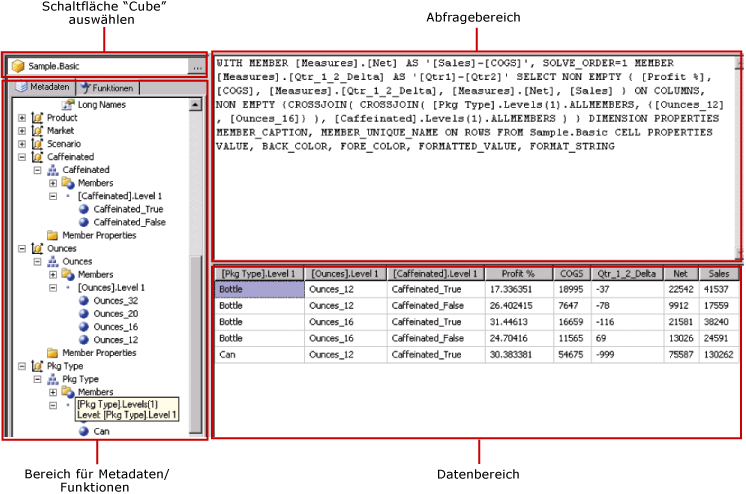

# Benutzeroberfläche des Abfrage-Designers von Hyperion Essbase
  [!INCLUDE[ssRSnoversion](../../includes/ssrsnoversion-md.md)] bietet einen grafischer Abfrage-Designer zum Erstellen von MDX-Abfragen (Multidimensional Expression) für eine [!INCLUDE[extEssbase](../../includes/extessbase-md.md)] -Datenquelle. Der grafische MDX-Abfrage-Designer verfügt über zwei Modi: Entwurfsmodus und Abfragemodus. Jeder Modus stellt einen Metadatenbereich bereit, in dem Sie Elemente aus einem für die Datenquelle definierten Cube ziehen können, um eine MDX-Abfrage zu erstellen, die beim Verarbeiten des Berichts Daten abruft.  
  
> [!IMPORTANT]  
>  Benutzer greifen auf Datenquellen zu, wenn sie Abfragen erstellen und ausführen. Sie sollten minimale Berechtigungen für die Datenquellen gewähren, z. B. nur Leseberechtigungen.  
  
 Weitere Informationen zum Arbeiten mit einer mehrdimensionalen [!INCLUDE[extEssbase](../../includes/extessbase-md.md)]-Datenquelle finden Sie unter [Hyperion Essbase-Verbindungstyp (SSRS)](../../reporting-services/report-data/hyperion-essbase-connection-type-ssrs.md).  
  
 In diesem Abschnitt werden die Schaltflächen auf der Symbolleiste und die Bereiche des Abfrage-Designers für jeden Modus des grafischen Abfrage-Designers beschrieben.  
  
## Grafischer Abfrage-Designer im Entwurfsmodus  
 Wenn Sie eine MDX-Abfrage für ein Dataset bearbeiten, das eine [!INCLUDE[extEssbase](../../includes/extessbase-md.md)] -Datenquelle verwendet, wird der grafische Abfrage-Designer im Entwurfsmodus geöffnet.  
  
 In der folgenden Abbildung werden die Bereiche für den Entwurfsmodus bezeichnet.  
  
   
  
 In der folgenden Tabelle sind die Bereiche in diesem Modus aufgeführt.  
  
|Bereich|Funktion|  
|----------|--------------|  
|Cube auswählen (Schaltfläche)|Zeigt den aktuell ausgewählten Cube an.|  
|Metadaten (Bereich)|Zeigt eine hierarchische Liste mit Cubes an.|  
|Berechnete Elemente (Bereich)|Zeigt die aktuell definierten berechneten Elemente an, die für eine Verwendung in der Abfrage verfügbar sind.|  
|Filter (Bereich)|Zeigt die in der Abfrage anzuwendenden Filter an.|  
|Daten (Bereich)|Zeigt die Ergebnisse des Ausführens der Abfrage an.|  
  
 Sie können Dimensionen und Measures aus dem Metadatenbereich und berechnete Elemente aus dem Bereich Berechnete Elemente in den Datenbereich ziehen. Wenn die Umschaltfläche **AutoExecute** auf der Symbolleiste aktiviert ist, führt der Abfrage-Designer die Abfrage jedes Mal aus, wenn Sie ein Objekt im Datenbereich ablegen. Wenn **AutoExecute** deaktiviert ist, führt der Abfrage-Designer die Abfrage nicht aus, während Sie Änderungen am Datenbereich vornehmen. Sie können die Abfrage mithilfe der Schaltfläche **Ausführen** auf der Symbolleiste manuell ausführen.  
  
 Im Filterbereich können Sie Dimensionswerte auswählen, um die aus der Datenquelle abgerufenen Daten zu begrenzen. Werte, die Sie im Filter im Entwurfsmodus definieren, werden in der MDX-Where-Klausel im Abfragemodus angezeigt.  
  
### Symbolleiste für den grafischen Abfrage-Designer im Entwurfsmodus  
 Die Symbolleiste des Abfrage-Designers stellt Schaltflächen bereit, die Ihnen beim Entwurf von MDX-Abfragen mit der grafischen Oberfläche helfen. In der folgenden Tabelle werden die Schaltflächen gezeigt und ihre Funktionen beschrieben.  
  
|Schaltfläche|Description|  
|------------|-----------------|  
|**Als Text bearbeiten**|Wechseln zwischen dem textbasierten Abfrage-Designer und dem grafischen Abfrage-Designer. Nicht verfügbar für diesen Datenquellentyp.|  
|**Importieren**|Importieren einer vorhandenen Abfrage aus einer Berichtsdefinitionsdatei (.rdl) im Dateisystem. Weitere Informationen finden Sie unter [Erstellen von Berichten zu eingebetteten und freigegebenen Datasets &#40;Berichts-Generator und SSRS&#41;](../../reporting-services/report-data/report-embedded-datasets-and-shared-datasets-report-builder-and-ssrs.md).|  
||Aktualisieren von Metadaten aus der Datenquelle.|  
||Zeigt das Dialogfeld **Generator für berechnete Elemente** an. Verwenden Sie dies, um Ausdrücke für ein berechnetes Element zu erstellen bzw. zu bearbeiten, sowie zum Festlegen der **Lösungsreihenfolge** -Eigenschaft.|  
||Umschalten zwischen Einblenden und Ausblenden leerer Zellen im Datenbereich. (Dies entspricht dem Verwenden der NON EMPTY-Klausel in MDX.)|  
||Automatisches Ausführen der Abfrage und Anzeigen des Ergebnisses, sobald eine Änderung vorgenommen wird, beispielsweise Löschen einer Spalte im Datenbereich. Die Ergebnisse werden im Datenbereich angezeigt.|  
||Löschen des ausgewählten Elements aus der Abfrage. Verwenden Sie diese Schaltfläche, um ausgewählte Zeilen im Filterbereich zu löschen.|  
||Führt die Abfrage aus und zeigt die Ergebnisse im Datenbereich an.|  
||Abbrechen der Abfrage.|  
||Umschalten zwischen Entwurfsmodus und Abfragemodus.|  
  
## Grafischer Abfrage-Designer im Abfragemodus  
 Klicken Sie zum Umschalten des grafischen Abfrage-Designers in den Abfragemodus auf der Symbolleiste auf die Umschaltfläche **Entwurfsmodus** . In der folgenden Abbildung werden die Teile des Abfrage-Designers im Abfragemodus angezeigt.  
  
   
  
 Die folgende Tabelle beschreibt die Funktion jedes Bereichs.  
  
|Bereich|Funktion|  
|----------|--------------|  
|Cube auswählen (Schaltfläche)|Zeigt den aktuell ausgewählten Cube an.|  
|Metadaten/Funktionen (Bereich)|Zeigt ein Fenster im Registerformat mit einer Liste verfügbarer Metadaten oder Funktionen an, die zum Erstellen des Abfragetexts verwendet werden können.|  
|Abfragebereich|Zeigt den aktuellen Abfragetext an.|  
|Ergebnisbereich|Zeigt die Ergebnisse der Abfrage an.|  
  
 Aus dem Metadatenbereich können Sie Measures und Dimensionen von der Registerkarte **Metadaten** in den MDX-Abfragebereich ziehen. Sie können Funktionen von der Registerkarte **Funktionen** in den MDX-Abfragebereich ziehen. Wenn Sie die Abfrage ausführen, zeigt der Ergebnisbereich die Ergebnisse für die aktuelle MDX-Abfrage an.  
  
### Symbolleiste für den grafischen Abfrage-Designer im Abfragemodus  
 Die Symbolleiste des Abfrage-Designers stellt Schaltflächen bereit, die Ihnen beim Entwurf von MDX-Abfragen mit der grafischen Oberfläche helfen. Die Schaltflächen der Symbolleiste sind im Entwurfs- und Abfragemodus identisch, aber die folgenden Schaltflächen sind für den Abfragemodus nicht aktiviert:  
  
-   **Als Text bearbeiten**  
  
-   **Berechnetes Element hinzufügen** ()  
  
-   **Leere Zellen anzeigen** ()  
  
-   **AutoExecute** ()  
  
## Weitere Informationen finden Sie unter  
 [Erstellen eines freigegebenen Datasets oder eingebetteten Datasets &#40;Berichts-Generator und SSRS&#41;](../../reporting-services/report-data/create-a-shared-dataset-or-embedded-dataset-report-builder-and-ssrs.md)   
 [RSReportDesigner Configuration File (RSReportDesigner-Konfigurationsdatei)](../../reporting-services/report-server/rsreportdesigner-configuration-file.md)  
  
  
