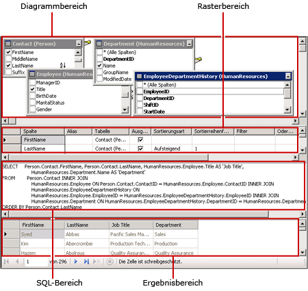
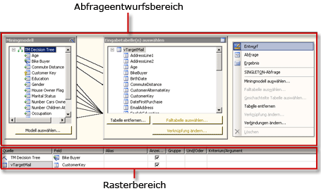
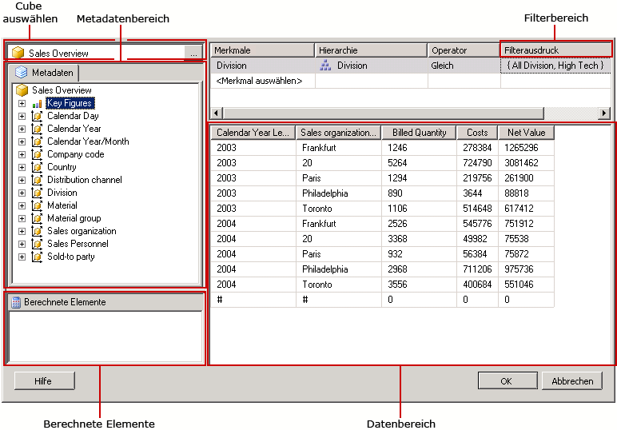
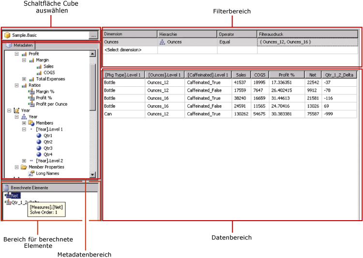

# Abfrageentwurfstools (SSRS)
  [!INCLUDE[ssRSnoversion](../../includes/ssrsnoversion-md.md)] stellt eine Reihe von Abfrageentwurfstools bereit, mit denen Sie im Berichts-Designer Datasetabfragen erstellen können. Einige Abfrage-Designer stellen alternative Modi bereit, sodass Sie entscheiden können, ob Sie im visuellen Modus oder direkt in der Abfragesprache arbeiten möchten. In diesem Thema werden die einzelnen Tools sowie die von ihnen unterstützten Datenquellen beschrieben. Folgende Tools werden in diesem Thema vorgestellt:  
  
-   [Textbasierter Abfrage-Designer](#Textbased)  
  
-   [Grafischer Abfrage-Designer](#Graphical)  
  
-   [Berichtsmodellabfrage-Designer](#Model)  
  
-   [MDX-Abfrage-Designer](#MDX)  
  
-   [DMX-Abfrage-Designer](#DMX)  
  
-   [SapNetWeaver BI Abfrage-Designer](#SAPBW)  
  
-   [MDX-Abfrage-Designer von Hyperion Essbase](#Hyperion)  
  
 Wenn Sie mit einer Berichtsserver-Projektvorlage oder einer Vorlage des Berichtsserverprojekt-Assistenten arbeiten, werden alle Abfrageentwurfstools in der Datenentwurfsumgebung von [!INCLUDE[ssBIDevStudioFull](../../includes/ssbidevstudiofull-md.md)] ausgeführt. Weitere Informationen zum Arbeiten mit Abfrage-Designern finden Sie unter [Reporting Services Query Designers](../Topic/Reporting%20Services%20Query%20Designers.md).  
  
 Ob ein bestimmter Abfrage-Designer verfügbar ist, hängt von dem Typ der Datenquelle ab, mit der Sie arbeiten.  
  
 Welche Datenquellentypen in Ihrem Bericht verfügbar sind, wird durch die auf dem Client oder Berichtsserver installierten [!INCLUDE[ssRSnoversion](../../includes/ssrsnoversion-md.md)] -Erweiterungen bestimmt. Weitere Informationen finden Sie unter [RSReportDesigner-Konfigurationsdatei](../../reporting-services/report-server/rsreportdesigner-configuration-file.md) und [RsReportServer.config-Konfigurationsdatei](../../reporting-services/report-server/rsreportserver-config-configuration-file.md).  
  
 Eine Datenverarbeitungserweiterung und der zugehörige Abfrage-Designer können sich hinsichtlich der Unterstützung für Datenquellen auf folgende Weisen unterscheiden:  
  
-   **Hinsichtlich des Abfrage-Designer-Typs.** Eine [!INCLUDE[ssNoVersion](../../includes/ssnoversion-md.md)]-Datenquelle unterstützt z. B. sowohl grafische als auch textbasierte Abfrage-Designer.  
  
-   **Hinsichtlich der Abfragesprachenvariation.** Eine Abfragesprache wie [!INCLUDE[tsql](../../includes/tsql-md.md)] kann zum Beispiel je nach Datenquellentyp in der Syntax variieren. Die [!INCLUDE[msCoName](../../includes/msconame-md.md)] [!INCLUDE[tsql](../../includes/tsql-md.md)] -Sprache und die Oracle SQL-Sprache unterscheiden sich in der Syntax für einen Abfragebefehl.  
  
-   **Hinsichtlich der Unterstützung für den Schemateil des Namens eines Datenbankobjekts.** Wenn in einer Datenquelle Schemas als Teil des Datenbankobjektbezeichners verwendet werden, muss der Schemaname als Teil der Abfrage für Namen angegeben werden, für die das Standardschema nicht verwendet wird. Beispiel: `SELECT FirstName, LastName FROM [Person].[Person]`.  
  
-   **Hinsichtlich der Unterstützung für Abfrageparameter.** Datenanbieter unterscheiden sich in der Unterstützung für Parameter. Einige Datenanbieter unterstützen benannte Parameter, beispielsweise `SELECT Col1, Col2 FROM Table WHERE <parameter identifier><parameter name> = <value>`. Einige Datenanbieter unterstützen unbenannte Parameter, beispielsweise `SELECT Col1, Col2 FROM Table WHERE <column name> = ?`. Der Parameterbezeichner kann je nach Datenanbieter unterschiedlich sein. Beispielsweise wird in [!INCLUDE[ssNoVersion](../../includes/ssnoversion-md.md)] das Symbol @ und in Oracle der Doppelpunkt (:) verwendet. Einige Datenanbieter unterstützen keine Parameter.  
  
-   **Hinsichtlich der Fähigkeit zum Importieren von Abfragen.** Sie können z. B. für eine [!INCLUDE[ssNoVersion](../../includes/ssnoversion-md.md)]-Datenquelle eine Abfrage aus einer Berichtsdefinitionsdatei (.rdl) oder aus einer SQL-Datei importieren.  
  
##   Textbasierter Abfrage-Designer  
 Der textbasierte Abfrage-Designer ist das Standardtool zum Erstellen von Abfragen für die meisten unterstützten relationalen Datenquellen, einschließlich [!INCLUDE[msCoName](../../includes/msconame-md.md)] [!INCLUDE[ssNoVersion](../../includes/ssnoversion-md.md)], Oracle, Teradata, OLE DB, XML und ODBC. Im Gegensatz zum grafischen Abfrage-Designer wird bei diesem Abfrageentwurfstools die Abfragesyntax während des Abfrageentwurfs nicht überprüft. In der folgenden Grafik wird der textbasierte Abfrage-Designer veranschaulicht.  
  
   
  
 Der textbasierte Abfrage-Designer wird zum Erstellen komplexer Abfragen unter Verwendung gespeicherter Prozeduren, zum Abfragen von XML-Daten und zum Schreiben dynamischer Abfragen empfohlen. Je nach Datenquelle können Sie möglicherweise die Schaltfläche **Als Text bearbeiten** auf der Symbolleiste aktivieren bzw. deaktivieren, um zwischen dem grafischen und dem textbasierten Abfrage-Designer zu wechseln. Weitere Informationen finden Sie unter [Benutzeroberfläche des textbasierten Abfrage-Designers](../Topic/Text-based%20Query%20Designer%20User%20Interface.md).  
  
##   Grafischer Abfrage-Designer  
 Der grafische Abfrage-Designer dient zum Erstellen oder Ändern von [!INCLUDE[tsql](../../includes/tsql-md.md)] -Abfragen, die für die relationale Datenbank ausgeführt werden. Dieses Abfrageentwurfstool wird in mehreren [!INCLUDE[msCoName](../../includes/msconame-md.md)] -Produkten und anderen [!INCLUDE[ssNoVersion](../../includes/ssnoversion-md.md)] -Komponenten verwendet. Abhängig vom Datenquellentyp unterstützt es Modi für Text, StoredProcedure und TableDirect. In der folgenden Grafik wird der grafische Abfrage-Designer veranschaulicht.  
  
   
  
 Sie können auf der Symbolleiste die Schaltfläche **Als Text bearbeiten** aktivieren oder deaktivieren, um zwischen dem textbasierten und dem grafischen Abfrage-Designer zu wechseln. Weitere Informationen finden Sie unter [Graphical Query Designer User Interface](../../reporting-services/report-data/graphical-query-designer-user-interface.md).  
  
##   Berichtsmodellabfrage-Designer  
 Der Berichtsmodellabfrage-Designer wird zum Erstellen oder Ändern von Abfragen verwendet, die für ein auf einem Berichtsserver veröffentlichtes SMDL-Berichtsmodell ausgeführt werden. Berichte, die für Modelle ausgeführt werden, unterstützen die Datendurchsuchung mittels Durchklicken. Die Abfrage bestimmt den Pfad der Datendurchsuchung zur Laufzeit. In der folgenden Grafik wird der Berichtsmodellabfrage-Designer veranschaulicht.  
  
   
  
 Wenn Sie den Berichtsmodellabfrage-Designer verwenden möchten, müssen Sie eine Datenquelle definieren, die auf ein veröffentlichtes Modell zeigt. Wenn Sie ein Dataset für die Datenquelle definieren, können Sie die Dataset-Abfrage im Berichtsmodellabfrage-Designer öffnen. Der Berichtsmodellabfrage-Designer kann im grafischen oder im textbasierten Modus verwendet werden. Sie können auf der Symbolleiste die Schaltfläche **Als Text bearbeiten** aktivieren oder deaktivieren, um zwischen dem textbasierten und dem grafischen Abfrage-Designer zu wechseln. Weitere Informationen finden Sie unter [Report Model Query Designer User Interface](../../reporting-services/report-data/report-model-query-designer-user-interface.md).  
  
##   MDX-Abfrage-Designer  
 Der MDX-Abfrage-Designer (Multidimensional Expression) dient zum Erstellen oder Ändern von Abfragen, die für eine [!INCLUDE[ssASnoversion](../../includes/ssasnoversion-md.md)]-Datenquelle mit mehrdimensionalen Cubes ausgeführt werden. In der folgenden Grafik wird der MDX-Abfrage-Designer nach dem Definieren der Abfrage und der Filter veranschaulicht.  
  
   
  
 Wenn Sie den MDX-Abfrage-Designer verwenden möchten, müssen Sie nach einer Datenquelle suchen, die einen verfügbaren Analysis Service-Cube aufweist, der gültig ist und verarbeitet wurde. Wenn Sie ein Dataset für die Datenquelle definieren, können Sie die Abfrage im MDX-Abfrage-Designer öffnen. Falls erforderlich, können Sie die MDX- und DMX-Schaltfläche auf der Symbolleiste verwenden, um zwischen MDX- und DMX-Modus zu wechseln. Weitere Informationen finden Sie unter [Analysis Services MDX Query Designer User Interface](../../reporting-services/report-data/analysis-services-mdx-query-designer-user-interface.md).  
  
##   DMX-Abfrage-Designer  
 Der Data Mining Prediction Expression (DMX)-Abfrage-Designer dient zum Erstellen oder Ändern von Abfragen, die für eine [!INCLUDE[ssASnoversion](../../includes/ssasnoversion-md.md)]-Datenquelle mit Miningmodellen ausgeführt werden. In der folgenden Grafik wird der DMX-Abfrage-Designer nach der Auswahl des Modells und der Eingabetabellen veranschaulicht.  
  
   
  
 Wenn Sie den DMX-Abfrage-Designer verwenden möchten, müssen Sie eine Datenquelle definieren, die ein gültiges, verfügbares Data Mining-Modell aufweist. Wenn Sie ein Dataset für die Datenquelle definieren, können Sie die Abfrage im DMX-Abfrage-Designer öffnen. Falls erforderlich, können Sie die MDX- und DMX-Schaltfläche auf der Symbolleiste verwenden, um zwischen MDX- und DMX-Modus zu wechseln. Nachdem Sie das Modell ausgewählt haben, können Sie Data Mining-Vorhersageabfragen erstellen, die Daten für einen Bericht bereitstellen. Weitere Informationen finden Sie unter [Analysis Services DMX Query Designer User Interface](../../reporting-services/report-data/analysis-services-dmx-query-designer-user-interface.md).  
  
##   SapNetWeaver BI Abfrage-Designer  
 Der [!INCLUDE[SAP_DPE_BW_1](../../includes/sap-dpe-bw-1-md.md)] -Abfrage-Designer dient zum Abrufen von Daten aus einer [!INCLUDE[SAP_DPE_BW_1](../../includes/sap-dpe-bw-1-md.md)] -Datenbank. Wenn Sie diesen Abfrage-Designer verwenden möchten, benötigen Sie eine [!INCLUDE[SAP_DPE_BW_1](../../includes/sap-dpe-bw-1-md.md)]-Datenquelle, bei der mindestens eine InfoCube-, MultiProvider- oder webfähige Abfrage definiert ist. In der folgenden Grafik wird der [!INCLUDE[SAP_DPE_BW_1](../../includes/sap-dpe-bw-1-md.md)] -Abfrage-Designer veranschaulicht. Weitere Informationen finden Sie unter [SAP NetWeaver BI Query Designer User Interface](../../reporting-services/report-data/sap-netweaver-bi-query-designer-user-interface.md).  
  
   
  
##   MDX-Abfrage-Designer von Hyperion Essbase  
 Der [!INCLUDE[extEssbase](../../includes/extessbase-md.md)] -Abfrage-Designer dient zum Abrufen von Daten aus [!INCLUDE[extEssbase](../../includes/extessbase-md.md)] -Datenbanken und -Anwendungen. In der folgenden Grafik wird der [!INCLUDE[extEssbase](../../includes/extessbase-md.md)] -Abfrage-Designer veranschaulicht.  
  
   
  
 Wenn Sie diesen Abfrage-Designer verwenden möchten, benötigen Sie eine [!INCLUDE[extEssbase](../../includes/extessbase-md.md)] -Datenquelle mit mindestens einer Datenbank.  
  
 Weitere Informationen finden Sie unter [Hyperion Essbase Query Designer User Interface](../../reporting-services/report-data/hyperion-essbase-query-designer-user-interface.md).  
  
## Siehe auch  
 [Reporting Services-Tools](../../reporting-services/tools/reporting-services-tools.md)   
 [Berichtsdatasets &#40;SSRS&#41;](../../reporting-services/report-data/report-datasets-ssrs.md)   
 [Datenverbindungen, Datenquellen und Verbindungszeichenfolgen &#40;Berichts-Generator und SSRS&#41;](../../reporting-services/report-data/data-connections-data-sources-and-connection-strings-report-builder-and-ssrs.md)   
 [Reporting Services-Tutorials &#40;SSRS&#41;](../../reporting-services/reporting-services-tutorials-ssrs.md)   
 [Von Reporting Services unterstützte Datenquellen &#40;SSRS&#41;](../../reporting-services/report-data/data-sources-supported-by-reporting-services-ssrs.md)   
 [Erstellen einer eingebetteten oder freigegebenen Datenquelle &#40;SSRS&#41;](../Topic/Create%20an%20Embedded%20or%20Shared%20Data%20Source%20\(SSRS\).md)  
  
  