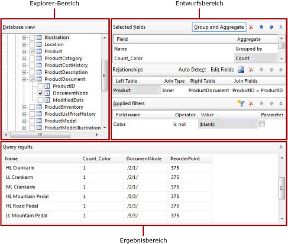
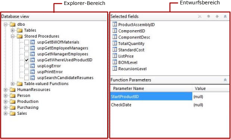

# Benutzeroberfläche des relationalen Abfrage-Designers (Berichts-Generator)
  Der Berichts-Generator und Berichts-Designer in [!INCLUDE[ssBIDevStudioFull](../../includes/ssbidevstudiofull-md.md)]bieten sowohl einen grafischen Abfrage-Designer als auch einen textbasierten Abfrage-Designer. In diesen Designern können Sie eine Abfrage erstellen, um die Daten anzugeben, die für ein Berichtsdataset aus relationalen [!INCLUDE[msCoName](../../includes/msconame-md.md)] [!INCLUDE[ssNoVersion](../../includes/ssnoversion-md.md)] - und [!INCLUDE[msCoName](../../includes/msconame-md.md)] [!INCLUDE[ssSDS](../../includes/sssds-md.md)] relational databases - und [!INCLUDE[msCoName](../../includes/msconame-md.md)] [!INCLUDE[ssDWCurrentFull](../../includes/ssdwcurrentfull-md.md)] abgerufen werden sollen. Verwenden Sie den grafischen Abfrage-Designer zum Durchsuchen von Metadaten, interaktiven Erstellen einer Abfrage sowie zum Anzeigen der Ergebnisse der Abfrage. Verwenden Sie den textbasierten Abfrage-Designer, um die Abfrage anzuzeigen, die vom grafischen Abfrage-Designer erstellt wurde, oder um eine Abfrage zu ändern. Sie können auch eine vorhandene Abfrage aus einer Datei oder einem Bericht importieren.  
  
> [!NOTE]  
>  In Berichts-Generator müssen Sie den textbasierten Abfrage-Designer verwenden, um eine Abfrage für die Oracle-, OLE DB-, ODBC- und Teradata-Datenquellentypen zu erstellen. Weitere Informationen finden Sie unter [Benutzeroberfläche des textbasierten Abfrage-Designers &#40;Report Builder&#41;](../../reporting-services/report-data/text-based-query-designer-user-interface-report-builder.md).  
  
> [!IMPORTANT]  
>  Benutzer greifen auf Datenquellen zu, wenn sie Abfragen erstellen und ausführen. Sie sollten minimale Berechtigungen für die Datenquellen gewähren, z. B. nur Leseberechtigungen.  
  
## Grafischer Abfrage-Designer  
 Im grafischen Abfrage-Designer können Sie die Datenbanktabellen und -sichten durchsuchen und interaktiv die SQL-SELECT-Anweisung erstellen, mit der die Datenbanktabellen und Spalten angegeben werden, aus denen Daten für das Dataset abgerufen werden. Sie wählen die Felder aus, die im Dataset enthalten sein sollten, und geben optional Filter an, die die Daten im Dataset begrenzen. Sie können angeben, dass Filter als Parameter verwendet werden und den Wert des Filters zur Laufzeit bereitstellen. Wenn Sie mehrere verknüpfte Tabellen auswählen, beschreibt der Abfrage-Designer die Beziehung zwischen Sätzen von zwei Tabellen.  
  
 Der grafische Abfrage-Designer ist in drei Bereiche aufgeteilt. Abhängig davon, ob die Abfrage Tabellen/Sichten oder gespeicherte Prozeduren/Tabellenwertfunktionen verwendet, ändert sich das Layout des Abfrage-Designers.  
  
> [!NOTE]  
>  [!INCLUDE[ssDWCurrentFull](../../includes/ssdwcurrentfull-md.md)] unterstützt keine gespeicherten Prozeduren oder Tabellenwertfunktionen.  
  
 Die folgende Abbildung zeigt den grafischen Abfrage-Designer, wenn er mit Tabellen oder Sichten verwendet wird.  
  
   
  
 Die folgende Abbildung zeigt den grafischen Abfrage-Designer an, wenn er mit gespeicherten Prozeduren oder Tabellenwertfunktionen verwendet wird.  
  
   
  
 Die folgende Tabelle beschreibt die Funktion jedes Bereichs.  
  
 [Datenbanksicht](#DatabaseView)  
 Zeigt eine hierarchische Sicht von Tabellen, Sichten, gespeicherten Prozeduren und Tabellenwertfunktionen an, die nach Datenbankschema angeordnet sind.  
  
 [Ausgewählte Felder](#SelectedFields)  
 Zeigt die Liste der Datenbankfeldnamen von den ausgewählten Elementen im Bereich Datenbanksicht an. Diese Felder werden zur Feldauflistung für das Berichtsdataset.  
  
 [Funktionsparameter](#FunctionParameters)  
 Zeigt die Liste der Eingabeparameter für gespeicherte Prozeduren oder Tabellenwertfunktionen im Bereich Datenbanksicht an.  
  
 [Beziehungen](#Relationships)  
 Zeigt eine Liste von Beziehungen an, die aus ausgewählten Feldern für Tabellen oder Sichten im Bereich "Datenbanksicht" abgeleitet werden, oder zeigt manuell erstellte Beziehungen an.  
  
 [Angewendete Filter](#AppliedFilters)  
 Zeigt eine Liste von Feldern und Filterkriterien für Tabellen oder Sichten in der Datenbanksicht an.  
  
 [Abfrageergebnisse](#QueryResults)  
 Zeigt Beispieldaten für das Resultset für die automatisch generierte Abfrage an.  
  
###   Bereich Datenbanksicht  
 Im Bereich Datenbanksicht werden die Metadaten für Datenbankobjekte angezeigt, zu deren Anzeige Sie berechtigt sind. Diese Berechtigung wird von der Datenquellenverbindung und den Anmeldeinformationen bestimmt. In der hierarchischen Sicht werden Datenbankobjekte nach Datenbankschema angeordnet angezeigt. Erweitern Sie den Knoten für jedes Schema, um Tabellen, Sichten, gespeicherte Prozeduren und Tabellenwertfunktionen anzuzeigen. Erweitern Sie die Tabelle oder Sicht, um die einzelnen Spalten anzuzeigen.  
  
###   Bereich Ausgewählte Felder  
 Der Bereich "Ausgewählte Felder" enthält die Felder im Berichtsdataset und die Gruppen und Aggregate, die in die Abfrage eingeschlossen werden sollen.  
  
 Die folgenden Optionen werden angezeigt:  
  
-   **Ausgewählte Felder** zeigt die Datenbankfelder an, die Sie für Tabellen oder Sichten auswählen, oder die Eingabeparameter für gespeicherte Prozeduren oder Tabellenwertfunktionen. Die Felder, die in diesem Bereich angezeigt werden, werden zur Feldauflistung für das Berichtsdataset.  
  
     Zeigen Sie die Feldauflistung für ein Berichtsdataset im Berichtsdatenbereich an. Diese Felder stellen die Daten dar, die Sie in Tabellen, Diagrammen und anderen Berichtselementen bei der Anzeige eines Berichts anzeigen können.  
  
-   **Gruppieren und aggregieren:** Schaltet die Verwendung der Gruppierung und von Aggregaten in der Abfrage um. Wenn Sie die Funktion zum Gruppieren und Aggregieren deaktivieren, nachdem Sie die Gruppierung und Aggregate hinzugefügt haben, werden sie entfernt. Der Text **(keine)**gibt an, dass Gruppierung und Aggregate nicht verwendet werden. Wenn Sie die Funktion zum Gruppieren und aggregieren wieder aktivieren, werden die vorherige Gruppierung und die vorherigen Aggregate wiederhergestellt.  
  
-   **Feld löschen** Löscht das ausgewählte Feld.  
  
#### Gruppieren und aggregieren:  
 Bei Datenbanken mit einer großen Tabelle kann die für eine Abfrage zurückgegebene Anzahl von Datenzeilen zur groß für die Verwendung in einem Bericht sein. Zudem beeinträchtigen solche Abfragen die Leistung des Netzwerks, über das die großen Datenmengen transportiert werden, und des Berichtsservers, von dem der Bericht verarbeitet wird. Um die Anzahl der Datenzeilen einzuschränken, kann die Abfrage SQL-Aggregate enthalten, die die Daten auf dem Datenbankserver zusammenfassen. SQL-Aggregate unterscheiden sich von clientseitigen Aggregaten, die beim Rendern des Berichts angewendet werden.  
  
 Aggregate stellen Zusammenfassungen der Daten bereit. Die Daten werden gruppiert, um das Aggregat zu unterstützen, das die Zusammenfassungsdaten übermittelt. Wenn Sie in der Abfrage ein Aggregat verwenden, werden die anderen von der Abfrage zurückgegebenen Felder automatisch gruppiert, und die Abfrage enthält die SQL-Klausel GROUP BY. Sie können Daten zusammenfassen, ohne ein Aggregat hinzuzufügen, indem Sie nur die Option **Gruppiert nach** in der Liste **Gruppieren und aggregieren** verwenden. Viele der Aggregate schließen eine Version ein, die das Schlüsselwort DISTINCT verwendet. Durch das Einschließen von DISTINCT werden doppelte Werte ausgeschlossen.  
  
 [!INCLUDE[msCoName](../../includes/msconame-md.md)] [!INCLUDE[ssNoVersion](../../includes/ssnoversion-md.md)] uses [!INCLUDE[tsql](../../includes/tsql-md.md)] and [!INCLUDE[msCoName](../../includes/msconame-md.md)] [!INCLUDE[ssDWCurrentFull](../../includes/ssdwcurrentfull-md.md)] uses [!INCLUDE[DWsql](../../includes/dwsql-md.md)]. Beide Dialekte der SQL-Sprache unterstützen die Klausel, das Schlüsselwort und die Aggregate, die der Abfrage-Designer bereitstellt.  
  
 Weitere Informationen zu [!INCLUDE[tsql](../../includes/tsql-md.md)] finden Sie unter [Transact-SQL-Referenz &#40;Datenbankmodul&#41;](../../t-sql/transact-sql-reference-database-engine.md) in der [!INCLUDE[ssNoVersion](../../includes/ssnoversion-md.md)]-[Onlinedokumentation](http://go.microsoft.com/fwlink/?LinkId=141687) auf msdn.microsoft.com.  
  
 In der folgenden Tabelle sind die Aggregate einschließlich einer kurzen Beschreibung aufgelistet.  
  
|Aggregat|Description|  
|---------------|-----------------|  
|Avg|Gibt den Mittelwert der Werte in einer Gruppe zurück. Implementiert das SQL AVG-Aggregat.|  
|Count|Gibt die Anzahl von Elementen in einer Gruppe zurück. Implementiert das SQL COUNT-Aggregat.|  
|Count Big|Gibt die Anzahl von Elementen in einer Gruppe zurück. Es ist das SQL COUNT_BIG-Aggregat. Der Unterschied zwischen COUNT und COUNT_BIG besteht darin, dass COUNT_BIG immer einen **bigint** -Datentypwert zurückgibt.|  
|Min|Gibt den kleinsten Wert in einer Gruppe zurück. Implementiert das SQL MIN-Aggregat.|  
|Max|Gibt den größten Wert in einer Gruppe zurück. Implementiert das SQL MAX-Aggregat.|  
|StDev|Gibt die statistische Standardabweichung aller Werte in einer Gruppe zurück. Implementiert das SQL STDEV-Aggregat.|  
|StDevP|Gibt die statistische Standardabweichung für die Auffüllung aller Werten im angegebenen Ausdruck einer Gruppe zurück. Implementiert das SQL STDEVP-Aggregat.|  
|Sum|Gibt die Summe aller Werte in der Gruppe zurück. Implementiert das SQL SUM-Aggregat.|  
|Var|Gibt die statistische Varianz aller Werte in der Gruppe zurück. Implementiert das SQL VAR-Aggregat.|  
|VarP|Gibt die statistische Varianz der Auffüllung für alle Werte in der Gruppe zurück. Implementiert das SQL VARP-Aggregat.|  
|Avg Distinct|Gibt eindeutige Durchschnittswerte zurück. Implementiert eine Kombination der AVG-Aggregation und des DISTINCT-Schlüsselworts.|  
|Count Distinct|Gibt eindeutige Anzahlwerte zurück. Implementiert eine Kombination des COUNT-Aggregats und des DISTINCT-Schlüsselworts.|  
|Count Big Distinct|Gibt eine eindeutige Anzahl von Elementen in einer Gruppe zurück. Implementiert eine Kombination des COUNT_BIG-Aggregats und des DISTINCT-Schlüsselworts.|  
|StDev Distinct|Gibt eindeutige statistische Standardabweichungen zurück. Implementiert eine Kombination des STDEV-Aggregats und des DISTINCT-Schlüsselworts.|  
|StDevP Distinct|Gibt eindeutige statistische Standardabweichungen zurück. Implementiert eine Kombination des STDEVP-Aggregats und des DISTINCT-Schlüsselworts.|  
|Sum Distinct|Gibt eindeutige Summen zurück. Implementiert eine Kombination des SUM-Aggregats und des DISTINCT-Schlüsselworts.|  
|Var Distinct|Gibt eindeutige statistische Varianzen zurück. Implementiert eine Kombination des VAR-Aggregats und des DISTINCT-Schlüsselworts.|  
|VarP Distinct|Gibt eindeutige statistische Varianzen zurück. Implementiert eine Kombination des VARP-Aggregats und des DISTINCT-Schlüsselworts.|  
  
###   Bereich Funktionsparameter  
 Der Bereich Funktionsparameter zeigt die Parameter für eine gespeicherte Prozedur oder Tabellenwertfunktion an. Die folgenden Spalten werden angezeigt:  
  
-   **Parametername** zeigt den Namen des Parameters an, der von der gespeicherten Prozedur oder Tabellenwertfunktion definiert wird.  
  
-   **Wert** wird für den Parameter verwendet, wenn die Abfrage zur Laufzeit ausgeführt wird, um Daten abzurufen, die im Bereich Abfrageergebnisse angezeigt werden sollen. Dieser Wert wird nicht verwendet, wenn der Bericht zur Laufzeit ausgeführt wird.  
  
###   Bereich Beziehungen  
 Im Bereich "Beziehungen" werden die Joinbeziehungen angezeigt. Die Beziehungen können automatisch von den Fremdschlüsseleinschränkungen erkannt werden, die aus den Datenbankmetadaten abgerufen werden, oder Sie können diese manuell erstellen.  
  
 Die folgenden Optionen werden angezeigt:  
  
-   **Automatische Erkennung** schaltet das Feature zur automatischen Erkennung um, die Beziehungen zwischen Tabellen automatisch erstellt. Wenn die automatische Erkennung aktiviert ist, erstellt der Abfrage-Designer Beziehungen aus Fremdschlüsseln in Tabellen; andernfalls müssen Sie die Beziehungen manuell erstellen. Wenn Sie Tabellen im Bereich **Datenbanksicht** auswählen, versucht die Funktion zur automatischen Erkennung automatisch, Beziehungen zu erstellen. Wenn Sie die Funktion zur automatischen Erkennung aktivieren, nachdem Sie manuell Joins erstellt haben, werden diese Joins verworfen.  
  
    > [!IMPORTANT]  
    >  Bei der Verwendung mit [!INCLUDE[ssDWCurrentFull](../../includes/ssdwcurrentfull-md.md)] werden die zum Erstellen von Joins benötigten Metadaten nicht bereitgestellt, und Beziehungen können nicht automatisch erkannt werden. Wenn die Abfrage Daten aus [!INCLUDE[ssDWCurrentFull](../../includes/ssdwcurrentfull-md.md)]abruft, müssen alle Tabellenjoins manuell erstellt werden.  
  
-   **Beziehung hinzufügen** Fügt der Liste **Beziehung** eine Beziehung hinzu.  
  
     Wenn die automatische Erkennung aktiviert ist, werden die Tabellen, von denen Spalten in der Abfrage verwendet werden, automatisch der Liste **Beziehung** hinzugefügt. Wenn die automatische Erkennung feststellt, dass zwei Tabellen verknüpft sind, wird der Spalte **Linke Tabelle** eine Tabelle und der Spalte **Rechte Tabelle** die andere Tabelle hinzugefügt, und zwischen ihnen wird ein innerer Join erstellt. Jede Beziehung generiert eine JOIN-Klausel in der Abfrage. Wenn die Tabellen nicht verknüpft sind, werden alle Tabellen in der Spalte **Linke Tabelle** aufgelistet, und die Spalte **Jointyp** gibt an, dass die Tabellen nicht mit anderen Tabellen verknüpft sind. Wenn die Funktion zur automatischen Erkennung aktiviert ist, können Sie manuell keine Beziehungen zwischen Tabellen hinzufügen, die von der automatischen Erkennung als nicht verknüpft erkannt wurden.  
  
     Wenn die Funktion zur automatischen Erkennung deaktiviert ist, können Sie zwischen Tabellen Beziehungen hinzufügen und ändern. Klicken Sie auf **Felder bearbeiten** , um die Felder anzugeben, die zum Verknüpfen der beiden Tabellen verwendet werden sollen.  
  
     Die Reihenfolge, in der die Beziehungen in der Liste **Beziehung** angezeigt werden, ist die Reihenfolge, in der die Joins in der Abfrage ausgeführt werden. Sie können die Reihenfolge von Beziehungen ändern, indem Sie sie in der Liste nach oben und unten verschieben.  
  
     Beim Verwenden von mehreren Beziehungen in einer Abfrage muss in einer der vorangehenden Beziehungen auf eine der Tabellen in jeder Beziehung, außer auf die erste, verwiesen werden.  
  
     Wenn von einer vorangehenden Beziehung auf beide Tabellen in einer Beziehung verwiesen wird, generiert die Beziehung keine separate Joinklausel; stattdessen wird der für die vorangehende Beziehung generierten Joinklausel eine Joinbedingung hinzugefügt. Der Jointyp wird von der vorangehenden Beziehung abgeleitet, von der auf die gleichen Tabellen verwiesen wurde.  
  
-   **Felder bearbeiten** Öffnet das Dialogfeld **Verknüpfte Felder bearbeiten** , in dem Sie Beziehungen zwischen Tabellen hinzufügen und ändern. Sie haben ausgewählt, dass die Felder in der rechten und linken Tabelle verknüpft werden sollen. Sie können mehrere Felder aus der linken Tabelle und aus der rechten Tabelle verknüpfen, um mehrere Joinbedingungen in einer Beziehung anzugeben. Die beiden Felder, die die linken und rechten Tabellen verknüpfen, müssen nicht über den gleichen Namen verfügen. Die Datentypen der verknüpften Felder müssen kompatibel sein.  
  
-   **Beziehung löschen:**  Löscht die ausgewählte Beziehung**.**  
  
-   **Nach oben** und **Nach oben** Verschiebt Beziehungen in der Liste **Beziehung** nach oben oder nach unten. Die Reihenfolge, in der Beziehungen in die Abfrage eingefügt werden, kann sich auf die Abfrageergebnisse auswirken. Die Beziehungen werden der Abfrage in der Reihenfolge hinzugefügt, in der sie in der Liste **Beziehung** angezeigt werden.  
  
 Die folgenden Spalten werden angezeigt:  
  
-   **Linke Tabelle** Zeigt den Namen der ersten Tabelle an, die ein Teil einer Joinbeziehung ist.  
  
-   **Jointyp** Zeigt den Typ der SQL-Anweisung JOIN an, die in der automatisch generierten Abfrage verwendet wird. Wenn eine Fremdschlüsseleinschränkung erkannt wird, wird standardmäßig INNER JOIN verwendet. Andere Jointypen können LEFT JOIN oder RIGHT JOIN sein. Wenn keiner dieser Jointypen zutrifft, wird in der Spalte **Jointyp** **Nicht verbunden**angezeigt. Für nicht verknüpfte Tabellen werden keine CROSS JOIN-Joins erstellt; stattdessen müssen Sie Beziehungen manuell erstellen, indem Sie Spalten in der linken und rechten Tabelle verknüpfen. Weitere Informationen zu JOINs finden Sie unter den JOIN-Grundlagen in der [!INCLUDE[ssNoVersion](../../includes/ssnoversion-md.md)][Books Online](http://go.microsoft.com/fwlink/?LinkId=141687) on msdn.microsoft.com.  
  
-   **Rechte Tabelle** Zeigt den Namen der zweiten Tabelle in der Joinbeziehung an.  
  
-   **Joinfelder** listet Paare von verknüpften Felder auf. Wenn eine Beziehung mehrere Joinbedingungen umfasst, werden die Joinfelderpaare durch Kommas (,) getrennt.  
  
###   Bereich Angewendete Filter  
 Im Bereich "Angewendete Filter" werden die Kriterien angezeigt, mit denen die Anzahl von Datenzeilen begrenzt wird, die zur Laufzeit abgerufen werden. In diesem Bereich angegebene Kriterien werden verwendet, um eine SQL-WHERE-Klausel zu generieren. Wenn Sie die Parameteroption auswählen, wird automatisch ein Berichtsparameter erstellt. Mit Berichtsparametern, die auf Abfrageparametern basieren, kann ein Benutzer Werte für die Abfrage angeben, um die Daten in dem Bericht zu steuern.  
  
 Die folgenden Spalten werden angezeigt:  
  
-   **Feldname** Zeigt den Namen des Felds an, für das die Kriterien angewendet werden sollen.  
  
-   **Operator** Zeigt den Vorgang an, der im Filterausdruck verwendet werden soll.  
  
-   **Wert** Zeigt den Wert an, der im Filterausdruck verwendet werden soll.  
  
-   **Parameter** Zeigt die Option an, mit der ein Abfrageparameter der Abfrage hinzugefügt werden kann. Verwenden Sie die Dataseteigenschaften, um die Beziehung zwischen Abfrageparameter und Berichtsparameter anzuzeigen.  
  
###   Bereich Abfrageergebnisse  
 Im Bereich Abfrageergebnisse werden die Ergebnisse für die automatisch generierte Abfrage angezeigt, die mit den Auswahlen in den anderen Bereichen angegeben wird. Die Spalten im Resultset entsprechen den Feldern, die Sie im Bereich Ausgewählte Felder angeben. Die Zeilendaten werden mit den Filtern begrenzt, die Sie im Bereich Angewendete Filter angeben. Falls die Abfrage Aggregate enthält, enthält das Resultset die neuen Aggregatspalten. Wenn die Spalte **Color** z. B. mit dem Count-Aggregat aggregiert wird, enthalten die Abfrageergebnisse eine neue Spalte ein. Diese Spalte erhält standardmäßig den Namen **Count_Color**.  
  
 Diese Daten stellen Werte aus der Datenquelle zum Zeitpunkt der Abfrageausführung dar. Die Daten werden nicht in der Berichtsdefinition gespeichert. Die eigentlichen Daten in dem Bericht werden bei der Verarbeitung des Berichts abgerufen.  
  
 Die Sortierreihenfolge im Resultset wird von der Reihenfolge bestimmt, in der die Daten aus der Datenquelle abgerufen werden. Die Sortierreihenfolge kann geändert werden, indem die Abfrage geändert wird oder nachdem die Daten für den Bericht abgerufen wurden.  
  
### Symbolleiste für den grafischen Abfrage-Designer  
 Die Symbolleiste des relationalen Abfrage-Designers stellt die folgenden Schaltflächen bereit, mit denen Sie eine Abfrage angeben oder die Ergebnisse der Abfrage anzeigen können.  
  
|Schaltfläche|Description|  
|------------|-----------------|  
|**Als Text bearbeiten**|Wechselt zum textbasierten Abfrage-Designer, um die automatisch generierte Abfrage anzuzeigen oder die Abfrage zu ändern.|  
|**Importieren**|Importiert eine vorhandene Abfrage aus einer Datei oder einem Bericht. Die Dateitypen SQL und RDL werden unterstützt.|  
|**Abfrage ausführen**|Führen Sie die Abfrage aus. Das Resultset wird im Bereich mit den Abfrageergebnissen angezeigt.|  
  
## Grundlegendes zu automatisch generierten Abfragen  
 Wenn Sie Tabellen und Spalten oder gespeicherte Prozeduren und Sichten im Bereich Datenbanksicht auswählen, ruft der Abfrage-Designer die zugrunde liegenden Primärschlüssel- und Fremdschlüsselbeziehungen aus dem Datenbankschema ab. Der Abfrage-Designer erkennt Beziehungen zwischen zwei Tabellen, indem er diese Beziehungen analysiert, und fügt der Abfrage Joins hinzu. Sie können die Abfrage dann ändern, indem Sie Gruppen und Aggregate hinzufügen, Beziehungen hinzufügen oder ändern und Filter hinzufügen. Klicken Sie auf **Als Text bearbeiten**, um den Abfragetext anzuzeigen, der die Spalten, aus denen Daten abgerufen werden sollen, die Joins zwischen Tabellen und alle Gruppen oder Aggregate anzeigt.  
  
## Textbasierter Abfrage-Designer  
 Verwenden Sie zur optimalen Steuerung der Abfrage den textbasierten Abfrage-Designer. Wenn Sie zum textbasierten Abfrage-Designer wechseln möchten, klicken Sie auf der Symbolleiste auf **Als Text bearbeiten**. Nachdem Sie eine Abfrage im textbasierten Abfrage-Designer bearbeitet haben, können Sie den relationalen Abfrage-Designer nicht mehr verwenden. Die Abfrage wird dann immer im textbasierten Abfrage-Designer geöffnet. Weitere Informationen finden Sie unter [Benutzeroberfläche des textbasierten Abfrage-Designers &#40;Report Builder&#41;](../../reporting-services/report-data/text-based-query-designer-user-interface-report-builder.md).  
  
## Siehe auch  
 [Abfrage-Designer &#40;Berichts-Generator&#41;](http://msdn.microsoft.com/library/553f0d4e-8b1d-4148-9321-8b41a1e8e1b9)  
  
  
