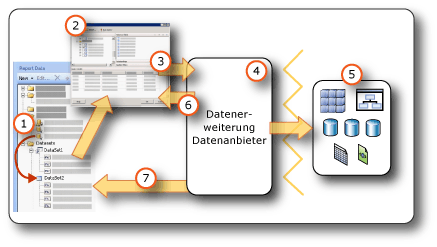

# Erstellen von Berichten zu eingebetteten und freigegebenen Datasets (Berichts-Generator und SSRS)
  Ein Dataset gibt die Daten aus einer Datenverbindung an, die Sie verwenden möchten. Ein Dataset basiert auf einer Datenverbindung, die im Bericht als eine eingebettete Datenquelle oder ein Verweis auf eine freigegebene Datenquelle auf einem Berichtsserver gespeichert wurde. Das Dataset enthält eine Abfrage, die einen Satz von Feldern angibt. Wie Sie diese Felder in die Entwurfsoberfläche ziehen, erstellen Sie Ausdrücke, die die tatsächlichen Daten ergeben, wenn der Bericht ausgeführt wird.  
  
 Die folgenden beiden Datasettypen stehen zur Verfügung:  
  
-   **Freigegebenes Dataset.** Ein freigegebenes Dataset wird auf dem Berichtsserver definiert. Sie können zum Server wechseln, um ein freigegebenes Dataset zu erstellen oder ein vordefiniertes auszuwählen, das dem Bericht hinzugefügt werden soll. Verwenden Sie ein freigegebenes Dataset, um eine Abfrage bereitzustellen, die in mehreren Berichten verwendet werden kann. Freigegebene Datasets werden auf dem Berichtsserver gespeichert und separat von Berichten oder freigegebenen Datenquellen verwaltet. Ein Berichtsserveradministrator kann die Abfrage z. B. aktualisieren, damit Benutzer von einer verbesserten Indizierung oder einer anderweitigen Optimierung der Abfrageleistung profitieren können.  
  
-   **Eingebettetes Dataset.** Ein eingebettetes Datasets wird nur von dem Bericht definiert, in den es eingebettet ist, und kann nur von diesem verwendet werden. Verwenden Sie ein eingebettetes Dataset, wenn Sie Daten aus einer externen Datenquelle abrufen möchten, die nur in einem Bericht verwendet werden sollen. Eingebettete Datasets sind nützlich, wenn Sie eine Abfrage erstellen möchten, die über keine anderen Abhängigkeiten verfügt, und die Sie nicht für mehrere Berichte verwenden müssen.  
  
 Ein Dataset enthält außerdem Parameter, Filter und Datenoptionen, mit denen bestimmte Zeicheneigenschaften angegeben werden, z. B. Groß- oder Kleinschreibung, Kanatyp, Breite, Akzent und Sortierungsinformationen.  
  
   
  
1.  **Datasets im Berichtsdatenbereich:** Ein Dataset wird im Berichtsdatenbereich angezeigt, nachdem Sie ein eingebettetes Dataset erstellt oder ein freigegebenes Dataset hinzugefügt haben. Ein Dataset basiert auf einer Datenquelle.  
  
2.  **Abfrage-Designer:** Wenn Sie eine Datasetabfrage entwerfen, wird der dem Datenquellentyp zugeordnete Abfrage-Designer geöffnet.  
  
3.  **Abfragebefehl:** Der Abfrage-Designer unterstützt Sie beim Erstellen eines Abfragebefehls. Die Befehlssyntax wird durch den Datenanbieter bestimmt.  
  
4.  **Datenerweiterung/Datenanbieter:** Die Verbindung mit den Daten kann über mehrere Datenzugriffsebenen hergestellt werden.  
  
5.  **Externe Datenquellen:** Rufen Sie Daten aus relationalen Datenbanken, mehrdimensionalen Datenbanken, SharePoint-Listen, Webdiensten oder Berichtsmodellen ab.  
  
6.  **Abfrageergebnisse:** Sie können die Abfrage ausführen und ein Beispielresultset anzeigen. Zum Ausführen einer Abfrage benötigen Sie Entwurfszeitanmeldeinformationen.  
  
7.  **Metadaten aus einem Schema:** Der Datenanbieter führt getrennt von der Abfrage einen Schemaabfragebefehl aus, um Metadaten für die Datasetfeldauflistung abzurufen. Eine [!INCLUDE[tsql](../../includes/tsql-md.md)] **SELECT**-Anweisung gibt z.B. die Spaltennamen für eine Datenbanktabelle zurück. Erweitern Sie das Dataset im Berichtsdatenbereich, um die Datasetfeldauflistung anzuzeigen.  
  
 Daten können auch mithilfe von vordefinierten freigegebenen Datasets und Berichtsteilen in einen Bericht eingeschlossen werden. Diese Elemente verfügen bereits über die erforderlichen Informationen zur Datenverbindung. Weitere Informationen finden Sie unter [Berichtsdatasets &#40;SSRS&#41;](../../reporting-services/report-data/report-datasets-ssrs.md) und [Berichtsteile &#40;Berichts-Generator und SSRS&#41;](../../reporting-services/report-design/report-parts-report-builder-and-ssrs.md).  
  
 Weitere Informationen zu integrierten Datenquellentypen und Datenerweiterungen finden Sie unter [Hinzufügen von Daten aus externen Datenquellen &#40;SSRS&#41;](../../reporting-services/report-data/add-data-from-external-data-sources-ssrs.md).  
  
> [!NOTE]  
>  [!INCLUDE[ssRBRDDup](../../includes/ssrbrddup-md.md)]  
  
##  <a name="Overview"></a> Grundlegendes zu Berichtsdatasets und Abfragen  
 Ein Berichtsdataset enthält einen Abfragebefehl, der für die externe Datenquelle ausführt wird und angibt, welche Daten abgerufen werden sollen. Zum Erstellen des Abfragebefehls verwenden Sie den Abfrage-Designer, der mit der Datenerweiterung für die externe Datenquelle verknüpft ist. Im Abfrage-Designer können Sie den Abfragebefehl ausführen und ein Resultset anzeigen. Das Resultset ist ein rechteckiges Rowset, das Spaltennamen und Zeilen mit der gleichen Anzahl von Werten in jeder Zeile hat. Hierarchische Daten, die auch als *unregelmäßige Hierarchien*bezeichnet werden, werden nicht unterstützt. Die Spaltennamen werden als eine Liste von Datasetfeldern in der Berichtsdefinition gespeichert.  
  
 Nachdem Sie dem Bericht Datasets hinzugefügt haben, ziehen Sie Felder aus den entsprechenden Feldauflistungen im Berichtsdatenbereich in Tabellen, Diagramme und andere Berichtselemente, die Sie zum Entwerfen des Berichtslayouts verwenden. Weitere Informationen zum Arbeiten mit Feldern finden Sie unter [Datasetfeld-Sammlung &#40;Berichts-Generator und SSRS&#41;](../../reporting-services/report-data/dataset-fields-collection-report-builder-and-ssrs.md).  
  
### Grundlegendes zu Daten aus Berichtsdatasets  
 Je nach Datenerweiterung kann ein Berichtsdataset die folgenden Datentypen umfassen:  
  
-   Ein Resultset aus einer relationalen Datenbank, das aus der Ausführung von Datenbankbefehlen, gespeicherten Prozeduren oder benutzerdefinierten Funktionen resultieren kann. Wenn bei einer einzelnen Abfrage mehrere Resultsets abgerufen werden, wird nur das erste Resultset verarbeitet, alle weiteren Resultsets werden ignoriert. Wenn Sie z. B. im textbasierten Abfrage-Designer die folgende Abfrage ausführen, wird nur das Resultset für `Production.Product` im Ergebnisbereich angezeigt:  
  
    ```  
    SELECT ProductID FROM Production.Product  
    GO  
    SELECT ContactID FROM Person.Contact  
    ```  
  
-   Ein vereinfachtes Rowset von mehrdimensionalen Datenquellen, die das XMLA (XML for Analysis)-Protokoll verwenden. Einige Datenanbieter stellen zusätzliche Zellen- und Dimensionseigenschaften aus der Datenquelle bereit, die Sie im Resultset nicht sehen können, im Bericht jedoch verfügbar sind.  
  
-   Ein vereinfachtes Resultset aus XML-Datenquellen, u. a. XML-Elemente, deren Attribute und deren untergeordnete Elemente.  
  
-   Ein Resultset von einem beliebigen registrierten und konfigurierten [!INCLUDE[dnprdnshort](../../includes/dnprdnshort-md.md)] -Datenanbieter.  
  
-   Daten aus einem Berichtsmodell, das für eine bestimmte Datenquelle entworfen wurde, mit vordefinierten Entitäten, Entitätenbeziehungen und Feldern. Weitere Informationen finden Sie unter "Verwenden von Berichtsmodellen als Datenquellen" in der [Reporting Services-Dokumentation](http://go.microsoft.com/fwlink/?linkid=121312) in der SQL Server-Onlinedokumentation.  
  
 Wenn der Bericht zur Laufzeit verarbeitet wird, kann das tatsächlich für eine Abfrage zurückgegebene Resultset null oder mehr Zeilen enthalten. Zudem ist es möglich, dass die in der Abfrage definierten Spalten in der Datenquelle fehlen. NULL-Werte aus der Datenquelle werden dem [!INCLUDE[dnprdnshort](../../includes/dnprdnshort-md.md)]-Wert **System.DBNull.Value** zugeordnet.  
  
 Weitere Informationen zu Datasetfeldern finden Sie unter [Datasetfeld-Sammlung &#40;Berichts-Generator und SSRS&#41;](../../reporting-services/report-data/dataset-fields-collection-report-builder-and-ssrs.md).  
  
### Datasetabfrage  
 Wenn Sie zur Entwurfszeit eine Datasetabfrage in einem Abfrage-Designer ausführen, wird ein Rowset mit den Beispieldaten angezeigt, das aus der Datenquelle stammt. Wenn ein Benutzer zur Laufzeit den Bericht angezeigt, führt die Datasetabfrage möglicherweise zu anderen Werten, da die Daten in der Datenquelle geändert wurden. Bei jeder Berichtsverarbeitung werden möglicherweise neue Daten angezeigt.  
  
 Beim Definieren der einzelnen Datasets öffnet der Berichts-Generator den Abfrage-Designer, der dem Typ der Datenquelle entspricht, um Sie beim Entwerfen der Abfragen zu unterstützen. Wenn Sie z. B. eine Abfrage für Daten aus einer relationalen SQL Server-Datenbank definieren möchten, wird in den Tabellen-/Matrix-, Diagramm- und Karten-Assistenten eine einfache grafische Benutzeroberfläche zum Erstellen der Abfrage geöffnet. Sie müssen nur noch die gewünschten Felder für das Dataset auswählen.  
  
 In einem Abfrage-Designer können Sie wie folgt vorgehen:  
  
-   Schalten Sie zwischen grafischer und textbasierter Abfragesicht um. Mit der grafischen Abfragesicht können Sie Schemas, Tabellen, Sichten und gespeicherte Prozeduren der Datenquelle anzeigen. Verwenden Sie die textbasierte Sicht, um eine Abfrage einzugeben oder eine vorhandene Abfrage einzufügen bzw. anzuzeigen. Dies wird hauptsächlich für komplexe Abfragen verwendet, die nicht im grafischen Abfrage-Designer angezeigt werden können. Sie können z. B. eine Abfrage aus einer [!INCLUDE[tsql](../../includes/tsql-md.md)] (.sql)-Datei, einem anderen Bericht auf dem Berichtsserver oder einer Berichtsdefinitionsdatei (.rdl) aus einer Dateifreigabe importieren.  
  
-   Führen Sie die Abfrage aus, um die Daten anzuzeigen. Die Abfrage gibt ein Resultset zurück. Die Spalten im Resultset werden zur Feldauflistung des Datasets. Die Zeilen des Ergebnisses werden zu den Daten des Datasets. Sie können mit der Abfrage arbeiten, bis Sie die gewünschten Spalten erhalten.  
  
-   Fügen Sie Abfrageparameter hinzu, um nur die gewünschten Daten für den Bericht abzurufen. Abfrageparameter generieren automatisch entsprechende Berichtsparameter. Bei einer Berichtsmodell-Datenquelle generiert der von Ihnen angegebene Filter automatisch einen entsprechenden Berichtsparameter. Mit Berichtsparametern können Benutzer die Berichtsdaten angeben, die beim Ausführen des Berichts angezeigt werden sollen. Der Benutzer wählt z. B. aus, für welche Produktkategorien Daten angezeigt werden sollen. Wenn der Bericht ausgeführt wird, werden nur die Daten für diese Produktkategorien angezeigt.  
  
-   Importieren einer vorhandenen Abfrage aus einem anderen Bericht.  
  
 Abfrage-Designer können abhängig vom Datenquellentyp einen grafischen Modus oder einen Textmodus bereitstellen. Wenn Sie den Textmodus auswählen, müssen Sie die entsprechende Abfragesyntax für die Datenquelle verwenden.  
  
 Wenn Sie ein Berichtsdataset definieren, können Sie Dateneigenschaften in der Abfrage festlegen oder die vom Datenanbieter festgelegten Standardwerte annehmen. Sie können den Datentyp mithilfe einer der folgenden Vorgehensweisen ändern:  
  
-   Schreiben Sie die Datasetabfrage um, sodass ein Feld ausdrücklich in einen anderen Datentyp konvertiert wird.  
  
-   Bearbeiten Sie das Feld im Dataset, und stellen Sie ein benutzerdefiniertes Format bereit.  
  
-   Erstellen Sie auf Grundlage eines Datenbankfelds ein neues benutzerdefiniertes Feld, und stellen Sie ein benutzerdefiniertes Format bereit.  
  
 Weitere Informationen finden Sie unter [Datasetfeld-Sammlung &#40;Berichts-Generator und SSRS&#41;](../../reporting-services/report-data/dataset-fields-collection-report-builder-and-ssrs.md).  
  
### Importieren vorhandener Abfragen für ein Dataset  
 Wenn Sie ein Dataset erstellen, können Sie eine neue Abfrage erstellen oder eine vorhandene Abfrage aus einer Datei oder aus einem anderen Bericht importieren. Wenn Sie eine Abfrage aus einem anderen Bericht importieren, können Sie die zu importierende Abfrage in der Liste der Datasets im Bericht auswählen.  
  
 Nur die Dateitypen SQL und RDL werden unterstützt. Multidimensional Expression-Abfragen (MDX), Data Mining Prediction-Abfragen (DMX) und Modellabfragen (SMQL) können nur mit dem entsprechenden Abfrage-Designer generiert werden.  
  
##  <a name="Compare"></a> Vergleichen und Erstellen von freigegebene Datasets und eingebetteten Datasets  
 Ein eingebettetes Dataset wird in einem Bericht oder einem veröffentlichten Berichtsteil definiert. Änderungen am eingebetteten Dataset wirken sich nur auf diesen Bericht oder diesen Berichtsteil aus.  
  
 Ein freigegebenes Dataset wird auf einem Berichtsserver oder einer SharePoint-Website definiert, basiert auf einer freigegebenen Datenquelle und kann von mehreren Berichten und Berichtsteilen verwendet werden. Änderungen an der Definition eines freigegebenen Datasets wirken sich auf alle Berichte und alle Berichtsteile, die es verwenden, aus.  
  
 Wenn Sie einem Bericht ein freigegebenes Dataset hinzufügen, wird die Datasetfeldauflistung auf die aktuelle Definition auf dem Berichtsserver aktualisiert. Sie empfangen keine Updatebenachrichtigungen, wenn Änderungen auf dem Berichtsserver vorgenommen werden. Um eine lokale Kopie der Feldauflistung mit Änderungen zu synchronisieren, die an der Definition des freigegebenen Datasets auf dem Berichtsserver vorgenommen wurden, müssen Sie die lokale Feldauflistung aktualisieren. Weitere Informationen finden Sie unter [Hinzufügen, Bearbeiten und Aktualisieren von Feldern im Berichtsdatenbereich &#40;Berichts-Generator und SSRS&#41;](../../reporting-services/report-data/add-edit-refresh-fields-in-the-report-data-pane-report-builder-and-ssrs.md).  
  
 Veröffentlichte Berichtselemente enthalten die eingebetteten und freigegebenen Datasets, von denen sie abhängen. Weitere Informationen finden Sie unter [Berichtsteile und Datasets in Berichts-Generator](../../reporting-services/report-data/report-parts-and-datasets-in-report-builder.md).  
  
 Der Unterschied zwischen den eingebetteten und den freigegebenen Datenquellen ist die Art der Erstellung, Speicherung und Verwaltung. In der folgenden Tabelle werden die Unterschiede zwischen eingebetteten und freigegebenen Datenquellen zusammengefasst:  
  
|Description|Eingebettet<br /><br /> Datenquelle|Shared<br /><br /> Datenquelle|  
|-----------------|------------------------------|----------------------------|  
|Die Datenverbindung ist in die Berichtsdefinition eingebettet.|||  
|Der Zeiger auf die Datenverbindung auf dem Berichtsserver ist in die Berichtsdefinition eingebettet.|||  
|Wird auf dem Berichtsserver verwaltet.|||  
|Ist für freigegebene Datasets erforderlich.|||  
|Ist für Komponenten erforderlich.|||  
  
 Im Berichts-Designer können Sie freigegebene Datasets als Teil eines Berichtsprojekts erstellen und steuern, ob sie auf einem Berichtsserver bereitgestellt werden sollen. Sie können nicht zu einem Berichtsserver navigieren und ein freigegebenes Dataset auswählen, das dem Bericht hinzugefügt werden soll.  
  
 In Berichts-Generator können Sie folgende Aufgaben ausführen:  
  
-   Um ein freigegebenes Dataset zu erstellen, verwenden Sie die Entwurfsansicht für freigegebene Datasets. Sie können es auf einem Berichtsserver oder einer SharePoint-Website speichern, um des für andere Berichte freizugeben. Sie können auch zum Berichtsserver navigieren und das vorhandene freigegebene Dataset bearbeiten. In dieser Ansicht können Sie eine Abfrage erstellen und alle Datasetoptionen festlegen. Weitere Informationen finden Sie unter [Freigegebene Dataset-Entwurfsansicht &#40;Berichts-Generator&#41;](../../reporting-services/report-builder/shared-dataset-design-view-report-builder.md).  
  
-   Öffnen Sie den Berichts-Generator in der Berichtsentwurfsansicht, um dem Bericht ein freigegebenes Dataset hinzuzufügen. Wechseln Sie von einem Assistenten oder dem Berichtsdatenbereich zum Berichtsserver, und wählen Sie das freigegebene Dataset aus, das dem Bericht hinzugefügt werden soll. In dieser Ansicht können außer dem Hinzufügen von Feldern keine Änderungen an der Abfrage vorgenommen werden. Sie können andere Datenoptionen überschreiben und Filter hinzufügen. Es ist nicht möglich, Filter zu entfernen.  
  
 In der folgenden Tabelle werden die Eigenschaften verglichen, die für die Definition des freigegebenen Datasets auf dem Berichtsserver und die Instanz des freigegebenen Datasets in der Berichtsdefinition konfiguriert werden können.  
  
|Eigenschaft|Konfigurationshinweise für die Definition|Konfigurationshinweise für die Instanz|  
|--------------|--------------------------------------------|------------------------------------------|  
|Abfragetext|Die Abfrage kann konfiguriert werden, einschließlich der Definition als Ausdruck.|Die Abfrage kann nicht geändert werden.|  
|Abfrageparameter|Auf Berichtsparameter kann nicht verwiesen werden.<br /><br /> Schließt Standardwerte ein.<br /><br /> Schließt eine Markierung für den Schreibschutz ein.|Parameter, die in der Definition nicht als schreibgeschützt markiert sind, können konfiguriert werden.|  
|Filter|Filter können definiert werden.|Datasetfilter, die Teil der Definition sind, können nicht angezeigt oder geändert werden.<br /><br /> Zusätzliche Filter können erstellt werden.|  
|Datenquelle|Muss eine freigegebene Datenquelle sein.|Die Datenquelle kann nicht geändert werden.|  
|Felder|Felder im Abfragebefehl<br /><br /> Berechnete Felder sind kein Teil der Datasetdefinition.|Felder anzeigen, aber nicht ändern<br /><br /> Die Feldauflistung ist statisch und basiert auf der Abfrage, die beim Hinzufügen des freigegebenen Datasets zum Berichts vorlag. Klicken Sie im Dialogfeld **Dataseteigenschaften** auf **Felder aktualisieren** , um die Auflistung zu aktualisieren. Die tatsächliche Feldauflistung entspricht dem Rückgabeergebnis der aktuellen Abfrage in der Definition.<br /><br /> Berechnete Felder hinzufügen|  
|Dataset|Datenoptionen wie z. B. die Berücksichtigung der Groß- und Kleinschreibung|Datenoptionen in der Instanz können überschrieben werden.|  
  
 Weitere Informationen zum Erstellen von Datasets finden Sie unter [Erstellen eines freigegebenen Datasets oder eingebetteten Datasets &#40;Berichts-Generator und SSRS&#41;](../../reporting-services/report-data/create-a-shared-dataset-or-embedded-dataset-report-builder-and-ssrs.md) und [Reporting Services-Tools](../../reporting-services/tools/reporting-services-tools.md) in der [Reporting Services-Dokumentation](http://go.microsoft.com/fwlink/?linkid=121312) der SQL Server-Onlinedokumentation.  
  
##  <a name="SortGroupFilter"></a> Filtern, Sortieren und Gruppieren von Daten in einem Dataset  
 Die Daten in einem Dataset stammen aus einer externen Datenquelle, für die ein Abfragebefehl ausgeführt wurde. Die Abfragebefehlssyntax für eine Datenerweiterung bestimmt, ob Daten sortiert oder gruppiert werden können. Das Sortierend und Gruppieren findet in der Abfrage statt, bevor die Daten für einen Bericht abgerufen werden. Das Filtern findet statt, nachdem die Daten für einen Bericht abgerufen wurden.  
  
 Weitere Informationen finden Sie unter [Filtern, Gruppieren und Sortieren von Daten &#40;Berichts-Generator und SSRS&#41;](../../reporting-services/report-design/filter-group-and-sort-data-report-builder-and-ssrs.md).  
  
### Filtern von Daten in einem Dataset  
 Filter sind Teil der Datasetdefinition in einem Bericht. Geben Sie mithilfe von Datasetfiltern an, welche Daten aus welchem Dataset in einen Bericht einbezogen werden sollen. Wenn Sie Filter für ein Dataset angeben, zeigen alle Datenbereiche, die auf dem Dataset basieren, nur die Daten an, die vom Datasetfilter gefiltert werden.  
  
 Filter sind Teil der Definition eines freigegebenen Datasets. Filter freigegebener Datasets wirken sich auf alle Berichte aus, die das freigegebene Dataset enthalten. Nachdem Sie dem Bericht ein freigegebenes Dataset oder eine Komponente mit einem abhängigen freigegebenen Dataset hinzugefügt haben, können Sie weitere Datasetfilter erstellen. Von Ihnen erstellte Filter werden nur in Ihrem Bericht verwendet, sie sind nicht Teil der Definition des freigegebenen Datasets auf dem Berichtsserver.  
  
 Sie können weitere Filter für einen Datenbereich oder eine Datenbereichsgruppe festlegen. Sie können auch eine Kombination von Parametern und Filtern verwenden, um Benutzern zu ermöglichen, die Daten auszuwählen, die sie in einem Bericht anzeigen möchten. Weitere Informationen finden Sie unter [Berichtsparameter &#40;Berichts-Generator und Berichts-Designer&#41;](../../reporting-services/report-design/report-parameters-report-builder-and-report-designer.md).  
  
### Sortieren von Daten in einem Dataset  
 In einem Dataset ist die Reihenfolge der Daten die Reihenfolge, in der sie aus der externen Datenquelle abgerufen werden. Dies ist die gleiche Reihenfolge, die Sie sehen, wenn Sie die Abfrage im Abfrage-Designer ausführen. Wenn die Abfragebefehlssyntax das Sortieren unterstützt, können Sie die Abfrage so bearbeiten, dass die Daten an der Quelle sortiert werden, bevor sie als Berichtsdaten zurückgegeben werden. Bei einer [!INCLUDE[tsql](../../includes/tsql-md.md)] -Abfrage steuert z. B. die ORDER BY-Anweisung die Sortierreihenfolge.  
  
 Um Daten zu sortieren, nachdem sie an den Bericht zurückgegeben wurden, definieren Sie Sortierungsausdrücke für Datenbereiche und Datenbereichsgruppen. Weitere Informationen finden Sie im Thema über den jeweiligen Datenbereichstyp, z.B. [Tabellen, Matrizen und Listen &#40;Berichts-Generator und SSRS&#41;](../../reporting-services/report-design/tables-matrices-and-lists-report-builder-and-ssrs.md).  
  
 Sie können auch eine Kombination von Parametern und Sortierungsausdrücken verwenden, um Benutzern zu ermöglichen, die Sortierreihenfolge der Daten in einem Bericht auszuwählen. Weitere Informationen finden Sie unter [Berichtsparameter &#40;Berichts-Generator und Berichts-Designer&#41;](../../reporting-services/report-design/report-parameters-report-builder-and-report-designer.md).  
  
### Gruppieren von Daten in einem Dataset  
 Sie können keine Daten in einem Dataset gruppieren. Um Daten in einem Dataset zu aggregieren, können Sie den Abfragebefehl so bearbeiten, dass Aggregate berechnet werden, bevor die Daten für einen Bericht abgerufen werden. Diese Werte werden als *Serveraggregate*bezeichnet. Verwenden Sie in Ausdrücken die Aggregatfunktion, um diese Werte als vorausberechnete Aggregate zu identifizieren. Weitere Informationen finden Sie unter [Aggregatfunktion &#40;Berichts-Generator und SSRS&#41;](../../reporting-services/report-design/aggregate-function-report-builder-and-ssrs.md).  
  
##  <a name="Parameters"></a> Verwenden von Parametern und Datasets  
 Für eine eingebettete Datasetabfrage mit Abfragevariablen werden automatisch entsprechende Abfrageparameter und entsprechende Berichtsparameter erstellt. Beim Ausführen des Berichts wird der Wert des Berichtsparameters mit dem Datasetabfrageparameter verknüpft. Auf diese Weise schließt der Abfragebefehl, der für die externe Datenquelle ausgeführt wird, die Werte ein, die für Berichtsparameter angegeben werden. Berichtsparameter ermöglichen einem Benutzer, die Daten auszuwählen, die im Bericht angezeigt werden sollen. Auf der Seite [Dataseteigenschaften (Dialogfeld), Parameter &#40;Berichts-Generator&#41;](../Topic/Dataset%20Properties%20Dialog%20Box,%20Parameters%20\(Report%20Builder\).md) können Sie sich ansehen, wie Abfrage- und Berichtsparameter miteinander verknüpft sind.  
  
 Bei einem freigegebenen Dataset sind Abfrageparameter Teil der Definition des freigegebenen Datasets, die auf dem Berichtsserver unabhängig von einem Bericht verwaltet werden kann. In der folgenden Liste ist die Unterstützung für Abfrageparameterwerte aufgeführt:  
  
-   Kann auf einem Ausdruck basieren.  
  
-   Kann Standardwerte einschließen.  
  
-   Kann als schreibgeschützt festgelegt werden. Der Schreibschutzparameter kann in einer Instanz des freigegebenen Datasets in einem Bericht nicht geändert werden.  
  
-   Kann keine Verweise auf den integrierten Auflistungsparameter beinhalten, der Berichtsparameter darstellt.  
  
 Navigieren Sie zum Konfigurieren von Abfrageparameterwerten für ein freigegebenes Dataset im Dataset-Entwurfsmodus zu einem freigegebenen Dataset auf dem Berichtsserver, öffnen Sie es, und legen Sie auf der Seite [Dataseteigenschaften (Dialogfeld), Parameter &#40;Berichts-Generator&#41;](../Topic/Dataset%20Properties%20Dialog%20Box,%20Parameters%20\(Report%20Builder\).md) Optionen fest. Weitere Informationen finden Sie unter [Erstellen eines freigegebenen Datasets oder eingebetteten Datasets &#40;Berichts-Generator und SSRS&#41;](../../reporting-services/report-data/create-a-shared-dataset-or-embedded-dataset-report-builder-and-ssrs.md).  
  
 Bei einigen mehrdimensionalen Datenquellen, z. B. [!INCLUDE[ssASnoversion](../../includes/ssasnoversion-md.md)], haben Sie im grafischen Abfrage-Designer die Möglichkeit, Abfragefilter anzugeben und eine Option zum Erstellen eines entsprechenden Abfrageparameters auszuwählen. Wenn Sie die Parameteroption auswählen, erstellt die Datenerweiterung automatisch ein separates Berichtsdataset, um verfügbare Werte für eine Dropdownliste für diesen Parameter bereitzustellen. Standardmäßig werden diese verborgenen Datasets nicht im Berichtsdatenbereich angezeigt.  
  
 Mit Abfrageparametern verknüpfte Berichtsparameter ermöglichen das Filtern von Daten, bevor die Daten von der externen Datenquelle zurückgegeben werden. Sie können die Daten im Bericht auch filtern, indem Sie Filter erstellen, die Teil der Berichtsdefinition sind. Weitere Informationen finden Sie unter [Filtern, Gruppieren und Sortieren von Daten &#40;Berichts-Generator und SSRS&#41;](../../reporting-services/report-design/filter-group-and-sort-data-report-builder-and-ssrs.md).  
  
### Anzeigen ausgeblendeter Datasets  
 Wenn Sie für einige mehrdimensionale Datenquellen eine parametrisierte Abfrage erstellen, werden Datasets, die gültige Werte für den Parameter bereitstellen, automatisch erstellt. Bei einigen Abfrage-Designern führen Sie dies durch, indem Sie Filter festlegen und anschließend die Option zum Erstellen von Parametern auswählen. Standardmäßig werden diese Datasets nicht im Berichtsdatenbereich angezeigt, sie können jedoch eingeblendet werden. Weitere Informationen finden Sie unter [Anzeigen von ausgeblendeten Datasets für Parameterwerte für mehrdimensionale Daten &#40;Berichts-Generator und SSRS&#41;](../../reporting-services/report-data/show hidden datasets for parameter values - multidimensional data.md).  
  
##  <a name="Maps"></a> Verwenden von Karten und Datasets  
 Wenn Sie eine Karte in den Bericht einschließen, müssen Sie räumliche Daten bereitstellen. Räumliche Daten können aus einem Berichtsdataset, aus einer Karte im Kartenkatalog oder aus ESRI-Shape-Dateien stammen. Räumliche Daten aus einem Bericht oder aus einer ESRI-Shape-Datei werden im Berichtsdatenbereich nicht als Dataset angezeigt. Weitere Informationen finden Sie unter [Karten &#40;Berichts-Generator und SSRS&#41;](../../reporting-services/report-design/maps-report-builder-and-ssrs.md).  
  
##  <a name="Multiple"></a> Anzeigen von Daten aus mehreren Datasets  
 Ein Bericht enthält i. d. R. mehr als ein Dataset. In der folgenden Liste ist die Verwendung von Datasets in einem Bericht beschrieben:  
  
-   Sie zeigen die Daten aus jedem Dataset mithilfe eines separaten Datenbereichs an. Weitere Informationen finden Sie unter [Datenbereiche und Karten &#40;Berichts-Generator und SSRS&#41;](../../reporting-services/report-design/data-regions-and-maps-report-builder-and-ssrs.md).  
  
-   Sie können mit einem Dataset mehr als einen Datenbereich verknüpfen und mehrere Sichten derselben Daten bereitzustellen. Weitere Informationen finden Sie unter [Verknüpfen mehrerer Datenbereiche mit einem Dataset &#40;Berichts-Generator und SSRS&#41;](../../reporting-services/report-design/linking-multiple-data-regions-to-the-same-dataset-report-builder-and-ssrs.md).  
  
-   Mithilfe von Datasets können Sie eine Dropdownliste verfügbarer Werte oder Standardwerte für einen Berichtsparameter bereitstellen. Weitere Informationen finden Sie unter [Berichtsparameter &#40;Berichts-Generator und Berichts-Designer&#41;](../../reporting-services/report-design/report-parameters-report-builder-and-report-designer.md).  
  
-   Mithilfe von Abfrageparametern und Drillthroughberichten oder Unterberichten können Sie aufeinander bezogene Daten in mehreren Datasets miteinander verknüpfen. Beispielsweise kann ein Verkaufsbericht Zusammenfassungsdaten für alle Filialen aufweisen, und ein Drillthroughlink kann die Geschäfts-ID als Parameter für einen Bericht mit einer Datasetabfrage angeben, mit der die einzelnen Verkäufe für den betreffende Filiale abgerufen werden. Weitere Informationen finden Sie unter [Drillthrough, Drilldown, Unterberichte und geschachtelte Datenbereiche &#40;Berichts-Generator und SSRS&#41;](../../reporting-services/report-design/drillthrough, drilldown, subreports, and nested data regions.md) und [Unterberichte &#40;Berichts-Generator und SSRS&#41;](../../reporting-services/report-design/subreports-report-builder-and-ssrs.md).  
  
-   Detaildaten aus mehreren Datasets in einem einzelnen Datenbereich können nicht angezeigt werden. Jedoch können Sie für mehrere Datasets innerhalb eines Datenbereichs Werte von Aggregat- oder integrierten Funktionen anzeigen. Weitere Informationen finden Sie unter [Aggregatfunktionsreferenz &#40;Berichts-Generator und SSRS&#41;](../../reporting-services/report-design/aggregate-functions-reference-report-builder-and-ssrs.md). Wenn Sie Detaildaten aus mehreren Datasets zu einem Datenbereich kombinieren müssen, muss die Abfrage so umgeschrieben werden, dass die Daten als einzelnes Dataset abgerufen werden.  
  
##  <a name="NoRows"></a> Anzeigen einer Meldung, wenn keine Datenzeilen verfügbar sind  
 Wenn während der Berichtsverarbeitung die Abfrage für ein Dataset ausgeführt wird, enthält das Resultset möglicherweise keine Zeilen. Im gerenderten Bericht wird ein mit einem leeren Dataset verknüpfter Datenbereich als leerer Datenbereich angezeigt. Sie können Text angeben, der im gerenderten Bericht anstelle des leeren Datenbereichs angezeigt werden soll. Wenn die Abfragen für sämtliche Datasets zur Laufzeit keine Daten zurückgeben, können Sie auch eine Meldung für Unterberichte festlegen. Weitere Informationen finden Sie unter [Festlegen einer Meldung über fehlende Daten für einen Datenbereich &#40;Berichts-Generator und SSRS&#41;](../../reporting-services/report-data/set-a-no-data-message-for-a-data-region-report-builder-and-ssrs.md).  
  
##  <a name="Options"></a> Festlegen von Datasetoptionen  
 Bei Datenquellen, die internationale Daten unterstützen, müssen Sie möglicherweise die Eigenschaften für ein Dataset anpassen, die sich auf die Sortierreihenfolge, internationale Zeicheneigenschaften und Berücksichtigung der Groß- und Kleinschreibung auswirken. Zu diesen Eigenschaften zählen Groß-/Kleinschreibung, Kanatyp, Breite, Akzent und Sortierung. Weitere Informationen finden Sie in "Internationale Überlegungen zu Datenbanken und Datenbankmodulanwendungen" und "Arbeiten mit Sortierungen" in der [SQL Server-Onlinedokumentation](http://go.microsoft.com/fwlink/?linkid=98335). Weitere Informationen zum Festlegen dieser Eigenschaften finden Sie unter [Dataseteigenschaften (Dialogfeld), Optionen &#40;Berichts-Generator&#41;](../../reporting-services/report-data/dataset-properties-dialog-box-options-report-builder.md).  
  
## Siehe auch  
 [Datasetfeld-Sammlung &#40;Berichts-Generator und SSRS&#41;](../../reporting-services/report-data/dataset-fields-collection-report-builder-and-ssrs.md)   
 [Datenverbindungen, Datenquellen und Verbindungszeichenfolgen in Berichts-Generator](../Topic/Data%20Connections,%20Data%20Sources,%20and%20Connection%20Strings%20in%20Report%20Builder.md)   
 [Berichtsdatasets &#40;SSRS&#41;](../../reporting-services/report-data/report-datasets-ssrs.md)  
  
  