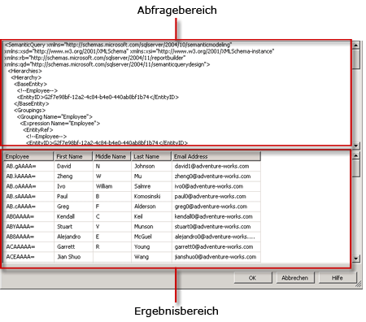

# Benutzeroberfläche des Berichtsmodellabfrage-Designers
  Der Berichts-Designer stellt zwei Abfrage-Designer bereit, mit deren Hilfe Sie angeben können, welche Daten aus einer Berichtsserver-Modelldatenquelle in einem Bericht verwendet werden sollen. Verwenden Sie den grafischen Abfrage-Designer, um Modellentitäten und Entitätsfelder zu durchsuchen und auszuwählen. Verwenden Sie den textbasierten Abfrage-Designer, um mit einer SMDL-Spezifikation (Semantic Model Definition Language) direkt im XML-Format zu arbeiten.  
  
> [!IMPORTANT]  
>  Benutzer greifen auf Datenquellen zu, wenn sie Abfragen erstellen und ausführen. Sie sollten minimale Berechtigungen für die Datenquellen gewähren, z. B. nur Leseberechtigungen.  
  
## Grafischer Abfrage-Designer  
 Der Berichts-Designer stellt einen grafischen Abfrage-Designer bereit, mit dem Sie SMDL-Abfragen entwerfen und ausführen können, die während der Berichtsverarbeitung die Feldauflistung eines Berichtsdatasets auffüllen. Der grafische Abfrage-Designer ist in drei Gebiete oder Bereiche aufgeteilt.  
  
 In der folgenden Abbildung werden die einzelnen Bereiche bezeichnet.  
  
   
  
 Die folgende Tabelle beschreibt die Funktion jedes Bereichs.  
  
|Bereich|Funktion|  
|----------|--------------|  
|Explorer-Bereich|Zeigt grafische Darstellungen der Entitäten und Entitätsfelder im Modell an. Verwenden Sie diesen Bereich, um Entitäten sowie deren zugehörige Entitäten und Felder zu durchsuchen.|  
|Entwurfsbereich|Zeigt eine Liste der Felder aus dem Modell an. Verwenden Sie diesen Bereich, um das Layout der ausgewählten Felder anzuordnen.|  
|Ergebnisbereich|Zeigt die Ergebnisse der Abfrage an. Um die Abfrage auszuführen, mit der rechten Maustaste in einen beliebigen Bereich, und klicken Sie dann auf **ausführen**, oder klicken Sie auf die **ausführen** () auf der Symbolleiste.|  
  
 Das Ändern von Informationen im Explorer- oder Entwurfsbereich hat Auswirkungen auf den Inhalt des Ergebnisbereichs, wenn Sie auf **Ausführen**klicken.  
  
 Zum Ausführen von Aktionen innerhalb eines bestimmten Bereichs, z. B. Löschen einer Spalte im Entwurfsbereich, klicken Sie mit der rechten Maustaste auf die Spalte, und klicken Sie dann auf den Befehl im Menü.  
  
### Symbolleiste für den grafischen Abfrage-Designer  
 Sie können auch die Schaltflächen der Symbolleiste beim Entwerfen der Abfrage verwenden. In der folgenden Tabelle werden die Schaltflächen der Symbolleiste und ihre Verwendungsmöglichkeiten aufgelistet.  
  
|Schaltfläche|Description|  
|------------|-----------------|  
|**Als Text bearbeiten**|Wechseln zwischen dem textbasierten Abfrage-Designer und dem grafischen Abfrage-Designer. Bei der Abfrage für eine Berichtsservermodell-Datenquelle handelt es sich um eine SMQL-Spezifikation (Semantic Model Query Language) in XML.|  
|**Importieren**|Importieren einer vorhandenen Abfrage aus einer Berichtsdefinitionsdatei (.rdl) im Dateisystem. Weitere Informationen finden Sie unter [Erstellen von Berichten zu eingebetteten und freigegebenen Datasets &#40;Berichts-Generator und SSRS&#41;](../../reporting-services/report-data/report-embedded-datasets-and-shared-datasets-report-builder-and-ssrs.md).|  
||Macht die letzte Aktion rückgängig.|  
||Stellt die letzte Aktion wieder her.|  
||Führt die Abfrage aus und zeigt die resultierenden Zeilen im Ergebnisbereich an.|  
||Öffnet das Dialogfeld **Daten filtern** , in dem Sie angeben können, nach welchen Daten gefiltert werden soll. Sie können Filter unabhängig von den aktuellen Daten im Entwurfsbereich angeben.|  
  
## Textbasierter Abfrage-Designer  
 Wenn Sie eine Berichtsservermodell-Datasetabfrage erstellen, wird standardmäßig der grafische Abfrage-Designer verwendet. Wenn Sie zum textbasierten Abfrage-Designer wechseln möchten, klicken Sie auf der Symbolleiste auf die Umschaltfläche **Als Text bearbeiten** .  
  
 Der textbasierte Abfrage-Designer besteht aus zwei Bereichen: dem SMQL-Abfragebereich und dem Ergebnisbereich. Diese Ansicht des Abfrage-Designers ist primär nützlich, wenn Sie bereits über eine SMQL-Abfragespezifikation aus einer anderen Quelle verfügen und sie in den Abfragebereich einfügen möchten. Im Gegensatz zum grafischen Abfrage-Designer wird die Abfragesyntax vom textbasierten Abfrage-Designer nicht überprüft und die Abfrage nicht umstrukturiert. Wenn Sie auf der Symbolleiste auf **Ausführen** klicken, wird die Abfrage für die Datenquelle ausgeführt, und die Ergebnisse werden im Ergebnisbereich angezeigt.  
  
 In der folgenden Abbildung werden die einzelnen Bereiche bezeichnet.  
  
   
  
 Die folgende Tabelle beschreibt die Funktion jedes Bereichs.  
  
|Bereich|Funktion|  
|----------|--------------|  
|Abfragebereich|Zeigt den SMQL-Spezifikationstext an.|  
|Ergebnisbereich|Zeigt die Ergebnisse der Abfrage an. Wenn Sie die Abfrage ausführen möchten, klicken Sie mit der rechten Maustaste in einen beliebigen Bereich und anschließend auf **Ausführen**, oder klicken Sie auf der Symbolleiste auf die Schaltfläche **Ausführen** .|  
  
### Symbolleiste für den textbasierten Abfrage-Designer  
 Sie können auch die Schaltflächen der Symbolleiste beim Entwerfen der Abfrage verwenden. In der folgenden Tabelle werden die Schaltflächen der Symbolleiste und ihre Verwendungsmöglichkeiten aufgelistet.  
  
|Schaltfläche|Description|  
|------------|-----------------|  
|**Als Text bearbeiten**|Wechseln zwischen dem textbasierten Abfrage-Designer und dem grafischen Abfrage-Designer.|  
|**Importieren**|Importieren einer Abfrage aus einem vorhandenen Bericht.|  
||Führt den Abfragetext aus und zeigt das resultierende Rowset im Ergebnisbereich an.|  
  
## Siehe auch  
 [Abfrageentwurfstools &#40;SSRS&#41;](../../reporting-services/report-data/query-design-tools-ssrs.md)   
 [Hinzufügen von Daten aus externen Datenquellen (SSRS)](../../reporting-services/report-data/add-data-from-external-data-sources-ssrs.md)   
 [Berichtsmodellverbindung &#40; SSRS &#41;](../../reporting-services/report-data/report-model-connection-ssrs.md)   
 [RSReportDesigner-Konfigurationsdatei](../../reporting-services/report-server/rsreportdesigner-configuration-file.md)  
  
  
