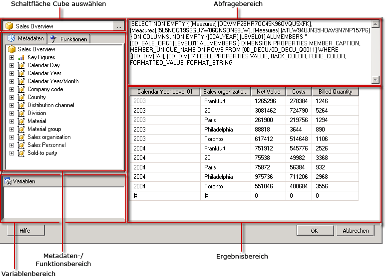

# Benutzeroberfl&#228;che des Abfrage-Designers f&#252;r SAP NetWeaver BI
  [!INCLUDE[ssRSnoversion](../../includes/ssrsnoversion-md.md)] stellt einen grafischen Abfrage-Designer zum Erstellen von MDX-Abfragen (Multidimensional Expression) für eine SAP NetWeaver® Business Intelligence-Datenquelle bereit. Der grafische MDX-Abfrage-Designer verfügt über zwei Modi: Entwurfsmodus und Abfragemodus. Jeder Modus bietet einen Metadatenbereich, aus dem Sie Elemente aus einem InfoCube, einem MultiProvider oder einer für die Datenquelle definierten, webfähigen Abfrage ziehen können, um eine MDX-Abfrage zu erstellen, die bei der Berichtsverarbeitung Daten abruft.  
  
> [!IMPORTANT]  
>  Benutzer greifen auf Datenquellen zu, wenn sie Abfragen erstellen und ausführen. Sie sollten minimale Berechtigungen für die Datenquellen gewähren, z. B. nur Leseberechtigungen.  
  
 Weitere Informationen zum Arbeiten mit einer mehrdimensionalen SAP-Datenquelle finden Sie unter [SAP NetWeaver BI-Verbindungstyp&#40;SSRS&#41;](../../reporting-services/report-data/sap-netweaver-bi-connection-type-ssrs.md).  
  
 In diesem Abschnitt werden die Schaltflächen auf der Symbolleiste und die Bereiche des Abfrage-Designers für jeden Modus des grafischen Abfrage-Designers beschrieben.  
  
## Grafischer Abfrage-Designer im Entwurfsmodus  
 Wenn Sie in der Datenansicht des Berichts-Designers ein Dataset mit einer [!INCLUDE[SAP_DPE_BW_1](../../includes/sap-dpe-bw-1-md.md)] -Datenquelle bearbeiten, wird der grafische Abfrage-Designer im Entwurfsmodus geöffnet. In der folgenden Abbildung werden die Bereiche für den Entwurfsmodus bezeichnet.  
  
   
  
 In der folgenden Tabelle sind die Bereiche in diesem Modus aufgeführt.  
  
|Bereich|Funktion|  
|----------|--------------|  
|Cube auswählen (Schaltfläche)|Zeigt den zurzeit ausgewählten InfoCube, MultiProvider oder die zurzeit ausgewählte webfähige Abfrage an.|  
|Metadaten (Bereich)|Zeigt eine hierarchische Liste von InfoCubes, MultiProvidern und Abfragen an. An der Datenquelle erstellte Abfragen werden möglicherweise unter dem entsprechenden Cube angezeigt.|  
|Berechnete Elemente (Bereich)|Zeigt die aktuell definierten berechneten Elemente an, die für eine Verwendung in der Abfrage verfügbar sind.|  
|Daten (Bereich)|Zeigt die Ergebnisse des Ausführens der Abfrage an.|  
  
 Sie können Dimensionen und Kennzahlen aus dem Metadatenbereich und berechnete Elemente aus dem Bereich Berechnete Elemente in den Datenbereich ziehen. Wenn die Umschaltfläche **AutoExecute** auf der Symbolleiste aktiviert ist, führt der Abfrage-Designer die Abfrage jedes Mal aus, wenn Sie ein Objekt im Datenbereich ablegen. Wenn **AutoExecute** deaktiviert ist, führt der Abfrage-Designer die Abfrage nicht aus, während Sie Änderungen am Datenbereich vornehmen. Sie können die Abfrage mithilfe der Schaltfläche **Ausführen** auf der Symbolleiste manuell ausführen.  
  
### Symbolleiste für den grafischen Abfrage-Designer im Entwurfsmodus  
 Die Symbolleiste des Abfrage-Designers stellt Schaltflächen bereit, die Ihnen beim Entwurf von MDX-Abfragen mit der grafischen Oberfläche helfen. In der folgenden Tabelle werden die Schaltflächen und ihre Funktionen beschrieben.  
  
|Schaltfläche|Description|  
|------------|-----------------|  
|**Als Text bearbeiten**|Wechseln zwischen dem textbasierten Abfrage-Designer und dem grafischen Abfrage-Designer. Nicht verfügbar für diesen Datenquellentyp.|  
|**Importieren**|Importieren einer vorhandenen Abfrage aus einer Berichtsdefinitionsdatei (.rdl) im Dateisystem. Weitere Informationen finden Sie unter [Erstellen von Berichten zu eingebetteten und freigegebenen Datasets &#40;Berichts-Generator und SSRS&#41;](../../reporting-services/report-data/report-embedded-datasets-and-shared-datasets-report-builder-and-ssrs.md).|  
||Aktualisieren von Metadaten aus der Datenquelle.|  
||Zeigt das Dialogfeld **Generator für berechnete Elemente** an.|  
||Umschalten zwischen Einblenden und Ausblenden leerer Zellen im Datenbereich. (Dies entspricht dem Verwenden der NON EMPTY-Klausel in MDX.)|  
||Automatisches Ausführen der Abfrage und Anzeigen des Ergebnisses, sobald eine Änderung vorgenommen wird, beispielsweise Löschen einer Spalte im Datenbereich. Die Ergebnisse werden im Datenbereich angezeigt.|  
||Löschen der ausgewählten Spalte im Datenbereich aus der Abfrage.|  
|")|Anzeigen des Dialogfelds **Variablen** . Diese Schaltfläche ist nur aktiviert, wenn es sich bei dem ausgewählten Cube um einen Abfragecube handelt (da nur Abfragecubes Variablen unterstützen). Wenn Sie einer Variablen einen Standardwert zuweisen, wird ein entsprechender Berichtsparameter erstellt.|  
||Führt die Abfrage aus und zeigt die Ergebnisse im Datenbereich an.|  
||Abbrechen der Abfrage.|  
||Umschalten zwischen Entwurfsmodus und Abfragemodus.|  
  
## Grafischer Abfrage-Designer im Abfragemodus  
 Klicken Sie zum Umschalten des grafischen Abfrage-Designers in den Abfragemodus auf der Symbolleiste auf die Umschaltfläche **Entwurfsmodus** .  
  
 In der folgenden Abbildung werden die Teile des Abfrage-Designers im Abfragemodus angezeigt.  
  
   
  
 Die folgende Tabelle beschreibt die Funktion jedes Bereichs.  
  
|Bereich|Funktion|  
|----------|--------------|  
|Cube auswählen (Schaltfläche)|Zeigt den zurzeit ausgewählten InfoCube, MultiProvider oder sonstigen Cube an.|  
|Metadaten/Funktionen (Bereich)|Zeigt ein Fenster im Registerformat mit einer Liste verfügbarer Metadaten oder Funktionen an, die zum Erstellen des Abfragetexts verwendet werden können.|  
|Variablen (Bereich)|Zeigt die zurzeit definierten Variablen an, die für die Verwendung in der Abfrage verfügbar sind.|  
|Abfragebereich|Zeigt den aktuellen Abfragetext an.|  
|Ergebnisbereich|Zeigt die Ergebnisse der Abfrage an.|  
  
 Aus dem Metadatenbereich können Sie Kennzahlen und Dimensionen von der Registerkarte **Metadaten** in den MDX-Abfragebereich ziehen. Der technische Name für die Metadaten wird an der Cursorposition eingefügt. Sie können Funktionen von der Registerkarte **Funktionen** in den MDX-Abfragebereich ziehen. Wenn Sie die Abfrage ausführen, zeigt der Ergebnisbereich die Ergebnisse für die aktuelle MDX-Abfrage an.  
  
 Wenn es sich bei dem von Ihnen ausgewählten Cube um eine webfähige Abfrage handelt, werden Sie aufgefordert, statische Standardwerte für die vorhandenen Variablen festzulegen. Sie können dann Variablen in den MDX-Abfragebereich ziehen.  
  
 Im Metadatenbereich und im Variablenbereich werden Anzeigenamen angezeigt. Wenn Sie die Objekte im MDX-Abfragebereich ablegen, sehen Sie, wie die technischen Namen, die von der Datenquelle benötigt werden, in die MDX-Abfrage eingegeben werden.  
  
### Symbolleiste für den grafischen Abfrage-Designer im Abfragemodus  
 Die Symbolleiste des Abfrage-Designers stellt Schaltflächen bereit, die Ihnen beim Entwurf von MDX-Abfragen mit der grafischen Oberfläche helfen. Die Schaltflächen der Symbolleiste sind im Entwurfs- und Abfragemodus identisch, aber die folgenden Schaltflächen sind für den Abfragemodus nicht aktiviert:  
  
-   **Als Text bearbeiten**  
  
-   **Berechnetes Element hinzufügen** ()  
  
-   **Leere Zellen anzeigen** ()  
  
-   **AutoExecute** ()  
  
-   **Löschen** ()  
  
## Siehe auch  
 [Erstellen eines freigegebenen Datasets oder eingebetteten Datasets &#40;Berichts-Generator und SSRS&#41;](../../reporting-services/report-data/create-a-shared-dataset-or-embedded-dataset-report-builder-and-ssrs.md)   
 [RSReportDesigner-Konfigurationsdatei](../../reporting-services/report-server/rsreportdesigner-configuration-file.md)  
  
  