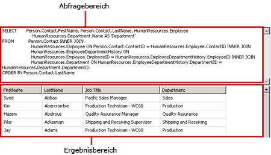
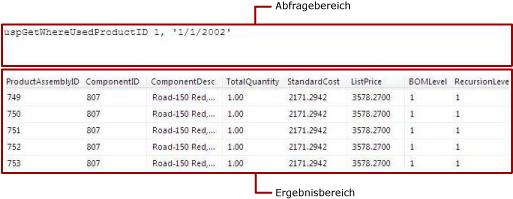

# <a name="text-based-query-designer-user-interface-report-builder"></a>Benutzeroberfläche des textbasierten Abfrage-Designers (Berichts-Generator)
  Verwenden Sie den textbasierten Abfrage-Designer, um eine Abfrage mithilfe der Abfragesprache zu verwenden, die von der Datenquelle unterstützt wird, führen Sie die Abfrage aus, und zeigen Sie die Ergebnisse zur Entwurfszeit an. Sie können mehrere [!INCLUDE[tsql](../../includes/tsql-md.md)] -Anweisungen, Abfrage- oder Befehlssyntaxen für benutzerdefinierte Datenverarbeitungserweiterungen und Abfragen angeben, die als Ausdrücke angegeben sind. Da der textbasierte Abfrage-Designer die Abfrage nicht zuvor verarbeitet und eine beliebige Abfragesyntax aufnehmen kann, handelt es sich hierbei um das standardmäßige Abfrage-Designer-Tool für viele Datenquellentypen.  
  
> [!IMPORTANT]  
>  Benutzer greifen auf Datenquellen zu, wenn sie Abfragen erstellen und ausführen. Sie sollten minimale Berechtigungen für die Datenquellen gewähren, z. B. nur Leseberechtigungen.  
  
 Der textbasierte Abfrage-Designer zeigt eine Symbolleiste und die folgenden zwei Bereiche an:  
  
-   **Abfrage** Zeigt den Abfragetext, den Tabellennamen oder den Namen der gespeicherten Prozedur an, je nach Abfragetyp. Nicht alle Abfragetypen können für alle Datenquellentypen verwendet werden. Beispiel: Tabellenname wird nur vom Datenquellentyp OLE DB unterstützt.  
  
-   **Ergebnis** Zeigt die Ergebnisse einer Ausführung der Abfrage zur Entwurfszeit an.  
  
## <a name="text-based-query-designer-toolbar"></a>Symbolleiste für den textbasierten Abfrage-Designer  
 Der textbasierte Abfrage-Designer stellt eine einzige Symbolleiste für alle Befehlstypen bereit. In der folgenden Tabelle werden jede Schaltfläche auf der Symbolleiste und ihre Funktion aufgelistet.  
  
|Schaltfläche|Description|  
|------------|-----------------|  
|**Als Text bearbeiten**|Wechseln zwischen dem textbasierten Abfrage-Designer und dem grafischen Abfrage-Designer. Nicht alle Datenquellentypen unterstützen grafische Abfrage-Designer.|  
|**Importieren**|Importiert eine vorhandene Abfrage aus einer Datei oder einem Bericht. Nur die Dateitypen SQL und RDL werden unterstützt.|  
||Führen Sie die Abfrage aus, und zeigen Sie das Resultset im Ergebnisbereich an.|  
|**Befehlstyp**|Wählen Sie **Text**, **StoredProcedure**oder **TableDirect**. Weist eine gespeicherte Prozedur Parameter auf, wird das Dialogfeld **Abfrageparameter definieren** angezeigt, wenn Sie auf der Symbolleiste auf **Ausführen** klicken. Sie können nach Bedarf Werte eingeben. Unterstützung für den Befehlstyp ändert sich jeweils nach dem Datenquellentyp. Nur OLE DB und ODBC unterstützen z.B. **TableDirect**.<br /><br /> Hinweis: Wenn eine gespeicherte Prozedur mehr als ein Resultset zurückgibt, wird nur das erste Resultset verwendet, um das Dataset zu füllen.|  
  
### <a name="command-type-text"></a>Befehlstyp "Text"  
 Wenn Sie ein [!INCLUDE[ssNoVersion](../../includes/ssnoversion-md.md)] -Dataset erstellen, wird vom Berichts-Designer standardmäßig der relationale Abfrage-Designer geöffnet. Wenn Sie zum textbasierten Abfrage-Designer wechseln möchten, klicken Sie auf der Symbolleiste auf die Umschaltfläche **Als Text bearbeiten** . Der textbasierte Abfrage-Designer hat zwei Bereiche: den Abfragebereich und den Ergebnisbereich. In der folgenden Abbildung werden die einzelnen Bereiche bezeichnet.  
  
   
  
 Die folgende Tabelle beschreibt die Funktion jedes Bereichs.  
  
|Bereich|Funktion|  
|----------|--------------|  
|Abfrage|Zeigt den [!INCLUDE[tsql](../../includes/tsql-md.md)] -Abfragetext an. In diesem Bereich schreiben oder bearbeiten Sie eine [!INCLUDE[tsql](../../includes/tsql-md.md)] -Abfrage.|  
|Ergebnis|Zeigt die Ergebnisse der Abfrage an. Klicken Sie zum Ausführen der Abfrage mit der rechten Maustaste in einen beliebigen Bereich, und klicken Sie auf **Ausführen**, oder klicken Sie auf der Symbolleiste auf **Ausführen** .|  
  
#### <a name="example"></a>Beispiel  
 Die folgende Abfrage gibt die Liste der Namen aus der AdventureWorks2014-Datenbanktabelle **ContactType** für das **Person** -Schema zurück.  
  
```  
SELECT Name FROM Person.ContactType  
```  
  
 Wenn Sie auf der Symbolleiste auf **Ausführen** klicken, wird der Befehl im **Abfragebereich** ausgeführt, und die Ergebnisse werden im **Ergebnisbereich** angezeigt. Das Resultset zeigt eine Liste mit 20 Typen von Kontakten an, wie Besitzer oder Handelsvertreter.  
  
### <a name="command-type-storedprocedure"></a>StoredProcedure-Befehlstyp  
 Wenn Sie den **Befehlstyp StoredProcedure**auswählen, zeigt der textbasierte Abfrage-Designer zwei Bereiche an: den Abfragebereich und den Ergebnisbereich. Geben Sie den Namen der gespeicherten Prozedur im Bereich **Abfrage** ein, und klicken Sie auf der Symbolleiste auf Ausführen. Wenn die gespeicherte Prozedur Parameter verwendet, wird das Dialogfeld **Abfrageparameter definieren** geöffnet. Geben Sie die Parameterwerte für die gespeicherte Prozedur ein. Für jeden Eingabeparameter einer gespeicherten Prozedur wird ein Berichtsparameter erstellt.  
  
 Die folgende Abbildung zeigt die Bereiche Abfrage und Ergebnis an, wenn Sie eine gespeicherte Prozedur ausführen. In diesem Fall sind die Eingabeparameter Konstanten.  
  
   
  
 Die folgende Tabelle beschreibt die Funktion jedes Bereichs.  
  
|Bereich|Funktion|  
|----------|--------------|  
|Abfrage|Zeigt den Namen der gespeicherten Prozedur und eventueller Eingabeparameter an.|  
|Ergebnis|Zeigt die Ergebnisse der Abfrage an. Klicken Sie zum Ausführen der Abfrage mit der rechten Maustaste in einen beliebigen Bereich, und klicken Sie auf **Ausführen**, oder klicken Sie auf der Symbolleiste auf **Ausführen** .|  
  
#### <a name="example"></a>Beispiel  
 Die folgende Abfrage ruft die gespeicherte AdventureWorks2014-Prozedur **uspGetWhereUsedProductID**auf. Sie müssen einen Wert für den Produkt-ID-Parameter eingeben, wenn Sie die Abfrage ausführen.  
  
```  
uspGetWhereUsedProductID  
```  
  
 Klicken Sie auf die Schaltfläche **Ausführen** (**!**). Wenn Sie nach den Abfrageparametern gefragt werden, geben Sie die Werte mithilfe der folgenden Tabelle ein.  
  
|||  
|-|-|  
|*@StartProductID*|820|  
|*@CheckDate*|20010115|  
  
 Das Resultset zeigt eine Liste mit 13 Produkt-IDs, die die angegebene Komponentennummer verwendet haben, für das angegebene Datum an.  
  
### <a name="command-type-tabledirect"></a>TableDirect-Befehlstyp  
 Wenn Sie den **Befehlstyp TableDirect**auswählen, zeigt der textbasierte Abfrage-Designer zwei Bereiche an: den Abfragebereich und den Ergebnisbereich. Wenn Sie eine Tabelle auswählen und auf die Schaltfläche **Ausführen** klicken, werden alle Spalten für diese Tabelle zurückgegeben.  
  
#### <a name="example"></a>Beispiel  
 Bei einem Datenquellentyp OLE DB gibt die folgende Datasetabfrage ein Resultset für alle Kontakttypen in der AdventureWorks2014-Datenbank zurück.  
  
 `Person.ContactType`  
  
 Die Eingabe des Tabellennamens Person.ContactType entspricht der Erstellung der [!INCLUDE[tsql](../../includes/tsql-md.md)] -Anweisung `SELECT * FROM Person.ContactType`.  
  
## <a name="see-also"></a>Siehe auch  
 [Benutzeroberfläche des relationalen Abfrage-Designers &#40;Berichts-Generator&#41;](../../reporting-services/report-data/relational-query-designer-user-interface-report-builder.md)   
 [Abfrage-Designer &#40;Berichts-Generator&#41;](http://msdn.microsoft.com/library/553f0d4e-8b1d-4148-9321-8b41a1e8e1b9)  
  
  
