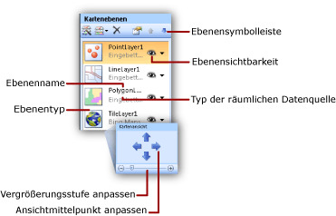

# Hinzufügen, Ändern oder Löschen einer Karte oder einer Kartenebene (Berichts-Generator und SSRS)
  Eine Karte ist eine Sammlung von Ebenen. Wenn Sie einem paginierten [!INCLUDE[ssRSnoversion_md](../../includes/ssrsnoversion-md.md)] -Bericht eine Karte hinzufügen, definieren Sie die erste Ebene. Sie können zusätzliche Ebenen mit dem Kartenebenen-Assistenten erstellen.  
  
 Optionen können am einfachsten mit dem Kartenebenen-Assistenten hinzugefügt, entfernt oder geändert werden. Sie können Optionen über den Bereich Karte auch manuell ändern. Klicken Sie zum Anzeigen des Bereichs **Karte** in der Karte auf die Entwurfsoberfläche für Berichte. Die folgende Abbildung zeigt die Teile des Bereichs an:  
  
   
  
 Kartenebenen werden von unten nach oben in der Reihenfolge gezeichnet, in der sie im Kartenbereich angezeigt werden. In der vorstehenden Abbildung wird die Kachelebene zuerst gezeichnet, und die Polygonebene wird zuletzt gezeichnet. Ebenen, die später gezeichnet werden, können Kartenelemente auf früher gezeichneten Ebenen verdecken. Sie können die Reihenfolge der Ebenen mit den Pfeiltasten auf der Symbolleiste des Bereichs Karte ändern. Um Ebenen anzuzeigen oder auszublenden, schalten Sie das Sichtbarkeitssymbol um. Sie können die Transparenz einer Ebene auf der Seite **Sichtbarkeit** des **Ebenendaten** -Eigenschaftendialogfelds ändern.  
  
 In der folgenden Tabelle werden die Symbole für den Bereich **Karte** angezeigt:  
  
|Symbol|Description|Verwendung|  
|------------|-----------------|-----------------|  
||Kartenebenen-Assistent|Um mit einem Assistenten eine Ebene hinzuzufügen, klicken Sie auf **Assistent für neue Ebenen**.|  
||Ebene hinzufügen|Um manuell eine Ebene hinzuzufügen, klicken Sie auf **Ebene hinzufügen**, und klicken Sie dann auf den Typ der Kartenebene, die Sie hinzufügen möchten.|  
||Polygonebene|Fügen Sie eine Kartenebene hinzu, die Bereiche oder Formen anzeigt, die auf Sätzen von Polygonkoordinaten basieren.|  
||Linienebene|Fügen Sie eine Kartenebene hinzu, die Pfade oder Routen anzeigt, die auf Sätzen von Linienkoordinaten basieren.|  
||Punktebene|Fügen Sie eine Kartenebene hinzu, die Orte anzeigt, die auf Sätzen von Punktkoordinaten basieren.|  
||Kachelebene|Fügen Sie eine Kartenebene hinzu, die Bing Map-Kacheln anzeigt, die dem aktuellen vom Viewport definierten Kartenansichtbereich entsprechen.|  
  
 Am unteren Rand der Karte befindet sich der Kartenansichtsbereich. Um die Optionen für Zentrieren und Zoomen der Karte zu ändern, verwenden Sie die Pfeiltasten, um den Ansichtsmittelpunkt festzulegen, und den Schieberegler, um die Zoomstufe festzulegen.  
  
 Weitere Informationen zu Ebenen finden Sie unter [Karten &#40;Berichts-Generator und SSRS&#41;](../../reporting-services/report-design/maps-report-builder-and-ssrs.md).  
  
> [!NOTE]  
>  [!INCLUDE[ssRBRDDup](../../includes/ssrbrddup-md.md)]  
  
##   So fügen Sie eine Ebene über den Kartenebenen-Assistenten hinzu  
  
-   Klicken Sie auf dem Menüband im Menü **Einfügen** auf **Karte**und dann auf **Karte Wizard.** . Mit dem Assistenten können Sie der vorhandenen Karte eine Ebene hinzufügen. Die meisten Assistentenseiten sind im Karten-Assistenten und im Kartenebenen-Assistenten identisch.  
  
     Weitere Informationen finden Sie unter [Karten-Assistent und Kartenebenen-Assistent &#40;Berichts-Generator und SSRS&#41;](../../reporting-services/report-design/map-wizard-and-map-layer-wizard-report-builder-and-ssrs.md).  
  
##   So ändern Sie die Optionen für eine Ebene mit dem Kartenebenen-Assistenten  
  
-   Führen Sie den Karten-Assistenten aus. Mit diesem Assistenten können Sie die Optionen für eine von Ihnen erstellte Ebene mithilfe des Kartenebenen-Assistenten ändern. Im Bereich Karte mit der rechten Maustaste in der Ebene, und klicken Sie auf der Symbolleiste auf Layer-Assistentenschaltfläche ().  
  
     Weitere Informationen finden Sie unter [Karten-Assistent und Kartenebenen-Assistent &#40;Berichts-Generator und SSRS&#41;](../../reporting-services/report-design/map-wizard-and-map-layer-wizard-report-builder-and-ssrs.md).  
  
##   So fügen Sie eine Punkt-, Linien- oder Polygonebene über die Symbolleiste des Kartenbereichs hinzu  
  
1.  Klicken Sie auf die Karte, bis der Kartenbereich angezeigt wird.  
  
2.  Klicken Sie auf der Symbolleiste auf die Schaltfläche **Ebene hinzufügen** , und klicken Sie in der Dropdownliste auf den Typ der Ebene, die Sie hinzufügen möchten: **Punkt**, **Linie**oder **Polygon**.  
  
    > [!NOTE]  
    >  Sie können eine Kartenebene auch manuell hinzufügen und konfigurieren. Es empfiehlt sich jedoch, neue Ebenen mit dem Kartenebenen-Assistenten hinzuzufügen. Um den Assistenten über die Symbolleiste des Kartenbereichs zu starten, klicken Sie auf der Ebene Assistentenschaltfläche ().  
  
3.  Klicken Sie mit der rechten Maustaste auf die Ebene, und klicken Sie anschließend auf **Ebenendaten**.  
  
4.  Wählen Sie unter **Räumliche Daten verwenden aus**die Quelle räumlicher Daten aus. Die Optionen hängen von der Auswahl ab.  
  
     Wenn Sie analytische Daten aus dem Bericht auf dieser Ebene darstellen möchten, gehen Sie wie folgt vor:  
  
    1.  Klicken Sie auf **Analytische Daten**.  
  
    2.  Klicken Sie unter **Analytisches Dataset**auf den Namen des Datasets, das die analytische Daten und die Übereinstimmungsfelder enthält, mit denen eine Beziehung zwischen analytischen und räumlichen Daten hergestellt wird.  
  
    3.  Klicken Sie auf **Hinzufügen**.  
  
    4.  Geben Sie den Namen des Übereinstimmungsfelds aus dem räumlichen Dataset ein.  
  
    5.  Geben Sie den Namen des Übereinstimmungsfelds aus dem analytischen Dataset ein.  
  
     Weitere Informationen zum Verknüpfen räumlicher und analytischer Daten finden Sie unter [Anpassen der Daten und der Anzeige einer Karte oder einer Kartenebene &#40;Berichts-Generator und SSRS&#41;](../../reporting-services/report-design/customize-the-data-and-display-of-a-map-or-map-layer-report-builder-and-ssrs.md).  
  
5.  [!INCLUDE[clickOK](../../includes/clickok-md.md)]  
  
##   So filtern Sie analytische Daten für die Ebene  
  
1.  Klicken Sie auf die Karte, bis der Kartenbereich angezeigt wird.  
  
2.  Klicken Sie mit der rechten Maustaste in den Kartenbereich, und klicken Sie anschließend auf  **Ebenendaten**.  
  
3.  Klicken Sie auf **Filter**.  
  
4.  Definieren Sie eine Filtergleichung, um die in der Kartenanzeige verwendeten analytischen Daten zu beschränken. Weitere Informationen finden Sie unter [Beispiele für Filtergleichungen &#40;Berichts-Generator und SSRS&#41;](../../reporting-services/report-design/filter-equation-examples-report-builder-and-ssrs.md).  
  
##   So steuern Sie Punkteigenschaften für eine Punktebene oder für Polygonmittelpunkte  
  
1.  Wählen Sie **Allgemein** im Dialogfeld **Punkteigenschaften von Karten** aus, um Bezeichnung, QuickInfo und Markertypoptionen für die folgenden Kartenelemente zu ändern:  
  
    -   Alle dynamischen oder eingebettete Punkte auf einer Punktebene. Farbregeln, Größenregeln und Markertypregeln für Punkte überschreiben diese Optionen. Um Optionen für einen bestimmten eingebetteten Punkt zu überschreiben, verwenden Sie die Seite [Map Embedded Point Properties Dialog Box, Marker](http://msdn.microsoft.com/library/3c5eb1c5-d40a-424f-aa7c-43b112f42dec) .  
  
    -   Der Mittelpunkt für alle dynamischen oder eingebetteten Polygone auf einer Polygonebene. Farbregeln, Größenregeln und Markertypregeln für Mittelpunkte überschreiben diese Optionen. Verwenden Sie die Seite [Eigenschaften für eingebettete Punkte der Karte (Dialogfeld), Marker](http://msdn.microsoft.com/library/3c5eb1c5-d40a-424f-aa7c-43b112f42dec) , um Optionen für einen bestimmten eingebetteten Punkt zu überschreiben.  
  
##   So geben Sie eingebettete Daten als Quelle räumlicher Daten an  
  
1.  Klicken Sie auf die Karte, bis der Kartenbereich angezeigt wird.  
  
2.  Klicken Sie mit der rechten Maustaste auf die Ebene, und klicken Sie anschließend auf **Ebenendaten**.  
  
3.  Wählen Sie unter **Räumliche Daten verwenden aus**den Wert **In Bericht eingebettete Daten**aus.  
  
4.  Um Kartenelemente aus einem vorhandenen Bericht zu laden oder Kartenelemente auf der Grundlage einer ESRI-Datei zu erstellen, klicken Sie auf **Durchsuchen**, zeigen Sie auf die Datei, und klicken Sie dann auf **Öffnen**. Die Kartenelemente werden in diese Berichtsdefinition eingebettet. Die räumlichen Daten, auf die Sie zeigen, müssen zum Ebenentyp passen. Beispielsweise müssen Sie für eine Punktebene auf räumliche Daten zeigen, die Sätze von Punktkoordinaten angeben.  
  
5.  Geben Sie unter **Räumliches Feld**den Namen des Felds an, das räumliche Daten enthält. Möglicherweise müssen Sie diesen Namen anhand der Quelle räumlicher Daten bestimmen.  
  
    > [!NOTE]  
    >  Wenn Sie den Namen des Felds nicht kennen und zu einer ESRI-Shape-Datei gewechselt haben, verwenden Sie statt dieser Option die Option **Mit ESRI-Shape-Datei verknüpfen** .  
  
6.  [!INCLUDE[clickOK](../../includes/clickok-md.md)]  
  
##   So geben Sie eine ESRI-Shape-Datei als Quelle räumlicher Daten an  
  
1.  Klicken Sie auf die Karte, bis der Kartenbereich angezeigt wird.  
  
2.  Klicken Sie mit der rechten Maustaste auf die Ebene, und klicken Sie anschließend auf **Ebenendaten**.  
  
3.  Wählen Sie unter **Räumliche Daten verwenden aus**den Eintrag **Mit ESRI-Shape-Datei verknüpfen**aus.  
  
4.  Geben Sie unter **Dateiname**den Speicherort einer ESRI-Shape-Datei ein, oder klicken Sie auf **Durchsuchen** , um eine ESRI-Shape-Datei auszuwählen.  
  
    > [!NOTE]  
    >  Wenn sich die Shape-Datei auf dem lokalen Computer befindet, werden die räumlichen Daten in die Berichtsdefinition eingebettet. Um die Daten bei der Verarbeitung des Berichts dynamisch abzurufen, müssen Sie die ESRI-Shape-Datei (.shp) und die zugehörige Unterstützungsdatei (.dbf) auf den Berichtsserver hochladen. Weitere Informationen finden Sie unter „Vorgehensweise: Hochladen einer Datei oder eines Berichts (Berichts-Manager)“ in der [Reporting Services-Dokumentation](http://go.microsoft.com/fwlink/?linkid=121312) in der SQL Server-Onlinedokumentation.  
  
5.  [!INCLUDE[clickOK](../../includes/clickok-md.md)]  
  
##   So geben Sie ein Berichtsdataset-Feld als Quelle räumlicher Daten an  
  
1.  Klicken Sie auf die Karte, bis der Kartenbereich angezeigt wird.  
  
2.  Klicken Sie mit der rechten Maustaste auf die Ebene, und klicken Sie anschließend auf **Ebenendaten**.  
  
3.  Wählen Sie unter **Räumliche Daten verwenden aus**den Eintrag **Räumliches Feld in einem Dataset**aus.  
  
4.  Klicken Sie unter **Datasetname**auf den Namen eines Datasets in dem Bericht, das die gewünschten räumlichen Daten enthält.  
  
5.  Klicken Sie unter **Name des räumlichen Felds**auf den Namen des Felds im Dataset, das räumliche Daten enthält.  
  
6.  [!INCLUDE[clickOK](../../includes/clickok-md.md)]  
  
##   So fügen Sie eine Kachelebene hinzu  
  
1.  Klicken Sie auf die Karte, bis der Kartenbereich angezeigt wird.  
  
2.  Klicken Sie auf der Symbolleiste auf die Schaltfläche **Ebene hinzufügen** , und klicken Sie in der Dropdownliste auf **Kachelebene**.  
  
    > [!NOTE]  
    >  Weitere Informationen zur Verwendung von Bing-Kartenkacheln im Bericht finden Sie in den [zusätzlichen Nutzungsbedingungen](http://go.microsoft.com/fwlink/?LinkId=151371).  
  
3.  Klicken Sie mit der rechten Maustaste im Kartenbereich auf die Kachelebene, und klicken Sie anschließend auf **Kacheleigenschaften**.  
  
4.  Wählen Sie unter **Anordnungsoptionen**ein Kachelformat aus. Wenn die Bing-Kartenkacheln verfügbar sind, wird die Ebene auf der Entwurfsoberfläche anhand des ausgewählten Formats aktualisiert.  
  
    > [!NOTE]  
    >  Eine Kachelebene kann auch hinzugefügt werden, wenn Sie im Karten-Assistenten oder im Kartenebenen-Assistenten eine Polygon-, Linien- oder Punktebene hinzufügen. Wählen Sie auf der Seite **Optionen für räumliche Daten und Kartenansicht auswählen** die Option **Bing Maps-Hintergrund für diese Kartenansicht hinzufügen**aus.  
  
##   So ändern Sie die Zeichnungsreihenfolge einer Ebene  
  
1.  Klicken Sie auf die Karte, bis der Kartenbereich angezeigt wird.  
  
2.  Klicken Sie im Kartenbereich auf die Ebene, um sie auszuwählen.  
  
3.  Klicken Sie auf der Symbolleiste des Kartenbereichs auf die NACH-OBEN- oder NACH-UNTEN-TASTE, um die Zeichnungsreihenfolge der einzelnen Ebenen zu ändern.  
  
##   So ändern Sie die Transparenz einer Polygon-, Linien- oder Punktebene  
  
1.  Klicken Sie auf die Karte, bis der Kartenbereich angezeigt wird.  
  
2.  Klicken Sie mit der rechten Maustaste auf die Ebene, und klicken Sie anschließend auf **Ebenendaten**.  
  
3.  Klicken Sie auf **Sichtbarkeit**.  
  
4.  Geben Sie unter **Transparenzoptionen**einen Wert ein, der die Transparenz in Prozent darstellt, z. B. **40**. 0 (null) % Transparenz bedeutet, dass die Ebene nicht transparent ist. 100 % Transparenz bedeutet, dass die Ebene im Bericht nicht sichtbar ist.  
  
5.  [!INCLUDE[clickOK](../../includes/clickok-md.md)]  
  
##   So ändern Sie die Transparenz einer Kachelebene  
  
1.  Klicken Sie auf die Karte, bis der Kartenbereich angezeigt wird.  
  
2.  Klicken Sie mit der rechten Maustaste auf die Ebene, und klicken Sie anschließend auf **Kacheleigenschaften**.  
  
3.  Klicken Sie auf **Sichtbarkeit**.  
  
4.  Geben Sie unter **Transparenzoptionen**einen Wert ein, der die Transparenz in Prozent darstellt, z. B. **40**.  
  
5.  [!INCLUDE[clickOK](../../includes/clickok-md.md)]  
  
##   So geben Sie eine sichere Verbindung für eine Kachelebene an  
  
1.  Klicken Sie auf die Karte, bis der Kartenbereich angezeigt wird.  
  
2.  Klicken Sie im Kartenbereich auf die Kachelebene, um sie auszuwählen. Im Eigenschaftenbereich werden die Eigenschaften der Kachelebene angezeigt.  
  
3.  Legen Sie im Bereich „Eigenschaften“ UseSecureConnection auf **TRUE**fest.  
  
 Die Verbindung für den Bing Maps-Webdienst ruft Bing Maps-Kacheln für diese Ebene mithilfe des HTTP-SSL (Secure Sockets Layer)-Diensts ab.  
  
##   So geben Sie die Sprache für Kachelbezeichnungen an  
  
1.  Standardmäßig wird die Sprache für Kachelformate mit Bezeichnungen vom Standardgebietsschema für den Berichts-Generator bestimmt. Sie können die Spracheinstellung für Kachelbezeichnungen auf die folgende Weise anpassen.  
  
    -   Klicken Sie auf die Karte außerhalb des Viewports, um die Karte auszuwählen. Wählen Sie im Eigenschaftenbereich aus der Dropdownliste einen Kulturwert für die TileLanguage-Eigenschaft aus.  
  
    -   Klicken Sie auf den Berichtshintergrund, um den Bericht auszuwählen. Wählen Sie im Eigenschaftenbereich aus der Dropdownliste einen Kulturwert für die Language-Eigenschaft aus.  
  
     Die Reihenfolge zum Festlegen der Kachelbezeichnungssprache ist: Berichtseigenschaft „Language“, Standardgebietsschema für den Berichts-Generator und Karteneigenschaft „TileLanguage“.  
  
##   So blenden Sie eine Ebene auf der Grundlage einer Viewport-Zoomstufe bedingt aus  
  
1.  Legen Sie Optionen unter **Sichtbarkeit** fest, um die Anzeige für eine Kartenebene zu steuern.  
  
    -   Klicken Sie im Bereich „Kartenebenen“ mit der rechten Maustaste auf eine Ebene, um sie auszuwählen, und klicken Sie auf der Symbolleiste „Kartenebenen“ auf „Eigenschaften“, um **Kartenebeneneigenschaften**zu öffnen.  
  
    -   Klicken Sie auf **Sichtbarkeit**.  
  
    -   Wählen Sie unter **Ebenensichtbarkeit**die Option Je nach Zoomwert einblenden/ausblenden.  
  
    -   Geben Sie den minimalen und maximalen Zoomwert für die Anzeige der Ebene ein.  
  
    -   Optional. Geben Sie einen Wert für die Transparenz ein.  
  
     Sie können die Ebene auch bedingt ausblenden. Weitere Informationen finden Sie unter [Ausblenden eines Elements &#40;Berichts-Generator und SSRS&#41;](../../reporting-services/report-builder/hide-an-item-report-builder-and-ssrs.md).  
  
## Siehe auch  
 [Karten &#40;Berichts-Generator und SSRS&#41;](../../reporting-services/report-design/maps-report-builder-and-ssrs.md)   
 [Problembehandlung bei Berichten: Kartenberichte &#40;Berichts-Generator und SSRS&#41;](../../reporting-services/report-design/troubleshoot-reports-map-reports-report-builder-and-ssrs.md)  
  
  
