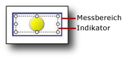

# Hinzufügen oder Löschen eines Indikators (Berichts-Generator und SSRS)
  In einem paginierten [!INCLUDE[ssRSnoversion_md](../../includes/ssrsnoversion-md.md)] -Bericht sind Indikatoren minimale Messgeräte, die den Zustand eines einzelnen Datenwerts auf einen Blick wiedergeben. Weitere Informationen dazu finden Sie unter [Indikatoren &#40;Berichts-Generator und SSRS&#41;](../../reporting-services/report-design/indicators-report-builder-and-ssrs.md).  
  
 Indikatoren werden im Allgemeinen in einer Tabelle oder einer Matrix in Zellen eingefügt, aber Sie können Indikatoren auch parallel mit Messgeräten, eingebettet in Messgeräte oder eigenständig verwenden.  
  
 Beim ersten Hinzufügen eines Indikators wird er standardmäßig so konfiguriert, dass Prozentsätze als Maßeinheiten verwendet werden. Die Prozentbereiche sind gleichmäßig über die Elemente des Indikatorsatzes verteilt, und der vom Indikator angezeigte Wertebereich entspricht dem übergeordneten Element des Indikators, z. B. einer Tabelle oder Matrix.  
  
 Sie können die Werte und die Status von Indikatoren aktualisieren. Weitere Informationen finden Sie in folgenden Themen:  
  
-   [Ändern von Indikatorsymbolen und Indikatorsätzen &#40;Berichts-Generator und SSRS&#41;](../../reporting-services/report-design/change-indicator-icons-and-indicator-sets-report-builder-and-ssrs.md)  
  
-   [Festlegen und Konfigurieren von Maßeinheiten &#40;Berichts-Generator und SSRS&#41;](../../reporting-services/report-design/set-and-configure-measurement-units-report-builder-and-ssrs.md)  
  
-   [Festlegen des Synchronisierungsbereichs &#40;Berichts-Generator und SSRS&#41;](../../reporting-services/report-design/set-synchronization-scope-report-builder-and-ssrs.md)  
  
 Da ein Indikator im Messgerätebereich positioniert wird, müssen Sie den Indikator statt des Bereichs auswählen, wenn Sie den Indikator mit dem Dialogfeld **Indikatoreigenschaften** oder dem Bereich **Eigenschaften** konfigurieren möchten. Die folgende Abbildung enthält einen ausgewählten Indikator in dessen Messgerätbereich.  
  
   
  
> [!NOTE]  
>  Abhängig von der Spaltenbreite und Länge der Datenwerte kann der Text in Tabellen- oder Matrixzellen umbrochen und in mehreren Zeilen angezeigt werden. In diesem Fall kann das Indikatorsymbol gestreckt und in der Form verändert werden, wodurch u. U. seine Lesbarkeit beeinträchtigt wird. Platzieren Sie den Indikator in einem Rechteck, um sicherzustellen, dass das Symbol nicht verzerrt wird.  
  
## So fügen Sie einer Tabelle oder einer Matrix einen Indikator hinzu  
  
1.  Öffnen Sie einen vorhandenen Bericht, oder erstellen Sie einen neuen Bericht, der eine Tabelle und eine Matrix mit den anzuzeigenden Daten enthält. Weitere Informationen finden Sie unter [Tabellen &#40;Berichts-Generator und SSRS&#41;](../../reporting-services/report-design/tables-report-builder-and-ssrs.md) oder [Matrizen](../../reporting-services/report-design/create-a-matrix-report-builder-and-ssrs.md).  
  
2.  Fügen Sie eine Spalte in die Tabelle oder Matrix ein. Weitere Informationen finden Sie unter [Einfügen oder Löschen einer Spalte &#40;Berichts-Generator und SSRS&#41;](../../reporting-services/report-design/insert-or-delete-a-column-report-builder-and-ssrs.md).  
  
3.  Klicken Sie optional auf der Registerkarte **Einfügen** auf **Rechteck**, und klicken Sie dann in der neuen Spalte auf eine Zelle.  
  
4.  Klicken Sie auf der Registerkarte **Einfügen** auf **Indikator**, und klicken Sie dann in der neuen Spalte auf eine Zelle.  
  
     Falls Sie einer Zelle ein Rechteck hinzugefügt haben, klicken Sie auf diese Zelle.  
  
5.  Klicken Sie im linken Bereich des Dialogfelds **Indikatorart auswählen** auf den gewünschten Indikatortyp und dann auf den Indikatorsatz.  
  
6.  Klicken Sie auf **OK**.  
  
7.  Klicken Sie auf den Indikator. Der Bereich **Messgerätdaten** wird geöffnet.  
  
8.  Klicken Sie im Bereich **Werte** in der Dropdownliste **(Keine Angabe)** auf das Feld, dessen Werte Sie als Indikator anzeigen lassen möchten.  
  
     Der Indikator ist so konfiguriert, dass Standardwerte verwendet werden. Standardmäßig sind Indikatoren so konfiguriert, dass Prozentsätze als Maßeinheiten verwendet werden, und die Prozentbereiche werden über die Elemente des Indikators gleichmäßig verteilt. Der vom Indikator gelieferte Wert verwendet den Bereich der nächsten Gruppe.  
  
## So löschen Sie einen Indikator für eine Tabelle oder eine Matrix  
  
1.  Klicken Sie mit der rechten Maustaste auf den Indikator, und klicken Sie dann auf **Löschen**.  
  
    > [!NOTE]  
    >  Ein Indikator kann in einem Messgerätbereich positioniert sein, der andere Indikatoren oder Messgeräte enthält. Wenn die Messgerätbereiche mehrere Elemente enthalten, stellen Sie sicher, dass Sie zum Löschen auf den Indikator klicken und nicht auf den Messgerätbereich. Wenn Sie klicken und den Messgerätbereich entfernen, werden die Messgerätbereiche und alle Elemente darin gelöscht.  
  
2.  Klicken Sie auf **Löschen**.  
  
## Siehe auch  
 [Indikatoren &#40;Berichts-Generator und SSRS&#41;](../../reporting-services/report-design/indicators-report-builder-and-ssrs.md)  
  
  
