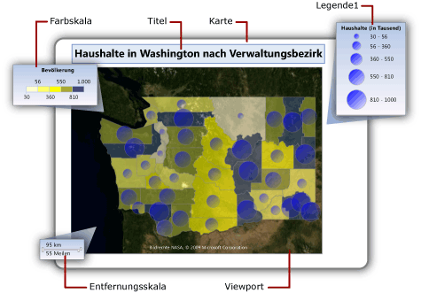

# Ändern der Kartenlegenden, Farbskala und zugeordneten Regeln (Berichts-Generator und SSRS)
  In einem paginierten [!INCLUDE[ssRSnoversion_md](../../includes/ssrsnoversion-md.md)] -Bericht kann eine Karte Legenden, eine Farbskala und eine Entfernungsskala enthalten. Diese Teile einer Karte erleichtern Benutzern die Interpretation der Datenvisualisierung auf der Karte.  
  
 Legenden enthalten die folgenden Teile einer Karte:  
  
-   **Kartenlegende:** Enthält Informationen zur Interpretation der analytischen Daten, durch die die Anzeige eines Kartenelements auf einer Kartenebene verändert wird. Eine Karte kann mehrere Legenden enthalten. Für jede Kartenebene geben Sie die zu verwendende Legende an. Eine Legende kann eine Anleitung für mehrere Kartenebenen enthalten.  
  
-   **Farbskala:** Enthält Informationen zur Interpretation der Farben auf der Karte. Eine Karte enthält eine Farbskala. Die Daten für die Farbskala können aus mehreren Ebenen stammen.  
  
-   **Entfernungsskala:** Enthält Informationen zur Interpretation des Maßstabs der Karte. Eine Karte enthält eine Entfernungsskala. Der aktuelle Zoomwert des Kartenviewports bestimmt die Entfernungsskala.  
  
   
  
##   So ändern Sie die Position einer Legende in Bezug zum Viewport  
  
#### So ändern Sie die Position einer Legende in Bezug zum Viewport  
  
1.  Klicken Sie in der Entwurfsansicht mit der rechten Maustaste in der Legende, und öffnen Sie die  *\<Berichtselement >***Eigenschaften** Seite.  
  
2.  Klicken Sie in **Position**auf den Ort, der angibt, wo die Legende relativ zum Viewport angezeigt wird.  
  
3.  Um die Legende außerhalb des Viewports anzuzeigen, wählen Sie **anzeigen \<Berichtselement > außerhalb des kartenviewports**.  
  
4.  [!INCLUDE[clickOK](../../includes/clickok-md.md)]  
  
    > [!NOTE]  
    >  In der Vorschau werden die zu skalierenden Kartenlegenden und Farbskalen nur angezeigt, wenn es Ergebnisse von den Regeln gibt, die sich auf diese Legende beziehen. Wenn keine anzuzeigenden Elemente vorhanden sind, wird die Legende nicht im gerenderten Bericht angezeigt.  
  
##   So ändern Sie das Layout einer Kartenlegende  
  
#### So ändern Sie das Layout einer Kartenlegende  
  
1.  Klicken Sie in der Entwurfsansicht mit der rechten Maustaste auf die Legende, und öffnen Sie die Seite **Legendeneigenschaften** .  
  
2.  Klicken Sie in **Legendenlayout**auf das Tabellenlayout, das Sie für die Legende verwenden möchten. Wenn Sie auf andere Optionen klicken, wird das Layout auf der Entwurfsoberfläche geändert.  
  
3.  [!INCLUDE[clickOK](../../includes/clickok-md.md)]  
  
##   So blenden Sie einen Kartenlegendentitel ein oder aus  
  
#### So blenden Sie einen Kartenlegendentitel ein oder aus  
  
-   Klicken Sie auf der Entwurfsoberfläche mit der rechten Maustaste auf die Kartenlegende, und klicken Sie anschließend auf **Legendentitel anzeigen**.  
  
##   So blenden Sie einen Farbskalatitel ein oder aus  
  
#### So blenden Sie einen Farbskalatitel ein oder aus  
  
-   Klicken Sie auf der Entwurfsoberfläche mit der rechten Maustaste auf die Farbskala, und klicken Sie anschließend auf **Farbskalatitel anzeigen**.  
  
##   So verschieben Sie Elemente aus der ersten Legende  
 Erstellen Sie beliebig viele weitere Legenden, aktualisieren Sie dann die Regeln für jede Kartenebene, und legen Sie fest, in welcher Legende die Regelergebnisse angezeigt werden sollen.  
  
#### So erstellen Sie eine neue Legende  
  
-   Klicken Sie in der Entwurfsansicht mit der rechten Maustaste außerhalb des Viewports auf die Karte, und klicken Sie anschließend auf **Legende hinzufügen**.  
  
     Eine neue Legende wird auf der Karte angezeigt.  
  
#### So zeigen Sie Regelergebnisse in einer Legende an  
  
1.  Klicken Sie in der Entwurfsansicht auf die Karte, bis der Kartenbereich angezeigt wird.  
  
2.  Mit der rechten Maustaste in der Schicht mit den Daten, die Sie möchten, und klicken Sie dann auf  *\<kartenelementtyp >***Farbregel**.  
  
3.  Klicken Sie auf **Legende**.  
  
4.  Klicken Sie in der Dropdownliste **In dieser Legende anzeigen** auf den Namen der Legende, in der die Regelergebnisse angezeigt werden sollen.  
  
5.  [!INCLUDE[clickOK](../../includes/clickok-md.md)]  
  
##   So verändern Sie Kartenelementfarben auf Grundlage eines Vorlagenstils  
  
#### So verändern Sie Kartenelementfarben auf Grundlage eines Vorlagenstils  
  
1.  Klicken Sie in der Entwurfsansicht auf die Karte, bis der Kartenbereich angezeigt wird.  
  
2.  Mit der rechten Maustaste in der Schicht mit den Daten, die Sie möchten, und klicken Sie dann auf  *\<kartenelementtyp >***Farbregel**.  
  
3.  Klicken Sie auf **Vorlagenstil anwenden**.  
  
     Ein Vorlagenstil gibt eine Schrift, eine Rahmenart und eine Farbpalette an. Jedem Kartenelement wird eine andere Farbe von der Farbpalette für das Design, das im Karten-Assistenten oder Kartenebenen-Assistenten angegeben wurde, zugewiesen. Dies ist die einzige Option, die für Ebenen gilt, die keine analytischen Daten zugeordnet haben.  
  
4.  [!INCLUDE[clickOK](../../includes/clickok-md.md)]  
  
##   So verändern Sie Kartenelementfarben auf Grundlage der Farbpalette  
  
#### So verändern Sie Kartenelementfarben auf Grundlage der Farbpalette  
  
1.  Klicken Sie in der Entwurfsansicht auf die Karte, bis der Kartenbereich angezeigt wird.  
  
2.  Mit der rechten Maustaste in der Schicht mit den Daten, die Sie möchten, und klicken Sie dann auf  *\<kartenelementtyp >***Farbregel**.  
  
3.  Klicken Sie auf **Daten mithilfe der Farbpalette anzeigen**.  
  
     Diese Option verwendet eine integrierte oder benutzerdefinierte Palette, die Sie angeben. Auf Grundlage von verknüpften analytischen Daten wird jedem Kartenelement eine andere Farbe oder ein Schatten der Farbe auf der Palette zugewiesen.  
  
4.  Geben Sie in **Datenfeld**den Namen des Felds ein, das die analytischen Daten enthält, die Sie durch Farbe darstellen möchten.  
  
5.  Wählen Sie unter **Palette**den Namen der zu verwendenden Palette in der Dropdownliste aus.  
  
6.  [!INCLUDE[clickOK](../../includes/clickok-md.md)]  
  
##   So verändern Sie Kartenelementfarben auf Grundlage des Farbbereichs  
  
#### So verändern Sie Kartenelementfarben auf Grundlage des Farbbereichs  
  
1.  Klicken Sie in der Entwurfsansicht auf die Karte, bis der Kartenbereich angezeigt wird.  
  
2.  Mit der rechten Maustaste in der Schicht mit den Daten, die Sie möchten, und klicken Sie dann auf  *\<kartenelementtyp >***Farbregel**.  
  
3.  Klicken Sie auf **Daten mithilfe von Farbbereichen anzeigen**.  
  
     Durch diese Option werden in Kombination mit den Start-, Mittel- und Endfarben, die Sie auf dieser Seite angeben, und den Optionen, die Sie auf der Seite **Verteilung** angeben, die verknüpften analytischen Daten in Bereiche unterteilt. Der Berichtsprozessor weist jedem Kartenelement die entsprechende Farbe auf Grundlage der zugeordneten Daten und dem Bereich zu, in die es fällt.  
  
4.  Geben Sie in **Datenfeld**den Namen des Felds ein, das die analytischen Daten enthält, die Sie durch Farbe darstellen möchten.  
  
5.  Geben Sie in **Startfarbe**die Farbe an, die für den niedrigsten Bereich verwendet werden soll.  
  
6.  Geben Sie in **Mittelfarbe**die Farbe an, die für den mittleren Bereich verwendet werden soll.  
  
7.  Geben Sie in **Endfarbe**die Farbe an, die für den höchsten Bereich verwendet werden soll.  
  
8.  [!INCLUDE[clickOK](../../includes/clickok-md.md)]  
  
##   So verändern Sie Kartenelementfarben auf Grundlage benutzerdefinierter Farben  
  
#### So verändern Sie Kartenelementfarben auf Grundlage benutzerdefinierter Farben  
  
1.  Klicken Sie in der Entwurfsansicht auf die Karte, bis der Kartenbereich angezeigt wird.  
  
2.  Mit der rechten Maustaste in der Schicht mit den Daten, die Sie möchten, und klicken Sie dann auf  *\<kartenelementtyp >***Farbregel**.  
  
3.  Klicken Sie auf **Daten mithilfe benutzerdefinierter Farben anzeigen**.  
  
     Diese Option verwendet die Liste der Farben, die Sie angeben. Auf Grundlage von verknüpften analytischen Daten wird jedem Kartenelement eine Farbe aus der Liste zugewiesen. Wenn es mehr Kartenelemente als Farben gibt, wird keine Farbe zugewiesen.  
  
4.  Geben Sie in **Datenfeld**den Namen des Felds ein, das die analytischen Daten enthält, die Sie durch Farbe darstellen möchten.  
  
5.  Klicken Sie unter **Benutzerdefinierte Farben**auf **Hinzufügen** , um jede benutzerdefinierte Farbe anzugeben.  
  
6.  [!INCLUDE[clickOK](../../includes/clickok-md.md)]  
  
##   So legen Sie Verteilungsoptionen für eine Legende fest  
  
#### So legen Sie Verteilungsoptionen für eine Legende fest  
  
1.  Klicken Sie in der Entwurfsansicht auf die Karte, bis der Kartenbereich angezeigt wird.  
  
2.  Mit der rechten Maustaste in der Schicht mit den Daten, die Sie möchten, und klicken Sie dann auf  *\<kartenelementtyp >***Farbregel**.  
  
3.  Wählen Sie die **aten mithilfe** \<Regeltyp > Option. Um Verteilungsoptionen zu verwenden, müssen Sie Bereiche auf der Seite **Verteilung** auf Grundlage analytischer Daten erstellen, die der Ebene zugeordnet sind.  
  
4.  Klicken Sie auf **Verteilung**.  
  
5.  Wählen Sie einen der folgenden Verteilungstypen aus:  
  
    -   **EqualInterval**. Gibt Bereiche an, die die Daten in gleiche Bereichsintervalle unterteilen.  
  
    -   **EqualDistribution**. Gibt Bereiche an, die diese Daten teilen, damit jeder Bereich eine gleiche Anzahl von Elementen hat.  
  
    -   **Optimal**. Gibt Bereiche an, die automatisch die Verteilung zum Erstellen von ausgewogenen Unterbereichen anpassen.  
  
    -   **Benutzerdefiniert**. Geben Sie Ihre eigene Anzahl von Bereichen an, um die Verteilung von Werten zu steuern.  
  
     Weitere Informationen zu Verteilungsoptionen finden Sie unter [Unterschiedliche Polygon-, Linien- und Punktanzeigen bei der Verwendung von Regeln und analytischen Daten &#40;Berichts-Generator und SSRS&#41;](../../reporting-services/report-design/vary-polygon-line-and-point-display-by-rules-and-analytical-data.md).  
  
6.  Geben Sie in **Anzahl der Unterbereiche**die gewünschte Anzahl von Unterbereichen ein. Beim Verteilungstyp **Optimal**wird die Anzahl von Unterbereichen automatisch berechnet.  
  
7.  Geben Sie in **Bereichsanfang**einen minimalen Bereichswert ein. Alle Werte die kleiner als die Anzahl sind, sind die gleichen im Bereichsminimum.  
  
8.  Geben Sie in **Bereichsende**einen maximalen Bereichswert ein. Alle Werte die größer als diese Zahl sind, entsprechen dem Bereichsmaximum.  
  
9. [!INCLUDE[clickOK](../../includes/clickok-md.md)]  
  
##   So ändern Sie den Inhalt einer Regellegende  
  
#### So ändern Sie den Inhalt einer Farb-, Größen-, Breiten- oder Markertyplegende  
  
1.  Klicken Sie in der Entwurfsansicht auf die Karte, bis der Kartenbereich angezeigt wird.  
  
2.  Mit der rechten Maustaste in der Schicht mit den Daten, die Sie möchten, und klicken Sie dann auf  *\<kartenelementtyp >***Regel**.  
  
3.  Überprüfen Sie, ob **aten mithilfe** \< *Regeltyp*> ausgewählt ist.  
  
4.  Überprüfen Sie in **Datenfeld**, ob die analytischen Daten, die Sie auf der Ebene visuell darstellen, ausgewählt sind.  
  
    > [!NOTE]  
    >  Wenn keine Felder in der Dropdownliste angezeigt werden, klicken mit der rechten Maustaste auf die Ebene, und klicken Sie anschließend auf **Ebenendaten** , um die Seite „Analytische Daten“ im Dialogfeld „Kartenebenendaten-Eigenschaften“, zu öffnen. Überprüfen Sie auch, ob Sie analytische Daten für diese Ebene angegeben haben.  
  
5.  Klicken Sie auf **Legende**.  
  
6.  Wählen Sie unter **In dieser Legende anzeigen**die Kartenlegende für die Anzeige der Regelergebnisse aus.  
  
7.  [!INCLUDE[clickOK](../../includes/clickok-md.md)]  
  
##   So ändern Sie den Inhalt der Farbskala  
  
#### So ändern Sie den Inhalt der Farbskala oder einer Farblegende  
  
1.  Klicken Sie in der Entwurfsansicht auf die Karte, bis der Kartenbereich angezeigt wird.  
  
2.  Mit der rechten Maustaste in der Schicht mit den Daten, die Sie möchten, und klicken Sie dann auf  *\<kartenelementtyp >***Farbregel**.  
  
3.  Aktivieren Sie die zu verwendende Farbregeloption. Um Elemente in einer kartenlegende oder Farbskala anzuzeigen, müssen Sie eine der Auswählen der **aten mithilfe** \<Regeltyp > Optionen.  
  
4.  Überprüfen Sie in **Datenfeld**, ob die analytischen Daten, die Sie auf der Ebene visuell darstellen, ausgewählt sind.  
  
    > [!NOTE]  
    >  Wenn keine Felder in der Dropdownliste angezeigt werden, klicken mit der rechten Maustaste auf die Ebene, und klicken Sie anschließend auf **Ebenendaten** , um die Seite „Analytische Daten“ im Dialogfeld „Kartenebenendaten-Eigenschaften“, zu öffnen. Überprüfen Sie auch, ob Sie analytische Daten für diese Ebene angegeben haben.  
  
5.  Klicken Sie auf **Legende**.  
  
6.  Wählen Sie unter **Farbskalaoptionen**die Option **In Farbskala anzeigen** aus, um die Regelergebnisse in der Farbskala anzuzeigen. Sie können diese Option für mehrere Farbregeln angeben.  
  
7.  [!INCLUDE[clickOK](../../includes/clickok-md.md)]  
  
##   So entfernen Sie alle Elemente aus einer Legende  
  
#### So blenden Sie Elemente basierend auf einer Regel aus  
  
1.  Klicken Sie in der Entwurfsansicht auf die Karte, bis der Kartenbereich angezeigt wird.  
  
2.  Mit der rechten Maustaste in der Schicht mit den Daten, die Sie möchten, und klicken Sie dann auf  *\<kartenelementtyp >***Regel**.  
  
3.  Klicken Sie auf **Legende**.  
  
4.  [!INCLUDE[clickOK](../../includes/clickok-md.md)]  
  
##   So ändern Sie das Format des Inhalts einer Legende  
 Legen Sie Legendenoptionen für die zugeordnete Regel der Kartenlegende fest.  
  
#### So ändern Sie das Format des Inhalts einer Legende  
  
1.  Klicken Sie in der Entwurfsansicht auf die Karte, bis der Kartenbereich angezeigt wird.  
  
2.  Mit der rechten Maustaste in der Schicht mit den Daten, die Sie möchten, und klicken Sie dann auf  *\<kartenelementtyp >***Regel**.  
  
3.  Klicken Sie auf **Legende**.  
  
4.  Unter**Legendentext** werden Schlüsselwörter angezeigt, die die in der Legende angezeigten Daten angeben. Verwenden Sie Kartenschlüsselwörter und benutzerdefinierte Formate, um das Format des Legendentexts zu steuern. #FROMVALUE {C2} gibt z. B. ein Währungsformat mit zwei Dezimalstellen an. Weitere Informationen finden Sie unter [Unterschiedliche Polygon-, Linien- und Punktanzeigen bei der Verwendung von Regeln und analytischen Daten &#40;Berichts-Generator und SSRS&#41;](../../reporting-services/report-design/vary-polygon-line-and-point-display-by-rules-and-analytical-data.md).  
  
5.  [!INCLUDE[clickOK](../../includes/clickok-md.md)]  
  
## Siehe auch  
 [Karten &#40;Berichts-Generator und SSRS&#41;](../../reporting-services/report-design/maps-report-builder-and-ssrs.md)   
 [Hinzufügen, Ändern oder Löschen einer Karte oder einer Kartenebene &#40;Berichts-Generator und SSRS&#41;](../../reporting-services/report-design/add-change-or-delete-a-map-or-map-layer-report-builder-and-ssrs.md)   
 [Anpassen der Daten und der Anzeige einer Karte oder einer Kartenebene &#40;Berichts-Generator und SSRS&#41;](../../reporting-services/report-design/customize-the-data-and-display-of-a-map-or-map-layer-report-builder-and-ssrs.md)   
 [Problembehandlung bei Berichten: Kartenberichte &#40;Berichts-Generator und SSRS&#41;](../../reporting-services/report-design/troubleshoot-reports-map-reports-report-builder-and-ssrs.md)   
 [Karten-Assistent und Kartenebenen-Assistent &#40;Berichts-Generator und SSRS&#41;](../../reporting-services/report-design/map-wizard-and-map-layer-wizard-report-builder-and-ssrs.md)  
  
  
