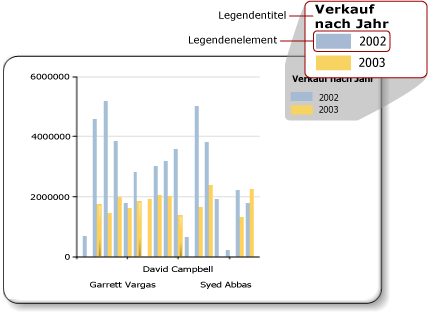

# Diagrammlegende - Formatierung (Berichts-Generator)
  Die Diagrammlegende enthält Beschreibungen für jede Kategorie in einem Diagramm. Eine Legende umfasst immer ein oder mehrere Legendenelemente. Jedes Legendenelement besteht aus einem farbigen Kästchen, das für die Reihe steht, und einer Textzeichenfolge, die die Reihe beschreibt. Dies ist in der folgenden Abbildung dargestellt.  
  
   
  
 Ein Legendenelement ist im Diagramm mit einer einzelnen Reihe verknüpft, mit Ausnahme von Formdiagrammen, bei denen die Legende mit einzelnen Datenpunkten verknüpft ist. Das Diagramm fügt Elemente basierend auf den Reihen, die von den Daten generiert werden, automatisch der Legende hinzu.  
  
 Sie können Legenden über das Dialogfeld **Legendeneigenschaften** oder im Bereich Eigenschaften formatieren. Klicken Sie mit der rechten Maustaste auf die Legende, und klicken Sie auf **Legendeneigenschaften** , um Werte für Legendentext, Hintergrundfarbe, Rahmen und 3D-Effekte zu ändern. Zum Ändern der Werte für den Legendentitel markieren Sie die Legende, klicken mit der rechten Maustaste auf den Legendentitel und klicken dann auf **Legendentiteleigenschaften**.  
  
 Sie können einer Legende keine Bilder, zusätzliche Spalten oder sonstige zusätzliche Elemente hinzufügen.  
  
> [!NOTE]  
>  [!INCLUDE[ssRBRDDup](../../includes/ssrbrddup-md.md)]  
  
## Sortieren von Legendenelementen in der Legende  
 Reihen werden in der Legende in der Reihenfolge sortiert, in der sie vom [!INCLUDE[ssRSnoversion](../../includes/ssrsnoversion-md.md)] -Verarbeitungsmodul verarbeitet werden. Sie können die Reihenfolge ändern, indem Sie die Reihenfolge der Felder in der Datenfeld-Ablagezone ändern. Wenn Sie eine Reihengruppierung verwenden, sind die Reihendaten erst bei der Verarbeitung bekannt. Es gibt also keine Möglichkeit, diese Elemente neu zu sortieren. Sie können die Änderungen in der Vorschau anzeigen. Weitere Informationen zur Reihengruppierung finden Sie unter [Diagramme &#40;Berichts-Generator und SSRS&#41;](../../reporting-services/report-design/charts-report-builder-and-ssrs.md).  
  
 Sie können für jede Reihe einzeln verhindern, dass sie in der Legende angezeigt wird. Wenn Sie die Reihengruppierung verwenden, werden alle Reihen mit Bezug zum Datenfeld ausgeblendet. Weitere Informationen finden Sie unter [Ausblenden von Legendenelementen im Diagramm &#40;Berichts-Generator und SSRS&#41;](../../reporting-services/report-design/chart-legend-hide-items-report-builder.md).  
  
## Ändern des Texts oder der Farbe eines Legendenelements in der Legende  
 Wenn Sie ein Feld in der Datenfeldablagezone eines Diagramms ablegen, wird automatisch ein Legendenelement mit dem Namen dieses Felds erstellt. Standardmäßig wird der Text für ein Legendenelement jeweils vom Namen des Datenfelds abgeleitet. Alle Legendenelemente im Diagramm sind mit jeweils einer Reihe verknüpft, mit Ausnahme von Formdiagrammen, bei denen die Legende stattdessen mit einzelnen Datenpunkten verknüpft ist. Wenn Sie in einem Formdiagramm eine Kategoriegruppe definieren, wird der Text der Legendenelemente jeweils von der Zeichenfolgendarstellung dieser Kategoriegruppe abgeleitet. Sie können bei Kreis-, Ring- und Trichterdiagrammen eigenen Bezeichnungstext festlegen, um andere Informationen außer der Kategoriegruppenbezeichnung anzuzeigen, die sich auf die einzelnen Datenpunkte in der Legende beziehen. Wählen Sie hierfür die Legende aus, und legen Sie im Dialogfeld **Reiheneigenschaften** bzw. unter der Eigenschaft **LegendText** im Eigenschaftenbereich den Legendentext fest. Weitere Informationen finden Sie unter [Ändern des Texts eines Legendenelements &#40;Berichts-Generator und SSRS&#41;](../../reporting-services/report-design/chart-legend-change-item-text-report-builder.md).  
  
 Sie können unter der Eigenschaft **LegendText** bzw. im Dialogfeld **Reiheneigenschaften** zudem diagrammspezifische Schlüsselwörter für häufig referenzierte Attribute (hierbei wird zwischen Groß- und Kleinschreibung unterschieden) definieren. Diese Schlüsselwörter werden zur Laufzeit durch ihre Datendarstellung ersetzt. Diese Vorgehensweise ist für Formdiagramme geeignet, da Sie so Informationen zu spezifischen Datenpunkten anzeigen können. Weitere Informationen finden Sie unter [Formatieren von Datenpunkten in einem Diagramm &#40;Berichts-Generator und SSRS&#41;](../../reporting-services/report-design/formatting-data-points-on-a-chart-report-builder-and-ssrs.md).  
  
 Für das farbige Kästchen, das für ein Legendenelement jeweils angezeigt wird, wird die Füllfarbe der entsprechenden Reihe übernommen. Wenn Sie die Farbe ändern möchten, die für ein Legendenelement angezeigt wird, müssen Sie die Farbe der entsprechenden Reihe ändern. Weitere Informationen finden Sie unter [Formatieren von Reihenfarben in einem Diagramm &#40;Berichts-Generator und SSRS&#41;](../../reporting-services/report-design/formatting-series-colors-on-a-chart-report-builder-and-ssrs.md).  
  
## Entfernen von zusätzlichen Legendenelementen aus der Legende  
 Die Legende ist immer mit einer Reihe verknüpft. Wenn ein Legendenelement in der Legende angezeigt wird, die entsprechende Reihe im Diagramm jedoch nicht zu sehen ist, liegt dies meist daran, dass die Reihe keine Werte enthält. Sie müssen die Reihe entfernen, um das Legendenelement aus der Legende zu entfernen. Um eine Reihe aus dem Diagramm zu entfernen, können Sie mit der rechten Maustaste auf die angegebene Reihe klicken und die Option Reihe löschen wählen.  
  
## Neuanordnen der Legende  
 Die Diagrammfläche ist der rechteckige Bereich, der die Achsenbezeichnungen und den Plotbereich umfasst. Sie können die Legende an zwölf verschiedene Positionen ziehen, wenn die Legende außerhalb der Diagrammfläche angeordnet wird. Standardmäßig wird die Legende außerhalb der Diagrammfläche angezeigt. Sie können die Position auch im Dialogfeld **Legendeneigenschaften** festlegen.  
  
 Es ist nicht möglich, die Legende aus der Diagrammfläche bzw. in die Diagrammfläche zu ziehen. Wenn Sie die Legende innerhalb der Diagrammfläche anordnen möchten, wählen Sie im Dialogfeld **Legendeneigenschaften** unter **Andocken**in der Dropdownliste den Eintrag **Standard** und deaktivieren die Option **Legende außerhalb von Diagrammfläche** anzeigen. Indem Sie die Legende innerhalb der Diagrammfläche anordnen, können Sie den vorhandenen Platz für die Datenpunkte im Diagramm vergrößern. Je nach Dataset kann dies jedoch dazu führen, dass die Legende auf der Diagrammfläche einige Datenpunkte überlagert, was die Lesbarkeit des Diagramms erschwert.  
  
## Horizontales Anzeigen von Legendenelementen  
 Standardmäßig wird die Legende als eine Liste mit einer oder mehreren Zeilen formatiert, die jeweils ein Legendenelement enthalten. Der Legendenbereich wird erweitert, um alle Legendenelemente aufnehmen zu können. Wenn die Legende nicht erweitert werden kann, werden Auslassungspunkte (…) angezeigt. Je nach angegebenem Legendenstil kann die Legende vertikal oder horizontal erweitert werden. Sie können den Layoutstil im Dialogfeld **Legendeneigenschaften** ändern, oder Sie können den zugeordneten Platz bearbeiten, um alle Legendenelemente anzuzeigen.  
  
 Um die Legende horizontal anzuzeigen, docken Sie die Legende im Diagramm oben oder unten an. Dies bewirkt, dass die Legende horizontal erweitert wird. Außerdem können Sie die „Layout“-Eigenschaft auf **Zeile** oder **Breite Tabelle**festlegen. Legen Sie die „MaxAutoSize“-Eigenschaft im Bereich „Eigenschaften“ fest, um den vertikalen Platz vorzugeben, der der Legende beim Andocken oben oder unten auf der Diagrammfläche zugeordnet wird.  
  
## Formatieren des Legendentexts  
 Sie können die Schriftart, den Stil und die Farbe des Legendentexts im Dialogfeld **Legendeneigenschaften** auf der Seite **Schriftart** ändern.  
  
 Standardmäßig wird der Legendentext nicht optimiert, damit er dem Legendenbereich entspricht. Um den Legendentext automatisch an den zugewiesenen Platz anzupassen, setzen Sie die „AutoFitTextDisabled“-Eigenschaft auf **False** und legen für die „MinFontSize“-Eigenschaft die niedrigste Größe fest, die noch akzeptabel ist und eine Optimierung der Legende ermöglicht.  
  
## Siehe auch  
 [Legendeneigenschaften (Dialogfeld), Allgemein &#40;Berichts-Generator und SSRS&#41;](http://msdn.microsoft.com/library/db718f8f-f185-422f-871c-96f0749e5893)   
 [Ändern des Texts eines Legendenelements &#40; Berichts-Generator und SSRS &#41;](../../reporting-services/report-design/chart-legend-change-item-text-report-builder.md)   
 [Formatieren eines Diagramms &#40; Berichts-Generator und SSRS &#41;](../../reporting-services/report-design/formatting-a-chart-report-builder-and-ssrs.md)   
 [Formatieren von Reihenfarben in einem Diagramm &#40; Berichts-Generator und SSRS &#41;](../../reporting-services/report-design/formatting-series-colors-on-a-chart-report-builder-and-ssrs.md)   
 [Diagramme &#40; Berichts-Generator und SSRS &#41;](../../reporting-services/report-design/charts-report-builder-and-ssrs.md)   
 [Ausblenden von Legendenelementen im Diagramm &#40; Berichts-Generator und SSRS &#41;](../../reporting-services/report-design/chart-legend-hide-items-report-builder.md)   
 [Definieren von Farben in einem Diagramm mit einer Palette &#40;Berichts-Generator und SSRS&#41;](../../reporting-services/report-design/define-colors-on-a-chart-using-a-palette-report-builder-and-ssrs.md)  
  
  
