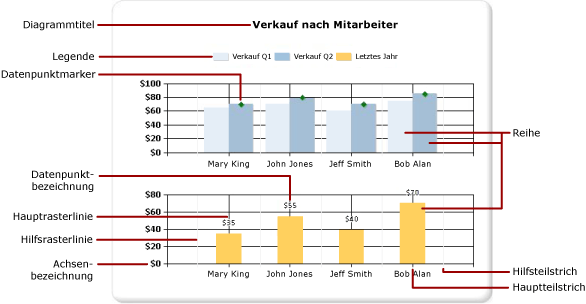
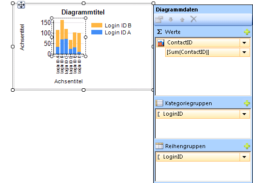
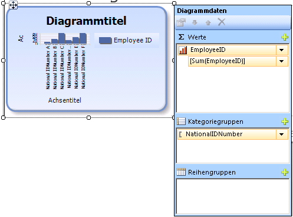

# Diagramme (Berichts-Generator und SSRS)
Erfahren Sie, mit Diagrammdatenbereichen für die Leser Ihre [!INCLUDE[ssRSnoversion_md](../../includes/ssrsnoversion-md.md)] paginierte Berichte zu verstehen, große Mengen aggregierter Daten auf einen Blick.  

Weitere Zeit, die Sie aufwenden müssen sorgfältig vorbereiten und auswerten Ihrer Daten vor dem Erstellen eines Diagramms, desto einfacher kostenintensiver wird Ihre Diagramme schnell und effizient zu gestalten. Um Hilfe zu erhalten, welcher Diagrammtyp auswählen, finden Sie unter [Diagrammtypen](../../reporting-services/report-design/chart-types-report-builder-and-ssrs.md) zum Experimentieren mit Diagrammen sofort zu starten, finden Sie unter der Balken, Spalte, Sparkline und Kreisdiagramm Lernprogramme in [Lernprogrammen für Berichts-Generator](../../reporting-services/report-builder-tutorials.md).  
  
 Die folgende Abbildung zeigt viele der verschiedenen Elemente, die im Diagramm verwendet werden.  
  
   
  
 Sie können Diagramme getrennt von einem Bericht als veröffentlichen *berichtsteile*. Weitere Informationen finden Sie unter [Berichtsteile](../../reporting-services/report-design/report-parts-report-builder-and-ssrs.md).
  
 
##   Entwerfen eines Diagramms  
 Nachdem Sie der Entwurfsoberfläche einen Diagrammdatenbereich hinzugefügt haben, können Sie Berichtsdataset-Felder für numerische und nicht numerische Daten in den Diagrammdatenbereich des Diagramms ziehen. Wenn Sie in der Entwurfsoberfläche auf das Diagramm klicken, wird der Diagrammdatenbereich mit drei untergeordneten Bereichen angezeigt: Kategoriegruppen, Reihengruppen und Werte. Wenn der Bericht über ein freigegebenes oder eingebettetes Dataset verfügt, werden die Felder im Dataset im Berichtsdatenbereich angezeigt. Ziehen Sie Felder aus dem Dataset in den entsprechenden Bereich im Bereich Diagrammdaten. Wenn einem Bereich des Diagramms ein Feld hinzugefügt wird, wird in der Standardeinstellung in [!INCLUDE[ssRSnoversion](../../includes/ssrsnoversion-md.md)] ein Aggregat für das Feld berechnet. Sie können auch die Reihengruppierung verwenden, um Reihen dynamisch zu generieren. Ein Diagramm ist [wie eine Matrix organisiert](#SimilarMatrix).  
  
   
  
> [!NOTE]  
>  Die Daten im Diagramm unterscheiden sich zur Entwurfszeit von den Daten im Diagramm, wenn der Bericht verarbeitet wird. Es ist nicht die wirklichen Daten. Es handelt sich um generierte Daten, die hinzugefügt wurden, damit Sie das Diagramm zur Entwurfszeit mit einer Vorstellung von dessen tatsächlicher Darstellung erstellen können.  
  
##  Ein Diagramm wie z. B. eine Matrix ist  
 Eine Möglichkeit, die Funktionsweise von Diagrammen zu veranschaulichen, ist der Vergleich mit Matrizen.  
  
   
  
 Begrifflich ist ihre Organisation identisch:  
  
-   Die Spaltengruppe der Matrix ähnelt dem kategoriegruppenbereich im Diagramm.  
  
-   Die Zeilengruppe in der Matrix ähnelt dem reihengruppenbereich im Diagramm.  
  
-   Der Datenbereich in der Matrix ist z. B. den Bereich der Werte im Diagramm.  
  
 
##   Hinzufügen von Daten zum Diagramm  
 Angenommen, Sie verfügen über einen Bericht, in dem der Vertrieb nach Namen anzeigt wird. Sie legen das Feld Vollständiger Name im Kategoriegruppenbereich und das Feld Vertrieb im Wertebereich ab.  
  
 Wenn Sie das Feld Vertrieb im Wertebereich ablegen, wird der Text des Datenfelds in der Legende angezeigt, und die Daten aus diesem numerischen Feld werden zu einem einzelnen Wert aggregiert. Standardmäßig wird der Wert mit der integrierten Funktion SUM aggregiert. Der Diagrammdatenbereich enthält einen einfachen Ausdruck für das Feld. Im Beispiel wird `[Sum(Sales)]` für den Feldausdruck `=Sum(Fields!Sales.Value)`angezeigt. Wenn keine Gruppen angegeben werden, zeigt das Diagramm nur einen Datenpunkt an. Um mehrere Datenpunkte anzuzeigen, müssen Sie die Daten gruppieren, indem Sie ein Gruppierungsfeld hinzufügen. Wenn Sie das Feld Name dem Kategoriegruppenbereich hinzufügen, wird dem Diagramm automatisch ein Gruppierungsfeld mit demselben Namen wie das Feld hinzugefügt. Wenn Felder hinzugefügt werden, in denen Werte entlang der x- und y-Achse definiert werden, verfügt das Diagramm über genügend Informationen, um die Daten korrekt zu zeichnen.  
  
   
  
 Wenn der Reihengruppenbereich leer bleibt, wird die Anzahl der Reihen zur Entwurfszeit festgelegt. In diesem Beispiel ist Vertrieb die einzige im Diagramm angezeigte Reihe.  
  
 
##   Kategorie- und Reihengruppen in einem Diagramm  
 Diagramme unterstützen geschachtelte Kategorie- und Reihengruppen. In Diagrammen werden keine Detaildaten angezeigt. Fügen Sie Gruppen einem Diagramm hinzu, indem Sie Datasetfelder in die Kategorie- und Reihenablagezonen für ein ausgewähltes Diagramm ziehen.  
  
 Formdiagramme, z. B. Kreisdiagramme, unterstützen Kategoriegruppen und geschachtelte Kategoriegruppen. Andere Diagramme, z. B. Balkendiagramme, unterstützen Kategoriegruppen und Reihengruppen. Sie können Gruppen schachteln, müssen jedoch sicherstellen, dass die Anzahl der Kategorien oder Reihen nicht die Lesbarkeit der Informationen im Diagramm erschwert.  
  
### Hinzufügen einer Reihengruppierung zu einem Diagramm  
 Wenn Sie dem Reihengruppenbereich ein Feld hinzufügen, hängt die Anzahl der Reihen von den im Feld enthaltenen Daten ab. Gehen Sie vom bereits weiter oben vorgestellten Beispiel aus, und nehmen Sie an, dass Sie dem Reihengruppenbereich das Feld Jahr hinzufügen. Die Anzahl der Werte im Feld Jahr bestimmt die Anzahl der im Diagramm angezeigten Reihen. Wenn das Feld Jahr die Jahre 2004, 2005 und 2006 enthält, werden im Diagramm drei Reihen für jedes Feld im Wertebereich angezeigt.  
  
##   Überlegungen zu Datasets vor dem Erstellen eines Diagramms  
 Diagramme stellen eine Zusammenfassungsansicht Ihrer Daten bereit. Bei großen Datasets können die Informationen in einem Diagramm jedoch verdeckt oder unlesbar werden. So können fehlende oder NULL-Datenpunkte, für einen Diagrammtyp schlecht geeignete Datentypen sowie erweiterte Anwendungen, wie das Kombinieren von Diagrammen mit Tabellen, die Lesbarkeit eines Diagramms beeinträchtigen. Bevor Sie ein Diagramm erstellen, sollten Sie daher Ihre Daten sorgfältig aufbereiten und analysieren, sodass Sie Ihre Diagramme schnell und effizient gestalten können.  
  
 Sie können einem Bericht so viele Diagramme hinzufügen, wie Sie möchten. Ein Diagramm ist wie jeder andere Datenbereich, z. B. eine Matrix oder eine Tabelle, an ein einzelnes Dataset gebunden. Wenn Sie mehrere Datasets in einem Diagramm anzeigen möchten, können Sie ein zusätzliches Dataset erstellen, das eine JOIN oder UNION-Anweisung in der SQL-Abfrage verwendet, bevor Sie dem Diagramm Daten hinzufügen. Weitere Informationen über die JOIN- und UNION-Anweisungen finden Sie in der Onlinedokumentation oder einer anderen SQL-Referenz.  
  
 Ziehen Sie in Betracht, die Daten in der Datasetabfrage vorab zu aggregieren, falls keine detaillierten Daten notwendig oder nützlich sind. Verringern Sie die Anzahl der Kategorien im Dataset, um die einzelnen Datenpunkte eindeutiger anzuzeigen. Sie können das Dataset filtern oder der Abfrage eine Bedingung hinzufügen, die die Anzahl der zurückgegebenen Zeilen reduziert. 
  
##   Bewährte Methoden für das Anzeigen von Daten in einem Diagramm  
 Diagramme sind höchst effektiv, wenn die Anzahl der angezeigten Elemente ein klares Bild der zugrunde liegenden Informationen ergibt. Manche Diagramme, wie Punktdiagramme, profitieren von zahlreichen Datenpunkten, während andere Diagramme, wie Kreisdiagramme, mit weniger Datenpunkten besser wirken. Daher sollten Sie bei der Auswahl des Diagrammtyps sorgfältig vorgehen und berücksichtigen, welche Werte in Ihrem Dataset enthalten sind und wie diese Informationen angezeigt werden sollen. Weitere Informationen finden Sie unter [Diagrammtypen &#40;Berichts-Generator und SSRS&#41;](../../reporting-services/report-design/chart-types-report-builder-and-ssrs.md).  
  
 Es gibt mehrere Methoden, um Daten in einem Diagramm zu konsolidieren:  
  
-   Wenn Sie ein Kreisdiagramm verwenden, können Sie kleinere Slices zu einem Slice mit dem Namen "Andere" zusammenfassen. Dadurch wird die Anzahl der Slices im Kreisdiagramm verringert. Weitere Informationen finden Sie unter [Zusammenfassen von kleinen Slices in einem Kreisdiagramm &#40;Berichts-Generator und SSRS&#41;](../../reporting-services/report-design/collect-small-slices-on-a-pie-chart-report-builder-and-ssrs.md).  
  
-   Vermeiden Sie es, Datenpunktbezeichnungen zu verwenden, wenn zahlreiche Datenpunkte vorhanden sind. Datenpunktbezeichnungen sind höchst effektiv, wenn das Diagramm nur wenige Punkte enthält.  
  
-   Filtern Sie unerwünschte oder irrelevante Daten. Dies hilft Ihnen, die Schlüsseldaten hervorzuheben, die Sie im Diagramm aufzeigen möchten. Um Datenpunkte in einem Diagramm zu filtern, legen Sie einen Filter für eine Kategoriegruppe oder eine Reihengruppe fest. Standardmäßig verwendet das Diagramm die integrierte Sum-Funktion, um Werte, die zur selben Gruppe gehören, in einem einzelnen Datenpunkt in der Reihe zu aggregieren. Falls Sie die Aggregatfunktion einer Reihe ändern, müssen Sie auch die Aggregatfunktion im Filterausdruck ändern. Weitere Informationen finden Sie unter [Filtern, Gruppieren und Sortieren von Daten &#40;Berichts-Generator und SSRS&#41;](../../reporting-services/report-design/filter-group-and-sort-data-report-builder-and-ssrs.md).  
  
-   Wenn Sie Verhältnisdaten in einer Tabellen- oder Matrixvorlage darstellen möchten, sollten Sie erwägen, anstelle eines Balkendiagramms ein lineares Messgerät zu verwenden. Messgeräte sind besser geeignet, einzelne Werte innerhalb einer Zelle darzustellen. Weitere Informationen finden Sie unter [Geschachtelte Datenbereiche &#40;Berichts-Generator und SSRS&#41;](../../reporting-services/report-design/nested-data-regions-report-builder-and-ssrs.md).  
   
##   Aggregieren von Werten von einem Datenfeld im Diagramm  
 Wenn dem Wertebereich des Diagramms ein Feld hinzugefügt wird, wird in der Standardeinstellung in [!INCLUDE[ssRSnoversion](../../includes/ssrsnoversion-md.md)] ein Aggregat für das Feld berechnet. Wenn Sie ein Feld auf das Diagramm ziehen, ohne das Feld in einem bestimmten Bereich abzulegen, bestimmt das Diagramm anhand des Datentyps für das Feld, ob dieses Feld zur Kategorie- (x-) oder Wertachse (y-Achse) gehört. Numerische Felder, die im Wertebereich abgelegt werden, werden mit der SUM-Funktion aggregiert. Wenn der Datentyp des Wertefelds im Wertebereich String lautet, kann das Diagramm auch dann keinen numerischen Wert anzeigen, wenn sich in den Feldern Zahlen befinden. Im Diagramm wird daher die COUNT-Funktion angezeigt. Zur Vermeidung dieses Verhaltens sollten Sie sicherstellen, dass die verwendeten Felder numerische Datentypen und keine Zeichenfolgen mit formatierten Zahlen aufweisen. Mit einem Visual Basic-Ausdruck können Sie Zeichenfolgenwerte in einen numerischen Datentyp konvertieren, indem Sie die **CDbl** -Konstante oder die **CInt** -Konstante verwenden. Zum Beispiel wird mit dem folgenden komplexen Ausdruck das Feld `MyField` mit als Zeichenfolgen formatierten numerischen Werten konvertiert.  
  
 `=Sum(CDbl(Fields!MyField.Value))`  
  
 Weitere Informationen zu Aggregatausdrücken finden Sie unter [Aggregatfunktionsreferenz &#40;Berichts-Generator und SSRS&#41;](../../reporting-services/report-design/report-builder-functions-aggregate-functions-reference.md).  
   
##   In diesem Abschnitt  
 [Hinzufügen eines Diagramms zu einem Bericht &#40;Berichts-Generator und SSRS&#41;](../../reporting-services/report-design/add-a-chart-to-a-report-report-builder-and-ssrs.md)  
 Beschreibt die ersten Schritte beim Hinzufügen eines Diagramms zum Bericht.  
  
 [Diagrammtypen &#40;Berichts-Generator und SSRS&#41;](../../reporting-services/report-design/chart-types-report-builder-and-ssrs.md)  
 Beschreibt alle in [!INCLUDE[ssRSnoversion](../../includes/ssrsnoversion-md.md)]verfügbaren Diagrammtypen und -untertypen, einschließlich Überlegungen und bewährten Vorgehensweisen zur Verwendung der verschiedenen Diagrammtypen.  
  
 [Formatieren eines Diagramms &#40;Berichts-Generator und SSRS&#41;](../../reporting-services/report-design/formatting-a-chart-report-builder-and-ssrs.md)  
 Verwenden Sie Formatierungen, um die Gesamtdarstellung zu verbessern und wichtige Datenpunkte des Diagramms hervorzuheben.  
  
 [Leere und NULL-Datenpunkte in Diagrammen &#40;Berichts-Generator und SSRS&#41;](../../reporting-services/report-design/empty-and-null-data-points-in-charts-report-builder-and-ssrs.md)  
 Beschreibt Überlegungen beim Arbeiten mit Diagrammen, die auf Feldern mit leeren oder NULL-Werten basieren.  
  
 [Anzeigen einer Reihe mit mehreren Datenbereichen in einem Diagramm &#40;Berichts-Generator und SSRS&#41;](../../reporting-services/report-design/displaying-a-series-with-multiple-data-ranges-on-a-chart.md)  
 Beschreibt das Hinzufügen von Skalierungsunterbrechungen zu einer Reihe mit mehreren Datenbereichen.  
  
 [Mehrere Reihen in einem Diagramm &#40;Berichts-Generator und SSRS&#41;](../../reporting-services/report-design/multiple-series-on-a-chart-report-builder-and-ssrs.md)  
 Beschreibt verschiedene Methoden zum Anzeigen mehrerer Reihen in einem Diagramm, einschließlich der Kombination von Diagrammtypen, der Verwendung der sekundären Achse, dem Angeben verschiedener Diagrammtypen und der Verwendung mehrerer Diagrammbereiche.  
  
 [Verknüpfen mehrerer Datenbereiche mit einem Dataset &#40;Berichts-Generator und SSRS&#41;](../../reporting-services/report-design/linking-multiple-data-regions-to-the-same-dataset-report-builder-and-ssrs.md)  
 Stellt verschiedene Ansichten der Daten aus dem gleichen Berichtsdataset bereit.  
  
 [Hinzufügen oder Löschen einer Gruppe in einem Diagramm &#40;Berichts-Generator und SSRS&#41;](../../reporting-services/report-design/add-or-delete-a-group-in-a-chart-report-builder-and-ssrs.md)  
 Beschreibt das Hinzufügen von Gruppen und geschachtelten Gruppen zu einem Diagramm.  
  
 [Hinzufügen eines gleitenden Durchschnitts zu einem Diagramm &#40;Berichts-Generator und SSRS&#41;](../../reporting-services/report-design/add-a-moving-average-to-a-chart-report-builder-and-ssrs.md)  
 Beschreibt die Verwendung der Formel "Gleitender Durchschnitt" zum Berechnen des Mittelwerts der Daten in der Reihe.  
  
 [Problembehandlung bei Diagrammen &#40;Berichts-Generator und SSRS&#41;](../../reporting-services/report-design/troubleshoot-charts-report-builder-and-ssrs.md)  
 Tipps zum Arbeiten mit Diagrammen.  
  
## Siehe auch  
 [Bilder, Textfelder, Rechtecke und Linien &#40;Berichts-Generator und SSRS&#41;](../../reporting-services/report-design/images-text-boxes-rectangles-and-lines-report-builder-and-ssrs.md)   
 [Interaktive Sortierung, Dokumentstrukturen, und Links &#40; Berichts-Generator und SSRS &#41;](../../reporting-services/report-design/interactive-sort-document-maps-and-links-report-builder-and-ssrs.md)   
 [Geschachtelte Datenbereiche &#40; Berichts-Generator und SSRS &#41;](../../reporting-services/report-design/nested-data-regions-report-builder-and-ssrs.md)   
 [Lernprogramm: Hinzufügen eines Säulendiagramms zu dem Bericht &#40; Berichts-Generator &#41;](../../reporting-services/tutorial-add-a-column-chart-to-your-report-report-builder.md)   
 [Tutorial: Hinzufügen eines Kreisdiagramms zu einem Bericht (Berichts-Generator)](../../reporting-services/tutorial-add-a-pie-chart-to-your-report-report-builder.md)   
 [Lernprogramm: Hinzufügen eines Balkendiagramms zum Bericht &#40; Berichts-Generator &#41;](../../reporting-services/tutorial-add-a-bar-chart-to-your-report-report-builder.md)  
  
  
