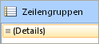
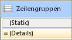
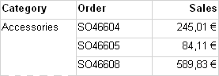
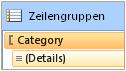
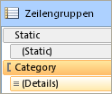
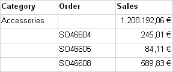

# Steuern von Zeilen- und Spaltenüberschriften (Berichts-Generator und SSRS)
  Eine Tabelle, eine Matrix oder ein Listendatenbereich kann horizontal und vertikal mehrere Seiten enthalten. Sie können angeben, ob die Zeilen- oder Spaltenüberschriften auf jeder Seite wiederholt werden sollen. In einem interaktiven Renderer, z. B. dem Berichts-Manager oder der Berichtsvorschau, können Sie auch angeben, ob die Zeilen- bzw. Spaltenüberschriften fixiert werden sollen, sodass sie sichtbar bleiben, wenn Sie einen Bildlauf in einem Bericht durchführen. In einer Tabelle oder Matrix enthält die erste Zeile normalerweise Spaltenüberschriften mit Beschriftungen für jede Spalte. Die erste Spalte enthält normalerweise Zeilenüberschriften für jede Zeile. Bei geschachtelten Gruppen können Sie nach Bedarf den Anfangssatz mit Zeilen- und Spaltenüberschriften wiederholen, in dem die Gruppenbezeichnungen angegeben sind. In der Standardeinstellung beinhaltet ein Listendatenbereich keine Überschriften.  
  
 Wie Sie die Wiederholung oder das Fixieren der Überschriften steuern, ist von den folgenden Faktoren abhängig:  
  
-   Bei Spaltenüberschriften, die am Anfang jeder Seite wiederholt werden:  
  
    -   Ob die Tabelle oder die Matrix einen Spaltengruppenbereich hat, der horizontal erweitert wird.  
  
    -   Ob Sie alle Zeilen, die mit Spaltengruppen verknüpft sind, als Einheit steuern möchten.  
  
-   Bei Zeilenüberschriften, die am Rand jeder Seite wiederholt werden:  
  
    -   Ob die Tabelle oder die Matrix einen Zeilengruppenbereich hat, der vertikal erweitert wird. Zeilenüberschriften werden nur bei Zeilengruppen mit einer Zeilengruppen-Kopfzeile unterstützt.  
  
> [!NOTE]  
>  [!INCLUDE[ssRBRDDup](../../includes/ssrbrddup-md.md)]  
  
## Grundlegendes zu Zeilen und Spalten in einem Tablix-Datenbereich  
 Eine Tabelle oder eine Matrix ist eine Vorlage für den zugrunde liegenden Tablix-Datenbereich. Ein Tablix-Datenbereich hat vier mögliche Bereiche: den Zeilengruppenbereich, der vertikal die Zeilen des Berichts steuert, den Spaltengruppenbereich, der horizontal die Spalten des Berichts steuert, den Textrumpf zur Anzeige der Daten und die Ecke. Um zu verstehen, wo Sie die Eigenschaften festlegen müssen, um das Wiederholen oder Fixieren der Kopfzeilen zu steuern, beachten Sie, dass es zwei Darstellungen für einen Tablix-Datenbereich gibt:  
  
-   **In der Berichtsdefinition** Jede Zeile oder Spalte in einer Tablix-Datenbereichsdefinition ist ein Tablix-Element von einer bestimmten Zeilen- oder Spaltengruppe. Ein Tablix-Element kann statisch oder dynamisch sein. Ein statisches Tablix-Element enthält Bezeichnungen oder Teilergebnisse und wird einmal pro Gruppe wiederholt. Ein dynamisches Tablix-Element enthält Gruppenwerte und wird einmal für jeden eindeutigen Gruppenwert (auch als Gruppeninstanz bezeichnet) wiederholt.  
  
-   **Auf der Entwurfsoberfläche** Auf der Entwurfsoberfläche wird ein Tablix-Datenbereich durch gepunktete Zeilen in vier Bereiche unterteilt. Jede Zelle in einem Bereich des Tablix-Datenbereichs ist in Zeilen und Spalten unterteilt. Die Zeilen und Spalten sind Gruppen zugeordnet, einschließlich der Detailgruppe. Wenn ein Tablix-Datenbereich ausgewählt wird, ist die Gruppenmitgliedschaft an den angezeigten Zeilen- und Spaltenziehpunkten und an den hervorgehobenen Balken zu erkennen. Zellen im Zeilengruppen- oder Spaltengruppenbereich stellen Gruppenkopfzeilen für Tablix-Elemente dar. Eine einzelne Zeile oder eine Spalte kann mehreren Gruppen zugeordnet sein.  
  
     Weitere Informationen finden Sie unter [Tablix-Datenbereich &#40;Berichts-Generator und SSRS&#41;](../../reporting-services/report-design/tablix-data-region-report-builder-and-ssrs.md) und [Zellen, Zeilen und Spalten des Tablix-Datenbereichs &#40;Berichts-Generator und SSRS&#41;](../../reporting-services/report-design/tablix-data-region-cells-rows-and-columns-report-builder-and-ssrs.md).  
  
 Bei Tablix-Datenbereichen mit Zeilengruppen- oder Spaltengruppenbereichen steuern Sie die zugeordneten Zeilen und Spalten, indem Sie die Eigenschaften des Tablix-Datenbereichs festlegen. In allen anderen Fällen steuern Sie die Zeilen und Spalten, indem Sie im Eigenschaftenbereich für das ausgewählte Tablix-Element die entsprechenden Eigenschaften festlegen. Schritt-für-Schritt-Anweisungen finden Sie unter [Anzeigen von Zeilen- und Spaltenüberschriften auf mehreren Seiten &#40;Berichts-Generator und SSRS&#41;](../../reporting-services/report-design/display-row-and-column-headers-on-multiple-pages-report-builder-and-ssrs.md) und [Sichtbarhalten von Kopfzeilen beim Scrollen durch einen Bericht &#40;Berichts-Generator und SSRS&#41;](../../reporting-services/report-design/keep-headers-visible-when-scrolling-through-a-report-report-builder-and-ssrs.md).  
  
##   Beispiele  
 Die häufigsten Beispiele für Tablix-Datenbereiche sind eine Matrix, eine Tabelle ohne Gruppen, eine Tabelle mit einer Zeilengruppe und einer Zeilengruppen-Kopfzeile sowie Tabellen mit einer Zeilengruppe ohne Zeilengruppen-Kopfzeile. Um das Wiederholen oder das Fixieren der Kopfzeilen zu steuern, müssen Sie ermitteln, ob die Zeilen oder Spalten, die Sie steuern möchten, einer Gruppenkopfzeile im Zeilengruppen- oder im Spaltengruppenbereich zugeordnet sind.  
  
 In den folgenden Abschnitten finden Sie Beispiele für häufige Layouts eines Tablix-Datenbereichs:  
  
-   [Matrix](#Matrix)  
  
-   [Tabelle ohne Gruppen](#TableNoGroups)  
  
-   [Tabelle mit Zeilengruppen und Zeilengruppenbereich](#TableRowGroupsGroupHeader)  
  
-   [Tabelle mit Zeilengruppen, jedoch ohne Zeilengruppenbereich](#TableRowGroupsNoGroupHeader)  
  
###   Matrix  
 In der Standardeinstellung verfügt eine einfache Matrix über eine Zeilengruppe und eine Spaltengruppe. Die folgende Abbildung zeigt eine Matrix mit einer Zeilengruppe für die Kategorie und einer Spaltengruppe für die Geografie:  
  
   
  
 Die gepunkteten Zeilen zeigen die vier Tablix-Bereiche an. Der Zeilengruppenbereich hat eine Zeilengruppen-Kopfzeile, die die Kategoriebezeichnungen in der ersten Spalte steuert. Entsprechend hat der Spaltengruppenbereich eine Spaltengruppen-Kopfzeile, die die Geografiebezeichnungen in der ersten Zeile steuert. In der Vorschau werden in der Matrix in der ersten Zeile die Spaltenüberschriften angezeigt, wie in der folgenden Abbildung dargestellt:  
  
   
  
 Um die Spaltenüberschriften in der ersten Zeile zu wiederholen oder zu fixieren, legen Sie die Eigenschaften für die Spaltenkopfzeilen im Tablix-Datenbereich fest. Die Spaltenkopfzeilen für geschachtelte Spaltengruppen werden automatisch mit eingeschlossen.  
  
 Um die Zeilenüberschriften in der ersten Spalte zu wiederholen oder zu fixieren, legen Sie die Eigenschaften für die Zeilenkopfzeilen im Tablix-Datenbereich fest. Die Zeilenkopfzeilen für geschachtelte Zeilengruppen werden automatisch mit eingeschlossen.  
  
 [Zurück zum Anfang](#Top)  
  
###   Tabelle ohne Zeilengruppen  
 In der Standardeinstellung enthält eine einfache Tabelle ohne Gruppen die Detailgruppe. Die folgende Abbildung zeigt eine Tabelle, in der Kategorie, Bestellnummer und Umsatzdaten angezeigt werden:  
  
   
  
 Es gibt keine gepunkteten Zeilen, da die Tabelle nur aus dem Tablix-Textbereich besteht. Die erste Zeile enthält Spaltenüberschriften und stellt ein statisches Tablix-Element dar, das keiner Gruppe zugeordnet ist. Die zweite Zeile zeigt Detaildaten an und stellt ein dynamisches Tablix-Element dar, das der Detailgruppe zugeordnet ist. Die folgende Abbildung zeigt eine Vorschau der Tabelle:  
  
   
  
 Um Spaltenüberschriften zu wiederholen oder zu fixieren, legen Sie die Eigenschaften im Tablix-Element für die statische Zeile fest, die Teil der Tablix-Datenbereichsdefinition ist. Um die statische Zeile auszuwählen, müssen Sie den erweiterten Modus im Gruppierungsbereich verwenden. In der folgenden Abbildung ist der Zeilengruppenbereich dargestellt:  
  
   
  
 In der folgenden Abbildung sind die statischen und dynamischen Tablix-Elemente im erweiterten Modus für die Zeilengruppen in der Tabelle dargestellt:  
  
   
  
 Wählen Sie die statische Zeile mit der Bezeichnung (**Statisch**) aus, um die Spaltenüberschriften für das Tablix-Element zu wiederholen oder zu fixieren. Im Eigenschaftenbereich werden die Eigenschaften des ausgewählten Tablix-Elements angezeigt. Indem Sie die Eigenschaften für dieses Tablix-Element festlegen, können Sie angeben, ob die erste Zeile wiederholt werden oder immer angezeigt werden soll.  
  
 [Zurück zum Anfang](#Top)  
  
###   Tabelle mit Zeilengruppen und einem Zeilengruppenbereich  
 Wenn Sie einer einfachen Tabelle eine Zeilengruppe hinzufügen, wird der Tabelle auf der Entwurfsoberfläche ein Zeilegruppenbereich hinzugefügt. In der folgenden Abbildung ist eine Tabelle mit einer Zeilengruppe auf der Grundlage einer Kategorie dargestellt:  
  
   
  
 Die gepunkteten Zeilen zeigen den Tablix-Zeilengruppenbereich und den Tablix-Textbereich an. Der Zeilengruppenbereich enthält eine Kopfzeile für die Zeilengruppe, jedoch nicht für die Spaltengruppe. Die folgende Abbildung zeigt eine Vorschau dieser Tabelle:  
  
   
  
 Um die Spaltenüberschriften zu wiederholen oder zu fixieren, verwenden Sie den gleichen Ansatz wie im vorherigen Beispiel. Die folgende Abbildung zeigt die Standardansicht des Zeilengruppenbereichs:  
  
   
  
 Verwenden Sie den Modus **Erweitert** des Zeilengruppenbereichs, um die Tablix-Elemente anzuzeigen, wie in der folgenden Abbildung gezeigt:  
  
   
  
 Es werden vier Tablix-Elemente aufgelistet: **Statisch**, (**Statisch**), Kategorie und (**Details**). Ein Tablix-Element mit Klammern () zeigt an, dass keine zugehörige Gruppenkopfzeile vorhanden ist. Um Spaltenüberschriften zu wiederholen oder zu fixieren, wählen Sie das oberste statische Tablix-Element aus und legen im Eigenschaftenbereich die entsprechenden Eigenschaften fest.  
  
 [Zurück zum Anfang](#Top)  
  
###   Tabelle mit Zeilengruppen ohne Zeilengruppenbereich  
 Eine Tabelle kann aus verschiedenen Gründen Zeilengruppen ohne Zeilengruppenbereich enthalten. Dies ist der Fall, wenn Sie beispielsweise die folgenden beiden Vorgehensweisen anwenden:  
  
-   Sie beginnen mit einer Tabelle mit Zeilengruppen und einem Zeilegruppenbereich und löschen die Spalten für den Zeilengruppenbereich. Löschen Sie nur die Spalten und nicht die Gruppen. Ein denkbares Szenario hierfür wäre ein Tabellenformat, dass lediglich ein einfaches Raster enthalten soll.  
  
-   Aktualisieren Sie für vorherige RDL-Versionen erstellte Berichte, die noch keine Tablix-Datenbereiche enthalten.  
  
 In der folgenden Abbildung ist eine Tabelle mit einer Zeilengruppe ohne Zeilengruppenbereich auf der Entwurfsoberfläche dargestellt:  
  
   
  
 Die Tabelle enthält drei Zeilen. Die erste Zeile enthält Spaltenkopfzeilen. Die zweite Zeile enthält den Gruppenwert und die Teilergebnisse. Die dritte Zeile enthält die Detaildaten. Es werden keine gepunkteten Zeilen angezeigt, da nur ein Tablix-Textbereich vorhanden ist. Die folgende Abbildung zeigt eine Vorschau dieser Tabelle:  
  
   
  
 Um das Wiederholen oder Fixieren der Zeilen zu steuern, müssen Sie die Eigenschaften des Tablix-Elements für jede Zeile festlegen. Im Standardmodus gibt es keinen Unterschied zwischen diesem und dem vorherigen Beispiel für eine Tabelle mit einer Zeilengruppe und einer Gruppenkopfzeile. Die folgende Abbildung zeigt den Gruppierungsbereich im Standardmodus für diese Tabelle:  
  
   
  
 Im erweiterten Modus zeigt diese Layoutstruktur jedoch an, dass andere Tablix-Elemente vorhanden sind. Die folgende Abbildung zeigt den Gruppierungsbereich im erweiterten Modus für diese Tabelle:  
  
 ![Die Zeile, erweitert, kein Gruppenkopf. ] (../../reporting-services/report-design/media/rs-tableheaderdynamicwithnogroupheadercelladvanced.gif "Zeilengruppen, erweitert, kein Gruppenkopf.")  
  
 Im Bereich Zeilengruppen werden die folgenden Tablix-Elemente aufgelistet: (**Statisch**), (Kategorie), (**Statisch**) und (**Details**). Um Spaltenüberschriften zu wiederholen oder zu fixieren, wählen Sie das oberste Tablix-Element (**Statisch**) aus und legen im Eigenschaftenbereich die entsprechenden Eigenschaften fest.  
  
 [Zurück zum Anfang](#Top)  
  
## Renderunterstützung für das Wiederholen oder Fixieren von Kopfzeilen  
 Die Renderer stellen unterschiedliche Unterstützungen für das Wiederholen oder Fixieren von Kopfzeilen bereit.  
  
 Renderer, die physische Seiten (PDF, Bild, Drucken) verwenden, unterstützen die folgenden Funktionen:  
  
-   Wiederholen von Zeilenkopfzeilen, wenn sich ein Tablix-Datenbereich horizontal über mehrere Seiten erstreckt.  
  
-   Wiederholen von Spaltenkopfzeilen, wenn sich ein Tablix-Datenbereich vertikal über mehrere Seiten erstreckt.  
  
 Außerdem werden von Renderern, die weiche Seitenumbrüche verwenden (wie z. B. vom Berichts-Manager, der Berichtsvorschau oder dem Berichts-Viewer-Steuerelement), die folgenden Funktionen unterstützt:  
  
-   Beibehalten der Zeilenkopfzeilen am Seitenrand, wenn Sie einen horizontalen Bildlauf in einem Bericht ausführen.  
  
-   Beibehalten der Spaltenkopfzeilen am Anfang der Seite, wenn Sie einen vertikalen Bildlauf in einem Bericht ausführen.  
  
 Weitere Informationen finden Sie unter [Renderingverhalten &#40;Berichts-Generator und SSRS&#41;](../../reporting-services/report-design/rendering-behaviors-report-builder-and-ssrs.md).  
  
## Siehe auch  
 [Filtern, Gruppieren und Sortieren von Daten &#40;Berichts-Generator und SSRS&#41;](../../reporting-services/report-design/filter-group-and-sort-data-report-builder-and-ssrs.md)   
 [Tabellen, Matrizen und Listen &#40;Berichts-Generator und SSRS&#41;](../../reporting-services/report-design/tables-matrices-and-lists-report-builder-and-ssrs.md)   
 [Paginierung in Reporting Services &#40;Berichts-Generator und SSRS&#41;](../../reporting-services/report-design/pagination-in-reporting-services-report-builder-and-ssrs.md)   
 [Exportieren von Berichten &#40;Berichts-Generator und SSRS&#41;](../../reporting-services/report-builder/export-reports-report-builder-and-ssrs.md)  
  
  
