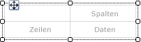
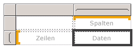
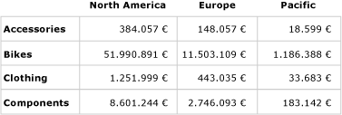
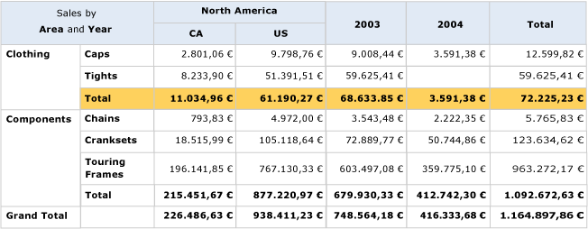

# Erstellen einer Matrix (Berichts-Generator und SSRS)
  Mithilfe einer Matrix können Sie gruppierte Daten und Zusammenfassungsinformationen anzeigen. Sie können Daten nach mehreren Feldern oder Ausdrücken in Zeilen- und Spaltengruppen gruppieren. Matrizen stellen ähnliche Funktionen wie Kreuztabellen und Pivottabellen bereit. Wenn zur Laufzeit die Berichtsdaten und Datenbereiche kombiniert werden, wächst die Matrix auf der Seite horizontal und vertikal. Werte in Matrixzellen zeigen aggregierte Werte für die Schnittmenge der Zeilen- und Spaltengruppen, zu denen die Zelle gehört. Sie können die Zeilen und Spalten formatieren, um die Daten zu markieren, die Sie hervorheben möchten. Sie können auch Drilldownschalter einfügen, mit denen die Detaildaten anfänglich ausgeblendet werden. Benutzer können dann auf die Schalter klicken, um nach Bedarf ausführlichere bzw. weniger Details anzuzeigen.  
  
 Nach dem anfänglichen Entwurf können Sie die Entwicklung einer Matrix fortsetzen, um die Anzeigefunktionen für Benutzer zu optimieren. Weitere Informationen finden Sie unter [Steuern der Tablix-Datenbereichsanzeige auf einer Berichtsseite &#40;Berichts-Generator und SSRS&#41;](../../reporting-services/report-design/controlling-the-tablix-data-region-display-on-a-report-page.md).  
  
 Um schnell mit Matrizen zu beginnen, gehen Sie unter [Tutorial: Erstellen eines Matrixberichts &#40;Berichts-Generator&#41;](../../reporting-services/tutorial-creating-a-matrix-report-report-builder.md).  
  
> [!NOTE]  
>  Sie können Listen in einem Bericht als Berichtsteile getrennt veröffentlichen. Erfahren Sie mehr über [Problembehandlung bei Berichtsteilen (Berichts-Generator und SSRS)](../../reporting-services/report-design/report-parts-report-builder-and-ssrs.md).  
  
##   Hinzufügen einer Matrix zum Bericht  
 Fügen Sie der Entwurfsoberfläche über die Registerkarte "Einfügen" auf dem Menüband eine Matrix hinzu. Sie haben die Möglichkeit, eine Matrix mit dem Tabellen- oder Matrix-Assistenten hinzuzufügen. Dabei werden auch eine Datenquellenverbindung und ein Dataset erstellt und auf Grundlage der Matrixvorlage die Matrix konfiguriert bzw. eine Matrix hinzugefügt.  
  
> [!NOTE]  
>  Der Assistent ist nur in [!INCLUDE[ssRBDenali](../../includes/ssrbdenali-md.md)]verfügbar.  
  
 Für die Beschreibung der Konfiguration einer Tabelle von Anfang bis Ende wird in diesem Thema die Matrixvorlage verwendet.  Anfänglich enthält die Matrix eine Zeilengruppe, eine Spaltengruppe, eine Eckzelle und eine Datenzelle, wie in der folgenden Abbildung dargestellt.  
  
   
  
 Wenn Sie auf der Entwurfsoberfläche eine Matrix auswählen, werden Zeilen- und Spaltenhandles angezeigt, wie in der folgenden Abbildung dargestellt.  
  
   
  
 Fügen Sie Gruppen hinzu, indem Sie Datasetfelder in die Bereiche für Zeilengruppen und Spaltengruppen des Gruppierungsbereichs ziehen. Das erste Feld, das Sie in den Bereich für Zeilengruppen bzw. Spaltengruppen ziehen, ersetzt die anfängliche leere Standardgruppe. Sie können dann auf jede einzelne Zelle von den Daten abhängige Formatierungen anwenden.  
  
   
  
 In Vorschau wird die Matrix erweitert, um die Zeilengruppen- und Spaltengruppenwerte anzuzeigen. In den Zellen werden Zusammenfassungswerte angezeigt, wie in der folgenden Abbildung dargestellt.  
  
   
  
 Die zu Beginn verwendete Matrix ist eine Vorlage auf Grundlage des Tablix-Datenbereichs. Sie können den Matrixentwurf auch weiterentwickeln, indem Sie geschachtelte oder angrenzende Zeilengruppen oder Spaltengruppen oder sogar Detailzeilen hinzufügen. Weitere Informationen finden Sie unter [Untersuchen der Flexibilität eines Tablix-Datenbereichs &#40;Berichts-Generator und SSRS&#41;](../../reporting-services/report-design/exploring-the-flexibility-of-a-tablix-data-region-report-builder-and-ssrs.md).  
  
  
##   Hinzufügen einer übergeordneten Gruppe oder untergeordneten Gruppe zu einer Matrix  
 Wenn Sie eine Gruppe anhand eines einzelnen Datasetfelds hinzufügen möchten, ziehen Sie das Feld aus dem Berichtsdatenbereich in den entsprechenden Bereich "Zeilengruppen" oder "Spaltengruppen" des Bereichs "Gruppierung". Legen Sie das Feld in der Gruppenhierarchie ab, um seine Beziehung mit vorhandenen Gruppen festzulegen. Legen Sie es oberhalb einer vorhandenen Gruppe ab, um eine übergeordnete Gruppe zu erstellen, oder legen Sie es unterhalb einer Gruppe ab, um eine untergeordnete Gruppe zu erstellen.  
  
 Wenn Sie ein Feld im Bereich **Gruppierung** ablegen, werden mehrere Aktionen ausgeführt:  
  
-   Eine neue Gruppe mit einem eindeutigen Namen auf Grundlage des Feldnamens wird automatisch erstellt. Der Gruppenausdruck wird auf den einfachen Feldnamenverweis, z. B. `[Category]`, festgelegt.  
  
-   Im entsprechenden Zeilengruppen- oder Spaltengruppenbereich wird eine neue Zeile oder Spalte angezeigt.  
  
-   In der neuen Spalte wird eine Zeilengruppenzelle für die Standarddatenzeilen im Berichtsdataset angezeigt. Zellen im Tablix-Text für diese Zeile sind nun Elemente der Zeilengruppe. Wenn Spaltengruppen definiert sind, sind in den Spalten befindliche Zellen Elemente dieser Spaltengruppen. Gruppenindikatoren stellen grafische Hinweise für die Gruppenmitgliedschaft jeder Zelle bereit.  
  
 Um die Gruppe nach dem Erstellen anzupassen, verwenden Sie das Dialogfeld **Tablix-Gruppe** . Sie können den Gruppennamen ändern und zusätzliche Ausdrücke bearbeiten oder der Gruppendefinition hinzufügen. Zum Hinzufügen oder Entfernen von Zeilen aus der Tabelle, gehen Sie unter [Einfügen oder Löschen einer Zeile &#40;Berichts-Generator und SSRS&#41;](../../reporting-services/report-design/insert-or-delete-a-row-report-builder-and-ssrs.md).  
  
 Bei der Ausführung des Berichts werden dynamische Spaltenköpfe für so viele Spalten, wie eindeutige Gruppenwerte vorhanden sind, nach rechts erweitert (bzw. nach links, wenn die Direction-Eigenschaft der Matrix auf RTL festgelegt ist). Dynamische Zeilen werden auf der Seite nach unten erweitert. Die Daten, die in den Zellen des Tablix-Texts angezeigt werden, stellen auf den Schnittpunkten von Zeilen- und Spaltengruppen basierende Aggregate dar, wie in der folgenden Abbildung dargestellt.  
  
   
  
 In der Vorschau wird der Bericht wie in der folgenden Abbildung angezeigt.  
  
   
  
 Zum Erstellen von Ausdrücken, die einen anderen als den Standardbereich angeben, müssen Sie im Aggregatfunktionsaufruf den Namen eines Datasets, eines Datenbereichs oder einer Gruppe angeben. Um den Prozentsatz der einzelnen Unterkategorien zu berechnen, den diese zu den Werten der Kategoriegruppe "Clothing" beitragen, fügen Sie in der Gruppe "Category" neben der Spalte "Total" eine Spalte hinzu, formatieren Sie das Textfeld, um den Prozentsatz anzuzeigen, und fügen Sie wie im folgenden Beispiel dargestellt im Zähler einen Ausdruck, der den Standardbereich verwendet, und im Nenner den Gruppenbereich "Category" hinzu.  
  
 `=SUM(Fields!Linetotal.Value)/SUM(Fields! Linetotal.Value,"Category")`  
  
 Weitere Informationen finden Sie unter [Ausdrucksbereich für Gesamtwerte, Aggregate und integrierte Sammlungen &#40;Berichts-Generator und SSRS&#41;](../../reporting-services/report-design/expression-scope-for-totals-aggregates-and-built-in-collections.md)-Ausdruck dar.  
  
  
##   Hinzufügen einer angrenzenden Gruppe zu einer Matrix  
 Wenn Sie anhand eines einzelnen Datasetfelds eine angrenzende Gruppe hinzufügen möchten, verwenden Sie das Kontextmenü im Gruppierungsbereich. Weitere Informationen finden Sie unter [Hinzufügen oder Löschen einer Gruppe in einem Datenbereich &#40;Berichts-Generator und SSRS&#41;](../../reporting-services/report-design/add-or-delete-a-group-in-a-data-region-report-builder-and-ssrs.md). Die folgende Abbildung zeigt eine auf der Geografie basierende Gruppe und eine auf dem Jahr basierende angrenzende Gruppe.  
  
   
  
 In diesem Beispiel wurden die Datenwerte in der Abfrage so gefiltert, dass nur Werte für Europa und für die Jahre 2003 und 2004 enthalten sind. Sie können Filter jedoch für jede Gruppe einzeln festlegen. In der Vorschau wird der Bericht wie in der folgenden Abbildung angezeigt.  
  
   
  
 Wenn Sie eine Ergebnisspalte für eine angrenzende Spaltengruppe hinzufügen möchten, klicken Sie in die Zelle mit der Definition der Spaltengruppe, und verwenden Sie den Befehl **Gesamtergebnis hinzufügen** . Neben der Spaltengruppe wird eine neue statische Spalte mit einer Standardaggregatsumme für jedes numerische Feld in den vorhandenen Zeilen hinzugefügt. Bearbeiten Sie das Standardaggregat (z. B. `Avg([Sales])`) manuell, um den Ausdruck zu ändern. Weitere Informationen finden Sie unter [Hinzufügen eines Gesamtergebnisses zu einer Gruppe oder einem Tablix-Datenbereich &#40;Berichts-Generator und SSRS&#41;](../../reporting-services/report-design/add-a-total-to-a-group-or-tablix-data-region-report-builder-and-ssrs.md).  
  
  
## Siehe auch  
 [Aggregatfunktionsreferenz &#40;Berichts-Generator und SSRS&#41;](../../reporting-services/report-design/report-builder-functions-aggregate-functions-reference.md)   
 [Beispiele für Ausdrücke &#40;Berichts-Generator und SSRS&#41;](../../reporting-services/report-design/expression-examples-report-builder-and-ssrs.md)  
  
  
