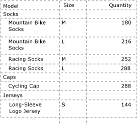
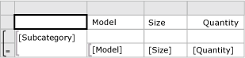
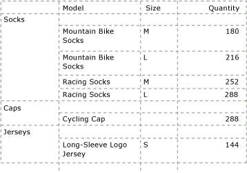
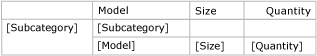
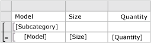

# Erstellen von abgestuften Berichten (Berichts-Generator und SSRS)
Ein abgestufter Bericht ist paginierter [!INCLUDE[ssRSnoversion](../../includes/ssrsnoversion-md.md)]-Berichtstyp, der Detailzeilen oder Untergruppen wie im folgenden Beispiel unter einer übergeordneten Gruppe eingerückt in der gleichen Spalte anzeigt:  
  
   
  
 Bei herkömmlichen Tabellenberichten wird die übergeordnete Gruppe in einer angrenzenden Spalte im Bericht platziert. Der neue Tablix-Datenbereich ermöglicht es Ihnen, eine Gruppe und Detailzeilen bzw. Untergruppen zur gleichen Spalte hinzuzufügen. Um die Gruppenzeilen von den Detailzeilen oder Zeilen untergeordneter Gruppen zu unterscheiden, können Sie entweder eine Formatierung wie eine Schriftfarbe anwenden oder die Detailzeilen mit einem Einzug versehen.  
  
 Die Verfahren in diesem Thema veranschaulichen das manuelle Erstellen eines abgestuften Berichts. Sie können jedoch auch den Assistenten zum Erstellen neuer Tabellen und Matrizen verwenden. Der Assistent stellt das Layout für abgestufte Berichte bereit und erleichtert die Berichterstellung. Nachdem Sie den Assistenten abgeschlossen haben, können Sie den Bericht optimieren.  
  
> [!NOTE]  
>  Der Assistent ist nur in Berichts-Generator verfügbar.  
  
> [!NOTE]  
>  [!INCLUDE[ssRBRDDup](../../includes/ssrbrddup-md.md)]  
  
## So erstellen Sie einen abgestuften Bericht  
  
1.  Erstellen Sie einen Tabellenbericht. Fügen Sie z. B. einen Tablix-Datenbereich ein, und fügen Sie der Datenzeile Felder hinzu.  
  
2.  Fügen Sie dem Bericht eine übergeordnete Gruppe hinzu.  
  
    1.  Klicken Sie in der Tabelle an einer beliebigen Stelle, um sie auszuwählen. Im Gruppierungsbereich wird die Gruppe Details im Bereich Zeilengruppen angezeigt.  
  
    2.  Klicken Sie im Gruppierungsbereich mit der rechten Maustaste auf die Gruppe „Details“, zeigen Sie auf **Gruppe hinzufügen**, und klicken Sie dann auf **Übergeordnete Gruppe**.  
  
    3.  Geben Sie im Dialogfeld **Tablix-Gruppe** einen Namen für die Gruppe an, und wählen Sie in der Dropdownliste einen Gruppierungsausdruck aus, bzw. geben Sie manuell einen Ausdruck ein. Die Dropdownliste zeigt die einfachen Feldausdrücke an, die im Berichtsdatenbereich verfügbar sind. Zum Beispiel ist [PLZ] ein einfacher Feldausdruck für das Feld PLZ in einem Dataset.  
  
    4.  Wählen Sie **Gruppenkopf hinzufügen**. Hierdurch wird eine statische Zeile für Gruppenbezeichnung und Gruppengesamtwerte über der Gruppe eingefügt. Ebenso können Sie **Gruppenfuß hinzufügen** auswählen, um unter der Gruppe eine statische Zeile hinzuzufügen. [!INCLUDE[clickOK](../../includes/clickok-md.md)]  
  
     Sie haben jetzt einen grundlegenden Tabellenbericht. Beim Rendern werden eine Spalte mit dem Gruppeninstanzwert und eine oder mehrere weitere Spalten mit gruppierten Detaildaten angezeigt. Die folgende Abbildung zeigt, wie der Datenbereich auf der Entwurfsoberfläche aussehen könnte.  
  
       
  
     Die folgende Abbildung zeigt, wie der gerenderte Datenbereich beim Anzeigen des Berichts aussehen könnte.  
  
       
  
3.  Für einen abgestuften Bericht benötigen Sie die erste Spalte, die die Gruppeninstanz enthält, nicht. Kopieren Sie stattdessen den Wert in der Gruppenkopfzelle, löschen Sie die Gruppenspalte, und fügen Sie den Wert in das erste Textfeld in der Gruppenkopfzeile ein. Um die Gruppenspalte zu entfernen, klicken Sie mit der rechten Maustaste auf die Gruppenspalte oder die Zelle, und klicken Sie auf **Spalten löschen**. Die folgende Abbildung zeigt, wie der Datenbereich auf der Entwurfsoberfläche aussehen könnte.  
  
       
  
4.  Ändern Sie die Auffüllung der Detaildatenzelle, um die Detailzeilen unter der Gruppenkopfzeile in der gleichen Spalte einzurücken.  
  
    1.  Wählen Sie die Zelle mit dem Detailfeld aus, das Sie einrücken möchten. Die Eigenschaften für das Textfeld dieser Zelle werden im Eigenschaftenbereich angezeigt.  
  
    2.  Erweitern Sie im Eigenschaftenbereich unter **Ausrichtung**die Eigenschaften für **Auffüllung**.  
  
    3.  Geben Sie für **Links**einen neuen Auffüllungswert ein, z. B. **.5in**. Durch die Auffüllung wird der Text in der Zelle um den angegebenen Wert eingerückt. Die Standardauffüllung ist 2 Punkt. Gültige Werte für die Auffüllungseigenschaften sind Zahlen über null (0) gefolgt von einem Größenkennzeichner.  
  
         Die folgenden Größenkennzeichner sind verfügbar:  
  
        |||  
        |-|-|  
        |**in**|Zoll (1 Zoll = 2,54 Zentimeter)|  
        |**cm**|Zentimeter|  
        |**mm**|Millimeter|  
        |**pt**|Punkte (1 Punkt = 1/72 Zoll)|  
        |**pc**|Picas (1 Pica = 12 Punkte)|  
  
     Ihr Datenbereich sollte dem folgenden Beispiel ähneln.  
  
       
  
     **Datenbereich für abgestuftes Berichtslayout**  
  
     Klicken Sie auf der Registerkarte **Home** auf **Ausführen**. Der Bericht zeigt die Gruppe mit eingezogenen Ebenen für die Untergruppenwerte an.  
  
## So erstellen Sie einen abgestuften Bericht mit mehreren Gruppen  
  
1.  Erstellen Sie einen Bericht wie in der vorherigen Vorgehensweise beschrieben.  
  
2.  Fügen Sie zusätzliche Gruppen zum Bericht hinzu.  
  
    1.  Klicken Sie im Bereich Zeilengruppen mit der rechten Maustaste auf die Gruppe, klicken Sie auf **Gruppe hinzufügen**, und wählen Sie dann den Gruppentyp aus, den Sie hinzufügen möchten.  
  
        > [!NOTE]  
        >  Es gibt mehrere Möglichkeiten, einem Datenbereich Gruppen hinzuzufügen. Weitere Informationen finden Sie unter [Hinzufügen oder Löschen einer Gruppe in einem Datenbereich &#40;Berichts-Generator und SSRS&#41;](../../reporting-services/report-design/add-or-delete-a-group-in-a-data-region-report-builder-and-ssrs.md).  
  
    2.  Geben Sie im Dialogfeld **Tablix-Gruppe** einen Namen ein.  
  
    3.  Geben Sie in **Gruppierungsausdruck**einen Ausdruck ein, oder wählen Sie ein Datasetfeld aus, nach dem gruppiert wird. Zum Erstellen eines Ausdrucks klicken Sie auf die Ausdrucksschaltfläche (**fx**), um das Dialogfeld **Ausdruck** zu öffnen.  
  
    4.  [!INCLUDE[clickOK](../../includes/clickok-md.md)]  
  
3.  Ändern Sie die Auffüllung für die Zelle, die die Gruppendaten enthält.  
  
## Siehe auch  
 [Seitenkopf- und Seitenfußzeilen &#40;Berichts-Generator und SSRS&#41;](../../reporting-services/report-design/page-headers-and-footers-report-builder-and-ssrs.md)   
 [Formatieren von Berichtselementen &#40;Berichts-Generator und SSRS&#41;](../../reporting-services/report-design/formatting-report-items-report-builder-and-ssrs.md)   
 [Tablix-Datenbereich &#40;Berichts-Generator und SSRS&#41;](../../reporting-services/report-design/tablix-data-region-report-builder-and-ssrs.md)   
 [Tabellen &#40;Berichts-Generator und SSRS&#41;](../../reporting-services/report-design/tables-report-builder-and-ssrs.md)   
 [Matrizen &#40;Berichts-Generator und SSRS&#41;](../../reporting-services/report-design/create-a-matrix-report-builder-and-ssrs.md)   
 [Listen &#40;Berichts-Generator und SSRS&#41;](../../reporting-services/report-design/create-invoices-and-forms-with-lists-report-builder-and-ssrs.md)   
 [Tabellen, Matrizen und Listen &#40;Berichts-Generator und SSRS&#41;](../../reporting-services/report-design/tables-matrices-and-lists-report-builder-and-ssrs.md)  
  
  