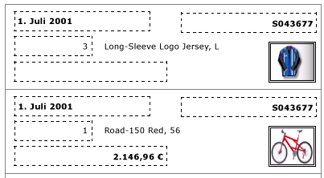
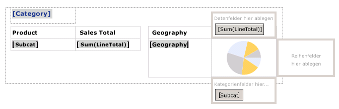
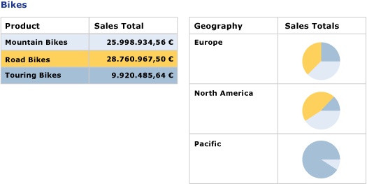

# Erstellen von Rechnungen und Formularen mit Listen(Berichts-Generator und SSRS)
  Ein Listendatenbereich wird mit jeder Gruppe oder Zeile im paginierten [!INCLUDE[ssRSnoversion](../../includes/ssrsnoversion-md.md)] -Berichtsdataset wiederholt. Eine Liste kann verwendet werden, um Freiformberichte oder -formulare, z. B. Rechnungen, oder Berichte und Formulare in Verbindung mit anderen Datenbereichen zu erstellen. Sie können Listen definieren, die beliebig viele Berichtselemente enthalten. Eine Liste kann geschachtelt sein  
  
 Einen schnellen Einstieg in Matrizen finden Sie unter [Tutorial: Erstellen eines Freiformberichts &#40;Berichts-Generator&#41;](../../reporting-services/tutorial-creating-a-free-form-report-report-builder.md).  
  
> [!NOTE]  
>  Sie können Listen in einem Bericht als Berichtsteile getrennt veröffentlichen. Erfahren Sie mehr über [Berichtsteile (Berichts-Generator und SSRS)](../../reporting-services/report-design/report-parts-report-builder-and-ssrs.md).  
  
##   Hinzufügen einer Liste zum Bericht  
 Fügen Sie der Entwurfsoberfläche über die Registerkarte "Einfügen" auf dem Menüband eine Liste hinzu. Standardmäßig enthält die Liste anfänglich eine einzelne Zelle in einer der Detailgruppe zugeordneten Zeile.  
  
   
  
 Wenn Sie auf der Entwurfsoberfläche eine Liste auswählen, werden Zeilen- und Spaltenhandles angezeigt, wie in der folgenden Abbildung dargestellt.  
  
   
  
 Die zu Beginn verwendete Liste ist eine Vorlage auf Grundlage des Tablix-Datenbereichs. Wenn Sie eine Liste hinzugefügt haben, können Sie den Entwurf weiter verbessern, indem Sie den Inhalt oder die Darstellung der Liste durch Angeben von Filter-, Sortier- oder Gruppierungsausdrücken ändern oder indem Sie die Art der Anzeige der Liste für alle Berichtsseiten ändern. Weitere Informationen finden Sie unter [Steuern der Tablix-Datenbereichsanzeige auf einer Berichtsseite &#40;Berichts-Generator und SSRS&#41;](../../reporting-services/report-design/controlling-the-tablix-data-region-display-on-a-report-page.md). Die Liste enthält anfangs nur eine Spalte und Zeile. Sie können den Listenentwurf jedoch weiterentwickeln, indem Sie geschachtelte oder angrenzende Zeilengruppen oder Spaltengruppen oder zusätzliche Detailzeilen hinzufügen. Weitere Informationen finden Sie unter [Untersuchen der Flexibilität eines Tablix-Datenbereichs &#40;Berichts-Generator und SSRS&#41;](../../reporting-services/report-design/exploring-the-flexibility-of-a-tablix-data-region-report-builder-and-ssrs.md).  
  
  
##   Anzeigen von Daten in einem Freiformlayout  
 Wenn Sie Daten nicht in einem Raster, sondern in einem Freiformlayout anordnen möchten, können Sie der Entwurfsoberfläche eine Liste hinzufügen. Ziehen Sie Felder aus dem Berichtsdatenbereich in die Zelle. Standardmäßig enthält die Zelle ein Rechteck, das als Container verwendet wird. Verschieben Sie jedes Feld im Container, bis Sie der Entwurf Ihren Wünschen entspricht. Die Ausrichtungslinien, die beim Ziehen von Textfeldern im rechteckigen Container angezeigt werden, erleichtern das vertikale und horizontale Ausrichten der Kanten. Entfernen Sie unerwünschte Abstände, indem Sie die Größe der Zelle anpassen. Weitere Informationen finden Sie unter [Ändern der Zeilenhöhe oder der Spaltenbreite &#40;Berichts-Generator und SSRS&#41;](../../reporting-services/report-design/change-row-height-or-column-width-report-builder-and-ssrs.md).  
  
 Die folgende Abbildung zeigt eine Liste mit Informationen zu einer Bestellung, den Feldern "Date", "Order", "Qty", "Product" und "LineTotal" sowie einer Grafik.  
  
   
  
 In der Vorschau wird die Liste wiederholt, sodass die Felddaten im Freiformformat angezeigt werden, wie in der folgenden Abbildung dargestellt:  
  
   
  
> [!NOTE]  
>  Die gepunkteten Linien in diesen Abbildungen geben das Freiformlayout für die einzelnen Feldwerte an. Normalerweise werden in einem Produktionsbericht keine gepunkteten Linien verwendet.  
  
  
##   Anzeigen von Daten mit einer Gruppierungsebene  
 Da Listen automatisch einen Container bereitstellen, können sie verwendet werden, um gruppierte Daten mit mehreren Sichten anzuzeigen. Wenn Sie die Standardliste zum Angeben einer Gruppe ändern möchten, bearbeiten Sie die Gruppe Details, und geben Sie einen neuen Namen sowie einen Gruppierungsausdruck an.  
  
 Zum Beispiel können Sie eine Tabelle und ein Diagramm mit unterschiedlichen Sichten desselben Datasets einbetten. Der Liste können Sie eine Gruppe hinzufügen, sodass die geschachtelten Berichtselemente einmal für jeden Gruppenwert wiederholt werden. Die folgende Abbildung zeigt eine nach Produktkategorie gruppierte Liste. Es ist keine Detailzeile vorhanden. Zwei Tabellen sind in der Liste nebeneinander geschachtelt. In der ersten Tabelle sind die Unterkategorien mit Gesamtverkäufen dargestellt. In der zweiten Tabelle ist die Kategorie nach geografischem Gebiet gruppiert angezeigt, mit einem Diagramm mit der Verteilung der Unterkategorien.  
  
   
  
 In der Vorschau zeigt die Tabelle die Gesamtverkäufe für alle Unterkategorien von Fahrrädern, und die Tabelle daneben zeigt die Übersicht über die Verkäufe nach geografischem Gebiet. Die erste Tabelle stellt anhand eines Ausdrucks zur Angabe der Hintergrundfarbe der Tabelle und einer benutzerdefinierten Palette für das Diagramm auch die Legende für die Diagrammfarben bereit.  
  
   
  
  
## Siehe auch  
 [Aggregatfunktionsreferenz &#40;Berichts-Generator und SSRS&#41;](../../reporting-services/report-design/report-builder-functions-aggregate-functions-reference.md)   
 [Beispiele für Ausdrücke &#40;Berichts-Generator und SSRS&#41;](../../reporting-services/report-design/expression-examples-report-builder-and-ssrs.md)  
  
  
