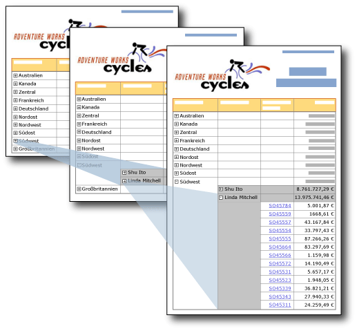

# Drilldownaktion (Berichts-Generator und SSRS)
  Durch die Bereitstellung von Plus- oder Minussymbolen für ein Textfeld können Sie Benutzern das interaktive Aus- und Einblenden von Elementen ermöglichen. Dies wird als *Drilldownaktion* bezeichnet. Für eine Tabelle oder Matrix können Sie statische Zeilen und Spalten oder Zeilen und Spalten ein- und ausblenden, die Gruppen zugeordnet sind.  
  
   
  
 In dieser Abbildung klickt der Benutzer im Bericht auf die Pluszeichen (+), um Detaildaten anzuzeigen.  
  
 Sie können für eine Tabelle mit Zeilengruppen z. B. anfänglich alle Zeilen mit Ausnahme der äußeren Gruppenzusammenfassungszeile ausblenden. Fügen Sie für jede innere Gruppe (einschließlich der Detailgruppe) der Gruppierungszelle der enthaltenden Gruppe ein Symbol zum Erweitern/Reduzieren hinzu. Beim Rendern des Berichts kann der Benutzer auf das Textfeld klicken, um die Detaildaten zu erweitern und zu reduzieren. Weitere Informationen finden Sie unter [Tabellen &#40;Berichts-Generator und SSRS&#41;](../../reporting-services/report-design/tables-report-builder-and-ssrs.md).  
  
 Zu diesem Zweck legen Sie die Sichtbarkeitseigenschaften eines Elements fest, das von Benutzern erweitert oder reduziert werden soll.  
  
> [!NOTE]  
>  Wenn Sie einen Bericht mit einer Drilldownaktion erstellen, müssen die Sichtbarkeitsinformationen nicht nur für ein einzelnes Textfeld in der Zeile oder Spalte, sondern für die auszublendende Gruppe, Zeile oder Spalte und festgelegt werden. Darüber hinaus muss sich das für die Umschaltfläche verwendete Textfeld in einem enthaltenden Bereich befinden, der das aus- bzw. einzublendende Element steuert.  
>   
>  Wenn Sie z. B. eine Zeile ausblenden möchten, die einer geschachtelten Gruppe zugeordnet ist, muss sich das Textfeld in einer Zeile befinden, die der übergeordneten Gruppe oder einem Element an höherer Stelle in der Kapselungshierarchie zugeordnet ist.  
>   
>  Informationen zum Festlegen der Sichtbarkeitsinformationen für die Gruppe, Zeile oder Spalte, finden Sie unter [Hinzufügen einer Erweiterungs- oder Reduzieraktion zu einem Element &#40; Berichts-Generator und SSRS &#41;](../../reporting-services/report-design/add-an-expand-or-collapse-action-to-an-item-report-builder-and-ssrs.md)  
  
 Weitere Informationen zum Ausblenden von Berichtselementen finden Sie unter [Ausblenden eines Elements &#40; Berichts-Generator und SSRS &#41; ](../../reporting-services/report-builder/hide-an-item-report-builder-and-ssrs.md).  
  
> [!NOTE]  
>  [!INCLUDE[ssRBRDDup](../../includes/ssrbrddup-md.md)]  
  
## Vergleichen von Drilldown- und Drillthroughberichten  
 In einem Drilldownbericht klickt ein Benutzer auf eine Plus- oder Minusschaltfläche, um einen Abschnitt eines Berichts zu erweitern oder zu reduzieren und so Detaildaten anzuzeigen. In einem Drillthroughbericht klickt der Benutzer auf einen Link für einen Zusammenfassungswert, wodurch ein separater, zugehöriger Bericht zum Anzeigen von Detaildaten geöffnet wird. Die Detaildaten werden nur abgerufen, wenn der Detailbericht ausgeführt wird. Drillthroughberichte erfordern normalerweise weniger Ressourcen als Drilldownberichte. Weitere Informationen finden Sie unter [Drillthrough, Drilldown, Unterberichte und geschachtelte Datenbereiche &#40;Berichts-Generator und SSRS&#41;](../../reporting-services/report-design/drillthrough-drilldown-subreports-and-nested-data-regions.md).  
  
## Unterstützung ausgeblendeter Berichtselemente durch Renderingerweiterungen  
 Die Umschaltfläche zum Ein- und Ausblenden von Berichtselementen wird nur von Renderingerweiterungen mit Unterstützung für Benutzerinteraktivität unterstützt, z. B. die beim Ausführen eines Berichts im Berichts-Generator und Berichts-Manager verwendete HTML-Renderingerweiterung. Bei anderen Renderingerweiterungen werden ausgeblendete Elemente angezeigt. In der folgenden Liste wird die Unterstützung von Berichtselementen mit bedingter Sichtbarkeit beschrieben:  
  
-   Wenn Elemente in HTML ausgeblendet sind, sind sie in der HTML-Quelle nicht sichtbar.  
  
-   Die XML-Renderingerweiterung zeigt alle Berichtselemente an, unabhängig davon, ob sie ausgeblendet sind.  
  
-   Die Excel-Renderingerweiterung zeigt ausgeblendete Zeilen und Spalten für eine Tabelle, Matrix oder Liste an und erweitert diese. Alle Zeilen und Spalten sind sichtbar.  
  
 Weitere Informationen finden Sie unter [Renderingverhalten &#40;Berichts-Generator und SSRS&#41;](../../reporting-services/report-design/rendering-behaviors-report-builder-and-ssrs.md).  
  
## Siehe auch  
 [Drillthrough, Drilldown, Unterberichte und geschachtelte Datenbereiche &#40;Berichts-Generator und SSRS&#41;](../../reporting-services/report-design/drillthrough-drilldown-subreports-and-nested-data-regions.md)   
 [Interaktive Sortierung, Dokumentstrukturen, und Links &#40; Berichts-Generator und SSRS &#41;](../../reporting-services/report-design/interactive-sort-document-maps-and-links-report-builder-and-ssrs.md)   
 [Beispiele für Ausdrücke &#40; Berichts-Generator und SSRS &#41;](../../reporting-services/report-design/expression-examples-report-builder-and-ssrs.md)  
  
  
