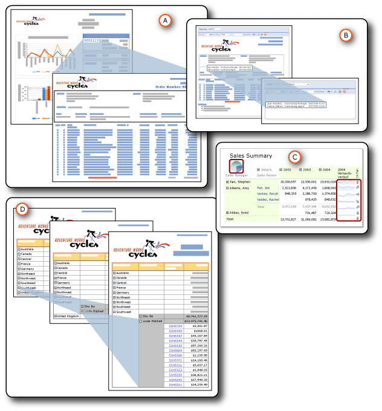

# Drillthrough, Drilldown, Unterberichte und geschachtelte Datenbereiche
  Daten können auf unterschiedliche Weise organisiert werden, um die Beziehungen allgemein oder detailliert anzuzeigen.  Sie können alle Daten in den Bericht einfügen, aber ausblenden, bis ein Benutzer die Details per Mausklick einblendet. Dies wird als *Drilldownaktion* bezeichnet. Sie können die Daten in einem Datenbereich (z. B. eine Tabelle oder ein Diagramm) anzeigen, der in einem anderen Datenbereich (z. B. eine Tabelle oder eine Matrix) *geschachtelt* ist. Sie können die Daten in einem *Unterbericht* anzeigen, der vollständig in einem Hauptbericht enthalten ist. Die Detaildaten können auch in *Drillthroughberichte* eingefügt werden. Hierbei handelt es sich um separate Berichte, die angezeigt werden, wenn ein Benutzer auf einen Link klickt.  
  
   
  
 A. Drillthroughbericht  
  
 B. Unterbericht  
  
 C. Geschachtelte Datenbereiche  
  
 D. Drilldownaktion  
  
 All diese Optionen haben Gemeinsamkeiten, dienen aber unterschiedlichen Zwecken und bieten unterschiedliche Funktionen. Zwei dieser Optionen, Drillthroughberichte und Unterberichte, sind eigentlich separate Berichte. Die Schachtelung ist eine Methode, mit der ein Datenbereich in einen anderen Datenbereich eingefügt wird. Ein Drilldown ist eine Aktion, die für jedes Berichtselement verwendet werden kann, um andere Berichtselemente auszublenden und anzuzeigen. Bei all diesen Optionen handelt es sich um Methoden zum Organisieren und Anzeigen von Daten, die Benutzern das Verständnis des Berichts erleichtern.  
  
> [!NOTE]  
>  [!INCLUDE[ssRBRDDup](../../includes/ssrbrddup-md.md)]  
  
##   Zusammenfassung der Merkmale  
 In der folgenden Tabelle werden die unterschiedlichen Merkmale zusammengefasst. Details werden in separaten Abschnitten an späterer Stelle dieses Thema erläutert. Die Drilldownaktion ist nicht in diesen Vergleichen enthalten, da diese Ein- und Ausblendeaktion auf alle Berichtselemente angewendet werden kann.  
  
|Merkmal|Unterbericht|Drillthroughberichte|geschachtelt|  
|-----------|---------------|------------------|------------|  
|Verwendung eines Datasets des Hauptberichts|Gleich oder unterschiedlich|Gleich oder unterschiedlich|Gleich|  
|Abruf von Daten|Daten werden zur gleichen Zeit abgerufen wie der Hauptbericht.|Daten werden für jeweils einen Drillthroughbericht abgerufen.|Alle Daten werden zur gleichen Zeit abgerufen wie der Hauptbericht.|  
|Verarbeitung und Rendern|Mit dem Hauptbericht|Beim Klicken auf den Link|Mit dem Hauptbericht|  
|Leistung|Langsamer (ruft aber alle Daten mit dem Hauptbericht ab)|Schneller (ruft aber nicht alle Daten mit dem Hauptbericht ab)|Schneller (und ruft alle Daten mit dem Hauptbericht ab)|  
|Verwendung von Parametern|Ja|ja|Nein|  
|Wiederverwendbar|Als Bericht oder Unterbericht oder Drillthroughbericht in anderen Berichten|Als Bericht oder Unterbericht oder Drillthroughbericht in anderen Berichten|Kann nicht wiederverwendet werden.|  
|Speicherort|Außerhalb des Hauptberichts, auf dem gleichem oder einem anderen Berichtsserver|Außerhalb des Hauptberichts, auf dem gleichem Berichtsserver|Im Hauptbericht|  
|Anzeige|Im Hauptbericht|In einem anderen Bericht|Im Hauptbericht|  
  
  
##   Details der Merkmale  
  
###   Verwendete Datasets  
 Unterberichte und Drillthroughberichte können das gleiche Dataset wie der Hauptbericht oder ein anderes Dataset verwenden. Geschachtelte Datenbereiche verwenden das gleiche Dataset.  
  
###   Abrufen von Daten  
 Unterberichte und geschachtelte Datenbereiche rufen Daten zur gleichen Zeit ab wie der Hauptbericht. Bei Drillthroughberichten ist dies nicht der Fall. Jeder Drillthroughbericht ruft Daten ab, wenn ein Benutzer auf den jeweiligen Link klickt. Dies ist von Bedeutung, wenn die Daten für den Hauptbericht und den untergeordneten Bericht zur gleichen Zeit abgerufen werden müssen.  
  
###   Verarbeiten und Rendern  
 Ein Unterbericht wird als Teil des Hauptberichts verarbeitet. Wenn Sie z. B. einer Tabellenzelle in der Detailzeile einen Unterbericht mit Bestellinformationen hinzufügen, wird der Unterbericht einmal pro Zeile der Tabelle verarbeitet und als Teil des Hauptberichts gerendert. Ein Drillthroughbericht wird nur verarbeitet und gerendert, wenn Benutzer im zusammenfassenden Hauptbericht auf den Drillthroughlink klicken.  
  
###   Leistung  
 Mitunter ist ein Datenbereich einem Unterbericht vorzuziehen. Dies ist insbesondere dann der Fall, wenn der Unterbericht nicht von mehreren Berichten verwendet wird. Da auf dem Berichtsserver jede Instanz eines Unterberichts als separater Bericht verarbeitet wird, wirkt sich dies u. U. negativ auf die Leistung aus. Datenbereiche bieten weitgehend dieselbe Funktionalität und Flexibilität wie Unterberichte, aber mit besserer Leistung. Drillthroughberichte bieten ebenfalls eine bessere Leistung als Unterberichte, da sie nicht alle Daten zur gleichen Zeit wie der Hauptbericht abrufen.  
  
###   Verwendung von Parametern  
 Drillthroughberichte und Unterberichte verfügen in der Regel über Berichtsparameter, die angeben, welche Berichtsdaten angezeigt werden sollen. Wenn Sie z. B. auf eine Bestellnummer im Hauptbericht klicken, wird ein Drillthroughbericht geöffnet, der unter Verwendung der Bestellnummer als Parameter alle Daten zu dieser Bestellnummer anzeigt. Beim Erstellen des Links im Hauptbericht geben Sie Werte an, die als Parameter für den Drillthroughbericht übergeben werden.  
  
 Zum Erstellen eines Drillthroughberichts oder Unterberichts müssen Sie zuerst den Zieldrillthroughbericht oder -unterbericht entwerfen und dann eine Drillthroughaktion erstellen oder den Verweis auf den Hauptbericht hinzufügen.  
  
###   Wiederverwendbarkeit  
 Unterberichte und Drillthroughberichte sind separate Berichte. Folglich können sie in einer Reihe von Berichten verwendet oder als eigenständige Berichte angezeigt werden. Geschachtelte Datenbereiche sind nicht wiederverwendbar. Sie können nicht als Berichtsteile gespeichert werden, da sie in einem Datenbereich geschachtelt sind. Sie können den Datenbereich speichern, in denen sie als Berichtsteil enthalten sind, aber nicht den geschachtelten Datenbereich.  
  
###   Speicherort  
 Da Unterberichte und Drillthroughberichte separate Berichte sind, werden sie außerhalb des Hauptberichts gespeichert. Unterberichte können auf demselben oder einem anderen Berichtsserver gespeichert werden, Drillthroughberichte müssen sich jedoch auf demselben Berichtsserver befinden. Geschachtelte Datenbereiche sind Teil des Hauptberichts.  
  
###   Anzeige  
 Unterberichte und geschachtelte Datenbereiche werden im Hauptbericht angezeigt. Drillthroughberichte werden als eigenständige Berichte angezeigt.  
  
  
##   In diesem Abschnitt  
 [Drillthroughberichte &#40; Berichts-Generator und SSRS &#41;](../../reporting-services/report-design/drillthrough-reports-report-builder-and-ssrs.md)  
 Erläutert die Berichte, die geöffnet werden, wenn ein Benutzer in einem Hauptbericht auf einen Link klickt.  
  
 [Unterberichte &#40; Berichts-Generator und SSRS &#41;](../../reporting-services/report-design/subreports-report-builder-and-ssrs.md)  
 Erläutert die Berichte, die im Hauptteil eines Hauptberichts angezeigt werden.  
  
 [Geschachtelte Datenbereiche &#40; Berichts-Generator und SSRS &#41;](../../reporting-services/report-design/nested-data-regions-report-builder-and-ssrs.md)  
 Erläutert die Schachtelung eines Datenbereichs in einem anderen Datenbereich, z. B. eines Diagramms in einer Matrix.  
  
 [Drilldownaktion &#40; Berichts-Generator und SSRS &#41;](../../reporting-services/report-design/drilldown-action-report-builder-and-ssrs.md)  
 Erläutert die Verwendung der Drilldownaktion zum Aus- und Einblenden von Berichtselementen.  
  
 [Angeben von Pfaden zu externen Elementen &#40; Berichts-Generator und SSRS &#41;](../../reporting-services/report-design/specifying-paths-to-external-items-report-builder-and-ssrs.md)  
 Erläutert, wie auf Elemente außerhalb der Berichtsdefinitionsdatei verwiesen wird.  
  
## Siehe auch  
 [Berichtsparameter &#40; Berichts-Generator und Berichts-Designer &#41;](../../reporting-services/report-design/report-parameters-report-builder-and-report-designer.md)  
  
  
