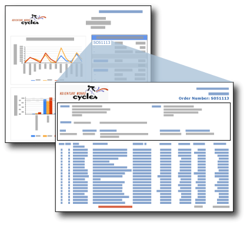

# Drillthroughberichte (Berichts-Generator und SSRS)
  Ein Drillthroughbericht ist ein Bericht, der geöffnet werden kann, indem der Benutzer auf einen Link in einem anderen Bericht klickt. Drillthroughberichte enthalten in der Regel Details zu einem Element im ursprünglichen Zusammenfassungsbericht. In dieser Abbildung enthält der Verkaufszusammenfassungsbericht z. B. Verkaufsaufträge und Gesamtbeträge. Wenn ein Benutzer auf eine Auftragsnummer in der Zusammenfassungsliste klickt, wird ein weiterer Bericht mit Details zu der Bestellung geöffnet.  
  
   
  
 Die Daten im Drillthroughbericht werden erst abgerufen, wenn der Benutzer im Hauptbericht auf den Link zum Öffnen des Drillthroughberichts klickt. Wenn die Daten für den Drillthroughbericht zur gleichen Zeit abgerufen werden sollen wie die Daten für den Hauptbericht, können Sie einen Unterbericht verwenden. Weitere Informationen finden Sie unter [Unterberichte &#40;Berichts-Generator und SSRS&#41;](../../reporting-services/report-design/subreports-report-builder-and-ssrs.md).  
  
> [!NOTE]  
>  Wenn Sie in Berichts-Generator arbeiten, müssen Sie mit einem Berichtsserver verbunden sein, um den Drillthroughbericht anzuzeigen, der über den Drillthroughlink im Hauptbericht geöffnet wird.  
  
 Einen schnellen Einstieg in Drillthroughberichte finden Sie im [Tutorial: Erstellen von Drillthrough- und Hauptberichten&#40;Berichts-Generator&#41;](../../reporting-services/tutorial-creating-drillthrough-and-main-reports-report-builder.md). 
   
## Parameter in Drillthroughberichten  
 Üblicherweise enthält ein Drillthroughbericht Parameter, die durch den Zusammenfassungsbericht an ihn übergeben werden. Im Beispiel mit dem Sales-Bericht enthält der zusammenfassende Bericht in einem Textfeld einer Tabellenzelle das Feld [OrderNumber], also Bestellnummer. Der Drillthroughbericht enthält einen Parameter, der als Wert die Bestellnummer verwendet. Wenn Sie den Link zum Drillthroughbericht für das Textfeld für [OrderNumber] festlegen, legen Sie auch den Parameter für den Zielbericht auf [OrderNumber] fest. Wenn der Benutzer im Zusammenfassungsbericht auf eine Auftragsnummer klickt, wird der Zieldetailbericht mit den Informationen für die jeweilige Auftragsnummer angezeigt. Anleitungen zum Anpassen von Drillthroughberichten auf der Basis von Parameterwerten finden Sie unter [Berichtsparameter &#40;Berichts-Generator und Berichts-Designer&#41;](../../reporting-services/report-design/report-parameters-report-builder-and-report-designer.md) und [InScope-Funktion &#40;Berichts-Generator und SSRS&#41;](../../reporting-services/report-design/report-builder-functions-inscope-function.md).  
  
## Entwerfen des Drillthroughberichts  
 Zum Erstellen eines Drillthroughberichts müssen Sie den Bericht zuerst entwerfen, bevor Sie die Drillthroughaktion im Hauptbericht erstellen.  
  
 Ein Drillthroughbericht kann ein beliebiger Bericht sein. In der Regel akzeptiert der Drillthroughbericht basierend auf dem Link aus dem Hauptbericht einen oder mehrere Parameter zum Angeben der anzuzeigenden Daten. Wenn der Link aus dem Hauptbericht z. B. für einen Verkaufsauftrag definiert wurde, wird die Verkaufsauftragsnummer an den Drillthroughbericht übergeben.  
  
## Erstellen einer Drillthroughaktion im Hauptbericht  
 Drillthroughlinks können Textfeldern (einschließlich Text in den Zellen einer Tabelle oder Matrix), Bildern, Diagrammen, Messgeräten und beliebigen anderen Berichtselementen mit einer Eigenschaftenseite "Aktion" hinzugefügt werden. Weitere Informationen finden Sie unter [Hinzufügen einer Drillthroughaktion für einen Bericht &#40;Berichts-Generator und SSRS&#41;](../../reporting-services/report-design/add-a-drillthrough-action-on-a-report-report-builder-and-ssrs.md).  
  
 Die Drillthroughaktion im Hauptbericht kann als Berichtsaktion oder als URL-Aktion erstellt werden. Im Fall einer Berichtsaktion muss sich der Drillthroughbericht auf dem gleichen Berichtsserver wie der Hauptbericht befinden. Bei einer URL-Aktion muss der Bericht unter der vollqualifizierten URL gespeichert sein. Die Angabe eines Berichts für einen Berichtsserver oder eine SharePoint-Website, die mit einem Berichtsserver integriert ist, kann unterschiedlich sein. Wenn der Berichtsserver im integrierten SharePoint-Modus konfiguriert wurde, werden nur URL-Aktionen unterstützt.  
  
 Weitere Informationen finden Sie unter [Hinzufügen einer Drillthroughaktion für einen Bericht &#40;Berichts-Generator und SSRS&#41;](../../reporting-services/report-design/add-a-drillthrough-action-on-a-report-report-builder-and-ssrs.md) und [Angeben von Pfaden zu externen Elementen &#40;Berichts-Generator und SSRS&#41;](../../reporting-services/report-design/specifying-paths-to-external-items-report-builder-and-ssrs.md).  
  
## Anzeigen eines Drillthroughberichts  
 Wenn Sie einen Zusammenfassungsbericht mit Drillthroughlinks nach seiner Veröffentlichung anzeigen möchten, müssen Sie sicherstellen, dass sich die Drillthroughberichte auf demselben Berichtsserver wie der zusammenfassende Bericht befinden. In jedem Fall benötigt der Benutzer Berechtigungen für den Drillthroughbericht, um ihn anzuzeigen.  
  
## Siehe auch  
 [Drillthrough, Drilldown, Unterberichte und geschachtelte Datenbereiche &#40;Berichts-Generator und SSRS&#41;](../../reporting-services/report-design/drillthrough-drilldown-subreports-and-nested-data-regions.md)  
  
  
