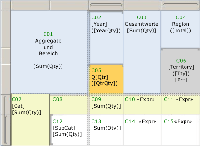

# <a name="expression-scope-for-totals-aggregates-and-built-in-collections"></a>Ausdrucksbereich für Gesamtwerte, Aggregate und integrierte Auflistungen
  Wenn Sie Ausdrücke schreiben, stellen Sie fest, dass der Begriff *Bereich* in mehreren Zusammenhängen verwendet wird. Ein Bereich kann die Daten angeben, die zum Auswerten eines Ausdrucks verwendet werden, oder den Satz von Textfeldern auf einer gerenderten Seite bzw. den Satz von Berichtselementen, die mithilfe einer Umschaltfläche ein- oder ausgeblendet werden können, bezeichnen. Sie finden den Begriff *Bereich* in Themen, die sich auf die Auswertung von Ausdrücken, Aggregatfunktionssyntax, und bedingte Sichtbarkeit beziehen, sowie in Fehlermeldungen im Zusammenhang mit diesen Bereichen. Mit den folgenden Beschreibungen können Sie feststellen, welche Bedeutung von *Bereich* zutrifft:  
  
-   **Datenbereich** Der Datenbereich ist eine Hierarchie von Bereichen, mit denen der Berichtsprozessor Berichtsdaten und Berichtslayout kombiniert und Datenbereiche wie Tabellen und Diagrammen zum Anzeigen von Daten erstellt. Die Kenntnis der grundlegenden Prinzipien von Datenbereichen ermöglicht es Ihnen, die gewünschten Ergebnisse bei folgenden Aktionen zu erhalten:  
  
    -   **Schreiben von Ausdrücken, die Aggregatfunktionen verwenden** Geben Sie die Daten an, die aggregiert werden sollen. Der Speicherort des Ausdrucks im Bericht wirkt sich darauf aus, welche Daten sich im Bereich für Aggregatberechnungen befinden.  
  
    -   **Hinzufügen von Sparklines zu einer Tabelle oder Matrix** Geben Sie einen minimalen und maximalen Bereich für Diagrammachsen zur Ausrichtung von geschachtelten Instanzen in einer Tabelle oder Matrix an.  
  
    -   **Hinzufügen von Indikatoren zu einer Tabelle oder Matrix** Geben Sie eine minimale und maximale Skala für das Messgerät zum Ausrichten geschachtelter Instanzen in einer Tabelle oder Matrix an.  
  
    -   **Schreiben von Sortierungsausdrücken** Geben Sie einen enthaltenden Bereich an, mit dem Sie die Sortierreihenfolge bei mehreren verbundenen Berichtselementen synchronisieren können.  
  
-   **Zellenbereich** Der Zellenbereich bezeichnet den Satz von Zeilen- und Spaltengruppen in einem Tablix-Datenbereich, zu dem eine Zelle gehört. Standardmäßig enthält jede Tablix-Zelle ein Textfeld. Der Wert des Textfelds ist der Ausdruck. Der Speicherort der Zelle bestimmt indirekt, welche Datenbereiche Sie für Aggregatberechnungen im Ausdruck angeben können.  
  
-   **Berichtselementbereich** Der Berichtselementbereich bezeichnet die Auflistung von Elementen auf einer gerenderten Berichtsseite. Der Berichtsprozessor kombiniert Daten und Berichtslayoutelemente, um eine kompilierte Berichtsdefinition zu erstellen. Während dieses Vorgangs werden Datenbereiche wie Tabellen und Matrizen nach Bedarf erweitert, damit alle Berichtsdaten angezeigt werden können. Der kompilierte Bericht wird dann von einem Berichtsrenderer verarbeitet. Der Berichtsrenderer bestimmt, welche Berichtselemente auf einer Seite angezeigt werden. Auf einem Berichtsserver werden die einzelnen Seiten gerendert, wenn Sie sie anzeigen. Wenn Sie einen Bericht exportieren, werden alle Seiten gerendert. Die Kenntnis der grundlegenden Prinzipien von Berichtselementbereichen ermöglicht es Ihnen, die gewünschten Ergebnisse bei folgenden Aktionen zu erhalten:  
  
    -   **Hinzufügen von Elementen zum Ein-/Ausschalten** Geben Sie ein Textfeld an, um die Umschaltfläche hinzuzufügen, über die die Sichtbarkeit eines Berichtselements gesteuert wird. Sie können eine Umschaltfläche nur Textfeldern im Bereich des Berichtselements, das umgeschaltet werden soll, hinzufügen.  
  
    -   **Schreiben von Ausdrücken im Seitenkopf und Seitenfuß** Geben Sie die Werte in Ausdrücken in Textfeldern oder anderen Berichtselementen an, die auf der gerenderten Seite angezeigt werden.  
  
 Das grundlegende Verständnis von Bereichen hilft Ihnen dabei, erfolgreich Ausdrücke zu schreiben, mit denen das gewünschte Ergebnis zurückgegeben wird.  
  
> [!NOTE]  
>  [!INCLUDE[ssRBRDDup](../../includes/ssrbrddup-md.md)]  
  
##  <a name="DataScope"></a> Grundlegendes zu Datenbereichen und Datenhierarchie  
 Ein Datenbereich gibt einen Satz von Berichtsdaten an. Der Datenbereich hat eine natürliche Hierarchie mit einer inhärenten Einschlussbeziehung. Bereiche, die sich in der Hierarchie auf einer höheren Stufe befinden, enthalten Sie Bereiche, die sich auf einer niedrigeren Hierarchiestufe befinden. Die folgende Liste von Datenbereichen beschreibt die Hierarchie in der Reihenfolge von den meisten Daten zu den wenigsten Daten:  
  
-   **Datasets, nachdem Datasetfilter angewendet wurden** Geben das mit dem Datenbereich oder einem Berichtselement im Hauptteil des Berichts verknüpfte Berichtsdataset an. Die für die Aggregation verwendeten Daten stammen aus dem Berichtsdataset, nachdem Datasetfilter angewendet wurden. Bei freigegebenen Datasets sind dies die Filter in der freigegebenen Datasetdefinition und die Filter in der freigegebenen Datasetinstanz im Bericht.  
  
-   **Datenbereiche** Gibt Daten vom Datenbereich an, nachdem Datenbereichsfilter und Sortierausdrücke angewendet wurden. Beim Berechnen von Aggregaten für Datenbereiche werden Gruppenfilter nicht verwendet.  
  
-   **Datenbereichsgruppen, nachdem Gruppenfilter angewendet wurden** Geben die Daten nach Anwendung der Gruppenausdrücke und Gruppenfilter auf die übergeordnete Gruppe und die untergeordneten Gruppen an. Bei einer Tabelle sind dies die Zeilen- und Spaltengruppen. Bei einem Diagramm sind dies die Reihen und Kategoriegruppen. Damit eine Bereichskapselung identifiziert werden kann, enthält jede übergeordnete Gruppe ihre untergeordneten Gruppen.  
  
-   **Geschachtelte Datenbereiche** Gibt die Daten für den geschachtelten Datenbereich im Kontext der Zelle an, der er hinzugefügt wurde, und nachdem die verschachtelten Bereichsfilter und Sortierausdrücke angewendet wurden.  
  
-   **Zeilen- und Spaltengruppen für die geschachtelten Datenbereiche** Gibt die Daten nach Anwendung der Gruppenausdrücke und Gruppenfilter des verschachtelten Datenbereichs an.  
  
 Das Verständnis von enthaltenden und enthaltenen Bereichen ist beim Schreiben von Ausdrücken mit Aggregatfunktionen von Bedeutung.  
  
##  <a name="Aggregates"></a> Zellenbereich und Ausdrücke  
 Wenn Sie einen Bereich bestimmen, geben Sie dem Berichtsprozessor die Daten an, die für eine Aggregatberechnung verwendet werden sollen. Abhängig vom Ausdruck und dem Speicherort des Ausdrucks können die gültigen Bereiche *enthaltende Bereiche*(sogenannte übergeordnete Bereiche) oder *enthaltene Bereiche*(sogenannte untergeordnete oder geschachtelte Bereiche) sein. Normalerweise können Sie keine einzelne Gruppeninstanz in einer Aggregatberechnung angeben. Sie können ein Aggregat für alle Gruppeninstanzen angeben.  
  
 Da der Berichtsprozessor Daten aus einem Berichtsdataset mit dem Tablix-Datenbereich kombiniert, wertet er Gruppenausdrücke aus und erstellt die Zeilen und die Spalten, die benötigt werden, um die Gruppeninstanzen darzustellen. Der Wert der Ausdrücke in den Textfeldern der einzelnen Tablix-Zellen werden im Kontext des Zellenbereichs ausgewertet. Abhängig von der Tablix-Struktur kann eine Zelle mehreren Zeilengruppen und Spaltengruppen angehören. Bei Aggregatfunktionen können Sie mit einem der folgenden Bereiche angeben, welcher Bereich verwendet werden soll:  
  
-   **Standardbereich** Die Daten innerhalb des Bereichs bei Berechnungen, wenn vom Berichtsprozessor ein Ausdruck ausgewertet wird. Der Standardbereich ist der innerste Satz der Gruppen, denen die Zelle oder der Datenpunkt angehört. Bei einem Tablix-Datenbereich kann der Satz Zeilen- und Spaltengruppen umfassen. Bei einem Diagrammdatenbereich kann der Satz Kategorie- und Reihengruppen umfassen.  
  
-   **Benannter Bereich** Der Name eines Datasets, eines Datenbereichs oder einer Datenbereichsgruppe innerhalb des Bereichs für den Ausdruck. Bei Aggregatberechnungen können Sie einen enthaltenden Bereich angeben. Sie können einen benannten Bereich nicht sowohl für eine Zeilengruppe als auch eine Spaltengruppe im selben Ausdruck angeben. Sie können nur dann einen enthaltenen Bereich angeben, wenn der Ausdruck für ein Aggregat eines Aggregats gilt.  
  
     Der folgende Ausdruck generiert die Jahre des Intervalls zwischen SellStartDate und LastReceiptDate. Diese Felder sind in zwei unterschiedlichen Datasets enthalten, DataSet1 und DataSet2. Die Aggregatfunktion [First-Funktion (Berichts-Generator und SSRS)](../../reporting-services/report-design/report-builder-functions-first-function.md) gibt den ersten Wert von SellStartDate in DataSet1 und den ersten Wert von LastReceiptDate in DataSet2 zurück.  
  
    ```  
    =DATEDIFF(“yyyy”, First(Fields!SellStartDate.Value, "DataSet1"), First(Fields!LastReceiptDate.Value, "DataSet2"))  
    ```  
  
-   **Domänenbereich** Wird auch Synchronisierungsbereich genannt. Ein Datenbereichstyp, der für die Auswertung von Ausdrücken bei geschachtelten Datenbereichen verwendet wird. Mit dem Domänenbereich werden Aggregate über alle Instanzen einer Gruppe hinweg angegeben, damit geschachtelte Instanzen ausgerichtet und problemlos verglichen werden können. Sie können z. B. den Bereich und die Höhe von Sparklines ausrichten, die in eine Tabelle eingebettet sind, damit die Werte aneinandergereiht dargestellt werden.  
  
 Bei einigen Speicherorten eines Berichts müssen Sie einen Bereich angeben. Beispielsweise müssen Sie für ein Textfeld auf der Entwurfsoberfläche den Namen des Datasets angeben, das verwendet werden soll: `=Max(Fields!Sales.Value,"Dataset1")`. Bei anderen Speicherorten gibt es einen impliziten Standardbereich. Wenn Sie z. B. kein Aggregat für ein Textfeld in einem Gruppenbereich angeben, wird das Standardaggregat First verwendet.  
  
 In jedem Thema zu Aggregatfunktionen werden die Bereiche aufgeführt, die für die jeweilige Verwendung zutreffen. Weitere Informationen finden Sie unter [Aggregatfunktionsreferenz &#40;Berichts-Generator und SSRS&#41;](../../reporting-services/report-design/report-builder-functions-aggregate-functions-reference.md).  
  
##  <a name="Examples"></a> Beispielaggregatausdrücke für einen Tabellendatenbereich  
 Es bedarf einiger Übung, wenn Ausdrücke geschrieben werden sollen, die außerhalb der Standardbereiche liegen. Befassen Sie sich mit der folgenden Abbildung und Tabelle, um die verschiedenen Bereiche besser zu verstehen. In der Abbildung wird jede Zelle in einer Tabelle mit Verkaufsinformationen, in der die Menge der verkauften Artikel pro Jahr und Quartal sowie nach Vertriebsgebiet angegeben wird, bezeichnet. Beachten Sie die visuellen Hinweise zu den Zeilen- und Spaltenhandles, die die Struktur der Zeilen- und Spaltengruppen anzeigen und damit geschachtelte Gruppen angeben. Die Tabelle verfügt über die folgende Struktur:  
  
-   Eine Tabellenkopfzeile mit der Eckzelle und drei Zeilen, die die Kopfzeilen der Spaltengruppe enthalten  
  
-   Zwei geschachtelte Zeilengruppen auf Grundlage der Kategorie Cat und der Unterkategorie SubCat  
  
-   Zwei geschachtelte Spaltengruppen auf Grundlage des Jahrs Year und des Quartals Qtr.  
  
-   Eine statische Spalte mit den Gesamtbeträgen namens Totals  
  
-   Eine angrenzende Spaltengruppe auf Grundlage des Vertriebsgebiets mit dem Namen Territory  
  
 Die Spaltenüberschrift für die Gebietsgruppe wurde zu Anzeigezwecken in zwei Zellen geteilt. Die erste Zelle zeigt den Gebietsnamen und die Gesamtbeträge an, die zweite Zelle verfügt über Platzhaltertext zur Berechnung des prozentualen Anteils jedes Gebiets an den Gesamtverkäufen.  
  
   
  
 Hier wird davon ausgegangen, dass das Dataset DataSet1 und die Tabelle Tablix1 genannt wird. In der folgenden Tabelle werden die Zellenbezeichnung, der Standardbereich und Beispiele dazu aufgeführt. Die Werte für den Platzhaltertext werden in Ausdruckssyntax dargestellt.  
  
|Zelle|Standardbereich|Platzhalterbezeichnungen|Text- oder Platzhalterwerte|  
|----------|-------------------|------------------------|--------------------------------|  
|C01|Tablix1|[Sum(Qty)]|Aggregate und Bereich<br /><br /> `=Sum(Fields!Qty.Value)`|  
|C02|Äußere Spaltengruppe "Year"|[Year]<br /><br /> ([YearQty])|`=Fields!Year.Value`<br /><br /> `=Sum(Fields!Qty.Value)`|  
|C03|Tablix1|[Sum(Qty)]|Totals<br /><br /> `=Sum(Fields!Qty.Value)`|  
|C04|Peerspaltengruppe "Territory"|([Total])|Territory<br /><br /> `=Sum(Fields!Qty.Value)`|  
|C05|Innere Gruppe "Qtr"|[Qtr]<br /><br /> ([QtrQty])|Q<br /><br /> `=Fields!Qtr.Value`<br /><br /> `=Sum(Fields!Qty.Value)`|  
|C06|Peerspaltengruppe "Territory"|[Territory]<br /><br /> ([Tty])<br /><br /> [Pct]|`=Fields!Territory.Value`<br /><br /> `=Sum(Fields!Qty.Value)`<br /><br /> `=FormatPercent(Sum(Fields!Qty.Value,"Territory")/Sum(Fields!Qty.Value,"Tablix1"),0) & " of " & Sum(Fields!Qty.Value,"Tablix1")`|  
|C07|Äußere Zeilengruppe "Cat"|[Cat]<br /><br /> [Sum(Qty)]|`=Fields!Cat.Value`<br /><br /> `=Sum(Fields!Qty.Value)`|  
|C08|Entspricht C07|||  
|C09|Äußere Zeilengruppe "Cat" und innere Spaltengruppe "Qtr"|[Sum(Qty)]|`=Sum(Fields!Qty.Value)`|  
|C10|Entspricht C07|<\<Expr>>|`=Sum(Fields!Qty.Value) & ": " & FormatPercent(Sum(Fields!Qty.Value)/Sum(Fields!Qty.Value,"Tablix1"),0) & " of " & Sum(Fields!Qty.Value,"Tablix1")`|  
|C11|Äußere Zeilengruppe "Cat" und Spaltengruppe "Territory"|<\<Expr>>|`=Sum(Fields!Qty.Value) & ": " & FormatPercent(Sum(Fields!Qty.Value)/Sum(Fields!Qty.Value,"Territory"),0) & " of " & Sum(Fields!Qty.Value,"Territory")`|  
|C12|Innere Zeilengruppe "Subcat"|[Subcat]<br /><br /> [Sum(Qty)]|`=Fields!SubCat.Value`<br /><br /> `=Sum(Fields!Qty.Value)`|  
|C13|Innere Zeilengruppe "Subcat" und innere Spaltengruppe "Qtr"|[Sum(Qty)]|`=Sum(Fields!Qty.Value)`|  
|C14|Innere Zeilengruppe "Subcat"|<\<Expr>>|`=Sum(Fields!Qty.Value) & ": " & FormatPercent(Sum(Fields!Qty.Value)/Sum(Fields!Qty.Value,"Cat"),0) & " of " & Sum(Fields!Qty.Value,"Cat")`|  
|C15|Innere Zeilengruppe "Subcat" und Spaltengruppe "Territory"|<\<Expr>>|`=Sum(Fields!Qty.Value) & ": " & FormatPercent(Code.CalcPercentage(Sum(Fields!Qty.Value),Sum(Fields!Qty.Value,"Cat")),0) & " of " & Sum(Fields!Qty.Value,"Cat")`|  
  
 Weitere Informationen zur Interpretation visueller Hinweise für Tablix-Datenbereiche finden Sie unter [Zellen, Zeilen und Spalten des Tablix-Datenbereichs &#40;Berichts-Generator und SSRS&#41;](../../reporting-services/report-design/tablix-data-region-cells-rows-and-columns-report-builder-and-ssrs.md). Weitere Informationen zum Tablix-Datenbereich finden Sie unter [Zellen, Zeilen und Spalten des Tablix-Datenbereichs (Berichts-Generator und SSRS)](../../reporting-services/report-design/tablix-data-region-cells-rows-and-columns-report-builder-and-ssrs.md). Weitere Informationen zu Ausdrücken und Aggregaten finden Sie unter [Ausdrucksverwendungen in Berichten &#40;Berichts-Generator und SSRS&#41;](../../reporting-services/report-design/expression-uses-in-reports-report-builder-and-ssrs.md) und [Aggregatfunktionsreferenz &#40;Berichts-Generator und SSRS&#41;](../../reporting-services/report-design/report-builder-functions-aggregate-functions-reference.md).  
  
  
##  <a name="Sparklines"></a> Synchronisieren von Skalen für Sparklines  
 Um Werte über einen Zeitraum auf der horizontalen Achse mit einem Sparklinediagramm zu vergleichen, das in eine Tabelle oder Matrix geschachtelt ist, können Sie die Werte der Kategoriegruppen synchronisieren. Dies wird als Ausrichten von Achsen bezeichnet. Wenn Sie die Option zum Ausrichten von Achsen auswählen, werden im Bericht automatisch die Mindest- und Höchstwerte einer Achse festgelegt. Zudem werden Platzhalter für Aggregatwerte bereitgestellt, die nicht in jeder Kategorie vorhanden sind. Dadurch werden die Werte in der Sparkline über alle Kategorien hinweg aufgereiht, sodass Sie die Werte für jede Zeile aggregierter Daten vergleichen können. Wenn Sie diese Option auswählen, ändern Sie den Bereich der Ausdrucksauswertung zum *Domänenbereich*. Mit dem Festlegen des Domänenbereich für ein geschachteltes Diagramm werden indirekt auch die Farbzuweisungen der einzelnen Kategorien in der Legende gesteuert.  
  
 Angenommen, Sie haben eine Sparkline, die wöchentliche Trends anzeigt, und ein Ort verfügt über Umsatzdaten von 3 Monaten, während ein anderer Ort über Umsatzdaten von 12 Monaten verfügt. Ohne die Synchronisierung der Skala würde der erste Ort nur drei Balken aufweisen, die wesentlich breiter sind und insgesamt genau so viel Platz belegen wie die Balken der 12 Monate des zweiten Orts.  
  
 Weitere Informationen finden Sie unter [Ausrichten von Diagrammdaten in einer Tabelle oder einer Matrix &#40;Berichts-Generator und SSRS&#41;](../../reporting-services/report-design/align-the-data-in-a-chart-in-a-table-or-matrix-report-builder-and-ssrs.md).  
  
  
##  <a name="Indicators"></a> Synchronisieren von Bereichen für Indikatoren  
 Um die Datenwerte anzugeben, die für einen Indikatorsatz verwendet werden sollen, müssen Sie einen Bereich angeben. Abhängig vom Layout des Datenbereichs, der den Indikator enthält, geben Sie einen Bereich oder einen enthaltenden Bereich an. In einer Gruppenkopfzeile, die Kategorieverkäufen zugeordnet ist, kann etwa eine Reihe von Pfeilen (nach oben, nach unten, zur Seite) Umsatzwerte in Relation zu einem Schwellenwert angeben. Der enthaltende Bereich ist der Name der Tabelle oder Matrix mit den Indikatoren.  
  
 Weitere Informationen finden Sie unter [Festlegen des Synchronisierungsbereichs &#40;Berichts-Generator und SSRS&#41;](../../reporting-services/report-design/set-synchronization-scope-report-builder-and-ssrs.md).  
  
  
##  <a name="Page"></a> Angeben von Bereichen im Seitenkopf oder Seitenfuß  
 Um Daten anzuzeigen, die auf jeder Seite eines Berichts anders sind, fügen Sie einem Berichtselement Ausdrücke hinzu. Das Berichtselement muss sich auf einer gerenderten Seite befinden. Da ein Bericht in Seiten aufgeteilt wird, während er gerendert wird, kann nur während des Rendervorgangs bestimmt werden, welche Elemente auf einer Seite bestehen. Beispielsweise verfügt eine Zelle in einer Detailzeile über ein Textfeld, das viele Instanzen auf einer Seite aufweist.  
  
 Aus diesem Grund gibt es eine globale Auflistung mit dem Namen ReportItems. Sie entspricht dem Satz von Textfeldern auf der aktuellen Seite.  
  
 Weitere Informationen finden Sie unter [Seitenkopf- und Seitenfußzeilen &#40;Berichts-Generator und SSRS&#41;](../../reporting-services/report-design/page-headers-and-footers-report-builder-and-ssrs.md) und [Verweise auf ReportItems-Sammlungen &#40;Berichts-Generator und SSRS&#41;](../../reporting-services/report-design/built-in-collections-reportitems-collection-references-report-builder.md).  
  
  
##  <a name="Toggles"></a> Angeben eines Elements zum Ein-/Ausschalten für Drilldown und bedingte Sichtbarkeit  
 Umschaltflächen sind Bilder mit Plus- oder Minuszeichen, die einem Textfeld hinzugefügt werden. Wenn ein Benutzer darauf klickt, werden andere Berichtselemente ein- oder ausgeblendet. Auf der Seite **Sichtbarkeit** der meisten Berichtselementeigenschaften können Sie angeben, welchem Berichtselement die Umschaltfläche hinzugefügt werden soll. Das Element zum Ein-/Ausschalten muss sich in einem hierarchisch höheren enthaltenden Bereich befinden als das Element, das ein- oder ausgeblendet werden soll.  
  
 In einem Tablix-Datenbereich können Sie einen Drilldowneffekt erstellen, bei dem Sie auf ein Textfeld klicken, um die Tabelle zu erweitern und weitere Daten anzuzeigen. Dazu müssen Sie die Eigenschaft **Sichtbarkeit** in der Gruppe festlegen und als Umschaltfläche ein Textfeld in einer Gruppenüberschrift, die einer enthaltenden Gruppe zugeordnet ist, auswählen.  
  
 Weitere Informationen finden Sie unter [Hinzufügen einer Erweiterungs- oder Reduzieraktion zu einem Element &#40;Berichts-Generator und SSRS&#41;](../../reporting-services/report-design/add-an-expand-or-collapse-action-to-an-item-report-builder-and-ssrs.md).  
  
  
##  <a name="Sort"></a> Angeben eines Sortierungsausdrucks zum Synchronisieren der Sortierreihenfolge  
 Wenn Sie einer Tabellenspalte eine interaktive Sortierschaltfläche hinzufügen, können Sie die Sortierung für mehrere Elemente mit einem gemeinsamen enthaltenden Bereich synchronisieren. Sie können z. B. einer Spaltenüberschrift in einer Matrix eine Sortierschaltfläche hinzufügen und den enthaltenden Bereich als Namen des Datasets angeben, das an die Matrix gebunden ist. Wenn ein Benutzer auf die Sortierschaltfläche klickt, werden außer den Matrixzeilen auch die Diagrammreihengruppen der Diagramme sortiert, die an das gleiche Datset gebunden sind. Auf diese Weise können alle Datenbereiche, die von diesem Dataset abhängig sind, mit der gleichen Sortierreihenfolge synchronisiert werden.  
  
 Weitere Informationen finden Sie unter [Filtern, Gruppieren und Sortieren von Daten &#40;Berichts-Generator und SSRS&#41;](../../reporting-services/report-design/filter-group-and-sort-data-report-builder-and-ssrs.md).  
  
  
##  <a name="Nulls"></a> Unterdrücken von NULL- oder 0-Werten zur Laufzeit  
 In zahlreichen Berichten kann bei Berechnungen für Gruppen eine Vielzahl an Zellen mit dem Wert 0 (null) oder NULL erstellt werden. Wenn Sie Ihren Bericht übersichtlicher gestalten möchten, können Sie einen Ausdruck zum Zurückgeben von Leerräumen hinzufügen, wenn der Aggregatwert 0 (null) ist. Weitere Informationen finden Sie unter „Beispiele zur Unterdrückung von NULL- oder 0-Werten“ in [Beispiele für Ausdrücke &#40;Berichts-Generator und SSRS&#41;](../../reporting-services/report-design/expression-examples-report-builder-and-ssrs.md).  
  
  
## <a name="see-also"></a>Weitere Informationen finden Sie unter  
 [Beispiele für Ausdrücke &#40;Berichts-Generator und SSRS&#41;](../../reporting-services/report-design/expression-examples-report-builder-and-ssrs.md)   
 [Beispiele für Gruppierungsausdrücke (Berichts-Generator und SSRS)](../../reporting-services/report-design/group-expression-examples-report-builder-and-ssrs.md)   
 [Erstellen von rekursiven Hierarchiegruppen &#40;Berichts-Generator und SSRS&#41;](../../reporting-services/report-design/creating-recursive-hierarchy-groups-report-builder-and-ssrs.md)   
 [Tabellen, Matrizen und Listen &#40;Berichts-Generator und SSRS&#41;](../../reporting-services/report-design/tables-matrices-and-lists-report-builder-and-ssrs.md)   
 [Formatieren von Text und Platzhaltern &#40;Berichts-Generator und SSRS&#41;](../../reporting-services/report-design/formatting-text-and-placeholders-report-builder-and-ssrs.md)  
  
  
