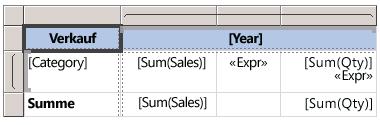
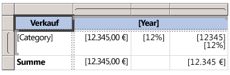

# Ausdrücke (Berichts-Generator und SSRS)
  Ausdrücke werden sehr häufig in [!INCLUDE[ssRSnoversion_md](../../includes/ssrsnoversion-md.md)] Berichten mit Seitenzahlen verwendet, um Daten abzurufen, zu berechnen, anzuzeigen, zu gruppieren, zu sortieren, zu filtern, zu parametrisieren oder zu formatieren. 
  
  Für viele Berichtselementeigenschaften kann ein Ausdruck festgelegt werden. Mithilfe von Ausdrücken können Sie Inhalt, Entwurf und Interaktivität des Berichts steuern. Ausdrücke werden in [!INCLUDE[msCoName](../../includes/msconame-md.md)] [!INCLUDE[vbprvb](../../includes/vbprvb-md.md)]geschrieben, in der Berichtsdefinition gespeichert und vom Berichtsprozessor bei der Ausführung des Berichts ausgewertet.  
  
 Im Gegensatz zu Anwendungen wie [!INCLUDE[msCoName](../../includes/msconame-md.md)] Office Excel, bei denen Sie Daten direkt in einem Arbeitsblatt oder einem Bericht bearbeiten, verwenden Sie Ausdrücke, bei denen es sich um Platzhalter für Daten handelt. Der Bericht muss in der Vorschau angezeigt werden, um die tatsächlichen Daten der ausgewerteten Ausdrücke anzeigen zu können. Wenn Sie den Bericht ausführen, wertet der Berichtsprozessor jeden Ausdruck aus, während Berichtsdaten und Elemente des Berichtslayouts, z. B. Tabellen und Diagramme, kombiniert werden.  
  
 Während des Berichtsentwurfs werden zahlreiche Berichtselementausdrücke für Sie festgelegt. Wenn Sie ein Feld aus dem Datenbereich in eine Tabellenzelle auf der Berichtsentwurfsoberfläche ziehen, wird z. B. ein einfacher Ausdruck als Textfeldwert für das Feld festgelegt. In der folgenden Abbildung enthält der Berichtsdatenbereich die Datasetfelder ID, Name, SalesTerritory, Code und Sales. Der Tabelle wurden die drei Felder[Name], [Code] und [Sales] hinzugefügt. Die Bezeichnung [Name] auf der Entwurfsoberfläche stellt den zugrunde liegenden `=Fields!Name.Value`-Ausdruck dar.  
  
   
  
 Wenn Sie den Bericht in der Vorschau anzeigen, kombiniert der Berichtsprozessor den Tabellendatenbereich mit den tatsächlichen Daten aus der Datenverbindung und zeigt für jede Zeile im Resultset eine Zeile in der Tabelle an.  
  
 Wenn Sie Ausdrücke manuell eingeben möchten, wählen Sie auf der Entwurfsoberfläche ein Element aus und legen die Eigenschaften des Elements mithilfe der Kontextmenüs und Dialogfelder fest. Wenn die Schaltfläche ***(fx)*** oder der Wert `<Expression>` in einer Dropdownliste angezeigt wird, deutet dies darauf hin, dass Sie einen Ausdruck für die Eigenschaft festlegen können. Weitere Informationen finden Sie unter [Hinzufügen eines Ausdrucks &#40;Berichts-Generator und SSRS&#41;](../../reporting-services/report-design/add-an-expression-report-builder-and-ssrs.md)-Ausdruck dar.  
  
 Wenn Sie komplexe Ausdrücke oder Ausdrücke entwickeln möchten, die benutzerdefinierten Code oder benutzerdefinierte Assemblys verwenden, empfiehlt sich die Verwendung des Berichts-Designers in [!INCLUDE[ssBIDevStudioFull](../../includes/ssbidevstudiofull-md.md)]. Weitere Informationen finden Sie unter [Benutzerdefinierter Code und Assemblyverweise in Ausdrücken in Berichts-Designer &#40;SSRS&#41;](../../reporting-services/report-design/custom-code-and-assembly-references-in-expressions-in-report-designer-ssrs.md)-Ausdruck dar.  
  
> [!NOTE]  
>  [!INCLUDE[ssRBRDDup](../../includes/ssrbrddup-md.md)]  
  
##   Grundlegendes zu einfachen und komplexen Ausdrücken  
 Ausdrücke beginnen mit einem Gleichheitszeichen (=) und werden in [!INCLUDE[msCoName](../../includes/msconame-md.md)] [!INCLUDE[vbprvb](../../includes/vbprvb-md.md)]geschrieben. Ausdrücke können eine Kombination aus Konstanten, Operatoren und Verweisen auf integrierte Werte (Felder, Auflistungen und Funktionen) und auf externen oder benutzerdefinierten Code enthalten.  
  
 Mithilfe von Ausdrücken können die Werte zahlreicher Berichtselementeigenschaften angegeben werden. Die häufigsten Eigenschaften sind Werte für Textfelder und Platzhaltertext. Wenn ein Textfeld nur einen Ausdruck enthält, entspricht der Ausdruck normalerweise dem Wert der Textfeldeigenschaft. Wenn ein Textfeld mehrere Ausdrücke enthält, entspricht jeder Ausdruck dem Wert eines Platzhaltertexts im Textfeld.  
  
 Ausdrücke werden auf der Berichtsentwurfsoberfläche standardmäßig als *einfache* oder *komplexe Ausdrücke*angezeigt.  
  
-   **Einfach:** Ein einfacher Ausdruck enthält einen Verweis auf ein einzelnes Element in einer integrierten Sammlung, beispielsweise ein Datasetfeld, einen Parameter oder ein integriertes Feld. Auf der Entwurfsoberfläche wird ein einfacher Ausdruck in eckigen Klammern angezeigt. `[FieldName]` entspricht z. B. dem zugrunde liegenden Ausdruck `=Fields!FieldName.Value`. Einfache Ausdrücke werden automatisch erstellt, während Sie das Berichtslayout anlegen und Elemente aus dem Berichtsdatenbereich auf die Entwurfsoberfläche ziehen. Weitere Informationen zu den Symbolen, die unterschiedliche integrierte Sammlungen darstellen, finden Sie unter [Grundlegendes zu Präfixsymbolen in einfachen Ausdrücken](#DisplayText).  
  
-   **Komplex:** Ein komplexer Ausdruck enthält Verweise auf mehrere integrierte Verweise, Operatoren und Funktionsaufrufe. Wird ein komplexer Ausdruck als <\<Expr >> Wenn der Ausdruckswert mehr als einen einfachen Verweis enthält. Zum Anzeigen des Ausdrucks zeigen Sie darauf und lesen die QuickInfo. Um den Ausdruck zu bearbeiten, öffnen Sie ihn im Dialogfeld **Ausdruck** .  
  
 Die folgende Abbildung enthält typische einfache und komplexe Ausdrücke sowohl für Textfelder als auch für Platzhaltertext.  
  
   
  
 Um in Ausdrücken Beispielwerte anstelle von Text anzuzeigen, formatieren Sie das Textfeld oder den Platzhaltertext. In der folgenden Abbildung wird die Berichtsentwurfsoberfläche auf die Anzeige von Beispielwerten umgeschaltet:  
  
   
  
 Weitere Informationen finden Sie unter [Formatieren von Text und Platzhaltern &#40;Berichts-Generator und SSRS&#41;](../../reporting-services/report-design/formatting-text-and-placeholders-report-builder-and-ssrs.md).  
  
### Berichtsmodellformeln  
 Wenn Sie eine Abfrage für ein Dataset entwerfen, das ein Berichtsmodell als Datenquelle verwendet, können Sie *Formeln*erstellen. Formeln sind Berechnungen, die für Werte in einem Bericht ausgeführt werden, die auf den Daten eines Berichtsmodells basieren.  
  
 Weitere Informationen finden Sie unter [Formeln in Berichtsmodellabfragen &#40;Berichts-Generator und SSRS&#41;](../../reporting-services/report-design/formulas-in-report-model-queries-report-builder-and-ssrs.md).  
   
##   Grundlegendes zu Präfixsymbolen in einfachen Ausdrücken  
 Einfache Ausdrücke verwenden Symbole, um anzugeben, ob ein Verweis für ein Feld, einen Parameter, eine integrierte Auflistung oder die ReportItems-Auflistung gilt. In der folgenden Tabelle sind Beispiele für Anzeige- und Ausdruckstext aufgeführt:  
  
|Element|Beispiel für Anzeigetext|Beispiel für Ausdruckstext|  
|----------|--------------------------|-----------------------------|  
|Datasetfelder|`[Sales]`   `[SUM(Sales)]`   `[FIRST(Store)]`|`=Fields!Sales.Value`   `=Sum(Fields!Sales.Value)`   `=First(Fields!Store.Value)`|  
|Berichtsparameter|`[@Param]`   `[@Param.Label]`|`=Parameters!Param.Value`   `=Parameters!Param.Label`|  
|Integrierte Felder|`[&ReportName]`|`=Globals!ReportName.Value`|  
|Für Anzeigetext verwendete Literalzeichen|`\[Sales\]`|`[Sales]`|  
  
##   Schreiben komplexer Ausdrücke  
 Ausdrücke können Verweise auf Funktionen, Operatoren, Konstanten, Felder, Parameter, Elemente aus integrierten Auflistungen sowie auf eingebetteten benutzerdefinierten Code oder benutzerdefinierte Assemblys enthalten.  
  
> [!NOTE]  
>  Wenn Sie komplexe Ausdrücke oder Ausdrücke entwickeln möchten, die benutzerdefinierten Code oder benutzerdefinierte Assemblys verwenden, empfiehlt sich die Verwendung des Berichts-Designers in [!INCLUDE[ssNoVersion](../../includes/ssnoversion-md.md)][!INCLUDE[ssBIDevStudioFull](../../includes/ssbidevstudiofull-md.md)]. Weitere Informationen finden Sie unter [Benutzerdefinierter Code und Assemblyverweise in Ausdrücken in Berichts-Designer &#40;SSRS&#41;](../../reporting-services/report-design/custom-code-and-assembly-references-in-expressions-in-report-designer-ssrs.md)-Ausdruck dar.  
  
 In der folgenden Tabelle sind die Verweistypen aufgeführt, die Sie in einen Ausdruck aufnehmen können:  
  
|Verweise|Description|Beispiel|  
|----------------|-----------------|-------------|  
|[Konstanten](../../reporting-services/report-design/constants-in-expressions-report-builder-and-ssrs.md)|Beschreibt die Konstanten, auf die Sie für Eigenschaften, die konstante Werte erfordern, z. B. Schriftfarben, interaktiv zugreifen können.|`="Blue"`|  
|[Operatoren](../../reporting-services/report-design/operators-in-expressions-report-builder-and-ssrs.md)|Beschreibt die Operatoren, mit denen Sie Verweise in einem Ausdruck kombinieren können. Der **&** -Operator wird z. B. zum Verketten von Zeichenfolgen verwendet.|`="The report ran at: " & Globals!ExecutionTime & "."`|  
|[Integrierte Auflistungen](../../reporting-services/report-design/built-in-collections-in-expressions-report-builder.md)|Beschreibt die integrierten Auflistungen, die Sie in einen Ausdruck einschließen können, z. B. `Fields`, `Parameters`und `Variables`.|`=Fields!Sales.Value`   `=Parameters!Store.Value`   `=Variables!MyCalculation.Value`|  
|[Integrierte Berichts- und Aggregatfunktionen](../../reporting-services/report-design/report-builder-functions-aggregate-functions-reference.md)|Beschreibt die integrierten Funktionen, z. B. `Sum` oder `Previous`, auf die Sie von einem Ausdruck aus zugreifen können.|`=Previous(Sum(Fields!Sales.Value))`|  
|[Benutzerdefinierter Code und Assemblyverweise in Ausdrücken in Berichts-Designer &#40;SSRS&#41;](../../reporting-services/report-design/custom-code-and-assembly-references-in-expressions-in-report-designer-ssrs.md)|Beschreibt, wie Sie auf die integrierten CLR-Klassen <xref:System.Math> und <xref:System.Convert>, andere CLR-Klassen, [!INCLUDE[vbprvb](../../includes/vbprvb-md.md)]-Laufzeitbibliotheksfunktionen oder Methoden aus einer externen Assembly zugreifen können.   Beschreibt, wie Sie auf benutzerdefinierten Code zugreifen können, der in den Bericht eingebettet ist oder der sowohl auf dem Berichtsclient als auch auf dem Berichtsserver als benutzerdefinierte Assembly kompiliert und installiert wird.|`=Sum(Fields!Sales.Value)`   `=CDate(Fields!SalesDate.Value)`   `=DateAdd("d",3,Fields!BirthDate.Value)`   `=Code.ToUSD(Fields!StandardCost.Value)`|  
   
##   Überprüfen von Ausdrücken  
 Wenn Sie einen Ausdruck für eine bestimmte Berichtselementeigenschaft erstellen, sind die in einem Ausdruck verwendbaren Verweise von den Werten abhängig, die die Berichtselementeigenschaft annehmen kann, sowie vom Bereich, in dem die Eigenschaft ausgewertet wird. Beispiel:  
  
-   Der [Sum]-Ausdruck berechnet standardmäßig die Summe der Daten, die sich zum Zeitpunkt der Ausdrucksauswertung im Ausdrucksbereich befinden. Bei einer Tabellenzelle hängt der Bereich von Mitgliedschaften in Zeilen- und Spaltengruppen ab. Weitere Informationen finden Sie unter [Ausdrucksbereich für Gesamtwerte, Aggregate und integrierte Sammlungen &#40;Berichts-Generator und SSRS&#41;](../../reporting-services/report-design/expression-scope-for-totals-aggregates-and-built-in-collections.md)-Ausdruck dar.  
  
-   Der Wert für eine Font-Eigenschaft muss zum Namen einer Schriftart ausgewertet werden.  
  
-   Die Ausdruckssyntax wird zur Entwurfszeit überprüft. Der Ausdrucksbereich wird beim Veröffentlichen des Berichts überprüft. Bei Überprüfungen, die von den tatsächlichen Daten abhängen, können Fehler nur zur Laufzeit ermittelt werden. Bei einigen Ausdrücken wird im gerenderten Bericht die Meldung #Fehler ausgegeben. Die Ursache für derartige Fehler können Sie mit dem Berichts-Designer in [!INCLUDE[ssBIDevStudioFull](../../includes/ssbidevstudiofull-md.md)]ermitteln. Der Berichts-Designer enthält ein Ausgabefenster, in dem weitere Informationen zu diesen Fehlern angegeben sind.  
  
 Weitere Informationen finden Sie unter [Ausdrucksreferenz &#40;Berichts-Generator und SSRS&#41;](../../reporting-services/report-design/expression-reference-report-builder-and-ssrs.md)-Ausdruck dar.  
  
##   In diesem Abschnitt  
 [Hinzufügen eines Ausdrucks &#40;Berichts-Generator und SSRS&#41;](../../reporting-services/report-design/add-an-expression-report-builder-and-ssrs.md)  
  
 [Ausdrucksverwendungen in Berichten &#40;Berichts-Generator und SSRS&#41;](../../reporting-services/report-design/expression-uses-in-reports-report-builder-and-ssrs.md)  
  
 [Ausdrucksbereich für Gesamtwerte, Aggregate und integrierte Sammlungen &#40;Berichts-Generator und SSRS&#41;](../../reporting-services/report-design/expression-scope-for-totals-aggregates-and-built-in-collections.md)  
  
 [Ausdrucksreferenz &#40;Berichts-Generator und SSRS&#41;](../../reporting-services/report-design/expression-reference-report-builder-and-ssrs.md)  

## Siehe auch
 Weitere Informationen und Beispiele finden Sie in den folgenden Themen:  
  
-   [Ausdrucksverwendungen in Berichten &#40;Berichts-Generator und SSRS&#41;](../../reporting-services/report-design/expression-uses-in-reports-report-builder-and-ssrs.md)  
-   [Beispiele für Ausdrücke &#40;Berichts-Generator und SSRS&#41;](../../reporting-services/report-design/expression-examples-report-builder-and-ssrs.md)  
-   [Beispiele für Filtergleichungen &#40;Berichts-Generator und SSRS&#41;](../../reporting-services/report-design/filter-equation-examples-report-builder-and-ssrs.md)  
-   [Beispiele für Gruppierungsausdrücke &#40;Berichts-Generator und SSRS&#41;](../../reporting-services/report-design/group-expression-examples-report-builder-and-ssrs.md)  
-   [Lernprogramm: Einführung in Ausdrücke](Tutorial:%20Introducing%20Expressions.md)
-   [Berichtsbeispiele (Berichts-Generator und SSRS)](http://go.microsoft.com/fwlink/?LinkId=198283)  
  

