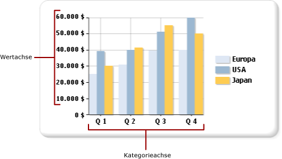

# Formatieren von Achsenbezeichnungen in einem Diagramm (Berichts-Generator und SSRS)
  Koordinatenbasierte Diagrammtypen (Säulen-, Balken-, Flächen-, Punkt-, Linien- und Bereichsdiagramme) verfügen über zwei Achsen, die zur Kategorisierung und Anzeige von Datenbeziehungen verwendet werden. Auf jede Achse werden unterschiedliche Formatierungstypen angewendet.  
  
 Sie können Achsen über das Dialogfeld **Achseneigenschaften** oder im Bereich Eigenschaften formatieren. Klicken Sie mit der rechten Maustaste auf die Achse, die Sie formatieren möchten, und klicken Sie dann auf **Achseneigenschaften**, um die Werte für den Achsentext, numerische Formate und Datumsformate, die Haupt- und Hilfsteilstriche, die automatische Anpassung von Bezeichnungen sowie die Stärke, die Farbe und den Stil der Achsenlinie anzupassen. Zum Ändern der Werte für den Achsentitel klicken Sie mit der rechten Maustaste auf den Achsentitel, und klicken Sie dann auf **Achsentiteleigenschaften**.  
  
 Die Achsenbezeichnungen identifizieren die Hauptintervalle im Diagramm. Das Diagramm verwendet standardmäßig einen Algorithmus, um zu ermitteln, wie die Bezeichnungen optimal auf der Achse platziert werden, sodass das Überlappen von Text vermieden wird.  
  
> [!NOTE]  
>  [!INCLUDE[ssRBRDDup](../../includes/ssrbrddup-md.md)]  
  
## Achsentypen  
 Das Diagramm verfügt über zwei Hauptachsen: die Wertachse und die Kategorieachse.  
  
   
  
 Wenn Sie ein Feld aus Ihrem Dataset auf die Entwurfsoberfläche ziehen, bestimmt das Diagramm, ob dieses Feld zur Kategorie- oder zur Wertachse gehört.  
  
 Die Wertachse ist normalerweise die vertikale Achse oder y-Achse des Diagramms. Sie wird verwendet, um numerische Datenwerte anzuzeigen, aus denen ein Diagramm erstellt wird. Ein Feld, das in den Datenfeldbereich gezogen wird, wird auf der Wertachse dargestellt. Die Kategorieachse ist normalerweise die horizontale Achse oder x-Achse des Diagramms. Bei Balkendiagrammen sind diese Achsen umgekehrt. Bei Balkendiagrammtypen ist die Kategorieachse die vertikale Achse, und die Wertachse ist die horizontale Achse. Weitere Informationen finden Sie unter [Balkendiagramme &#40;Berichts-Generator und SSRS&#41;](../../reporting-services/report-design/bar-charts-report-builder-and-ssrs.md).  
  
## Wie das Diagramm Achsenbezeichnungsintervalle berechnet  
 Bevor Sie Achsenbezeichnungen formatieren, sollten Sie verstehen, wie das Diagramm Achsenbezeichnungsintervalle berechnet. Dies ermöglicht es Ihnen, die Eigenschaften festzulegen, die für das gewünschte Achsenbezeichnungsverhalten erforderlich sind.  
  
 Die Achsenskala ist an einen Mindest- und einen Höchstwert gebunden, die den Datenbereich definieren, der an der Anchse angezeigt wird. Das Diagramm berechnet den Mindest- und Höchstwert an jeder Achse auf Grundlage der Werte im Resultset. Auf der Wertachse wird die Skala immer von der kleinsten und größten Zahl im Wertfeld bestimmt. Auf der Kategorieachse werden dieMindest- und Höchstwerttypen abhängig vom Typ des Kategoriefelds bestimmt. Jedes Feld in einem Dataset kann einem von drei Kategoriefeldtypen zugeordnet werden. In der folgenden Tabelle werden diese drei Typen von Kategoriefeldern illustriert.  
  
|Kategoriefeldtyp|Description|Beispiel|  
|-------------------------|-----------------|-------------|  
|Numerisch|Kategorien werden in numerischer Reihenfolge an der x-Achse dargestellt.|Ein Verkaufsbericht nach Mitarbeiter-ID zeigt die Mitarbeiter-IDs an der x-Achse an.|  
|Date/Time|Kategorien werden in chronolgischer Reihenfolge an der x-Achse dargestellt.|Bei einem monatlichen Verkaufsbericht werden formatierte Datumsangaben an der x-Achse angezeigt.|  
|Zeichenfolgen|Kategorien werden in der Reihenfolge, in der sie in der Datenquelle vorkommen, an der x-Achse dargestellt.|Bei einem Verkaufsbericht nach Regionen werden die Regionsnamen an der x-Achse angezeigt.|  
  
 Alle Diagrammtypen mit zwei Achsen sind so konzipiert, dass einige Achsenbezeichnungen unterdrückt werden, wenn zu viele Kategorien vorhanden sind, um auf die Achse zu passen. Auf diese Weise wird das Diagramm übersichtlicher und Bezeichnungskollisionen werden vermieden.  
  
 Die Anwendung berechnet anhand der folgenden Schritte, wo die Bezeichnungen auf einer Achse platziert werden:  
  
1.  Die Mindest- und Höchstwerte werden auf Grundlage der Werte im Resultset identifiziert.  
  
2.  Auf Grundlage dieser Mindest- und Höchstwerte wird eine bestimmte Anzahl von Achsenintervallen mit gleichem Abstand berechnet (normalerweise zwischen vier und sechs).  
  
3.  Auf Grundlage der Achsenbezeichnungseigenschaften werden in diesen Intervallen Bezeichnungen angezeigt. Zu den Eigenschaften, die die Platzierung der Bezeichnungen beeinflussen, zählen der Schriftgrad, der Anzeigewinkel der Bezeichnungen sowie die Textumbrucheigenschaften. Diese Optionen zur automatischen Anpassung der Achsenbezeichnungen können geändert werden.  
  
### Beispiel für die Berechnung der Achsenbezeichnungen durch das Diagramm  
 Die hier gezeigte Tabelle enthält Beispielumsatzdaten, die in einem Säulendiagramm dargestellt werden sollen. Das Feld Name wird dem Bereich Kategoriegruppen und das Feld Menge dem Bereich Werte hinzugefügt.  
  
|Name|Quantity|  
|----------|--------------|  
|Michael Blythe|229|  
|Jae Pak|112|  
|Ranjit Varkey Chudukatil|494|  
|Jillian Carson|247|  
|Linda Mitchell|339|  
|Rachel Valdez|194|  
  
 Das Feld Menge wird an der Wertachse dargestellt. Der niedrigste Wert ist 112 und der höchste Wert 494. In diesem Fall berechnet das Diagramm, dass die Skala bei 0 beginnt und bei 500 endet. Das Diagramm berechnet zudem fünf Intervalle mit gleichem Abstand (100) und erstellt Bezeichnungen bei 0, 100, 200, 300, 400 und 500.  
  
 Das Feld Name wird an der Kategorieachse dargestellt. Das Diagramm berechnet zwischen vier und sechs Bezeichnungen sowie die erforderlichen automatischen Anpassungseinstellungen, damit die Bezeichnungen auf die Kategorieachse passen und keine Bezeichnungskollisionen verursachen. Als Ergebnis werden möglicherweise einige Kategoriebezeichnungen weggelassen. Sie können die Optionen zur automatischen Anpassung für jede Achse einzeln überschreiben.  
  
## Anzeigen aller Bezeichnungen an der Kategorieachse  
 Auf der Wertachse stellen die Achsenintervalle ein konsistentes Maß für die Datenpunkte im Diagramm bereit. Auf der Kategorieachse kann diese Funktion jedoch bewirken, dass Kategorien ohne Achsenbezeichnungen angezeigt werden. In der Regel sollten alle Kategorien eine Bezeichnung aufweisen. Sie können die Anzahl der Intervalle auf 1 festlegen, um alle Kategorien anzuzeigen.  Weitere Informationen finden Sie unter [Angeben eines Achsenintervalls &#40;Berichts-Generator und SSRS&#41;](../../reporting-services/report-design/specify-an-axis-interval-report-builder-and-ssrs.md).  
  
> [!NOTE]  
>  Da Sie durch ein manuelles Intervall an einer Achse die automatischen Bezeichnungsfunktionen überschreiben, muss das Diagramm die Größer aller anderen Elemente entsprechend ändern. Dies kann zu unerwarteten Ergebnissen bezüglich der Größe und Positionierung der Bezeichnungen oder der Größe anderer Elemente im Diagramm führen.  
  
## Variable Achsenintervalle  
 Das Diagramm berechnet unabhängig von der Größe des Diagramms ungefähr fünf Achsenbezeichnungsintervalle. Wenn Sie in breiteren oder höheren Diagrammen nur fünf Bezeichnungen an einer Achse anzeigen, können dadurch große Lücken zwischen den einzelnen Bezeichnungen entstehen. Dies macht es schwieriger, den Wert jedes Datenpunkts an der Achse zu identifizieren. Um dieses Verhalten bei breiteren oder höheren Diagrammen zu vermeiden, können Sie ein variables Achsenintervall festlegen. Das Diagramm berechnet die optimale Anzahl der Bezeichnungen, die an der Achse angezeigt werden können, je nach Achse auf Grundlage der Breite oder der Höhe des Diagramms. Weitere Informationen finden Sie unter [Angeben eines Achsenintervalls &#40;Berichts-Generator und SSRS&#41;](../../reporting-services/report-design/specify-an-axis-interval-report-builder-and-ssrs.md).  
  
## Sortieren von Achsenwerten  
 Kategorien werden an der x-Achse in der Reihenfolge angezeigt, in der sie im Resultset vorkommen. Sie können die Gruppenreihenfolge ändern, indem Sie der Abfrage einen SORT-Befehl hinzufügen oder das Dataset mithilfe eines Ausdrucks sortieren. Diagrammdatenbereiche werden auf dieselbe Weise sortiert wie alle anderen Datenbereiche. Weitere Informationen zum Sortieren von Daten finden Sie unter [Sortieren von Daten in einem Datenbereich &#40;Berichts-Generator und SSRS&#41;](../../reporting-services/report-design/sort-data-in-a-data-region-report-builder-and-ssrs.md).  
  
## Angeben von Skalarwerten auf der Kategorieachse  
 Standardmäßig zeigt das Diagramm nur Achsenbezeichnungen für Datenpunkte im Dataset an, die gültige Werte enthalten. Wenn beispielsweise an der Kategorieachse die Werte 1, 2 und 6 vorhanden sind, zeigt das Diagramm nur die Kategorien 1, 2 und 6 an. Um die Skala der Kategoriewerte beizubehalten, können Sie angeben, dass das Diagramm eine skalare Achse verwenden soll. In diesem Szenario zeigt das Diagramm Bezeichnungen für 1-6 an der x-Achse des Diagramms an, auch wenn Ihr Dataset keine Werte für 3-5 enthält.  
  
 Es gibt zwei Möglichkeiten, um eine skalare Achse festzulegen:  
  
-   Wählen Sie im Dialogfeld **Achseneigenschaften** die Option **Skalare Achse** aus. Dadurch werden der Achse numerische oder Datums-/Uhrzeitwerte hinzugefügt, wo keine Datengruppierungswerte vorhanden sind. Weitere Informationen finden Sie unter [Achseneigenschaften &#40;Dialogfeld, Achsenoptionen, Berichts-Generator und SSRS&#41;](../Topic/Axis%20Properties%20Dialog%20Box,%20Axis%20Options%20\(Report%20Builder%20and%20SSRS\).md).  
  
-   Wählen Sie ein Feld aus, oder geben Sie in das Dialogfeld **Reiheneigenschaften** einen Ausdruck für die Option **Kategorienfeld** ein. Das Diagramm fügt Achsenintervalle für alle Werte im Kategorienfeld hinzu, das Sie angegeben haben.  
  
## Hinzufügen oder Entfernen von Seitenrändern an der Kategorieachse  
 Bei Balken-, Säulen- und Punktdiagrammen fügt das Diagramm anf den Enden der x-Achse automatisch Seitenränder hinzu. Die Größe der Seitenränder kann nicht geändert werden. Bei allen anderen Diagrammtypen fügt das Diagramm keine Seitenränder hinzu. Weitere Informationen finden Sie unter [Hinzufügen oder Entfernen von Rändern aus einem Diagramm &#40;Berichts-Generator und SSRS&#41;](../../reporting-services/report-design/add-or-remove-margins-from-a-chart-report-builder-and-ssrs.md).  
  
## In diesem Abschnitt  
 [Formatieren von Achsenbezeichnungen als Datumsangabe oder Währung &#40;Berichts-Generator und SSRS&#41;](../../reporting-services/report-design/format-axis-labels-as-dates-or-currencies-report-builder-and-ssrs.md)  
  
 [Positionieren von Bezeichnungen in einem Diagramm &#40;Berichts-Generator und SSRS&#41;](../../reporting-services/report-design/position-labels-in-a-chart-report-builder-and-ssrs.md)  
  
 [Angeben eines Achsenintervalls &#40;Berichts-Generator und SSRS&#41;](../../reporting-services/report-design/specify-an-axis-interval-report-builder-and-ssrs.md)  
  
 [Hinzufügen oder Entfernen von Rändern aus einem Diagramm &#40;Berichts-Generator und SSRS&#41;](../../reporting-services/report-design/add-or-remove-margins-from-a-chart-report-builder-and-ssrs.md)  
  
 [Angeben einer logarithmischen Skalierung &#40;Berichts-Generator und SSRS&#41;](../../reporting-services/report-design/specify-a-logarithmic-scale-report-builder-and-ssrs.md)  
  
## Siehe auch  
 [Formatieren eines Diagramms &#40;Berichts-Generator und SSRS&#41;](../../reporting-services/report-design/formatting-a-chart-report-builder-and-ssrs.md)   
 [Diagramme &#40;Berichts-Generator und SSRS&#41;](../../reporting-services/report-design/charts-report-builder-and-ssrs.md)   
 [Formatieren von Datenpunkten in einem Diagramm &#40;Berichts-Generator und SSRS&#41;](../../reporting-services/report-design/formatting-data-points-on-a-chart-report-builder-and-ssrs.md)  
  
  