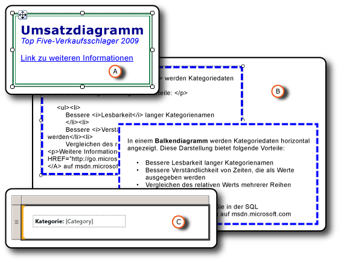

# Formatieren von Berichtselementen (Berichts-Generator und SSRS)
  Durch Formatieren der Elemente in einem Bericht lässt sich das Aussehen und die Lesbarkeit des Berichts deutlich verbessern. Die Textfelder und individuellen Elemente in Textfeldern, Bilder, Ausdrücke und Daten können im Berichtsentwurfsmodus formatiert werden.  
  
   
  
 A. Textfeld mit einem doppellinigen Rahmen und unterschiedlichen Formatvorlagen, einschließlich eines Links  
  
 B. Textfeld mit einem gestrichelten Rahmen und unformatiertem HTML und gerendertem HTML  
  
 C. Textfeld mit einer Textbezeichnung und einem Platzhalter  
  
 Sie können Formatierungsoptionen ändern, indem Sie das zu formatierende Element auswählen und dann das zugehörige Dialogfeld "Eigenschaften" öffnen. Wenn Sie z.B. den gesamten Inhalt eines Textfelds oder ein markiertes Wort in einem Textfeld formatieren möchten, klicken Sie mit der rechten Maustaste darauf, und wählen Sie **Textfeldeigenschaften**aus. Anschließend können Sie die gewünschten Formatierungsstile anwenden.  
  
 Eine schnelle Einführung finden Sie unter [Tutorial: Formatieren von Text &#40;Berichts-Generator&#41;](../../reporting-services/tutorial-format-text-report-builder.md).  
  
> [!NOTE]  
>  [!INCLUDE[ssRBRDDup](../../includes/ssrbrddup-md.md)]  
  
## In diesem Abschnitt  
 [Formatieren von Text und Platzhaltern &#40;Berichts-Generator und SSRS&#41;](../../reporting-services/report-design/formatting-text-and-placeholders-report-builder-and-ssrs.md)  
 Beschreibt das Formatieren von Text und Anpassen von Formatoptionen für unterschiedliche Textblöcke innerhalb eines Textfelds.  
  
 [Importieren von HTML in einen Bericht &#40;Berichts-Generator und SSRS&#41;](../../reporting-services/report-design/importing-html-into-a-report-report-builder-and-ssrs.md)  
 Beschreibt das Einfügen und Verwenden von HTML in einem Bericht.  
  
 [Formatieren von Zahlen und Datumsangaben &#40;Berichts-Generator und SSRS&#41;](../../reporting-services/report-design/formatting-numbers-and-dates-report-builder-and-ssrs.md)  
 Beschreibt die Verwendung der standardmäßigen und benutzerdefinierten Formatierungszeichenfolgen, die von [!INCLUDE[ssRSnoversion](../../includes/ssrsnoversion-md.md)]unterstützt werden.  
  
 [Formatieren von Linien, Farben und Bildern &#40;Berichts-Generator und SSRS&#41;](../../reporting-services/report-design/formatting-lines-colors-and-images-report-builder-and-ssrs.md)  
 Beschreibt, wie Sie innerhalb von Berichtselementen und Datenbereichen Zeilen, Gitternetzlinien, Farben und Bilder formatieren.  
  
 [Festlegen des Gebietsschemas für einen Bericht oder ein Textfeld &#40;Reporting Services&#41;](../../reporting-services/report-design/set-the-locale-for-a-report-or-text-box-reporting-services.md)  
 Beschreibt, wie die Einstellung für Datenanzeigeformate geändert wird, die sich durch Sprache und Bereich unterscheiden, z. B. Datum, Währungs- und Zahlenwerte.  
  
## Siehe auch  
 [Formatieren eines Diagramms &#40;Berichts-Generator und SSRS&#41;](../../reporting-services/report-design/formatting-a-chart-report-builder-and-ssrs.md)  
  
  
