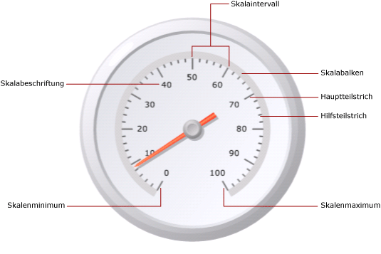
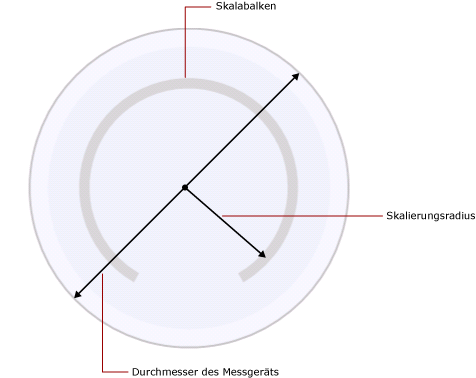

# Formatieren von Skalen auf einem Messgerät (Berichts-Generator und SSRS)
  In einem paginierten [!INCLUDE[ssRSnoversion_md](../../includes/ssrsnoversion-md.md)] -Bericht umfasst die Messgerätskala den durch einen Mindestwert und einen Höchstwert begrenzten Bereich von Zahlen, der auf dem Messgerät angezeigt wird. Typischerweise enthält eine Messgerätskala Messgerätbezeichnungen und Teilstriche, die das exakte Ablesen des Messgerätzeigers ermöglichen. Eine Messgerätskala ist generell mindestens einem Messgerätzeiger zugeordnet. Sie können mehrere Skalen auf einem Messgerät festlegen.  
  
   
  
 Im Gegensatz zu Diagrammen mit mehreren Gruppen zeigen Messgeräte nur einen Wert an. Sie müssen den Mindestwert und den Höchstwert der Skala definieren. Die Intervalle werden automatisch basierend auf dem festgelegten Mindest- und Höchstwert berechnet.  
  
 Wenn Sie einem Messgerät mit einer Skala eine zweite Skala hinzufügen, werden die Darstellungseigenschaften der ersten Skala für die zweite Skala geklont.  
  
 Sie können die Eigenschaften der Skala festlegen, indem Sie mit der rechten Maustaste auf die Messgerätbezeichnungen oder Teilstriche klicken und die Option **Radiale Skalierungseigenschaften** oder **Lineare Skalierungseigenschaften**auswählen. Jeder Messgerättyp enthält mindestens eine Skala mit demselben Eigenschaftensatz. Darüber hinaus sind jedoch auch Eigenschaften vorhanden, die für die einzelnen Messgerättypen spezifisch sind:  
  
-   Auf einem radialen Messgerät können Sie den Radius, den Startwinkel und den Mittelpunktswinkel der radialen Skala angeben.  
  
-   Auf einem linearen Messgerät können Sie die Breite des Startrands und des Endrands in Bezug auf die Endpunkte des linearen Messgeräts angeben.  
  
 Kurze Anweisungen zum Formatieren von Skalen finden Sie unter [Festlegen eines Mindestwerts oder eines Höchstwerts auf einem Messgerät &#40;Berichts-Generator und SSRS&#41;](../../reporting-services/report-design/set-a-minimum-or-maximum-on-a-gauge-report-builder-and-ssrs.md).  
  
##   Definieren des Mindestwerts, des Höchstwerts und der Intervalle für eine Skala  
 Auf Messgeräten werden häufig KPIs (Key Performance Indicators) angezeigt, die in Prozentsätzen von 0 bis 100 gemessen werden. Dabei handelt es sich somit um die Standardwerte für den Mindest- und Höchstwert des jeweiligen Messgeräts. Möglicherweise wird von diesen Werten jedoch nicht die gewünschte Werteskala dargestellt. Da keine integrierte Logik vorhanden ist, mit der die vom KPI-Datenfeld dargestellten Werte bestimmt werden, werden der Mindestwert und der Höchstwert vom Messgerät nicht automatisch berechnet. Wenn das KPI-Datenfeld keinen Wert zwischen 0 und 100 enthält, müssen Sie den Mindest- und den Höchstwert explizit festlegen, um einen Kontext für den auf dem Messgerät angezeigten Wert bereitzustellen.  
  
 Die Skala enthält Haupt- und Hilfsteilstriche. Darüber hinaus weist die Skala Bezeichnungen auf, die i. d. R. den Hauptteilstrichen zugeordnet sind. Eine Skala kann beispielsweise Hauptteilstriche bei den Werten 0, 20, 40, 60, 80 und 100 aufweisen. Die Bezeichnungen müssen diesen Teilstrichen entsprechen. Die Differenz zwischen den Bezeichnungswerten wird als Skalaintervall bezeichnet. In diesem Beispiel ist das Skalaintervall auf 20 festgelegt. Sie können die Intervalleigenschaft im Dialogfeld **Radiale Skalierungseigenschaften** oder **Lineare Skalierungseigenschaften** festlegen.  
  
 Skalaintervalle werden von der Anwendung anhand der folgenden Schritte berechnet:  
  
1.  Geben Sie den Mindest- und den Höchstwert an. Diese Werte werden für das Dataset nicht automatisch berechnet. Daher müssen Sie die Werte im Dialogfeld **Eigenschaften** für das Messgerät angeben.  
  
2.  Wenn Sie keinen Wert für Intervall angeben, wird der Standardwert Automatisch verwendet. Das heißt, dass die Anwendung anhand der im ersten Schritt festgelegten Mindest- und Höchstwerte eine Anzahl von Intervallen mit gleichem Abstand berechnet. Wenn Sie einen Wert für Intervall angeben, berechnet das Messgerät die Differenz zwischen Mindestwert und Höchstwert und dividiert das Ergebnis durch den Wert, der für Intervall festgelegt wurde.  
  
 Außerdem sind Eigenschaften vorhanden, mit denen Bezeichnungs- und Teilstrichintervalle definiert werden können. Wenn Sie einen Wert für diese Eigenschaften angeben, überschreiben diese den angegebenen Wert für die Skalaintervalleigenschaft. Wenn das Skalaintervall beispielsweise auf Automatisch festgelegt ist, das Bezeichnungsintervall jedoch auf den Wert 4 festgelegt wird, werden die Bezeichnungen bei 0, 4, 8 usw. angezeigt, die Hauptteilstriche werden jedoch weiterhin anhand der Berechnung des Messgeräts bestimmt. Dies kann zu Situationen führen, in denen die Bezeichnungen nicht mit den Teilstrichen synchronisiert sind. Es empfiehlt sich, beim Festlegen eines Bezeichnungsintervalls die Teilstriche auszublenden.  
  
 Der Intervalloffset bestimmt die Anzahl der Einheiten, die bis zur Anzeige der ersten Bezeichnung ausgelassen werden. Das angegebene Intervall wird für alle nachfolgenden Hauptteilstriche und Bezeichnungen auf der Skala verwendet. Wenn der Wert 0 für Bezeichnungs- und Teilstrichintervalle angegeben wird, entspricht dies dem Zurücksetzen des Intervalls auf den Wert "Automatisch".  
  
##   Verringern von Bezeichnungskollisionen mit Multiplikatoren  
 Wenn die Werte viele Stellen aufweisen, können sie möglicherweise die Lesbarkeit des Messgeräts beeinträchtigen. Mithilfe eines Skalenmultiplikators können Sie die Skalierung der Werte vergrößern oder verkleinern. Beim Angeben eines Skalenmultiplikators wird jeder ursprüngliche Wert auf der Skala vor seiner Anzeige auf der Skala mit dem Multiplikator multipliziert. Wenn Sie die Skalierung der Werte verringern möchten, müssen Sie eine Dezimalzahl angeben. Wenn sich die Skala beispielsweise von 0 bis 10000 erstreckt, Sie jedoch auf dem Messgerät die Zahlen 0 bis 10 anzeigen möchten, können Sie den Multiplikatorwert 0,001 angeben.  
  
> [!NOTE]  
>  Durch das Angeben eines Multiplikators wird nicht der tatsächliche Wert des Aggregatfelds, das vom Messgerät verwendet wird, multipliziert. Es werden lediglich die Werte der Bezeichnungen multipliziert, die auf dem Messgerät angezeigt werden, nachdem Mindestwert, Höchstwert und Intervalle definiert wurden. Bei Verwendung eines Multiplikators empfiehlt es sich, die Intervallberechnungen weiterhin automatisch ausführen zu lassen.  
  
##   Angeben von Skalabalkenbreite, Skalierungsradius und Skalawinkeln für eine radiale Skala  
 Legen Sie im Dialogfeld **Radiale Skalierungseigenschaften** auf der Seite **Layout** die Skalabalkenbreite, den Skalierungsradius sowie den Startwinkel und den Mittelpunktswinkel der Skala fest. Mithilfe dieser Eigenschaften können Sie Größe und Format der Skala anpassen. Wenn Sie beispielsweise die Skalabezeichnungen außerhalb der Skala positionieren, müssen Sie den Radius der Skalierung ändern, damit die Bezeichnungen in das Messgerät passen.  
  
> [!NOTE]  
>  Wenn Sie auf die Skala eines Messgeräts klicken, wird um die Skala ein gepunkteter Umriss angezeigt. Dieser Umriss stellt nicht den Skalabalken dar, und er wird nicht beim Berechnen von Messwerten für das Messgerät verwendet. Er ist lediglich zur Entwurfszeit verfügbar, damit Sie die Skala markieren können, um auf die Skalaeigenschaften zuzugreifen.  
  
 Alle Messungen basieren auf dem Skalabalken. Wenn Sie ein Messgerät auswählen, wird die Skalabalkenbreite nicht angezeigt. Wenn Sie einen Wert für den Skalabalken angeben, ist dies hilfreich für alle anderen Messungen in Bezug auf die Skala. Wenn Sie den Skalabalken anzeigen möchten, legen Sie im Dialogfeld **Radiale Skalierungseigenschaften** auf der Seite **Layout** die Eigenschaft **Skalabalkenbreite** auf einen größeren Wert als 0 fest. Auf einem radialen Messgerät wird der Skalabalken als Prozentsatz des Messgerätdurchmessers gemessen. Auf einem linearen Messgerät wird der Skalabalken als Prozentsatz der Messgerätbreite bzw. -höhe gemessen, je nachdem, welcher Wert kleiner ist.  
  
 Der Skalierungsradius entspricht der Entfernung vom Mittelpunkt des Messgeräts bis zum Mittelpunkt des Skalabalkens. Der Wert des Skalierungsradius wird als Prozentsatz des Messgerätdurchmessers gemessen. Es wird empfohlen, für den Skalierungsradius keinen höheren Wert als 35 anzugeben. Wenn Sie einen höheren Wert als 35 angeben, wird die Skala wahrscheinlich außerhalb der Grenzen des Messgeräts gezeichnet. In der folgenden Abbildung wird veranschaulicht, wie der Skalierungsradius in Bezug auf den Durchmesser des Messgeräts auf dem Skalabalken gemessen wird.  
  
   
  
 Der Startwinkel ist der Drehwinkel (zwischen 0 und 360), bei dem die Skala beginnt. Die Nullposition (0) befindet sich unten im Messgerät, und der Startwinkel wird im Uhrzeigersinn gedreht. Bei einem Startwinkel von 90 Grad wird die Skala an der 9-Uhr-Position begonnen.  
  
 Der Mittelpunktswinkel entspricht der Gradzahl (zwischen 0 und 360), um die die Skala gedreht wird. Bei einem Mittelpunktswinkel von 360 Grad wird eine Skala erzeugt, die einen vollständigen Kreis darstellt. Dies ist hilfreich, wenn Sie ein Messgerät entwerfen möchten, das einer Uhr ähnelt.  
  
##   Positionieren von Bezeichnungen auf einer linearen oder radialen Skala  
 Es sind zwei Eigenschaften verfügbar, mit denen die Position von Bezeichnungen bestimmt werden kann. Mit der Eigenschaft zum Bestimmen der Bezeichnungsposition wird angeben, ob die Bezeichnungen innerhalb oder außerhalb des Skalabalkens oder auf dem Skalabalken angezeigt werden. Mit der Eigenschaft zum Angeben des Abstands wird der Abstand der Bezeichnungen von der Skala vom Skalabalken aus festgelegt. Wenn Sie Bezeichnungen innerhalb des Skalabalkens positionieren möchten, geben Sie eine negative Zahl an. Wenn sich die Bezeichnungen beispielsweise außerhalb der Skala befinden und Sie als Abstand von der Skala den Wert 10 festgelegt haben, werden die Bezeichnungen um 10 Einheiten von ihrer normalen Position nach außen verschoben angezeigt, wobei eine Einheit wie folgt definiert ist:  
  
-   1 % des Messgerätdurchmessers auf einem radialen Messgerät oder  
  
-   1 % der Messgeräthöhe oder der Messgerätbreite (je nachdem, welcher Wert kleiner ist) auf einem linearen Messgerät  
  
## Siehe auch  
 [Formatierung Bereichen auf einem Messgerät &#40; Berichts-Generator und SSRS &#41;](../../reporting-services/report-design/formatting-ranges-on-a-gauge-report-builder-and-ssrs.md)   
 [Formatieren von Zeigern auf einem Messgerät &#40; Berichts-Generator und SSRS &#41;](../../reporting-services/report-design/formatting-pointers-on-a-gauge-report-builder-and-ssrs.md)   
 [Formatieren von Achsenbezeichnungen als Datumsangaben oder Währungen &#40; Berichts-Generator und SSRS &#41;](../../reporting-services/report-design/format-axis-labels-as-dates-or-currencies-report-builder-and-ssrs.md)   
 [Formatieren von Achsenbezeichnungen in einem Diagramm &#40; Berichts-Generator und SSRS &#41;](../../reporting-services/report-design/formatting-axis-labels-on-a-chart-report-builder-and-ssrs.md)   
 [Messgeräte &#40; Berichts-Generator und SSRS &#41;](../../reporting-services/report-design/gauges-report-builder-and-ssrs.md)  
  
  
