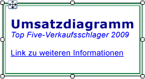
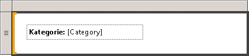

# Formatieren von Text und Platzhaltern (Berichts-Generator und SSRS)
  Ein Textfeld kann ein Berichtselement sein oder eine einzelne Zelle in einem Datenbereich mit Text, ein berechnetes Feld oder ein Zeiger auf ein Feld in einer Datenbank. Es kann sich auch um eine Kombination aus diesen drei Elementen handeln. Sie können Schriftarten und Farben kombinieren sowie Fett- und Kursivformatierungen hinzufügen; außerdem können Sie Absätze mithilfe von Ausrichtungen und Einzügen formatieren. Sie können ein vollständiges Textfeld formatieren, oder Sie können bestimmte Textelemente, Zahlen, Ausdrücke oder Felder in einem Textfeld formatieren.  
  
 Schriftart, Größe, Farbe und Effekte tragen jeweils zur Lesbarkeit eines Berichts bei. Auf Text in einem Textfeld oder in einem Datenbereich können Formate wie Schrift, Schriftart, Schriftgrad und Effekte wie Unterstreichung angewendet werden. Standardmäßig wird die Schriftart Arial mit dem Schriftgrad 10 Punkte in schwarz als Berichtsschriftart verwendet. In den Dialogfeldern **Textfeldeigenschaften** und **Texteigenschaften** können Sie angeben, wie der Text beim Rendern des Berichts dargestellt werden soll.  
  
   
  
 In dieser Abbildung verfügt das Textfeld selbst über einen Rahmen, und der gesamte Text befindet sich im gleichen Textfeld, weist aber unterschiedliche Formatierungen auf.  
  
 Eine schnelle Einführung finden Sie unter [Tutorial: Formatieren von Text &#40;Berichts-Generator&#41;](../../reporting-services/tutorial-format-text-report-builder.md).  
  
> [!NOTE]  
>  [!INCLUDE[ssRBRDDup](../../includes/ssrbrddup-md.md)]  
  
## Erstellen von Platzhaltertext in einem Textfeld  
 Wenn ein einfacher oder komplexer Ausdruck in einem Textfeld definiert wird, wird die resultierende Darstellung dieses Ausdrucks auf der Benutzeroberfläche als *Platzhalter*bezeichnet. Sie können Farben, Schriftarten, Aktionen sowie weitere Optionen für eine beliebige Anzahl an Platzhaltern oder Textabschnitten in einem Textfeld definieren.  
  
 Der Wert eines Platzhalters ist immer ein einfacher oder komplexer Ausdruck. Platzhalter können einem Textfeld durch Erstellen eines Ausdrucks mit einer der folgenden Methoden hinzugefügt werden:  
  
-   Ziehen Sie ein Feld aus dem Berichtsdatenbereich **** in das Textfeld. Wenn Sie den Ausdruck an eine andere Stelle im Hauptteil des Berichts ziehen, wird ein neues Textfeld mit dem Platzhalter erstellt. Beim Wert des Platzhalters handelt es sich um den Feldausdruck, der dem abgelegten Feld entspricht.  
  
-   Klicken Sie mit der rechten Maustaste auf eine beliebige Stelle im Textfeld, und wählen Sie **Platzhalter einfügen**aus. Im Dialogfeld **Platzhaltereigenschaften** können Sie einen Ausdruck als Wert des Platzhalters angeben. Weitere Informationen finden Sie unter [Platzhaltereigenschaften (Dialogfeld), Allgemein &#40;Berichts-Generator und SSRS&#41;](http://msdn.microsoft.com/library/7a867736-a3b0-4b5a-b3e5-fe7c8d7618a8).  
  
-   Geben Sie einen einfachen oder komplexen Ausdruck in das Textfeld ein. Wenn Sie z.B. **Name: [Name]** im Textfeld eingeben, wird der Text **[Name]** als Platzhalter angezeigt, der den Ausdruck `=Fields!Name.Value`darstellt.  
  
-   Geben Sie einen Ausdruck in ein leeres Textfeld ein, und beginnen Sie dazu mit einem Gleichheitszeichen (=). Wenn Sie den Fokus vom Textfeld entfernen, wird der resultierende Ausdruck in einen Platzhalter umgewandelt, den Sie bearbeiten können. Wenn das Textfeld nicht leer ist oder das Gleichheitszeichen nicht als erstes Zeichen in das Textfeld eingefügt wird, wird das Gleichheitszeichen als Zeichenfolgenliteral behandelt, und es wird kein Platzhalter erstellt. Weitere Informationen zum Definieren von einfachen und komplexen Ausdrücken finden Sie unter [Ausdruck verwendet wird, in Berichten &#40; Berichts-Generator und SSRS &#41; ](../../reporting-services/report-design/expression-uses-in-reports-report-builder-and-ssrs.md).  
  
## Formatieren von Platzhaltern und statischem Text in einem Textfeld  
 Platzhalter können mithilfe des Dialogfelds **Platzhaltereigenschaften** formatiert werden. Platzhalter können nur als Ganzes formatiert werden. Wenn Sie den zugrunde liegenden Ausdruck anzeigen möchten, können Sie den Mauszeiger über den Platzhalter bewegen. Sie können den zugrunde liegenden Ausdruck ändern, indem Sie auf den Platzhalter doppelklicken oder mit der rechten Maustaste auf den Platzhalter und anschließend auf **Platzhaltereigenschaften**klicken. Im Dialogfeld **Platzhaltereigenschaften** können Sie mit der Eigenschaft **Bezeichnung** unter **Allgemein** auch eine Bezeichnung für die Benutzeroberfläche angeben. Dieser Text wird zur Entwurfszeit für den Platzhalter angezeigt.  
  
   
  
 In dieser Abbildung enthält ein Textfeld in einer Liste eine Bezeichnung mit Fettformatierung und einen Platzhalter ohne Formatierung.  
  
 Im Gegensatz zu Platzhaltertext können Sie benutzerdefinierten Text separat in einem Textfeld ausrichten, mehrere Absätze in einem Textfeld verwenden und andere Optionen für beliebige Textteile definieren.  
  
 Sie können Farben, Schriftarten, Aktionen sowie weitere Optionen für beliebige Textteile in einem Textfeld definieren, um ein Seriendruckelement oder eine Vorlage für Text im Bericht zu erstellen. Sie können auch mehrere Absätze in einem Textfeld verwenden. Beispielsweise können Sie zwei Textabschnitte durch Drücken der EINGABETASTE im Textfeld aufteilen. Sie können auch einen Ausrichtungswert für eine beliebige Textzeichenfolge festlegen. Außerdem können Sie eine Aktion für benutzerdefinierten Text in einem Textfeld definieren. Dies ist hilfreich, wenn Sie einen Link für eine Textzeichenfolge in einem Textfeld hinzufügen möchten.  
  
> [!NOTE]  
>  Aktionen, die für ein Textfeld definiert wurden, haben eine höhere Priorität als Aktionen, die für Text in einem Textfeld definiert wurden.  
  
 Weitere Informationen zu gemischten Formatierungen finden Sie unter [Formatieren von Text in einem Textfeld &#40; Berichts-Generator und SSRS &#41; ](../../reporting-services/report-design/format-text-in-a-text-box-report-builder-and-ssrs.md).  
  
## Horizontales Ausrichten von Text  
 Im Dialogfeld **Textfeldeigenschaften** können Sie auf der Registerkarte **Ausrichtung** angeben, wie der Text horizontal ausgerichtet werden soll. Wenn Sie keinen Wert für die Ausrichtung angeben, wird der Standardwert **Standard**verwendet. Dies bedeutet, dass der Text auf Grundlage den Feldtyp für den Platzhalterwert ausgerichtet wird. Wenn Sie einen Ausdruck angeben, der nicht zu einem Zeichenfolgenwert ausgewertet wird (d. h. keine Zahl), wird der Text rechtsbündig ausgerichtet. Wird der Ausdruck zu einem Zeichenfolgenwert ausgewertet (z. B. eine Zahl), wird der Text linksbündig ausgerichtet.  
  
## Siehe auch  
 [Ausdrücke &#40;Berichts-Generator und SSRS&#41;](../../reporting-services/report-design/expressions-report-builder-and-ssrs.md)   
 [Formatieren von Achsenbezeichnungen in einem Diagramm &#40; Berichts-Generator und SSRS &#41;](../../reporting-services/report-design/formatting-axis-labels-on-a-chart-report-builder-and-ssrs.md)   
 [Formatieren von Skalen auf einem Messgerät &#40; Berichts-Generator und SSRS &#41;](../../reporting-services/report-design/formatting-scales-on-a-gauge-report-builder-and-ssrs.md)   
 [Tabellen, Matrizen und Listen &#40; Berichts-Generator und SSRS &#41;](../../reporting-services/report-design/tables-matrices-and-lists-report-builder-and-ssrs.md)   
 [Im Dialogfeld "Eigenschaften" Platzhalter, Allgemein &#40; Berichts-Generator und SSRS &#41;](http://msdn.microsoft.com/library/7a867736-a3b0-4b5a-b3e5-fe7c8d7618a8)   
 [Exportieren nach Microsoft Excel &#40; Berichts-Generator und SSRS &#41;](../../reporting-services/report-builder/exporting-to-microsoft-excel-report-builder-and-ssrs.md)   
 [Textfelder &#40; Berichts-Generator und SSRS &#41;](../../reporting-services/report-design/text-boxes-report-builder-and-ssrs.md)  
  
  

