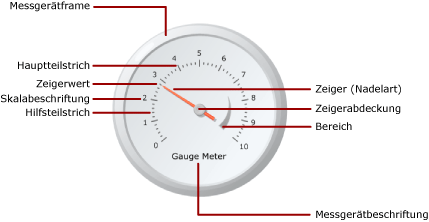

# Messgeräte (Berichts-Generator und SSRS)
  In paginierten [!INCLUDE[ssRSnoversion_md](../../includes/ssrsnoversion-md.md)] -Berichten zeigt ein Messgerätdatenbereich einen einzelnen Wert aus Ihrem Dataset an. Einzelne Messgeräte werden stets in einem Messgerätbereich positioniert, dem untergeordnete oder benachbarte Messgeräte hinzugefügt werden können. Innerhalb eines einzelnen Messgerätbereichs können Sie mehrere Messgeräte mit einheitlichen Funktionen wie Filtern, Gruppieren oder Sortieren erstellen.  
  
 Messgeräte können zur Ausführung zahlreicher Aufgaben in einem Bericht verwendet werden:  
  
-   Anzeigen von Key Performance Indicators (KPIs) in einem radialen oder linearen Messgerät  
  
-   Platzieren eines Messgeräts in einer Tabelle oder einer Matrix zur Veranschaulichung von Zellwerten  
  
-   Verwenden mehrerer Messgeräte in einem Messgerätbereich zum Vergleich von Daten in Feldern  
  
 Es gibt zwei Typen von Messgeräten: radiale und lineare Messgeräte. Die folgende Abbildung zeigt die grundlegenden Elemente eines einzelnen radialen Messgeräts im Messgerätbereich.  
  
   
  
 Weitere Informationen zur Verwendung von Messgeräten als KPIs finden Sie unter [Tutorial: Hinzufügen eines KPIS zu einem Bericht &#40;Berichts-Generator&#41;](../../reporting-services/tutorial-adding-a-kpi-to-your-report-report-builder.md).  
  
> [!NOTE]  
>  Sie können Messgeräten in einem Bericht als Berichtsteile getrennt veröffentlichen. Erfahren Sie mehr über [Berichtsteile](../../reporting-services/report-design/report-parts-report-builder-and-ssrs.md).  
  
##   Messgerättypen  
 [!INCLUDE[ssRSnoversion](../../includes/ssrsnoversion-md.md)] stellt zwei Messgerättypen bereit: radiale und lineare Messgeräte. Das radiale Messgerät normalerweise dazu verwendet, Daten als Geschwindigkeit auszudrücken. Das lineare Messgerät wird verwendet, um die Daten als Temperatur- oder Skalierungswert auszudrücken.  
  
 Die Hauptunterschiede zwischen den zwei Typen bestehen in der Gesamtform des Messgeräts und den verfügbaren Messgerätzeigern. Radiale Messgeräte sind rund oder kreisförmig und ähneln Tachometern. Die Messgerätzeiger sind oft Nadeln, können jedoch auch Marker oder Balken sein.  
  
 Lineare Messgeräte sind rechteckig, horizontal oder vertikal ausgerichtet und ähneln Linealen. Die Messgerätzeiger sind oft Thermometer, können jedoch auch Marker oder Balken sein. Aufgrund seiner Form ist dieser Messgerättyp hilfreich beim Integrieren in die Tabellen- oder Matrixdatenbereiche, um die Fortschrittsdaten anzuzeigen.  
  
 Abgesehen von diesen Unterschieden sind die zwei Messgerättypen austauschbar. Wenn Sie jedoch im Bericht ein einfaches Messgerät verwenden müssen, sollten Sie erwägen, einen Indikator anstelle eines Messgeräts zu verwenden. Weitere Informationen finden Sie unter [Indikatoren (Berichts-Generator und SSRS)](../../reporting-services/report-design/indicators-report-builder-and-ssrs.md).  
  
 In den folgenden Abbildungen werden radiale und lineare Messgeräte angezeigt. Das radiale Messgerät ist rund und verwendet den Nadelzeiger. Das lineare Messgerät ist horizontal und verwendet den Thermometerzeiger.  
  
 **Radiales Messgerät**  
  
   
  
 Optionen für radiale Messgeräte: "Radial", "Radial mit kleinem Messgerät", "Zwei Skalen", "90 Grad Nordost", "90 Grad Nordwest", "90 Grad Südwest", "90 Grad Südost", "180 Grad Nord", "180 Grad Süd", "180 Grad West", "180 Grad Ost" und "Messgerät".  
  
 **Lineares Messgerät**  
  
   
  
 Optionen für lineare Messgeräte: "Horizontal", "Vertikal", "Mehrere Balkenzeiger", "Zwei Skalen", "Drei Farbbereiche", "Logarithmisch", "Thermometer", "Thermometer Fahrenheit/Celsius" und "Lineardiagramm".  
  
##   Hinzufügen von Daten zu einem Messgerät  
 Ziehen Sie nach dem Hinzufügen des Messgeräts zur Entwurfsoberfläche ein Datasetfeld in den Messgerätdatenbereich. Das Messgerät aggregiert standardmäßig Feldwerte in einen Wert, der auf dem Messgerät angezeigt wird. Dieser Wert wird mit der Value-Eigenschaft an den Zeiger angefügt. Abhängig vom Datentyp des Felds verwendet das Messgerät das SUM- oder COUNT-Aggregat. Wenn Sie numerische Daten verwenden, die zum Hinzufügen geeignet sind, verwendet das Messgerät die SUM-Funktion. Andernfalls verwendet es das COUNT-Aggregat. Der Wert des Zeigers kann ein anderes Aggregat oder kein Aggregat verwenden.  
  
 Sie können eine Gruppierung für das Messgerät festlegen, sodass einzelne Gruppen oder einzelne Zeilen auf dem Messgerät angezeigt werden. Beim Anwenden von Gruppierung oder Filterung zeigt das Messgerät anhand des Zeigerwerts die letzte Gruppe bzw. Zeile im zurückgegebenen Dataset an.  
  
 Sie können einem Messgerät mehrere Werte hinzufügen, indem Sie einen weiteren Zeiger hinzufügen. Dieser Zeiger kann zu derselben Skala gehören. Sie können jedoch eine weitere Skala hinzufügen, der Sie den Zeiger zuordnen.  
  
 Im Gegensatz zu den Diagrammtypen im Dialogfeld **Diagrammtyp auswählen** werden die Messgerättypen im Dialogfeld **Messgerättyp auswählen** mit einer Kombination aus Messgeräteigenschaften erstellt. Messgerättypen können daher nicht auf die gleiche Art wie Diagrammtypen geändert werden. Wenn Sie den Messgerättyp ändern möchten, müssen Sie das Messgerät entfernen und der Entwurfsoberfläche erneut hinzufügen. Ein Messgerät verfügt mindestens über eine Skala und einen Zeiger. Sie können mehrere Skalen verwenden, indem Sie mit der rechten Maustaste auf das Messgerät klicken und **Skalierung hinzufügen**auswählen. Standardmäßig wird dadurch eine kleinere Skala erstellt und in der ersten Skala positioniert. Die Skala zeigt Bezeichnungen und Teilstriche an. Es gibt zwei Arten von Teilstrichen: Hilfs- und Hauptteilstriche.  
  
 Sie können mehrere Zeiger verwenden, indem Sie mit der rechten Maustaste auf das Messgerät klicken und **Zeiger hinzufügen**auswählen. Dadurch wird ein weiterer Zeiger für die gleiche Skala erstellt. Wenn Sie jedoch über mehrere Skalierungen verfügen, können Sie einen Zeiger einer beliebigen Skala im Messgerät zuordnen.  
  
### Überlegungen zum Hinzufügen von Daten zum Messgerät  
 Wie alle anderen Datenbereiche kann der Messgerätdatenbereich nur an ein Dataset gebunden werden. Wenn Sie über mehrere Datasets verfügen, empfiehlt es sich, mithilfe einer JOIN- oder UNION-Anweisung ein einziges Dataset zu erstellen oder für die einzelnen Datasets separate Messgeräte zu verwenden.  
  
 Numerische Datentypen werden mit der SUM-Funktion aggregiert. Nicht numerische Datentypen werden mit der COUNT-Funktion aggregiert, die die Anzahl der Instanzen für einen bestimmten Wert oder ein bestimmtes Feld im Dataset bzw. in der Gruppe zählt.  
  
 Wenn Sie nach dem Hinzufügen von Daten mit der rechten Maustaste auf den Zeiger klicken, werden die Optionen Zeigerwert löschen und Zeiger löschen aufgerufen. Mit der Option Zeigerwert löschen wird das an das Messgerät angefügte Feld entfernt, der Zeiger wird jedoch für das Messgerät weiterhin angezeigt. Mit der Option Zeiger löschen wird das Feld aus dem Messgerät entfernt, und der angezeigte Zeiger wird ebenfalls gelöscht. Wenn Sie dem Messgerät wieder ein Feld hinzufügen, wird der Standardzeiger erneut angezeigt. Wenn Sie dem Messgerät das Feld hinzugefügt haben, müssen Sie den maximalen und den minimalen Wert für die entsprechende Skala festlegen, um für das Messgerät einen Kontext zum Wert anzugeben. Sie können den minimalen und den maximalen Wert auch für einen Bereich festlegen, wodurch auf der Skala ein kritischer Bereich angegeben wird. Auf dem Messgerät werden der minimale und der maximale Wert auf der Skala bzw. im Bereich nicht automatisch festgelegt, da nicht bestimmt werden kann, wie der Wert erkannt wird.  
  
### Methoden zum Hinzufügen von Daten zu einem Messgerät  
 Nachdem Sie ein Dataset für den Bericht definiert haben, können Sie dem Messgerät ein Datenfeld hinzufügen, indem Sie einen der folgenden Vorgänge ausführen:  
  
-   Ziehen Sie ein Feld aus dem Dataset in den Datenbereich. Klicken Sie auf das Messgerät, und ziehen Sie ein Feld hinein. Sie können den Datenbereich öffnen, indem Sie auf das Messgerät klicken oder ein Feld über das Messgerät ziehen. Wenn sich auf dem Messgerät noch kein Zeiger befindet, wird dem Messgerät ein Zeiger hinzugefügt und an das hinzugefügte Feld gebunden.  
  
-   Zeigen Sie den Datenbereich an, und zeigen Sie auf den Feldplatzhalter. Klicken Sie auf den Pfeil nach unten neben dem Feldplatzhalter, und wählen Sie das Feld aus, das Sie verwenden möchten. Wenn bereits ein Feld ausgewählt ist, klicken Sie auf den Pfeil nach unten, und wählen Sie anschließend ein anderes Feld aus.  
  
    > [!NOTE]  
    >  Diese Vorgehensweise ist nicht möglich, wenn sich auf dem Messgerät kein Zeiger befindet und wenn das Messgerät bzw. der Bericht mehrere Datasets enthält und der Messgerätbereich keinem bestimmten Dataset zugeordnet ist.  
  
-   Klicken Sie mit der rechten Maustaste auf den Messgerätzeiger, und wählen Sie **Zeigereigenschaften**aus. Wählen Sie für **Wert**ein Feld aus der Dropdownliste aus, oder definieren Sie einen Feldausdruck, indem Sie auf die Schaltfläche **Ausdruck** (*fx*) klicken.  
  
### Aggregieren von Feldern in einen einzelnen Wert  
 Wenn einem Messgerät ein Feld hinzugefügt wird, wird von [!INCLUDE[ssRSnoversion](../../includes/ssrsnoversion-md.md)] standardmäßig ein Aggregat für das Feld berechnet. Numerische Datentypen werden mit der SUM-Funktion aggregiert. Nicht numerische Datentypen werden mit der COUNT-Funktion aggregiert, die die Anzahl der Instanzen für einen bestimmten Wert oder ein bestimmtes Feld im Dataset bzw. in der Gruppe zählt. Wenn der Datentyp des Wertefelds String lautet, kann das Messgerät keinen numerischen Wert anzeigen, selbst wenn sich in den Feldern Zahlen befinden. Stattdessen aggregiert das Messgerät Felder vom Typ String mithilfe der COUNT-Funktion. Zur Vermeidung dieses Verhaltens sollten Sie sicherstellen, dass die verwendeten Felder numerische Datentypen und keine Zeichenfolgen mit formatierten Zahlen aufweisen. Mit einem Visual Basic-Ausdruck können Sie Zeichenfolgenwerte mithilfe der CDbl-Konstante oder der CInt-Konstante in einen numerischen Datentyp konvertieren. Mit dem folgenden Ausdruck wird beispielsweise ein Zeichenfolgenfeld mit dem Namen MyField in numerische Werte konvertiert.  
  
 `=Sum(CDbl(Fields!MyField.Value))`  
  
 Weitere Informationen zu Aggregatausdrücken finden Sie unter [Aggregatfunktionsreferenz &#40;Berichts-Generator und SSRS&#41;](../../reporting-services/report-design/report-builder-functions-aggregate-functions-reference.md).  
  
### Definieren einer Gruppe auf einem Messgerät  
 Nachdem Sie dem Messgerät ein Feld hinzugefügt haben, können Sie eine Datengruppe hinzufügen. Das Messgerät unterscheidet sich von allen anderen Datenbereichen in [!INCLUDE[ssRSnoversion](../../includes/ssrsnoversion-md.md)], in denen jeweils mehrere Gruppen angezeigt werden können. Wenn Sie eine Gruppe durch Definieren eines Gruppenausdrucks für das Messgerät hinzufügen, entspricht dies dem Hinzufügen einer Zeilengruppe im Tablix-Datenbereich. Beim Hinzufügen der Gruppe wird jedoch nur der Wert der letzten Gruppe als Zeigerwert auf dem Messgerät angezeigt. Wenn Sie beispielsweise einen Gruppierungsausdruck für Jahr hinzufügen, zeigt der Zeiger auf den Wert, der im Dataset den aggregierten Umsatzwert für das Vorjahr darstellt. Weitere Informationen zu Gruppen finden Sie unter [Grundlegendes zu Gruppen &#40;Berichts-Generator und SSRS&#41;](../../reporting-services/report-design/understanding-groups-report-builder-and-ssrs.md).  
  
 Möglicherweise möchten Sie dem Messgerät eine Gruppe hinzufügen, z. B. wenn Sie mehrere Messgeräte in einer Tabelle oder Liste anzeigen und nach Gruppen aggregierte Daten anzeigen möchten. Weitere Informationen finden Sie unter [Hinzufügen oder Löschen einer Gruppe in einem Datenbereich &#40;Berichts-Generator und SSRS&#41;](../../reporting-services/report-design/add-or-delete-a-group-in-a-data-region-report-builder-and-ssrs.md).  
  
##   Positionieren von Elementen in einem Messgerät  
 Der Messgerätbereich ist der Container der obersten Ebene, der mindestens ein Messgerät enthält. Sie können das Dialogfeld **Messgerätbereichseigenschaften** anzeigen, indem Sie auf eine Stelle direkt neben dem Messgerät klicken. Jedes Messgerät enthält wiederum mehrere Messgerätelemente: eine Messgerätskala, einen Messbereich und einen Messgerätzeiger. Wenn Sie das Messgerät verwenden, müssen Sie sich mit der Messung von Elementen im Messgerätbereich vertraut machen, um die Größe und Position dieser Elemente ändern zu können.  
  
### Grundlegendes zu Größen- und Positionsmaßen  
 Alle Größen- und Positionsmaße auf dem Messgerät werden als Prozentsatz des jeweils übergeordneten Elements berechnet. Wenn übergeordnete Elemente unterschiedliche Breiten- und Höhenwerte aufweisen, wird die Größe des Messgerätelements als Prozentsatz des kleineren der beiden Werte berechnet. Beispielsweise werden auf einem linearen Messgerät alle Zeigermaße als Prozentsatz der Breite oder der Höhe des linearen Messgeräts berechnet, je nachdem, welcher Wert kleiner ist.  
  
 Positionsmaße werden ebenfalls, mithilfe eines Koordinatensystems, als Prozentsatz des jeweils übergeordneten Elements berechnet. Der Ursprung dieses Koordinatensystems liegt in der linken oberen Ecke, wobei die x-Achse nach rechts und die y-Achse nach unten zeigt. Koordinatenwerte sollten zwischen 0 und 100 liegen, und alle Maße werden als Prozentsatz dargestellt. Wenn die X- und Y-Positionen des linearen Messgeräts auf 50 und 50 festgelegt sind, ist das lineare Messgerät in der Mitte des Messgerätbereichs positioniert.  
  
### Positionieren mehrerer Messgeräte im Messgerätbereich  
 Ihn stehen zwei Möglichkeiten zur Verfügung, einem Messgerätbereich, der bereits ein Messgerät enthält, ein neues Messgerät hinzuzufügen. Sie können das Messgerät als untergeordnetes Element des ersten Messgeräts oder angrenzend zum ersten Messgerät hinzufügen.  
  
 Wenn einem Messgerätebereich ein neues Messgerät hinzugefügt wird, wird dessen Größe und Position proportional zu allen anderen Messgeräten im Messgerätbereich festgelegt. Wenn beispielsweise einem Messgerätbereich, der bereits ein radiales Messgerät enthält, ein weiteres radiales Messgerät hinzugefügt wird, werden die Größen beider Messgeräte automatisch angepasst, sodass jedes eine Hälfte des Messgerätbereichs einnimmt.  
  
 Sie können einem Messgerätbereich, der bereits ein Messgerät enthält, ein neues Messgerät hinzufügen. Dazu klicken Sie mit der rechten Maustaste auf eine beliebige Stelle des Messgerätbereichs, zeigen mit dem Mauszeiger auf **Neues Messgerät hinzufügen** , und wählen **Untergeordnet**aus. Das Dialogfeld **Messgerättyp auswählen** wird angezeigt. Als untergeordnetes Element wird das neue Messgerät mit einer von zwei Methoden hinzugefügt. In einem radialen Messgerät wird das untergeordnete Messgerät in der linken oberen Ecke des ersten Messgeräts positioniert. In einem linearen Messgerät wird das untergeordnete Messgerät in der Mitte des ersten Messgeräts positioniert. Über die Positionseigenschaften können Sie das untergeordnete Messgerät relativ zum übergeordneten Messgerät positionieren. Wie bei allen anderen Elementen werden Positionsmaße als Prozentsatz des jeweils übergeordneten Elements berechnet.  
  
### Positionieren von Bezeichnungen auf der Messgerätskala und von Messbereichen  
 Zwei Eigenschaften bestimmen die Position von Bezeichnungen auf einer Messgerätskala. Sie können die Eigenschaft **Platzierung** der Messgerätskala festlegen, um anzugeben, ob die Bezeichnungen innerhalb oder außerhalb des Skalabalkens oder aber über diesen hinweg angezeigt werden. Außerdem können Sie zum Bestimmen der Bezeichnungsposition einen numerischen Wert für die Eigenschaft **Abstand von Skala** festlegen, der die Anzahl von Einheiten angibt, die zur Platzierung addiert oder von dieser subtrahiert werden. Wenn z. B. **Platzierung** auf **Außen** festgelegt ist und Sie **Abstand von Skala** auf 10 festgelegt haben, werden die Bezeichnungen 10 Einheiten vom äußeren Rand der Messgerätskala positioniert, wobei 1 Einheit einem der folgenden entspricht:  
  
-   1 % des Messgerätdurchmessers auf einem radialen Messgerät oder  
  
-   1 % der Messgeräthöhe oder der Messgerätbreite (je nachdem, welcher Wert kleiner ist) auf einem linearen Messgerät  
  
 Die Eigenschaften **Position** und **Abstand von Skala** werden auch auf Messbereiche angewendet.  
  
### Beibehalten des Seitenverhältnisses auf einem linearen Messgerät  
 Radiale Messgeräte weisen eine Kreisform auf, daher behält dieser Messgerättyp die Breiten- und Höhenwerte normalerweise bei. Bei einem linearen Messgerät, das eine rechteckige Form aufweist, ist das Verhältnis zwischen Breite und Höhe dagegen meist ungleich 1. Das Seitenverhältnis eines Messgeräts ist das Verhältnis aus der Breite und der Höhe, das bei Größenänderungen des Messgeräts beibehalten werden soll. Wenn dieser Wert beispielsweise auf 2 festgelegt ist, ist die Breite des Messgeräts stets doppelt so groß wie dessen Höhe. Dieses Verhältnis wird bei jeder Größenänderung beibehalten. Zum Festlegen des Seitenverhältnisses können Sie im Dialogfeld **Lineare Messgeräteigenschaften** die AspectRatio-Eigenschaft angeben.  
  
##   Themen zur Vorgehensweise  
 In diesem Abschnitt werden Vorgehensweisen aufgeführt, mit denen die Arbeit mit Messgeräten in Berichten Schritt für Schritt erläutert werden. Außerdem erfahren Sie, wie Daten zur effektiven Anzeige in Messgeräte aufgenommen werden und wie Messgeräte und ihre Elemente hinzugefügt und konfiguriert werden.  
  
-   [Hinzufügen eines Messgeräts zu einem Bericht &#40;Berichts-Generator und SSRS&#41;](../../reporting-services/report-design/add-a-gauge-to-a-report-report-builder-and-ssrs.md)  
  
-   [Festlegen eines Mindestwerts oder eines Höchstwerts auf einem Messgerät &#40;Berichts-Generator und SSRS&#41;](../../reporting-services/report-design/set-a-minimum-or-maximum-on-a-gauge-report-builder-and-ssrs.md)  
  
-   [Festlegen eines Ausrichtungsintervalls auf einem Messgerät (Berichts-Generator und SSRS)](http://msdn.microsoft.com/en-us/0ece7297-6e2f-47fb-835d-b9e9cce53fe2)  
  
-   [Festlegen eines Bilds als Zeiger auf einem Messgerät (Berichts-Generator und SSRS)](http://msdn.microsoft.com/en-us/9d73b3c3-a068-4868-a2be-0cd261b6e92b)  
  
##   In diesem Abschnitt  
 In den folgenden Themen finden Sie zusätzliche Informationen zum Arbeiten mit Messgeräten.  
  
|||  
|-|-|  
|Begriff|Definition|  
|[Formatieren von Skalen auf einem Messgerät &#40;Berichts-Generator und SSRS&#41;](../../reporting-services/report-design/formatting-scales-on-a-gauge-report-builder-and-ssrs.md)|Stellt allgemeine Informationen zum Formatieren von Skalen auf Messgeräten und ausführliche Informationen zu den Formatierungsoptionen für Skalen auf radialen und linearen Messgeräten bereit.|  
|[Formatieren von Zeigern auf einem Messgerät &#40;Berichts-Generator und SSRS&#41;](../../reporting-services/report-design/formatting-pointers-on-a-gauge-report-builder-and-ssrs.md)|Stellt allgemeine Informationen zum Formatieren von Zeigern auf Messgeräten und ausführliche Informationen zu den Formatierungsoptionen für die verfügbaren Zeigerformate von radialen und linearen Messgeräten bereit.|  
|[Formatieren von Bereichen auf einem Messgerät &#40;Berichts-Generator und SSRS&#41;](../../reporting-services/report-design/formatting-ranges-on-a-gauge-report-builder-and-ssrs.md)|Stellt Informationen zum Formatieren von Bereichen auf Messgeräten bereit, um einen wichtigen Unterabschnitt der Werte im Messgerät anzugeben visuell anzuzeigen, wenn der Zeigerwert in eine bestimmte Wertespanne eintritt.|  
  
## Weitere Informationen finden Sie unter  
 [Ausdrücke &#40;Berichts-Generator und SSRS&#41;](../../reporting-services/report-design/expressions-report-builder-and-ssrs.md)   
 [Filtern, Gruppieren und Sortieren von Daten &#40;Berichts-Generator und SSRS&#41;](../../reporting-services/report-design/filter-group-and-sort-data-report-builder-and-ssrs.md)   
 [Berichtsparameter &#40;Berichts-Generator und Berichts-Designer&#41;](../../reporting-services/report-design/report-parameters-report-builder-and-report-designer.md)   
 [Diagramme &#40;Berichts-Generator und SSRS&#41;](../../reporting-services/report-design/charts-report-builder-and-ssrs.md)   
 [Tabellen, Matrizen und Listen &#40;Berichts-Generator und SSRS&#41;](../../reporting-services/report-design/tables-matrices-and-lists-report-builder-and-ssrs.md)  
  
  
