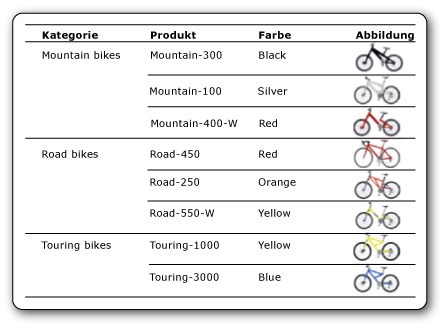

# Bilder (Berichts-Generator und SSRS)
  Ein Bild ist ein Berichtselement mit einem Verweis auf ein Bild, das in den Bericht eingebettet, in einer Datenbank, auf dem Berichtsserver oder an einer anderen Stelle im Internet gespeichert ist. Ein Bild kann ein mit Datenzeilen wiederholtes Bild darstellen. Sie können ein Bild auch als Hintergrund für bestimmte Berichtselemente verwenden.  
  
 Es empfiehlt sich, Logos auf einem Server zu speichern, da das gleiche Logo in zahlreichen Berichten wiederverwendet werden kann.  
  
> [!NOTE]  
>  [!INCLUDE[ssRBRDDup](../../includes/ssrbrddup-md.md)]  
  
##   Vergleichen externer, eingebetteter und datengebundener Bilder  
 Wenn Sie ein serverbasiertes oder anderes externes Bild in einem Bericht verwenden, enthält das Bildelement einen Pfad, der auf ein Bild auf dem Berichtsserver oder an einer beliebigen Stelle im Web zeigt. Wenn Sie allerdings ein eingebettetes Bild verwenden, werden die Bilddaten innerhalb der Berichtsdefinition gespeichert. Sie sind demnach nicht als separate Datei vorhanden.  
  
 Serverbasierte Bilder eignen sich gut für Logos und statische Bilder, die für mehrere Berichte oder Webseiten freigegeben werden. Mit eingebetteten Bildern wird sichergestellt, dass die Bilder immer für den Bericht verfügbar sind. Sie können allerdings nicht freigegeben werden. Berichtsdefinitionen mit externen Bildern sind kleiner als Definitionen mit eingebetteten Bildern.  
  
 Datengebundene Bilder können auch aus in einer Datenbank gespeicherten Binärdaten angezeigt werden. Datenbankbilder sind beispielsweise Bilder, die neben Produktnamen in einer Produktliste angezeigt werden. In der folgenden Abbildung werden die Bilder von Fahrrädern in einer Datenbank gespeichert und im Bericht abgerufen, um die einzelnen Produkte zu veranschaulichen.  
  
   
  
  
##   Bilder als Berichtsteile  
 Bilder können getrennt von einem Bericht als Berichtsteile gespeichert werden. [!INCLUDE[ssRBrptparts](../../includes/ssrbrptparts-md.md)]  
  
  
##   Einbetten von Bildern  
 Sie können Bilder in einen Bericht einbetten, sodass alle Bilddaten innerhalb der Berichtsdefinition gespeichert werden. Wenn Sie ein Bild einbetten, wird für das Bild die MIME-Codierung ausgeführt, und es wird als Text in der Berichtsdefinition gespeichert. Durch das Verwenden eines eingebetteten Bilds wird sichergestellt, dass das Bild immer für den Bericht verfügbar ist. Gleichzeitig nimmt allerdings die Größe der Berichtsdefinition zu.  
  
 Weitere Informationen zum Einbetten eines Bilds finden Sie unter [Einbetten eines Bilds in einen Bericht &#40;Berichts-Generator und SSRS&#41;](../../reporting-services/report-design/embed-an-image-in-a-report-report-builder-and-ssrs.md).  
  
  
##   Externe Bilder  
 Sie können gespeicherte Bilder in einen Bericht einschließen, indem Sie eine URL zum Bild angeben. Wenn Sie in einem Bericht ein externes Bild verwenden, wird die Bildquelle auf **External** festgelegt, und der Wert des Bilds entspricht der URL-Adresse oder dem Pfad zum Bild.  
  
 Weitere Informationen finden Sie unter [Angeben von Pfaden zu externen Elementen &#40;Berichts-Generator und SSRS&#41;](../../reporting-services/report-design/specifying-paths-to-external-items-report-builder-and-ssrs.md).  
  
 Wenn der Bericht im Berichts-Generator oder im Berichts-Designer ausgeführt wird, verwendet die Vorschau die Anmeldeinformationen des Benutzers zur Anzeige des Bilds. Wenn der Bericht auf dem Berichtsserver ausgeführt wird, wird das Bild in dem Bericht möglicherweise nicht angezeigt, wenn die Serveranmeldeinformationen nicht für den Zugriff auf das Bild ausreichen. In diesem Fall wenden Sie sich an den Systemadministrator.  
  
 Weitere Informationen zum Hinzufügen eines externen Bilds zu einem Bericht finden Sie unter [Hinzufügen eines externen Bilds &#40;Berichts-Generator und SSRS&#41;](../../reporting-services/report-design/add-an-external-image-report-builder-and-ssrs.md).  
  
  
##   Hintergrundbilder  
 Sie können ein Bild im Hauptteil des Berichts, in einem Rechteck oder Textfeld, einer Liste, Matrix oder Tabelle als Hintergrundbild verwenden. Ein Hintergrundbild hat ähnliche Eigenschaften wie ein Bild. Sie können auch angeben, wie das Bild zum Ausfüllen des Elementhintergrundes wiederholt wird.  
  
> [!NOTE]  
>  Einige Renderingerweiterungen, z.B. die HTML-Renderingerweiterung, rendern das Hintergrundbild für den Hauptteil des Berichts im Hauptteil, in der Kopfzeile und in der Fußzeile. Sie können ein separates Hintergrundbild für die Kopfzeile und die Fußzeile definieren. Wenn jedoch kein Bild definiert ist, verwendet der Bericht das Hintergrundbild des Hauptteiles. Bei anderen Renderingerweiterungen, z.B. der Bildrenderingerweiterung, wird das Hintergrundbild nicht in der Kopfzeile und Fußzeile gerendert.  
  
 Weitere Informationen zum Hinzufügen eines Hintergrundbilds finden Sie unter [Hinzufügen eines Hintergrundbilds &#40;Berichts-Generator und SSRS&#41;](../../reporting-services/report-design/add-a-background-image-report-builder-and-ssrs.md).  
  
  
##   Datengebundene Bilder  
 Sie können einem Bericht Bilder hinzufügen, die in einer Datenbank gespeichert sind. Dabei können Sie dasselbe Bildberichtselement wie für statische Bilder verwenden, jedoch mit einer Reihe von Eigenschaften, die die Speicherung des Bilds in einer Datenbank angeben. Anleitungen zum Verwenden von datengebundenen Bildern finden Sie unter [Hinzufügen eines datengebundenen Bilds &#40;Berichts-Generator und SSRS&#41;](../../reporting-services/report-design/add-a-data-bound-image-report-builder-and-ssrs.md).  
  
  
##   Themen zur Vorgehensweise  
 [Hinzufügen eines externen Bilds &#40;Berichts-Generator und SSRS&#41;](../../reporting-services/report-design/add-an-external-image-report-builder-and-ssrs.md)  
  
 [Einbetten eines Bilds in einen Bericht &#40;Berichts-Generator und SSRS&#41;](../../reporting-services/report-design/embed-an-image-in-a-report-report-builder-and-ssrs.md)  
  
 [Hinzufügen eines Hintergrundbilds &#40;Berichts-Generator und SSRS&#41;](../../reporting-services/report-design/add-a-background-image-report-builder-and-ssrs.md)  
  
 [Hinzufügen eines datengebundenen Bilds &#40;Berichts-Generator und SSRS&#41;](../../reporting-services/report-design/add-a-data-bound-image-report-builder-and-ssrs.md)  
  
  
## Siehe auch  
 [Exportieren in eine Bilddatei &#40;Berichts-Generator und SSRS&#41;](../../reporting-services/report-builder/exporting-to-an-image-file-report-builder-and-ssrs.md)   
 [Renderingverhalten &#40;Berichts-Generator und SSRS&#41;](../../reporting-services/report-design/rendering-behaviors-report-builder-and-ssrs.md)  
  
  
