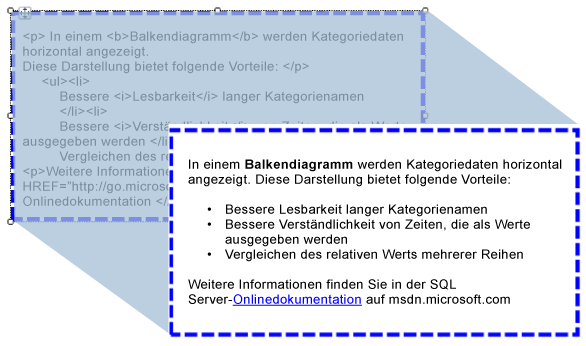

# Importieren von HTML in einen Bericht (Berichts-Generator und SSRS)
  Sie können ein Textfeld verwenden, um aus einem Feld im Dataset abgerufenen HTML-Text in den Bericht einzufügen. Der Text kann aus einem einfachen oder komplexen Ausdruck stammen, der zum ordnungsgemäß formatierten HTML evaluiert wird. Formatierter Text kann in allen unterstützten Ausgabeformaten einschließlich PDF gerendert werden.  
  
   
  
 Diese Abbildung zeigt Text mit HTML-Formatierung in der Berichtsentwurfsansicht und den gleichen Text wie er beim Ausführen des Berichts gerendert wird.  
  
> [!NOTE]  
>  Beim Importieren von Text mit HTML-Markup müssen die Daten stets zunächst vom Textfeld analysiert werden. Da nicht alle HTML-Tags unterstützt werden, weicht die HTML-Darstellung im gerenderten Bericht möglicherweise vom ursprünglichen HTML-Text ab.  
  
 Eine schnelle Einführung finden Sie unter [Tutorial: Formatieren von Text &#40;Berichts-Generator&#41;](../../reporting-services/tutorial-format-text-report-builder.md).  
  
> [!NOTE]  
>  [!INCLUDE[ssRBRDDup](../../includes/ssrbrddup-md.md)]  
  
## Unterstützte HTML-Tags  
 Nachfolgend finden Sie eine vollständige Liste der Tags, die bei einer Definition als Platzhaltertext als HTML gerendert werden:  
  
-   Hyperlinks: \<A HREF>  
  
-   Schriftarten: \  
  
-   Header-, Stil- und Blockelemente: \<H{n}>, \
, \,\
, \
, \<LI>, \<HN>  
  
-   Textformatierungen: \<B>, \<I>, \<U>, \<S>  
  
-   Listenformatierungen: \<OL>, \<UL>, \<LI>  
  
 Alle anderen HTML-Markuptags werden bei der Berichtsverarbeitung ignoriert. Wenn der Ausdruck im Platzhaltertext kein wohlgeformtes HTML aufweist, wird der Platzhalter als Text ohne Formatierung gerendert. Bei allen HTML-Tags wird nicht zwischen Groß- und Kleinschreibung unterschieden.  
  
 Wenn der Text im Textfeld nur aus einem Textabsatz besteht, wird das HTML im Platzhalter, mit dem Blockelemente definiert werden, ordnungsgemäß gerendert. Wenn das Textfeld hingegen mehrere Textblöcke aufweist, werden die HTML-Tags ignoriert, und die Struktur des Texts wird durch die Textblöcke bestimmt.  
  
 Wenn mehrere Tags für den Text definiert wurden und ein Konflikt zwischen HTML und vorhandenen Berichtseinschränkungen von [!INCLUDE[ssRSnoversion](../../includes/ssrsnoversion-md.md)] erkannt wird, werden nur die innersten HTML-Tags als HTML behandelt.  
  
 Weitere Informationen finden Sie unter [Hinzufügen von HTML in einem Bericht (Berichts-Generator und SSRS)](../../reporting-services/report-design/add-html-into-a-report-report-builder-and-ssrs.md).  
  
## Einschränkungen von Cascading Stylesheet-Attributen  
 Im Hinblick auf die Verwendung von CSS (Cascading Stylesheets)-Attributen wird nur eine Reihe grundlegender Tags definiert. Nachfolgend finden Sie eine Liste der unterstützten Attribute:  
  
-   text-align, text-indent  
  
-   font-family  
  
-   font-size  
  
    -   Nur gültige RDL-Größenwerte in absoluten CSS-Längeneinheiten werden unterstützt. Unterstützte Einheiten: in, cm, mm, pt, pc.  
  
    -   Relative CSS-Längeneinheiten werden ignoriert und nicht unterstützt. Nicht unterstützte Einheiten: em, ex, px,%,rem.  
  
     Weitere Informationen zu CSS-Einheiten finden Sie unter [Referenz zu CSS-Werten und -Einheiten](http://msdn.microsoft.com/library/ms531211\(VS.85\).aspx) (http://msdn.microsoft.com/library/ms531211(VS.85).aspx).  
  
-   color  
  
-   padding, padding-bottom, padding-top, padding-right, padding-left  
  
-   font-weight  
  
 Nachfolgend finden Sie einige Überlegungen zur Verwendung von CSS:  
  
-   CSS-Werte mit ungültigem Format werden ebenso ignoriert wie fehlerhaftes HTML.  
  
-   Wenn ein Tag sowohl Attribute als auch CSS-Formatattribute enthält, kommt der CSS-Eigenschaft eine höhere Priorität zu. Lautet der Text z.B. **\
**, wird nur das text-align-Attribut angewendet, und der Text wird rechtsbündig ausgerichtet.  
  
-   Wenn eine Eigenschaft bei Attributen oder CSS-Formaten mehrfach angegeben wurde, wird nur die letzte Instanz der Eigenschaft verwendet. Lautet der Text z.B. **\
**, wird der Text rechtsbündig ausgerichtet.  
  
## Siehe auch  
 [Rendern in das HTML-Format &#40;Berichts-Generator und SSRS&#41;](../../reporting-services/report-builder/rendering-to-html-report-builder-and-ssrs.md)  
  
  
