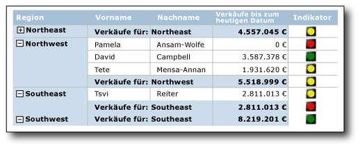
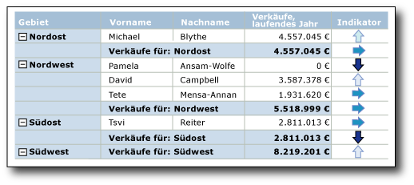

# Indikatoren (Berichts-Generator und SSRS)
  In paginierten [!INCLUDE[ssRSnoversion_md](../../includes/ssrsnoversion-md.md)] -Berichten sind Indikatoren kleine Messgeräte, die den Zustand eines einzelnen Datenwerts auf einen Blick wiedergeben. Die Symbole zur Darstellung der Indikatoren und ihres Zustands sind einfach und auch in kleineren Größen optisch wirkungsvoll.  
  
 Statusindikatoren können in Berichten zur Darstellung folgender Zustände verwendet werden:  
  
-   **Trends** : auswärts tendierende Pfeile, horizontale Pfeile (keine Veränderung) oder abwärts tendierende Pfeile.  
  
-   **Zustand** : allgemein anerkannte Symbole wie Häkchen und Ausrufezeichen.  
  
-   **Bedingungen** : allgemein anerkannte Formen wie Verkehrsampeln und -zeichen.  
  
-   **Bewertungen** : allgemein anerkannte Formen und Symbole, die den Status wie die Anzahl von Quadranten in einem Quadrat und Sterne anzeigen.  
  
 Sie können Indikatoren eigenständig in Dashboards oder Freiformberichten verwenden, sie werden jedoch am häufigsten in Tabellen oder Matrizen zur visuellen Darstellung von Daten in Zeilen oder Spalten eingesetzt. Das folgende Diagramm enthält eine Tabelle mit einem Ampelindikator, der die aufgelaufenen Jahresumsätze pro Vertriebsmitarbeiter und Gebiet vermittelt.  
   
   
  
 [!INCLUDE[ssRSnoversion](../../includes/ssrsnoversion-md.md)] enthält integrierte Indikatorsätze und Indikatorsymbole, die direkt verwendet werden können. Sie haben auch die Möglichkeit, einzelne Indikatorsymbole und Indikatorsätze an Ihre individuellen Anforderungen anzupassen.  
  
 Weitere Informationen zur Verwendung von Indikatoren als KPIs finden Sie unter [Tutorial: Hinzufügen eines KPIS zu einem Bericht &#40;Berichts-Generator&#41;](../../reporting-services/tutorial-adding-a-kpi-to-your-report-report-builder.md).  
  
> [!NOTE]  
>  Sie können Indikatoren in einem Bericht als Berichtsteile getrennt veröffentlichen. Erfahren Sie mehr über [Berichtsteile](../../reporting-services/report-design/report-parts-report-builder-and-ssrs.md).  
  
##   Vergleichen von Indikatoren mit Messgeräten  
 Auch wenn Indikatoren ganz anders aussehen, sind sie genauso einfach wie Messgeräte aufgebaut. Sowohl Indikatoren als auch Messgeräte zeigen einen einzelnen Datenwert an. Der Hauptunterschied besteht darin, dass Messgeräte außerdem über Elemente wie Frames und Zeiger verfügen. Indikatoren verfügen nur über Status, Symbole und (optional) Bezeichnungen. Indikatorstatus ähneln Messgerätskalen.  
  
 Wie Messgeräte befinden sich auch Indikatoren in einem Messgerätebereich. Wenn Sie einen Indikator mit dem Dialogfeld **Indikatoreigenschaften** oder dem Eigenschaftenbereich konfigurieren möchten, müssen Sie den Indikator und nicht den Bereich auswählen. Andernfalls gelten die verfügbaren Optionen für die Messgerätbereichsoptionen, und Sie können den Indikator nicht konfigurieren. Die folgende Abbildung enthält einen ausgewählten Indikator in dessen Messgerätbereich.  
  
   
  
 Abhängig davon, wie Sie den Datenwert darstellen möchten, können Messgeräte sich als effektiver als Indikatoren erweisen. Weitere Informationen finden Sie unter [Messgeräte &#40;Berichts-Generator und SSRS&#41;](../../reporting-services/report-design/gauges-report-builder-and-ssrs.md).  
  
##   Auswählen des zu verwendenden Indikatortyps  
 Der richtige Indikatorsatz ist entscheidend, wenn es darum geht, die Bedeutung von Daten direkt zu vermitteln, unabhängig davon, ob die Daten sich in einer Detailzeile, Zeilen- oder Spaltengruppe in einer Tabelle oder Matrix befinden oder eigenständig im Hauptteil eines Berichts oder in einem Dashboard angezeigt werden. Die integrierten Indikatorsätze verfügen mindestens über drei Symbole. Die Symbole können hinsichtlich Form, Farbe oder beider Kriterien variieren. Jedes Symbol vermittelt einen anderen Datenzustand.  
  
 In der folgenden Tabelle werden die integrierten Indikatorsätze aufgeführt und einige allgemeine Verwendungsmöglichkeiten beschrieben.  
  
|Indikatorsatz|Indikatortyp|  
|-------------------|--------------------|  
||Direktional: gibt Trends mit Pfeilen nach oben und unten, flachen Pfeilen (keine Änderung) oder schräg nach oben bzw. unten weisenden Pfeilen an.|  
||Symbole: geben den Status mit häufig verwendeten Symbolen wie Häkchen und Ausrufezeichen an.|  
||Form: geben Bedingungen mit häufig verwendeten Formen wie Verkehrszeichen und Diamantformen.|  
||Bewertungen: geben Bewertungen mit häufig verwendeten Formen und Symbolen an, die progressive Werte wie die Anzahl von Quadranten an einer Stelle anzeigen.|  
  
 Nachdem Sie einen Indikatorsatz ausgewählt haben, können Sie die Darstellung der einzelnen Indikatorsymbole des Satzes anpassen, indem Sie die Eigenschaften in den Dialogfeldern für Indikatoren oder im Eigenschaftenbereich festlegen. Sie können Indikatoren mit den integrierten Farben, Symbolen und Größen oder Ausdrücken konfigurieren.  
  
##   Anpassen von Indikatoren  
 Indikatoren können beliebig an Ihre Anforderungen angepasst werden. Sie können die Indikatorsätze sowie einzelne Indikatorsymbole innerhalb eines Satzes auf folgende Weise ändern:  
  
-   Ändern Sie die Farben der Indikatorsymbole. Möglicherweise soll das Farbschema eines Indikators einfarbig sein, oder Sie möchten andere Farben als die Standardfarben verwenden.  
  
-   Ändern Sie das Symbol im Indikatorsatz. Möglicherweise möchten Sie die Stern-, Kreis- und Quadratsymbole in einem Indikatorsatz verwenden.  
  
-   Geben Sie die Start- und Endwerte für einen Indikator an. Eventuell möchten Sie die Anzeige von Daten mit einem Symbol für 75 Prozent der Indikatorwerte verzerren.  
  
-   Fügen Sie dem Indikatorsatz Symbole hinzu. Sie können z. B. zusätzliche Symbole zu Indikatorsätzen hinzufügen, um die Indikatorwerte genauer unterscheiden zu können.  
  
-   Löschen Sie Symbole aus dem Indikatorsatz, um die Darstellung der Daten zu vereinfachen, indem Sie nur einige wenige Symbole verwenden.  
  
 Weitere Informationen finden Sie unter [Ändern von Indikatorsymbolen und Indikatorsätzen &#40;Berichts-Generator und SSRS&#41;](../../reporting-services/report-design/change-indicator-icons-and-indicator-sets-report-builder-and-ssrs.md).  
  
##   Verwenden von Indikatoren in Tabellen und Matrizen  
 Aufgrund der einfachen Formen von Indikatoren eignen sie sich perfekt für die Verwendung in Tabellen und Matrizen. Indikatoren sind auch dann wirkungsvoll, wenn sie klein sind. Deshalb sind sie in Detail- oder Gruppenzeilen von Berichten äußerst nützlich.  
  
 Das folgende Diagramm enthält einen Bericht mit einer Tabelle, in der der Richtungsindikatorsatz **Vier Pfeile (farbig)**verwendet wird, um Verkäufe anzugeben. Die Indikatorsymbole im Bericht werden so konfiguriert, dass Blau in verschiedenen Schattierungen anstelle der Standardfarben Rot, Gelb und Grün verwendet wird.  
  
   
  
 Weitere Informationen zum Hinzufügen, Ändern und Löschen von Indikatoren finden Sie unter [Hinzufügen oder Löschen eines Indikators &#40;Berichts-Generator und SSRS&#41;](../../reporting-services/report-design/add-or-delete-an-indicator-report-builder-and-ssrs.md).  
  
 Wenn Sie einem Bericht zum ersten Mal einen Indikator hinzufügen, wird dieser mit den Standardwerten konfiguriert. Sie können die Werte dann ändern, damit der Indikator die Daten wie gewünscht darstellt. Sie können die Darstellung der Indikatorsymbole, die Methode, wie der Indikator das zu verwendende Symbol auswählt, und die von einem Indikatorsatz verwendeten Symbole ändern. Weitere Informationen finden Sie unter [Ändern von Indikatorsymbolen und Indikatorsätzen &#40;Berichts-Generator und SSRS&#41;](../../reporting-services/report-design/change-indicator-icons-and-indicator-sets-report-builder-and-ssrs.md).  
  
 Standardmäßig werden Indikatoren so konfiguriert, dass Prozentsätze als Maßeinheit verwendet und der Minimal- sowie Maximalwert in den Daten automatisch erkannt wird. Jedes Symbol im Indikatorsatz entspricht einem Prozentbereich. Die Anzahl der Prozentbereiche hängt von der Anzahl der Symbole im Symbolsatz ab, die Bereiche haben allerdings die gleiche Größe und folgen sequenziell aufeinander. Wenn der Symbolsatz z. B. fünf Symbole aufweist, enthält er fünf Prozentbereiche mit einer Größe von jeweils 20 Prozent. Der erste Bereich beginnt bei 0 und endet bei 20, der zweite beginnt bei 20 und endet bei 40 usw. Für den Indikator im Bericht wird das Symbol aus dem Indikatorsatz verwendet, das dem Prozentbereich entspricht, in dem der Indikatordatenwert liegt. Sie können den Prozentbereich für jedes Symbol im Satz ändern. Die Minimal- und Maximalwerte können explizit festgelegt werden, indem ein Wert oder ein Ausdruck angegeben wird. Sie können die Maßeinheit stattdessen in einen numerischen Wert ändern. In diesem Fall geben Sie kein Minimum oder Maximum für die Daten an. Stattdessen geben Sie nur den Start- und Endwert für jedes vom Indikator verwendete Symbol an. Weitere Informationen finden Sie unter [Festlegen und Konfigurieren von Maßeinheiten &#40;Berichts-Generator und SSRS&#41;](../../reporting-services/report-design/set-and-configure-measurement-units-report-builder-and-ssrs.md).  
  
 Indikatoren übermitteln Datenwerte, indem sie Datenwerte von Indikatoren innerhalb eines angegebenen Bereichs synchronisieren. Standardmäßig ist der Bereich der übergeordnete Container des Indikators, z. B. die Tabelle oder die Matrix mit dem Indikator. Sie können die Synchronisierung des Indikators ändern, indem Sie abhängig vom Layout des Berichts einen anderen Bereich auswählen. Der Indikator kann die Synchronisierung überspringen. Weitere Informationen finden Sie unter [Festlegen des Synchronisierungsbereichs &#40;Berichts-Generator und SSRS&#41;](../../reporting-services/report-design/set-synchronization-scope-report-builder-and-ssrs.md).  
  
 Allgemeine Informationen zum Verständnis und zum Festlegen von Bereichen in Berichten finden Sie unter [Ausdrucksbereich für Gesamtwerte, Aggregate und integrierte Sammlungen (Berichts-Generator und SSRS)](../../reporting-services/report-design/expression-scope-for-totals-aggregates-and-built-in-collections.md).  
  
 Indikatoren verwenden nur einen einzelnen Wert. Wenn Sie mehrere Datenwerte anzeigen müssen, verwenden Sie eine Sparkline oder einen Datenbalken anstelle eines Indikators. Sie können mehrere Datenwerte darstellen, sind jedoch ebenfalls einfach aufgebaut, bei kleiner Größe leicht zu verstehen und gut geeignet für Tabellen und Matrizen. Weitere Informationen finden Sie unter [Sparklines und Datenbalken &#40;Berichts-Generator und SSRS&#41;](../../reporting-services/report-design/sparklines-and-data-bars-report-builder-and-ssrs.md).  
  
##   Anpassen der Größe von Indikatoren für eine maximale visuelle Wirkung  
 Zusätzlich zu Farbe, Richtung und Form können Sie die Größe anpassen und damit die visuelle Wirkung von Indikatoren maximieren. Angenommen, ein Bericht verwendet Indikatoren, um die Zufriedenheit der Kunden mit unterschiedlichen Fahrradmodellen anzuzeigen. Das vom Indikator verwendete Symbol kann so konfiguriert werden, dass es je nach der Zufriedenheit der Kunden eine entsprechende Größe annimmt. Je größer die Zufriedenheit, desto größer ist auch das Symbol, das im Bericht angezeigt wird. Im folgenden Bild wird ein Bericht zu Fahrradverkäufen angezeigt, wobei die Größe des Symbols jeweils den Umsatz darstellt.  
  
 Die Größe der Sterne legen Sie mit Ausdrücken dynamisch fest. Dabei dienen die vom Indikator verwendeten Feldwerte als Grundlage. Weitere Informationen finden Sie unter [Angeben der Größe eines Indikators mithilfe eines Ausdrucks &#40;Berichts-Generator und SSRS&#41;](../../reporting-services/report-design/specify-the-size-of-an-indicator-using-an-expression-report-builder-and-ssrs.md).  
  
 Weitere Informationen zum Schreiben und Verwenden von Ausdrücken finden Sie unter [Ausdrücke &#40;Berichts-Generator und SSRS&#41;](../../reporting-services/report-design/expressions-report-builder-and-ssrs.md).  
  
##   Aufnehmen von Indikatoren und Messgeräten in Messgerätbereiche  
 Indikatoren werden immer in einem Messgerätbereich positioniert. Der Messgerätbereich ist ein Container auf der obersten Ebene, der ein oder mehrere Messgeräte und Statusindikatoren enthalten kann. Der Messgerätbereich kann untergeordnete oder angrenzende Messgeräte oder Indikatoren enthalten. Wenn Sie einen Indikator als untergeordnetes Element eines Messgeräts verwenden, können Sie die Daten darüber hinaus visualisieren, indem Sie den Status des im Messgerät angezeigten Datenwerts anzeigen. Ein Indikator innerhalb eines Messgeräts kann z. B. einen grünen Kreis anzeigen, um darauf hinzuweisen, dass sich der Wert im Messgerät innerhalb der oberen 33 Prozent des Wertbereichs befindet. Platzieren Sie ein Messgerät und einen Indikator nebeneinander, um die Daten unterschiedlich darzustellen. In jedem Fall können der Indikator und das Messgerät die gleichen oder unterschiedliche Datenfelder verwenden.  
  
 Das folgende Diagramm zeigt einen Indikator neben einem Messgerät und innerhalb eines Messgeräts.  
  
   
  
 Weitere Informationen finden Sie unter [Aufnehmen von Indikatoren und Messgeräten in einen Messgerätbereich &#40;Berichts-Generator und SSRS&#41;](../../reporting-services/report-design/include-indicators-and-gauges-in-a-gauge-panel-report-builder-and-ssrs.md).  
  
 Weitere Informationen zum Verwenden von Messgeräten finden Sie unter [Messgeräte &#40;Berichts-Generator und SSRS&#41;](../../reporting-services/report-design/gauges-report-builder-and-ssrs.md).  
  
##   Sequenz der Indikatorstatus  
 Die Sequenz der Indikatorstatus auf der Registerkarte **Wert und Status** im Dialogfeld **Indikatoreigenschaften** beeinflusst, welches Indikatorsymbol für einen Datenwert angezeigt wird, wenn die Start- und Endwerte der Indikatorstatus sich überschneiden.  
  
 Das kann unabhängig davon vorkommen, ob Sie die prozentuale oder die numerische Maßeinheit für den Status verwenden. Die Wahrscheinlichkeit ist größer, wenn Sie die numerische Maßeinheit verwenden, da Sie für dafür spezifische Werte bereitstellen. Es ist auch wahrscheinlicher, wenn Sie Berichtsdatenwerte runden, da die Werte dadurch in der Regel weniger diskret werden.  
  
 Die folgenden Szenarios beschreiben, wie es sich auf die Datenvisualisierung auswirkt, wenn Sie die Sequenz der drei Status im Richtungsindikator **3 Pfeile (farbig)** ändern. Standardmäßig lautet die Sequenz.  
  
1.  Roter Pfeil nach unten  
  
2.  Gelber horizontaler Pfeil  
  
3.  Grüner Pfeil nach oben  
  
 Die folgenden Szenarios zeigen vier verschiedene Statussequenzen und ihre Wertebereiche sowie die Auswirkung der Sequenzen auf die Datenvisualisierung.  
  
 In diesen Szenarios verwendet der Indikator **3 Pfeile (farbig)** numerische Statusmessungen.  
  
|Statussequenz|Startwert|Endwert|  
|--------------------|-----------------|---------------|  
|Red|0|3500|  
|Gelb|3500|5000|  
|Green|5000|10000|  
  
 Der rote Pfeil nach unten gibt den Wert 3500 an, der gelbe horizontale Pfeil 5000.  
  
|Statussequenz|Startwert|Endwert|  
|--------------------|-----------------|---------------|  
|Green|5000|10000|  
|Gelb|3500|5000|  
|Red|0|3500|  
  
 Der gelbe horizontale Pfeil gibt den Wert 3500 an, der grüne Pfeil nach oben 5000.  
  
|Statussequenz|Startwert|Endwert|  
|--------------------|-----------------|---------------|  
|Green|5000|10000|  
|Red|0|3500|  
|Gelb|3500|5000|  
  
 Der rote Pfeil nach unten gibt den Wert 3500 an, der grüne Pfeil nach oben 5000.  
  
|Statussequenz|Startwert|Endwert|  
|--------------------|-----------------|---------------|  
|Gelb|3500|5000|  
|Red|0|3500|  
|Green|5000|10000|  
  
 Der gelbe Pfeil nach unten gibt jetzt sowohl den Wert 3500 als auch 5000 an.  
  
 Zusammenfassend lässt sich also sagen, dass die Auswertung oben in der Indikatorstatusliste startet und der Bericht das Indikatorsymbol anzeigt, das dem ersten Indikatorstatus zugeordnet ist, zu dessen Wertebereich die Daten passen. Wenn Sie die Sequenz der Indikatorstatus ändern, können Sie daher die Visualisierung von Datenwerten beeinflussen.  
  
##   Themen zur Vorgehensweise  
 Dieser Abschnitt enthält Verfahren, in denen das Hinzufügen, Ändern und Löschen von Indikatoren, das Konfigurieren und Anpassen von Indikatoren und die Verwendung von Indikatoren in Messgeräten erläutert werden.  
  
-   [Hinzufügen oder Löschen eines Indikators &#40;Berichts-Generator und SSRS&#41;](../../reporting-services/report-design/add-or-delete-an-indicator-report-builder-and-ssrs.md)  
  
-   [Ändern von Indikatorsymbolen und Indikatorsätzen &#40;Berichts-Generator und SSRS&#41;](../../reporting-services/report-design/change-indicator-icons-and-indicator-sets-report-builder-and-ssrs.md)  
  
-   [Festlegen und Konfigurieren von Maßeinheiten &#40; Berichts-Generator und SSRS &#41;](../../reporting-services/report-design/set-and-configure-measurement-units-report-builder-and-ssrs.md)  
  
-   [Festlegen des Synchronisierungsbereichs &#40;Berichts-Generator und SSRS&#41;](../../reporting-services/report-design/set-synchronization-scope-report-builder-and-ssrs.md)  
  
-   [Angeben der Größe eines Indikators mithilfe eines Ausdrucks &#40;Berichts-Generator und SSRS&#41;](../../reporting-services/report-design/specify-the-size-of-an-indicator-using-an-expression-report-builder-and-ssrs.md)  
  
-   [Aufnehmen von Indikatoren und Messgeräten in einen Messgerätbereich &#40;Berichts-Generator und SSRS&#41;](../../reporting-services/report-design/include-indicators-and-gauges-in-a-gauge-panel-report-builder-and-ssrs.md)  
  
## Siehe auch  
 [Messgeräte &#40;Berichts-Generator und SSRS&#41;](../../reporting-services/report-design/gauges-report-builder-and-ssrs.md)   
 [Sparklines und Datenbalken &#40; Berichts-Generator und SSRS &#41;](../../reporting-services/report-design/sparklines-and-data-bars-report-builder-and-ssrs.md)   
 [Diagramme &#40; Berichts-Generator und SSRS &#41;](../../reporting-services/report-design/charts-report-builder-and-ssrs.md)  
  
  
