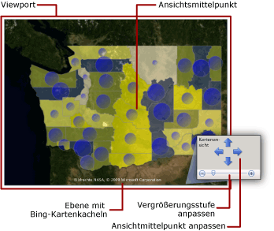

# Karten (Berichts-Generator und SSRS)
  Um Geschäftsdaten anhand eines geografischen Hintergrunds visuell darzustellen, können Sie dem paginierten [!INCLUDE[ssRSnoversion_md](../../includes/ssrsnoversion-md.md)] -Bericht eine Karte hinzufügen. Welchen Kartentyp Sie auswählen sollten, hängt davon ab, was für Informationen Sie im Bericht mitteilen möchten. Sie können eine Karte hinzufügen, die nur Orte anzeigt, oder eine Blasendiagrammkarte, bei der die Blasengröße von der Anzahl der Haushalte für einen Bereich abhängt, oder eine Markerkarte, bei der das Markerformat vom gewinnbringendsten Produkt für jeden Laden abhängt, oder eine Linienkarte, die Routen zwischen Läden anzeigt.  
  
 Eine Karte enthält einen Titel, einen Viewport, der den Mittelpunkt und die Skala angibt, einen optionalen Bing-Kartenkachelhintergrund für den Viewport, eine oder mehrere Ebenen, die räumliche Daten anzeigen, sowie zahlreiche Legenden, die Benutzern die Interpretation der Datenvisualisierungen erleichtern. Die folgende Abbildung zeigt die grundlegenden Teile einer Karte.  
  
   
  
 Informationen dazu, wie Sie sofort mit der Verwendung einer Karte beginnen, finden Sie unter [Tutorial: Kartenbericht &#40;Berichts-Generator&#41;](../../reporting-services/tutorial-map-report-report-builder.md) oder [Berichtsbeispiele (Berichts-Generator und SSRS)](http://go.microsoft.com/fwlink/?LinkId=198283).  
  
> [!NOTE]  
>  Karten können getrennt von einem Bericht als Berichtsteile gespeichert werden. Erfahren Sie mehr über [Berichtsteile](../../reporting-services/report-design/report-parts-report-builder-and-ssrs.md).  
  
##   Hinzufügen einer Karte zum Bericht  
 Führen Sie die folgenden allgemeinen Schritte aus, um dem Bericht eine Karte hinzuzufügen:  
  
-   Bestimmen Sie, welche analytischen Daten angezeigt werden sollen und welche Arten von räumlichen Daten Sie benötigen. Um beispielsweise in einer Blasendiagrammkarte den relativen Jahresumsatz pro Laden anzuzeigen, benötigen Sie als analytische Daten den Namen und den Umsatz jedes Ladens sowie als räumliche Daten den Namen und den Standort des Ladens zur Ermittlung des Breiten- und Längengrads.  
  
-   Wählen Sie das gewünschte Kartenformat aus. Standardkarten zeigen nur Standorte an. Blasendiagrammkarten können unterschiedlich große Blasen auf der Grundlage eines einzelnen analytischen Werts enthalten. Analytische Farbkarten enthalten unterschiedliche Kartenelemente auf der Grundlage von Bereichen analytischer Daten. Das Format, das Sie auswählen, hängt sowohl von den visuell darzustellenden Daten ab als auch von dem verwendeten Typ räumlicher Daten.  
  
-   Sammeln Sie die Informationen, die Sie benötigen, um räumliche Datenquellen, räumliche Daten, analytische Datenquellen und analytische Daten anzugeben. Hierzu gehören Verbindungszeichenfolgen zu räumlichen Datenquellen, der Typ benötigter räumlicher Daten sowie Übereinstimmungsfelder, die die räumlichen Daten und die analytischen Daten im Bericht einander zuordnen.  
  
-   Führen Sie den Karten-Assistenten aus, um dem Bericht eine Karte hinzuzufügen. Dies fügt der Karte die erste Kartenebene hinzu. Führen Sie den Kartenebenen-Assistenten aus, um zusätzliche Ebenen zu erstellen oder vorhandene Ebenen zu ändern. Die Assistenten erleichtern Ihnen die ersten Schritte. Weitere Informationen finden Sie unter [Karten-Assistent und Kartenebenen-Assistent &#40;Berichts-Generator und SSRS&#41;](../../reporting-services/report-design/map-wizard-and-map-layer-wizard-report-builder-and-ssrs.md).  
  
-   Nachdem Sie die Karte im Bericht in der Vorschau angezeigt haben, sollten Sie möglicherweise die Kartenansicht anpassen, die unterschiedliche Anzeige der einzelnen Datenebenen verändern, Legenden bereitstellen, die den Benutzern die Interpretation der Daten erleichtern, und die Auflösung anpassen, um die Anzeige benutzerfreundlich zu gestalten.  
  
 Weitere Informationen finden Sie unter [Planen eines Kartenberichts &#40;Berichts-Generator und SSRS&#41;](../../reporting-services/report-design/plan-a-map-report-report-builder-and-ssrs.md).  
  
##   Hinzufügen von Daten zu einer Karte  
 Eine Karte enthält zwei Arten von Daten: räumliche Daten und analytische Daten. Räumliche Daten definieren die Darstellung der Karte, während analytische Daten die Werte enthalten, die der Karte zugeordnet sind. Räumliche Daten definieren beispielsweise die Positionen von Städten in einem Bereich, während analytische Daten die Einwohnerzahl jeder Stadt bereitstellen.  
  
 Eine Karte muss räumliche Daten aufweisen; analytische Daten sind optional. Sie können beispielsweise eine Karte hinzufügen, die nur die Standorte von Läden in einer Stadt anzeigt.  
  
 Um Daten auf einer Karte visuell darzustellen, müssen die analytischen Daten und die räumlichen Daten miteinander in Beziehung stehen. Wenn die räumlichen Daten und die analytischen Daten aus der gleichen Quelle stammen, ist die Beziehung bekannt. Wenn die räumlichen Daten und die analytischen Daten aus unterschiedlichen Quellen kommen, müssen Sie Übereinstimmungsfelder angeben, um sie miteinander in Beziehung zu setzen.  
  
### Räumliche Daten  
 Räumliche Daten bestehen aus Sätzen von Koordinaten. Als räumliche Daten aus einer Datenquelle sind ein einzelner Punkt, mehrere Punkte, eine einzelne Linie, mehrere Linien oder ein Satz von Polygonen möglich. Jeder Satz von Koordinaten definiert ein *Kartenelement*, wie z. B. ein Polygon, das den Umriss eines Landkreises darstellt, eine Linie, die eine Straße darstellt, oder einen Punkt, der die Position einer Stadt darstellt.  
  
 Räumliche Daten basieren auf einem der folgenden Koordinatensysteme:  
  
-   **Geografisch** Gibt geodätische Koordinaten auf einer sphärischen Oberfläche mithilfe des Längen- und Breitengrads an. Für geografisch dargestellte räumliche Daten muss eine Projektion angegeben werden. Eine Projektion ist ein Satz von Regeln, der angibt, wie Objekte, für die sphärische Koordinaten vorhanden sind, auf einer planaren Oberfläche gezeichnet werden sollen. Nur geografische Daten mit derselben Projektion können verglichen oder kombiniert werden.  
  
-   **Planar** Gibt geometrische Koordinaten auf einer planaren Oberfläche als X und Y an.  
  
 Jede Kartenebene zeigt eine Art räumlicher Daten an: Polygone, Linien oder Punkte. Um mehrere Arten räumlicher Daten anzuzeigen, fügen Sie der Karte mehrere Ebenen hinzu. Sie können auch eine Ebene von Microsoft Bing-Kartenkacheln hinzufügen. Die Kachelebene hängt nicht von räumlichen Daten ab. Die Kachelebene zeigt Bildkacheln an, die den Koordinaten des Kartenviewports entsprechen.  
  
#### Quellen von räumlichen Daten  
 Die folgenden Quellen räumlicher Daten werden unterstützt:  
  
-   **Kartenkatalogberichte.** Räumliche Daten werden in Berichte eingebettet, die sich im Kartenkatalog befinden. Standardmäßig ist der Kartenkatalog installiert  *\<Laufwerk >*: \Programme\Microsoft SQL Server\Report \MapGallery.  
  
    > [!NOTE]  
    >  Für diese [!INCLUDE[ssRSnoversion](../../includes/ssrsnoversion-md.md)]-Kartenfunktion werden Daten aus TIGER/Line-Shape-Dateien verwendet, die vom U.S. Census Bureau ([http://www.census.gov/](http://www.census.gov/)) bereitgestellt werden. TIGER/Line-Shape-Dateien sind ein Auszug aus ausgewählten geografischen und kartographischen Informationen aus der Census MAF/TIGER-Datenbank. TIGER/Line-Shape-Dateien sind kostenfrei vom amerikanischen Volkszählungsbüro verfügbar. Weitere Informationen zu den TIGER/Line-Shape-Dateien finden Sie unter [http://www.census.gov/geo/www/tiger](http://www.census.gov/geo/www/tiger). Die Informationen zu geografischen Grenzen in den TIGER/Line-Shape-Dateien dienen nur der Sammlung statistischer Daten und der Tabellierung. Ihre Darstellung und Verwendung zu statistischen Zwecken bedeutet keine Aussage einer Rechtsprechungsbehörde, begründet keine Eigentumsrechte oder Rechtsansprüche und stellt keine rechtsverbindlichen Landbeschreibungen dar. Census TIGER und TIGER/Line sind eingetragene Marken des U.S. Bureau of the Census.  
  
-   **ESRI-Shape-Dateien.** ESRI-Shape-Dateien enthalten Daten, die dem Format für räumliche Daten in Shape-Dateien des Environmental Systems Research Institute, Inc. (ESRI) entsprechen. ESRI-Shape-Dateien verweisen auf einen Satz von Dateien. Daten in der SHP-Datei geben die geografischen oder geometrischen Formen an. Daten in der DBF-Datei stellen Attribute für die Formen bereit. Damit Sie eine Karte in der Entwurfsansicht anzeigen oder vom Berichtsserver ausführen können, müssen sich beide Dateien im gleichen Ordner befinden. Wenn Sie räumliche Daten aus einer SHP-Datei zum lokalen Dateisystem hinzufügen, werden sie in den Bericht eingebettet. Um zur Laufzeit räumliche Daten dynamisch abzurufen, laden Sie die Shape-Dateien auf den Berichtsserver, und geben Sie diese dann als die Quelle räumlicher Daten an. Weitere Informationen finden Sie unter [Finding ESRI Shapefiles for a Map](http://go.microsoft.com/fwlink/?linkid=178814).  
  
-   **In einer Datenbank gespeicherte räumliche SQL Server-Daten.** Sie können eine Abfrage verwenden, die Daten vom Typ **SQLGeometry** oder **SQLGeography** aus einer relationalen [!INCLUDE[ssNoVersion](../../includes/ssnoversion-md.md)] -Datenbank angibt. Weitere Informationen finden Sie in der [Übersicht über Typen räumlicher Daten](../../relational-databases/spatial/spatial-data-types-overview.md) in der [SQL Server-Onlinedokumentation](http://go.microsoft.com/fwlink/?linkid=98335).  
  
     Im Resultset, das im Abfrage-Designer angezeigt wird, wird jede Zeile räumlicher Daten als Einheit behandelt und in einem einzelnen Kartenelement gespeichert. Wenn beispielsweise in einer Zeile im Resultset mehrere Punkte definiert werden, gelten Anzeigeeigenschaften für alle Punkte in diesem Kartenelement.  
  
-   **Benutzerdefinierte Orte, die Sie erstellen.** Sie können Orte manuell einer Punktebene als eingebettete Punkte hinzufügen. Weitere Informationen finden Sie unter [Hinzufügen benutzerdefinierter Orte zu einer Karte &#40;Berichts-Generator und SSRS&#41;](../../reporting-services/report-design/add-custom-locations-to-a-map-report-builder-and-ssrs.md).  
  
#### Räumliche Daten in der Entwurfsansicht  
 In der Entwurfsansicht des Berichtsprozessors werden räumliche Beispieldaten angezeigt, um den Entwurf der Kartenebene zu erleichtern. Die angezeigten Daten hängen von der Verfügbarkeit der räumlichen Daten ab:  
  
-   **Eingebettete Daten.** Die Beispieldaten werden aus Kartenelementen abgerufen, die im Bericht in Kartenebenen eingebettet wurden.  
  
-   **Link zu ESRI-Shape-Datei.** Wenn die ESRI-Shape-Datei (.shp) und die Unterstützungsdatei (.dbf) verfügbar sind, werden die Beispieldaten aus der Shape-Datei geladen. Andernfalls generiert der Berichtsprozessor Beispieldaten und zeigt die Meldung **Es sind keine räumlichen Daten verfügbar**an.  
  
-   **Räumliche Daten von SQL Server.** Wenn die Datenquelle verfügbar ist und die Anmeldeinformationen gültig sind, werden die Beispieldaten aus den räumlichen Daten in der Datenbank geladen. Andernfalls generiert der Berichtsprozessor Beispieldaten und zeigt die Meldung **Es sind keine räumlichen Daten verfügbar**an.  
  
#### Einbetten räumlicher Daten in die Berichtsdefinition  
 Im Gegensatz zu analytischen Daten können räumliche Daten für eine Kartenebene in die Berichtsdefinition eingebettet werden. Wenn Sie räumliche Daten einbetten, betten Sie Kartenelemente ein, die in der Kartenebene verwendet werden.  
  
 Eingebettete Elemente bedeuten eine größere Berichtsdefinition; es wird jedoch sichergestellt, dass die räumlichen Daten immer verfügbar sind, wenn der Bericht in der Vorschau oder auf dem Berichtsserver ausgeführt wird. Mehr Daten bedeuten mehr Speicherplatz und längere Verarbeitungszeiten. Es ist immer eine bewährte Methode, räumliche Daten, wie auch andere Berichtsdaten, rein auf die Informationen einzuschränken, die für den Bericht benötigt werden.  
  
#### Steuern der Kartenauflösung zur Laufzeit  
 Wenn Sie die Auflösung für räumliche Daten ändern, geben Sie an, wie detailliert die Linien auf einer Karte gezeichnet werden sollen. Benötigen Sie zum Beispiel für Bereiche der Erdoberfläche eine Granularität von hundert Metern, oder sind anderthalb Kilometer detailliert genug?  
  
 Wenn die räumlichen Daten in den Bericht eingebettet werden, wirkt sich die verwendete Auflösung auf die Anzahl der Kartenelemente in der Berichtsdefinition aus. Eine höhere Auflösung vergrößert die Anzahl der Elemente, die erforderlich sind, um bei dieser Auflösung Grenzen zu zeichnen. Wenn die räumlichen Daten nicht in den Bericht eingebettet werden, berechnet der Berichtsserver die erforderlichen Linien zum Zeichnen der Grenzen bei dieser Auflösung jedes Mal, wenn Sie den Bericht anzeigen. Um einen Bericht zu entwerfen, bei dem Bildschirmauflösung und akzeptable Renderingzeit im Gleichgewicht sind, vereinfachen Sie die Kartenauflösung bis zu der Detailebene, die Sie benötigen, um die analytischen Daten im Bericht visuell darzustellen.  
  
### Analytische Daten  
 Analytische Daten sind die Daten, die Sie auf der Karte visuell darstellen möchten, wie z. B. die Einwohnerzahl einer Stadt oder der Gesamtumsatz eines Ladens. Folgende Quellen für analytische Daten sind möglich:  
  
-   **Datasetfeld.** Ein Feld aus einem Dataset im Berichtsdatenbereich.  
  
-   **Räumliches Datenquellenfeld.** Ein Feld aus der räumlichen Datenquelle, die in die räumlichen Daten eingeschlossen ist. Beispielsweise schließt eine ESRI-Shape-Datei häufig sowohl räumliche als auch analytische Daten ein. Feldnamen aus der räumlichen Datenquelle beginnen mit # und werden in der Dropdownliste von Feldern angezeigt, wenn Sie das Datenfeld für Regeln für eine Ebene angeben.  
  
-   **Eingebettete Daten für ein Kartenelement.** Nachdem Sie Polygone, Linien oder Punkte in einen Bericht eingebettet haben, können Sie die Datenfelder für einzelne Kartenelemente überschreiben und benutzerdefinierte Werte festlegen.  
  
 Wenn Sie Regeln für eine Ebene angeben und das Feld für analytische Daten auswählen, berechnet der Berichtsprozessor im Fall eines numerischen Datentyps automatisch Aggregatwerte für das Kartenelement mithilfe der Standardfunktion „Sum“. Wenn das Feld nicht numerisch ist, wird keine Aggregatfunktion angegeben, und die implizite Aggregatfunktion „First“ wird verwendet. Um den Standardausdruck zu ändern, ändern Sie die Optionen für die Regeln für die Ebene. Weitere Informationen finden Sie unter [Unterschiedliche Polygon-, Linien- und Punktanzeigen bei der Verwendung von Regeln und analytischen Daten &#40;Berichts-Generator und SSRS&#41;](../../reporting-services/report-design/vary-polygon-line-and-point-display-by-rules-and-analytical-data.md).  
  
### Übereinstimmungsfelder  
 Um analytische Daten mit Kartenelementen auf einer Ebene zu verknüpfen, müssen Sie *Übereinstimmungsfelder*angeben. Übereinstimmungsfelder werden verwendet, um eine Beziehung zwischen Kartenelementen und analytischen Daten zu erstellen. Sie können ein oder mehrere Felder für die Übereinstimmung verwenden; diese müssen jedoch einen eindeutigen analytischen Wert für jeden räumlichen Standort angeben.  
  
 Beispielsweise werden für eine Blasendiagrammkarte, bei der die Größen der Blasen der Einwohnerzahl von Städten entsprechen, die folgenden Daten benötigt:  
  
-   Aus der räumlichen Datenquelle:  
  
    -   **SpatialData.** Ein Feld mit räumlichen Daten, die Breiten- und Längengrad der Stadt angeben.  
  
    -   **Name.** Ein Feld, das den Namen der Stadt enthält.  
  
    -   **Area.** Ein Feld, das den Namen der Region enthält.  
  
-   Aus der analytischen Datenquelle:  
  
    -   **Population.** Ein Feld, das die Einwohnerzahl jeder Stadt enthält.  
  
    -   **City.** Ein Feld, das den Namen der Stadt enthält.  
  
    -   **Area.** Ein Feld, das den Namen des Gebiets, des Bundesstaats oder der Region enthält.  
  
 In diesem Beispiel reicht der Städtename allein nicht aus, um die Auffüllung eindeutig zu identifizieren. Beispielsweise gibt es in den USA viele Städte mit dem Namen Albany. Um eine bestimmte Stadt anzugeben, müssen Sie zusätzlich zum Namen der Stadt den Wert für "Area" angeben.  
  
##   Grundlegendes zum Kartenviewport  
 Nachdem Sie Kartendaten für einen Bericht angegeben haben, können Sie den Anzeigebereich der Karte einschränken, indem Sie einen *Kartenviewport*angeben. Standardmäßig ist der Viewport der gleiche Bereich wie die gesamte Karte. Um die Karte zuzuschneiden, können Sie den Mittelpunkt, die Zoomstufe sowie maximale und minimale Koordinaten angeben, die den Bereich definieren, den Sie in den Bericht einschließen möchten. Um die Anzeige der Karte im Bericht zu verbessern, können Sie die Legenden, Entfernungsskala und Farbskala außerhalb des Viewports verschieben. Die folgende Abbildung zeigt einen Viewport:  
  
   
  
##   Hinzufügen einer Ebene mit Bing-Kartenkacheln  
 Sie können eine Ebene für Bing-Kartenkacheln hinzufügen, die einen geografischen Hintergrund für die aktuelle vom Viewport definierte Kartenansicht bereitstellen. Um eine Kachelebene hinzuzufügen, müssen Sie als Koordinatensystem **Geografisch** und als Projektion **Mercator**eingeben. Kacheln, die mit dem Viewportmittelpunkt und der Zoomstufe übereinstimmen, die Sie auswählen, werden automatisch aus Bing Maps Web Services abgerufen.  
  
 Sie können die Ebene anpassen, indem Sie die folgenden Optionen angeben:  
  
-   Kacheltyp. Die folgenden Stile werden unterstützt:  
  
    -   **Straße.** Zeigt Daten in einem Straßenkartenformat an, das einen weißen Hintergrund, Straßen und Bezeichnungstext enthält.  
  
    -   **Luftbild.** Zeigt Daten in einem Luftbildformat ohne Text an.  
  
    -   **Hybrid.** Zeigt eine Kombination der Formate **Straße** und **Luftbild** an.  
  
-   Die Sprache für den Anzeigetext auf den Kacheln.  
  
-   Gibt an, ob eine sichere Verbindung verwendet werden soll, um die Kacheln vom Bing Maps-Webdienst abzurufen.  
  
 Eine detaillierte Anleitung finden Sie unter [Hinzufügen, Ändern oder Löschen einer Karte oder einer Kartenebene &#40;Berichts-Generator und SSRS&#41;](../../reporting-services/report-design/add-change-or-delete-a-map-or-map-layer-report-builder-and-ssrs.md).  
  
 Weitere Informationen zu Kacheln finden Sie im Thema zum [Bing-Kartenkachelsystem](http://go.microsoft.com/fwlink/?linkid=147315)(möglicherweise in englischer Sprache). Weitere Informationen zur Verwendung von Bing-Kartenkacheln im Bericht finden Sie in den [zusätzlichen Nutzungsbedingungen](http://go.microsoft.com/fwlink/?LinkId=151371).  
  
##   Grundlegendes zu Kartenebenen und Kartenelementen  
 Eine Karte kann mehrere Ebenen enthalten. Es stehen drei Arten von Ebenen zur Verfügung. Auf jeder Ebene wird ein Typ räumlicher Daten angezeigt:  
  
-   **Polygonebene.** Zeigt Umrisse von Bereichen oder Marker für den Polygonmittelpunkt an, der automatisch für jedes Polygon berechnet wird.  
  
-   **Linienebene.** Zeigt Linien für Pfade oder Routen an.  
  
-   **Punktebene.** Zeigt Marker für Punktpositionen an.  
  
 Wenn Sie die Quelle räumlicher Daten für eine Ebene angeben, überprüft der Assistent das Feld für räumliche Daten und legt den Ebenentyp auf Grundlage seines Typs fest. Für jeden Wert aus der Datenquelle wird ein Kartenelement zur Ebene hinzugefügt.  
  
 Um beispielsweise Lieferrouten von einem zentralen Lager zu den Läden anzuzeigen, können Sie zwei Ebenen hinzufügen: eine Punktebene mit Ortsmarken als Markern, die Standorte von Läden anzeigt, und eine Linienebene, die Lieferrouten vom Lager zu jedem Laden anzeigt. Für die Punktebene sind räumliche Punktdaten erforderlich, die Ladenstandorte angeben, und für die Linienebene sind räumliche Liniendaten erforderlich, die die Lieferrouten angeben.  
  
 Der vierte Ebenentyp ist eine Kachelebene. Eine Kachelebene fügt einen Hintergrund von Bing-Kartenkacheln hinzu, die dem Mittelpunkt und der Zoomstufe gemäß dem Kartenviewport entsprechen.  
  
 Um mit Ebenen zu arbeiten, wählen Sie auf der Berichtsentwurfsoberfläche eine Karte zum Anzeigen des Kartenbereichs aus. Der Kartenbereich zeigt die Liste der Ebenen an, die für die Karte definiert sind. Wählen Sie mithilfe dieses Bereichs eine Ebene aus, um die Optionen zu ändern, die Zeichnungsreihenfolge von Ebenen zu ändern, eine Ebene hinzuzufügen oder den Kartenebenen-Assistenten auszuführen, eine Ebene auszublenden oder anzuzeigen sowie den Ansichtsmittelpunkt und die Zoomstufe für den Kartenviewport zu ändern. Die folgende Abbildung zeigt einen Viewport:  
  
   
  
 Weitere Informationen zu Kartenebenen finden Sie unter [Hinzufügen, Ändern oder Löschen einer Karte oder einer Kartenebene &#40;Berichts-Generator und SSRS&#41;](../../reporting-services/report-design/add-change-or-delete-a-map-or-map-layer-report-builder-and-ssrs.md).  
  
### Verändern von Anzeigeeigenschaften für Punkte, Linien und Polygone  
 Anzeigeoptionen für Kartenelemente können für jede Ebene, mithilfe von Ebenenregeln oder für einzelne Elemente festgelegt werden. Sie können beispielsweise Anzeigeeigenschaften für alle Punkte auf einer Ebene festlegen, oder Sie können Regeln festlegen, die die Anzeigeeigenschaften für alle (eingebetteten und sonstigen) Punkte auf einer Ebene steuern, oder Sie können Anzeigeeigenschafteneinstellungen für bestimmte eingebettete Punkte überschreiben.  
  
 Wenn Sie einen Bericht anzeigen, werden die Anzeigewerte von der folgenden Hierarchie gesteuert (hier in aufsteigender Reihenfolge aufgeführt): Höhere Zahlen haben Vorrang:  
  
1.  **Ebeneneigenschaften.** Eigenschaften, die für die gesamte Ebene gelten. Verwenden Sie Ebeneneigenschaften beispielsweise, um die Quelle von analytischen Daten oder die Sichtbarkeit für die gesamte Ebene festzulegen.  
  
2.  **Eigenschaften von Polygonen, Linien und Punkten sowie Eigenschaften von eingebetteten Polygonen, Linien und Punkten.** Eigenschaften, die für alle Kartenelemente auf einer Ebene gelten, unabhängig davon, ob die Elemente aus dynamischen oder eingebetteten räumlichen Daten stammen. Verwenden Sie beispielsweise Polygonmittelpunkt-Eigenschaften, um die Füllfarbe für Blasen auf einen Farbverlauf festzulegen, sodass Blasenbereiche von Dunkelblau nach Hellblau und von oben nach unten gefüllt werden.  
  
3.  **Farbregeln, Größenregeln, Breitenregeln, Markertypregeln.** Mit Regeln werden Eigenschaften auf eine Ebene angewendet, wenn die Ebene Kartenelemente enthält, die eine Beziehung zu analytischen Daten aufweisen. Der Regeltyp hängt vom Ebenentyp ab. Verwenden Sie beispielsweise Schriftgradregeln, um die Blasengröße auf Grundlage der Einwohnerzahl zu verändern.  
  
4.  **Überschreiben von Eigenschaften für eingebettete Polygone, Linien oder Punkte**. Für eingebettete Kartenelemente können Sie die Überschreibungsoption aktivieren und eine beliebige Eigenschaft oder einen Datenwert ändern. Alle Änderungen, die Sie vornehmen, um Regeln für einzelne Elemente zu überschreiben, sind unwiderruflich. Sie können beispielsweise mit einer Ortsmarke als Marker einen bestimmten Laden hervorheben.  
  
 Weitere Informationen finden Sie unter [Unterschiedliche Polygon-, Linien- und Punktanzeigen bei der Verwendung von Regeln und analytischen Daten &#40;Berichts-Generator und SSRS&#41;](../../reporting-services/report-design/vary-polygon-line-and-point-display-by-rules-and-analytical-data.md).  
  
 Zusätzlich zum Verändern der Darstellung von Kartenelementen können Sie Punkten, Linien und Polygonen oder Ebenen wie folgt Interaktivitätsfunktionen hinzufügen:  
  
-   Erstellen Sie QuickInfos, um weitere Details für ein Kartenelement bereitzustellen, wenn der Benutzer mit der Maus auf die Karte zeigt.  
  
-   Fügen Sie Aktionen für einen Drillthrough zu anderen Positionen im Bericht, zu anderen Berichten oder zu Webseiten hinzu.  
  
-   Fügen Sie Parameter in Ausdrücken hinzu, die die Ebenensichtbarkeit definieren, sodass der Benutzer bestimmte Kartenebenen anzeigen oder ausblenden kann.  
  
 Weitere Informationen finden Sie unter [Interaktive Sortierung, Dokumentstrukturen und Links &#40;Berichts-Generator und SSRS&#41;](../../reporting-services/report-design/interactive-sort-document-maps-and-links-report-builder-and-ssrs.md).  
  
##   Grundlegendes zu Kartenlegenden, Farbskala und Entfernungsskala  
 Sie können dem Bericht unterschiedliche Legenden hinzufügen, um Benutzern die Interpretation einer Karte zu erleichtern. Karten können die folgenden Elemente einschließen:  
  
-   **Legenden.** Sie können mehrere Legenden erstellen. Elemente, die in einer Legende aufgeführt sind, werden automatisch anhand der Regeln generiert, die Sie für Kartenelemente auf jeder Ebene angeben. Für jede Regel geben Sie die Legende an, die verwendet werden soll, um die zugehörigen Elemente anzuzeigen. Auf diese Weise können Sie Elemente aus mehreren Ebenen derselben Legende oder unterschiedlichen Legenden zuweisen.  
  
-   **Farbskala.** Sie können eine einzelne Farbskala erstellen. Als Alternative zum Bereitstellen einer Legende für eine Farbregel können Sie Elemente für eine Farbregel in der Farbskala anzeigen. Mehrere Farbregeln können auf die Farbskala angewendet werden.  
  
-   **Entfernungsskala.** Sie können eine einzelne Entfernungsskala anzeigen. Die Entfernungsskala zeigt eine Skala für die aktuelle Kartenansicht in Kilometern und in Meilen an.  
  
 Sie können die Legenden, Farbskala und Entfernungsskala an diskreten Orten innerhalb oder außerhalb des Viewports positionieren. Weitere Informationen finden Sie unter [Ändern der Kartenlegenden, Farbskala und zugeordneten Regeln &#40;Berichts-Generator und SSRS&#41;](../../reporting-services/report-design/change-map-legends-color-scale-and-associated-rules-report-builder-and-ssrs.md).  
  
##   Problembehandlung für Karten  
 Kartenberichte verwenden räumliche und analytische Daten aus unterschiedlichen Datenquellen. Für die Daten jeder Kartenebene können andere Quellen verwendet werden. Für die Anzeigeeigenschaften für jede Ebene gilt eine bestimmte Rangfolge auf der Grundlage von Ebeneneigenschaften, Regeln und Kartenelementeigenschaften.  
  
 Wenn ein Kartenbericht nicht wie gewünscht angezeigt wird, sind zahlreiche Probleme als Ursache möglich. Damit Sie jedes Problem leichter isolieren und verstehen können, sollten Sie jeweils nur mit einer Ebene arbeiten. Verwenden Sie den Kartenbereich, um eine Ebene auszuwählen und ihre Sichtbarkeit mühelos umzuschalten.  
  
 Weitere Informationen zu Problemen bei Kartenberichten finden Sie unter [Problembehandlung bei Berichten: Kartenberichte &#40;Berichts-Generator und SSRS&#41;](../../reporting-services/report-design/troubleshoot-reports-map-reports-report-builder-and-ssrs.md)  
  
##   Themen zur Vorgehensweise  
 Dieser Abschnitt enthält Verfahren, die schrittweise zeigen, wie Sie mit Karten und Kartenebenen in Berichten arbeiten.  
  
-   [Hinzufügen, Ändern oder Löschen einer Karte oder einer Kartenebene &#40;Berichts-Generator und SSRS&#41;](../../reporting-services/report-design/add-change-or-delete-a-map-or-map-layer-report-builder-and-ssrs.md)  
  
-   [Ändern der Kartenlegenden, Farbskala und zugeordneten Regeln &#40;Berichts-Generator und SSRS&#41;](../../reporting-services/report-design/change-map-legends-color-scale-and-associated-rules-report-builder-and-ssrs.md)  
  
-   [Hinzufügen benutzerdefinierter Orte zu einer Karte &#40;Berichts-Generator und SSRS&#41;](../../reporting-services/report-design/add-custom-locations-to-a-map-report-builder-and-ssrs.md)  
  
##   In diesem Abschnitt  
 [Planen eines Kartenberichts &#40;Berichts-Generator und SSRS&#41;](../../reporting-services/report-design/plan-a-map-report-report-builder-and-ssrs.md)  
  
 [Karten-Assistent und Kartenebenen-Assistent &#40;Berichts-Generator und SSRS&#41;](../../reporting-services/report-design/map-wizard-and-map-layer-wizard-report-builder-and-ssrs.md)  
  
 [Anpassen der Daten und der Anzeige einer Karte oder einer Kartenebene &#40;Berichts-Generator und SSRS&#41;](../../reporting-services/report-design/customize-the-data-and-display-of-a-map-or-map-layer-report-builder-and-ssrs.md)  
  
 [Unterschiedliche Polygon-, Linien- und Punktanzeigen bei der Verwendung von Regeln und analytischen Daten &#40;Berichts-Generator und SSRS&#41;](../../reporting-services/report-design/vary-polygon-line-and-point-display-by-rules-and-analytical-data.md)  
  
 [Hinzufügen, Ändern oder Löschen einer Karte oder einer Kartenebene &#40;Berichts-Generator und SSRS&#41;](../../reporting-services/report-design/add-change-or-delete-a-map-or-map-layer-report-builder-and-ssrs.md)  
  
 [Ändern der Kartenlegenden, Farbskala und zugeordneten Regeln &#40;Berichts-Generator und SSRS&#41;](../../reporting-services/report-design/change-map-legends-color-scale-and-associated-rules-report-builder-and-ssrs.md)  
  
 [Hinzufügen benutzerdefinierter Orte zu einer Karte &#40;Berichts-Generator und SSRS&#41;](../../reporting-services/report-design/add-custom-locations-to-a-map-report-builder-and-ssrs.md)  
  
 [Problembehandlung bei Berichten: Kartenberichte &#40;Berichts-Generator und SSRS&#41;](../../reporting-services/report-design/troubleshoot-reports-map-reports-report-builder-and-ssrs.md)  
  
  
