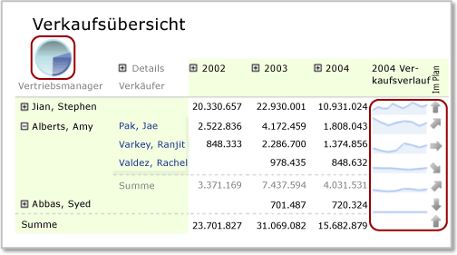

# Geschachtelte Datenbereiche (Berichts-Generator und SSRS)
  Sie können einen Datenbereich wie ein Diagramm in einen anderen Datenbereich schachteln, z. B. in eine Matrix. Dies geschieht häufig, um Zusammenfassungen von Daten in kompakter Form anzuzeigen oder eine visuelle Darstellung zusammen mit einer Tabellen- oder Matrixdarstellung bereitzustellen.  
  
 Angenommen, eine Matrix (auch bezeichnet als *Tablix*) enthält Bestellungen, die vertikal nach Niederlassung und horizontal nach Quartal gruppiert sind. Sie können der Eckzelle dieses Datenbereichs eine Tabelle oder ein Diagramm hinzufügen, um die Verkäufe aller Niederlassungen zusammenzufassen, oder Sie können einem Matrixspaltenkopf ein Diagramm hinzufügen, um den Anteil der Daten in der Spalte am Verkauf als Prozentsatz aller Verkäufe anzuzeigen.  
  
   
  
 In dieser Abbildung sind das Kreisdiagramm in der Eckzelle und die Sparklinediagramme in den Zeilen geschachtelte Datenbereiche.  
  
 Definitionsgemäß basieren geschachtelte Datenbereiche auf dem gleichen Berichtsdataset. Sie können keine Datenbereiche schachteln, die auf anderen Datasets basieren. Verwenden Sie Drillthroughberichte oder Unterberichte, um Daten aus anderen Datasets anzuzeigen. Weitere Informationen finden Sie unter [Drillthrough, Drilldown, Unterberichte und geschachtelte Datenbereiche &#40;Berichts-Generator und SSRS&#41;](../../reporting-services/report-design/drillthrough-drilldown-subreports-and-nested-data-regions.md).  
  
> [!NOTE]  
>  [!INCLUDE[ssRBRDDup](../../includes/ssrbrddup-md.md)]  
  
## Grundlegendes zum Begriff "Bereich" für einen geschachtelten Datenbereich  
 Der Bereich für Daten in einem geschachtelten Datenbereich wird automatisch durch die Platzierung im übergeordneten Datenbereich bestimmt. So entspricht der in einer Tablix-Eckzelle geschachtelte Diagrammdatenbereich den Daten aus dem Dataset, das an den Tablix-Datenbereich gebunden ist, nach Anwendung der Filter für das Dataset, den Tablix-Datenbereich und den Diagrammdatenbereich. Der Bereich für ein Tablix-Element in einer Tablix-Zelle entspricht im Wesentlichen dem Bereich für die Eckzelle; zusätzlich wurde jedoch eine Einschränkung auf die Mitgliedschaften in Zeilen- und Spaltengruppen der Zelle vorgenommen, in der der Bereich geschachtelt wurde, und die entsprechenden Gruppenfilter wurden angewendet. Weitere Informationen zum Bereich finden Sie unter [Ausdrucksbereich für Gesamtwerte, Aggregate und integrierte Sammlungen (Berichts-Generator und SSRS)](../../reporting-services/report-design/expression-scope-for-totals-aggregates-and-built-in-collections.md).  
  
 In der unten stehenden Liste wird der Bereich für Zellen in den folgenden Tablix-Bereichen beschrieben:  
  
-   **Tablix-Ecke:** Der Bereich entspricht den Daten im Datenbereich, die mit dem Tablix-Datenbereich verknüpft sind, nachdem die Filter- und Sortierungsausdrücke für das Dataset und die äußere Tablix angewendet wurden.  
  
-   **Tablix-Spaltengruppe:** Der Bereich entspricht den Daten in der innersten Spaltengruppe, nachdem die Filter- und Sortierungsausdrücke für das Dataset, die äußere Tablix und die Spaltengruppen angewendet wurden.  
  
-   **Tablix-Zeilengruppe:** Der Bereich entspricht den Daten in der innersten Zeilengruppe, nachdem die Filter- und Sortierungsausdrücke für das Dataset, die äußere Tablix und die Zeilengruppen angewendet wurden.  
  
-   **Tablix-Hauptteil:** Der Bereich entspricht den Daten in der innersten Gruppe, dargestellt durch die Schnittmenge von Zeilen- und Spaltengruppen, nachdem die Filter- und Sortierungsausdrücke für das Dataset, die äußere Tablix und die Spaltengruppen angewendet wurden.  
  
 Weitere Informationen finden Sie unter [Zonen des Tablix-Datenbereichs (Berichts-Generator und SSRS)](../../reporting-services/report-design/tablix-data-region-areas-report-builder-and-ssrs.md).  
  
## Schachteln eines Diagramms, einer Sparkline oder eines Datenbalkens in einer Tablix  
 Beim Hinzufügen eines Diagramms (einschließlich Sparklines oder Datenbalken) zur Kopf- oder Fußzeile einer Tablix-Spaltengruppe oder zu einer Tablix-Textzelle werden die an das Diagramm übergebenen Daten auf die Teilmenge der Daten für diese Zelle beschränkt. Wenn Sie einer Tablix-Zelle ein Diagramm hinzufügen, wird die Größe des Diagramms standardmäßig auf die Größe der Zelle erweitert.  
  
> [!NOTE]  
>  Zur besseren Kontrolle der Größe von Diagrammen in einer Tablix-Zelle können Sie das Diagramm zunächst einem Rechteck hinzufügen und anschließend das Rechteck der Tablix-Zelle.  
  
 Die Farben für die Diagrammlegende werden standardmäßig durch die Farbe der Datenpunkte in der Diagrammreihe bestimmt. Wenn Sie die Farbgebung steuern möchten, sodass in allen geschachtelten Diagrammdatenbereichen die gleiche Farbe für die gleiche Datenkategorie verwendet wird, müssen Sie benutzerdefinierte Farben verwenden und Sortierungsausdrücke für die Daten festlegen. Weitere Informationen finden Sie unter [Angeben von Farben, die für mehrere Formdiagramme konsistent sind (Berichts-Generator und SSRS)](../../reporting-services/report-design/specify-consistent-colors-across-multiple-shape-charts-report-builder-and-ssrs.md) und [Sortieren von Daten in einem Datenbereich (Berichts-Generator und SSRS)](../../reporting-services/report-design/sort-data-in-a-data-region-report-builder-and-ssrs.md).  
  
## Schachteln eines Messgeräts oder Indikators in einer Tablix  
 Sie können ein Messgerät oder einen Indikator in einer Tabelle, Matrix oder Liste schachteln, um einen Key Performance Indicator (KPI) anzuzeigen. Wenn Sie ein Messgerät oder einen Indikator in einer Tabelle einfügen, wird das Gerät für jede Zeile in der Tablix gerendert. Weitere Informationen zum Hinzufügen von Indikatoren zu einer Tablix finden Sie unter [Indikatoren (Berichts-Generator und SSRS)](../../reporting-services/report-design/indicators-report-builder-and-ssrs.md).  
  
### Hinzufügen eines Messgeräts zu einer Tablix  
 Messgeräte können Tablix-Datenbereichen auf zweierlei Weise hinzugefügt werden:  
  
-   Klicken Sie in die Tablix-Zelle, und fügen Sie ein Messgerät hinzu. Das Dialogfeld **Messgerättyp auswählen** wird angezeigt. Nachdem Sie einen Messgerättyp ausgewählt haben, wird der Datenbereich für das Messgerät in der ausgewählten Tablix-Zelle platziert. Sie müssen die Größe des Tablix-Elements wahrscheinlich ändern, um das Messgerät zu formatieren.  
  
-   Klicken Sie auf eine Stelle außerhalb der Tabelle, und fügen Sie ein Messgerät hinzu. Das Dialogfeld **Messgerättyp auswählen** wird angezeigt. Nachdem Sie einen Messgerättyp ausgewählt haben, wird der Datenbereich für das Messgerät in der linken oberen Ecke des Berichts platziert. Fügen Sie Daten hinzu, und formatieren Sie das Messgerät, bevor Sie das Gerät per Drag und Drop in der Tablix-Zelle platzieren.  
  
 Das Dataset, das an das Messgerät übergeben wird, wird analog zum Diagramm auf die Teilmenge der Daten für die Zelle begrenzt. Wenn ein Messgerät in einer Tablix-Zelle platziert wird, wird stets nur eine Datenzeile durch das Messgerät aggregiert.  
  
 Wenn Daten in der Tablix Gruppierungen enthalten, wird die Gruppe nicht automatisch von dem in der Tablix geschachtelten Messgerätdatenbereich geerbt. Fügen Sie dem Messgerät einen entsprechenden Gruppierungsausdruck hinzu, um die gleichen Informationen wie in der Tablix anzuzeigen. Angenommen, die Daten in der Tablix sind nach dem Produkt gruppiert. In diesem Fall müssen Sie dem Messgerät einen Gruppierungsausdruck für das Produkt hinzufügen, um die gleichen Daten anzuzeigen. Weitere Informationen finden Sie unter [Messgeräte (Berichts-Generator und SSRS)](../../reporting-services/report-design/gauges-report-builder-and-ssrs.md) und [Hinzufügen oder Löschen einer Gruppe in einem Datenbereich (Berichts-Generator und SSRS)](../../reporting-services/report-design/add-or-delete-a-group-in-a-data-region-report-builder-and-ssrs.md).  
  
 Sie müssen die Minimal- und Maximalwerte festlegen, die auf der Messgerätskala angezeigt werden. Wenn Sie den Höchstwert des Messgeräts angeben möchten, können Sie einen Ausdruck wie `=Max!MyField.Value`verwenden. Da der Ausdruck jedoch nur im Bereich der Daten in der Zelle ausgewertet wird, stimmen die Höchstwerte der einzelnen Messgeräte nicht für alle Zeilen im Tablix-Element überein. Dies erschwert möglicherweise Vergleiche zwischen Messgeräten im Tablix-Element. Sie können auch einen statischen Wert als Höchstwert angeben. Alle Zeilen im Tablix-Element zeigen ein Messgerät mit diesem Höchstwert an. Weitere Informationen finden Sie unter [Festlegen eines Mindestwerts oder eines Höchstwerts auf einem Messgerät (Berichts-Generator und SSRS)](../../reporting-services/report-design/set-a-minimum-or-maximum-on-a-gauge-report-builder-and-ssrs.md).  
  
 Wenn die Daten auf dem Messgerät zu groß werden, können Sie die Anzahl der angezeigten Stellen mithilfe eines Skalenmultiplizierers reduzieren. Klicken Sie dazu mit der rechten Maustaste auf die Skala, und wählen Sie **Skalierungseigenschaften**aus. Geben Sie im Dialogfeld **Skalierungseigenschaften** einen Wert für **Multiplikator**an.  
  
## Schachteln einer Tabelle oder Matrix und eines Diagramms in einer Liste  
 Fügen Sie zunächst ein Rechteck hinzu, und fügen Sie dem Rechteck anschließend Datenbereiche hinzu, um mehrere Datenbereiche in einer Liste zu schachteln.  
  
 Sie können eine Gruppe für den Datenbereich einer Liste definieren und ein Tablix-Element sowie ein Diagramm hinzufügen, um unterschiedliche Sichten der gleichen Daten zu ermöglichen. Voraussetzung dafür ist das Definieren identischer Gruppen- und Sortierungsausdrücke für das eingebettete Tablix-Element und das eingebettete Diagramm. Das Tablix-Element sowie das Diagramm verwenden definitionsgemäß Daten aus dem Dataset für den Datenbereich der übergeordneten Liste.  
  
> [!NOTE]  
>  Wenn Sie der Entwurfsoberfläche einen Listendatenbereich hinzufügen, enthält die Liste standardmäßig eine Detailzeile. Sie können diese Standardeinstellung durch Hinzufügen einer Gruppenzeile und Entfernen der Detailzeile ändern. Weitere Informationen finden Sie unter [Untersuchen der Flexibilität eines Tablix-Datenbereichs &#40;Berichts-Generator und SSRS&#41;](../../reporting-services/report-design/exploring-the-flexibility-of-a-tablix-data-region-report-builder-and-ssrs.md).  
  
 Weitere Informationen finden Sie unter [Grundlegendes zu Gruppen (Berichts-Generator und SSRS)](../../reporting-services/report-design/understanding-groups-report-builder-and-ssrs.md) und [Hinzufügen, Verschieben oder Löschen einer Tabelle, Matrix oder Liste (Berichts-Generator und SSRS)](../../reporting-services/report-design/add-move-or-delete-a-table-matrix-or-list-report-builder-and-ssrs.md).  
  
## Siehe auch  
 [Filtern, Gruppieren und Sortieren von Daten &#40;Berichts-Generator und SSRS&#41;](../../reporting-services/report-design/filter-group-and-sort-data-report-builder-and-ssrs.md)   
 [Tabellen, Matrizen und Listen &#40;Berichts-Generator und SSRS&#41;](../../reporting-services/report-design/tables-matrices-and-lists-report-builder-and-ssrs.md)   
 [Diagramme &#40;Berichts-Generator und SSRS&#41;](../../reporting-services/report-design/charts-report-builder-and-ssrs.md)   
 [Messgeräte &#40;Berichts-Generator und SSRS&#41;](../../reporting-services/report-design/gauges-report-builder-and-ssrs.md)   
 [Ausdrücke &#40;Berichts-Generator und SSRS&#41;](../../reporting-services/report-design/expressions-report-builder-and-ssrs.md)   
 [Formatieren von Berichtselementen (Berichts-Generator und SSRS)](../../reporting-services/report-design/formatting-report-items-report-builder-and-ssrs.md)   
 [Tutorial: Hinzufügen eines KPI zu einem Bericht (Berichts-Generator)](../../reporting-services/tutorial-adding-a-kpi-to-your-report-report-builder.md)   
 [Formatieren von Skalen auf einem Messgerät &#40;Berichts-Generator und SSRS&#41;](../../reporting-services/report-design/formatting-scales-on-a-gauge-report-builder-and-ssrs.md)  
  
  
